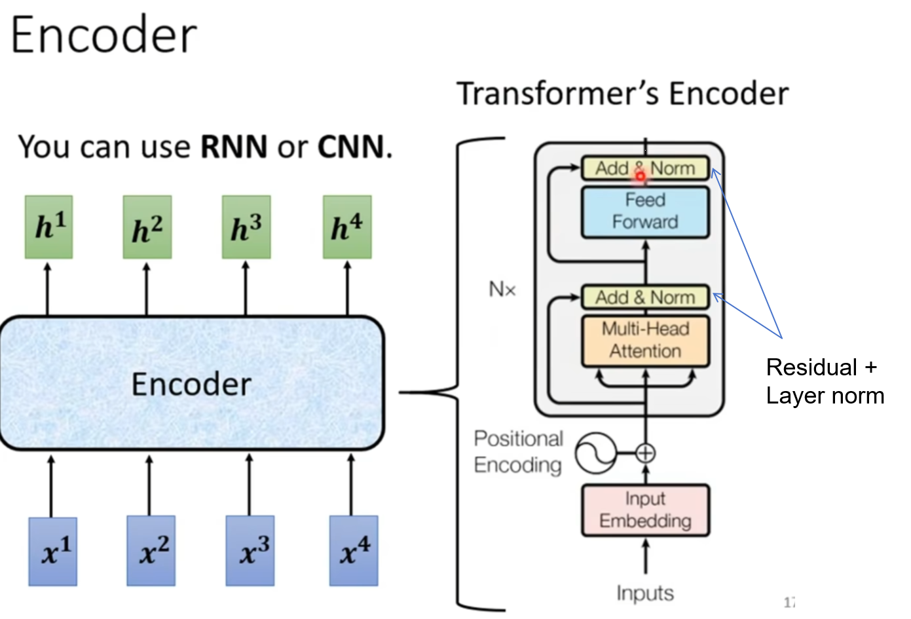

# AI

# machine learning

装袋法、集成学习和随机森林之间的关系如下：
集成学习
集成学习是一种通过组合多个机器学习模型来提高预测性能的方法。它将多个弱学习器组合成一个强学习器，以提高模型的准确性和稳定性。集成学习主要分为装袋法（Bagging）、提升法（Boosting）和堆叠法（Stacking）。
装袋法（Bagging）
装袋法是集成学习中的一种方法，其核心思想是通过有放回抽样（Bootstrap Sampling）从原始数据集中生成多个子数据集，然后在每个子数据集上独立训练一个模型。最终，通过平均法或多数投票法将这些模型的预测结果组合起来，得到最终的预测结果。装袋法的主要目的是降低模型的方差，提高模型的稳定性和泛化能力。
随机森林
随机森林是装袋法的一种改进和具体实现，专门用于构建决策树集成。它在装袋法的基础上增加了特征选择的随机性：在每次分裂节点时，随机森林只从部分特征中选择最优特征进行分裂，而不是从所有特征中选择。这种随机性进一步降低了决策树之间的相关性，提高了模型的泛化能力。
三者的关系
集成学习是大类，包括装袋法、提升法等多种方法，目的是通过组合多个模型来提高预测性能。
装袋法是集成学习中的一种具体方法，通过有放回抽样生成多个子数据集，并独立训练模型，然后组合结果。
随机森林是装袋法的一种改进和具体实现，专门用于构建决策树集成，通过增加特征选择的随机性来进一步降低模型的方差。


袋外数据（Out-of-Bag, OOB）是指在使用自助采样（Bootstrap Sampling）构建随机森林模型时，未被采样用于训练某棵决策树的数据。由于自助采样是有放回的随机抽样，每次构建决策树时，大约有36.8%的数据不会被选中，这些未被选中的数据就构成了袋外数据。
袋外数据的主要作用是用于模型的内部验证。在随机森林中，每棵树的训练数据集是通过自助采样得到的，因此每棵树都有自己的袋外数据。这些袋外数据可以用来评估模型的泛化能力，而无需额外的测试集。具体来说，袋外误差（OOB Error）是通过使用每棵树的袋外数据进行预测，并将预测结果与真实值进行比较来计算的。这种方法提供了一种无偏的误差估计，有助于评估模型的性能。
在随机森林中，可以通过设置参数（如oob_score=True）来启用袋外误差的计算。这种方法不仅可以节省数据划分的步骤，还能提供一个快速且有效的模型性能评估指标。


Class that can be used to bootstrap and launch a Spring application from a Java main method. By default class will perform the following steps to bootstrap your application:
Create an appropriate ApplicationContext instance (depending on your classpath)
Register a CommandLinePropertySource to expose command line arguments as Spring properties
Refresh the application context, loading all singleton beans
Trigger any CommandLineRunner beans
In most circumstances the static run(Class, String[]) method can be called directly from your main method to bootstrap your application:
@Configuration
@EnableAutoConfiguration
public class MyApplication  {

    // ... Bean definitions
 
    public static void main(String[] args) {
      SpringApplication. run(MyApplication. class, args);
    }
}

For more advanced configuration a SpringApplication instance can be created and customized before being run:
public static void main(String[] args) {
SpringApplication application = new SpringApplication(MyApplication. class);
// ... customize application settings here
application. run(args)
}

## bagging算法

### 随机森林


虽然原理上很简单，但随机森林的学习能力异常强大、算法复杂度高、又具备一定的抗过拟合能力，是从根本上来说比单棵决策树更优越的算法。即便在深入了解机器学习的各种技巧之后，它依然是我们能够使用的最强大的算法之一。原理如此简单、还如此强大的算法在机器学习的世界中是不常见的。**在机器学习竞赛当中，随机森林往往是我们在中小型数据上会尝试的第一个算法**。

在sklearn中，随机森林可以实现回归也可以实现分类。随机森林回归器由类`sklearn.ensemble.RandomForestRegressor`实现，随机森林分类器则有类`sklearn.ensemble.RandomForestClassifier`实现。我们可以像调用逻辑回归、决策树等其他sklearn中的算法一样，使用“实例化、fit、predict/score”三部曲来使用随机森林，同时我们也可以使用sklearn中的交叉验证方法来实现随机森林。其中回归森林的默认评估指标为R2，分类森林的默认评估指标为准确率。

```python
reg_f = RFR() #实例化随机森林
reg_t = DTR() #实例化决策树
cv = KFold(n_splits=5,shuffle=True,random_state=1412) #实例化交叉验证方式
```

与sklearn中其他回归算法一样，随机森林的默认评估指标是R2，但在机器学习竞赛、甚至实际使用时，我们很少使用损失以外的指标对回归类算法进行评估。对回归类算法而言，最常见的损失就是MSE。

```Python
result_t = cross_validate(reg_t #要进行交叉验证的评估器
                          ,X,y #数据
                          ,cv=cv #交叉验证模式
                          ,scoring="neg_mean_squared_error" #评估指标
                          ,return_train_score=True #是否返回训练分数
                          ,verbose=True #是否打印进程
                          ,n_jobs=-1 #线程数
                         )
```


## boosting算法

Boosting PK Bagging

|                | 装袋法 Bagging                                  | 提升法 Boosting                                       |
|----------------|----------------------------------------------|----------------------------------------------------|
| 弱评估器           | **相互独立**，并行构建                                | 相互关联，按顺序依次构建先建弱分类器的预测效果影响后续模型的建立                   |
| 建树前的抽样方式       | 样本有放回抽样特征无放回抽样                               | 样本有放回抽样 特征无放回抽样 先建弱分类器的预测效果可能影响抽样细节                |
| 集成的结果          | 回归平均分类众数                                     | 每个算法**具有自己独特的规则**，一般来说：(1) 表现为某种分数的加权平均 (2) 使用输出函数 |
| 目标             | **降低方差** 提高模型整体的稳定性来提升泛化能力 本质是从“平均”这一数学行为中获利 | **降低偏差** 提高模型整体的精确度来提升泛化能力 相信众多弱分类器叠加后可以等同于强学习器    |
| 单个评估器容易过拟合的时候  | 具有一定的抗过拟合能力                                  | 具有一定的抗过拟合能力                                        |
| 单个评估器的效力比较弱的时候 | 可能失效                                         | 大概率会提升模型表现                                         |
| 代表算法           | 随机森林                                         | 梯度提升树，Adaboost                                     |


- Bagging不同算法之间的核心区别在于靠以不同方式实现“独立性”（随机性），**那Boosting的不同算法之间的核心区别就在于上一个弱评估器的评估结果具体如何影响下一个弱评估器的建立过程**

  在以随机森林为代表的Bagging算法中，一次性建立多个平行独立的弱评估器，并让所有评估器并行运算。在Boosting集成算法当中，逐一建立多个弱评估器（基本是决策树），并且下一个弱评估器的建立方式依赖于上一个弱评估器的评估结果，最终综合多个弱评估器的结果进行输出，因此Boosting算法中的弱评估器之间不仅不是相互独立的、反而是强相关的，同时Boosting算法也不依赖于弱分类器之间的独立性来提升结果 

- Bagging算法和Boosting算法输出不同

  Bagging算法统一的回归求平均、分类少数服从多数的输出，Boosting算法在结果输出方面十分多样。当代Boosting算法的输出都会考虑整个集成模型中全部的弱评估器。**一般来说，每个Boosting算法会其以独特的规则自定义集成输出的具体形式**，但对大部分算法而言，集成算法的输出结果往往是**关于弱评估器的某种结果的加权平均**，其中权重的求解是boosting领域中非常关键的步骤。

**任意boosting算法的三大基本元素以及boosting算法自适应建模的基本流程：**

- 损失函数$L(x,y)$ ：用以衡量模型预测结果与真实结果的差异
- 弱评估器$f(x)$ ：（一般为）决策树，不同的boosting算法使用不同的建树过程
- 综合集成结果$H(x)$：即集成算法具体如何输出集成结果

这三大元素将会贯穿所有我们即将学习的boosting算法，我们会发现几乎所有boosting算法的原理都围绕这三大元素构建。在此三大要素基础上，所有boosting算法都遵循以下流程进行建模：

依据上一个弱评估器$f(x)_{t-1}$的结果，计算损失函数$L(x,y)$， 并使用$L(x,y)$自适应地影响下一个弱评估器$f(x)_t$的构建。集成模型输出的结果，受到整体所有弱评估器$f(x)_0$ ~ $f(x)_T$的影响。

### AdaBoost

AdaBoost的构筑过程非常简单：**首先，在全样本上建立一棵决策树，根据该决策树预测的结果和损失函数值，增加被预测错误的样本在数据集中的样本权重，并让加权后的数据集被用于训练下一棵决策树**。这个过程相当于有意地加重“难以被分类正确的样本”的权重，同时降低“容易被分类正确的样本”的权重，而将后续要建立的弱评估器的注意力引导到难以被分类正确的样本上。


在该过程中，上一棵决策树的的结果通过影响样本权重、即影响数据分布来影响下一棵决策树的建立，整个过程是自适应的。当全部弱评估器都被建立后，集成算法的输出$H(x)$等于所有弱评估器输出值的加权平均，加权所用的权重也是在建树过程中被自适应地计算出来的。

### 梯度提升树（Gradient Boosting Decision Tree，GBDT）

但与AdaBoost不同的是，GBDT在整体建树过程中做出了以下几个关键的改变：

- **弱评估器**

  GBDT的弱评估器输出类型不再与整体集成算法输出类型一致。对于AdaBoost或随机森林算法来说，当集成算法执行的是回归任务时，弱评估器也是回归器，当集成算法执行分类任务时，弱评估器也是分类器。但对于GBDT而言，**无论GBDT整体在执行回归/分类/排序任务，弱评估器一定是回归器**。GBDT通过sigmoid或softmax函数输出具体的分类结果，但实际弱评估器一定是回归器。

- **损失函数$L(x,y)$**

  在GBDT当中，损失函数范围不再局限于固定或单一的某个损失函数，而从数学原理上推广到了任意可微的函数。因此GBDT算法中可选的损失函数非常多，GBDT实际计算的数学过程也与损失函数的表达式无关。


- **拟合残差**

  GBDT依然自适应调整弱评估器的构建，但却不像AdaBoost一样通过调整数据分布来**间接**影响后续弱评估器。相对的，GBDT通过修改后续弱评估器的拟合目标来直接影响后续弱评估器的结构。

  具体地来说，在AdaBoost当中，每次建立弱评估器之前需要修改样本权重，且用于建立弱评估器的是样本$X$以及对应的$y$，在GBDT当中，我们不修改样本权重，但每次用于建立弱评估器的是样本$X$以及当下集成输出$H(x_i)$与真实标签$y$的差异（$y - H(x_i)$）。这个差异在数学上被称之为残差（Residual），因此**GBDT不修改样本权重，而是通过拟合残差来影响后续弱评估器结构**。


- **抽样思想**

  GBDT加入了随机森林中随机抽样的思想，在每次建树之前，允许对样本和特征进行抽样来增大弱评估器之间的独立性（也因此可以有袋外数据集）。虽然Boosting算法不会大规模地依赖于类似于Bagging的方式来降低方差，但由于Boosting算法的输出结果是弱评估器结果的加权求和，因此Boosting原则上也可以获得由“平均”带来的小方差红利。当弱评估器表现不太稳定时，采用与随机森林相似的方式可以进一步增加Boosting算法的稳定性。

## 新词发现

问：什么样的字符组合可以称为一个“词”？

目前新冠病毒的传播速度超过了疫苗的分发速度

- 内部的内聚性强：经常出现

  互信息：当A, B条件独立时，互信息最小为0；A,B越相关，即P(A,B)越大，互信息越大
    ```tex
    MI(A_k, B) = \log \frac{P(AB)}{P(A)P(B)} = \log \frac{P(A|B)}{P(A)} = \log \frac{P(B|A)}{P(B)}
    ```

- 外部的耦合性低：与其他词的搭配不固定

  新词的词语的左右邻字要足够丰富；字符组合左右邻字的丰富程度，可以用信息熵（Entropy）来表示

    ```tex
    Entropy(w) = -\sum_{w_n \in W_{\text{Neighbor}}} P(w_n \mid w) \log_2 P(w_n \mid w)
    ```

  信息熵是对信息量多少的度量，信息熵越高，表示信息量越丰富、不确定性越大。

  

  “副总裁”左右熵都高，可以成词, “人工智”右熵低，不能成词

## Transformer

### 注意力机制

跨序列进行样本相关性计算的是经典的**注意力机制（Attention）**，在一个序列内部对样本进行相关性计算的是**自注意力机制（self-attention）**。在Transformer架构中我们所使用的是自注意力机制

向量的相关性可以由两个向量的点积来衡量，等于一个发出询问矩阵(Q),一个应答矩阵(K)；QK = 相关性

在实际计算相关性的时候，一般不会直接使用原始特征矩阵并让它与转置矩阵相乘，**因为希望得到的是语义的相关性，而非单纯数字上的相关性**。因此在NLP中使用注意力机制的时候，**我们往往会先在原始特征矩阵的基础上乘以一个解读语义的$w$参数矩阵，以生成用于询问的矩阵Q、用于应答的矩阵K以及其他可能有用的矩阵**。

### 自注意力机制

transformer当中计算的相关性被称之为是**注意力分数**，该注意力分数是在原始的注意力机制上修改后而获得的全新计算方式，其具体计算公式如下


```tex
Attention(Q,K,V) = softmax(\frac{QK^{T}}{\sqrt{d_k}})V
```

Transformer为相关性矩阵设置了除以$\sqrt{d_k}$的标准化流程，$d_k$就是特征的维度, 经过Softmax归一化之后的分数，就是注意力机制求解出的**权重**

### Multi-Head Attention 多头注意力机制

在self-attention的基础上，对于输入的embedding矩阵，self-attention只使用了一组$W^Q,W^K,W^V$来进行变换得到Query，Keys，Values。而Multi-Head Attention使用多组$W^Q,W^K,W^V$得到多组Query，Keys，Values，
然后每组分别计算得到一个Z矩阵，最后将得到的多个Z矩阵进行拼接。Transformer原论文里面是使用了8组不同的$W^Q,W^K,W^V$


假设每个头的输出$Z_1$是一个维度为 (2,3) 的矩阵，如果我们有$h$个注意力头，那么最终的拼接操作会生成一个维度为 (2, 3h) 的矩阵。

假设有两个注意力头的例子：

头1的输出 $Z_1$：
$$
Z_1 = \begin{pmatrix}
z_{11} & z_{12} & z_{13} \\
z_{14} & z_{15} & z_{16}
\end{pmatrix}
$$

头2的输出$Z_2$：
$$
Z_2 = \begin{pmatrix}
z_{21} & z_{22} & z_{23} \\
z_{24} & z_{25} & z_{26}
\end{pmatrix}
$$

拼接操作：
$$
Z_{\text{concatenated}} = \begin{pmatrix}
z_{11} & z_{12} & z_{13} & z_{21} & z_{22} & z_{23} \\
z_{14} & z_{15} & z_{16} & z_{24} & z_{25} & z_{26}
\end{pmatrix}
$$

具体流程如下：


### Encoder

Positional Encoding: self attention的时候，加上位置的资讯

[//]: # ()



Positional Encoding: self attention的时候，加上位置的资讯


### Decoder

Autoregressive(AT)


self-attention -> Masked Self-attention


why masked? 因为token是一个个产生的，从左到右


#### cross attention


q来自于Decoder，K,V来自于Encoder


# 时间序列

## 1. EGADS

参考雅虎EGADS，实现用于大规模时间序列数据自动化异常检测的通用和可扩展框架


各种用例中可以提高50-60%的精确度和召回率 ？？

将预测、异常检测和告警分为三个独立组件，允许用户在任何组件中添加自己的模型。需要注意的是，本文重点讨论后两个组件。

但当时间序列的特征发生变化时，这些技术在没有适当重新训练的情况下表现不佳。第6.3节展示了“一刀切”原则在实践中的不足


时间序列建模模块（TMM）、异常检测模块（ADM）和告警模块（AM）。给定一个时间序列，TMM组件对时间序列进行建模，生成ADM和AM组件使用的预期值，分别计算误差和过滤不感兴趣的异常。

批量流程包括三个步骤：
- 监控的时间序列数据批量存储在Hadoop集群上。
- 批量模型生成器在这些数据上运行并为针对的时间序列构建模型。
- 模型存储在模型数据库中。

在线流程随后利用存储的模型, 数据流入Storm流处理拓扑
- 拓扑中的一个模块（bolt）调用EGADS ADM，根据模型数据库中存储的模型评估传入数据点。
- 如果检测到异常，这将被馈送到二级规则流程，包括组合规则和其他特定用例的逻辑（见第4节）。
- 根据规则，如果异常是告警事件，事件将被生成，存储在状态数据库中，并转发到告警路由系统。
- 告警路由系统应用路由配置规则，将告警发送给适当的支援人员。

异常检测算法能够检测以下三类异常：
1. 离群点(Outliers)：给定输入时间序列x，离群点是时间戳-值对$⟨t, xt⟩$，其中观测值xt与该时间的预期值$E(xt)$显著不同。
2. 变化点(Change points)：给定输入时间序列x，变化点是时间戳$t$，使得时间序列在$t$之前和之后的行为显著不同。
3. 异常时间序列(Anomalous time-series)：给定一组时间序列$X = \{x^i\}$，异常时间序列$x^j ∈ X$是其行为与X中的大多数时间序列显著不同的时间序列。


时间序列趋势线很明显，学会看图作数据的分析; 评估预测效果，才能优化和迭代

时间序列不能做**交叉验证**，得使用back test, 在量化中称为回测，原因防止出现data leak

back test


data leak: 你的模型在无意间已经拿到了验证集的信息, 交叉验证

### 时间序列的评估