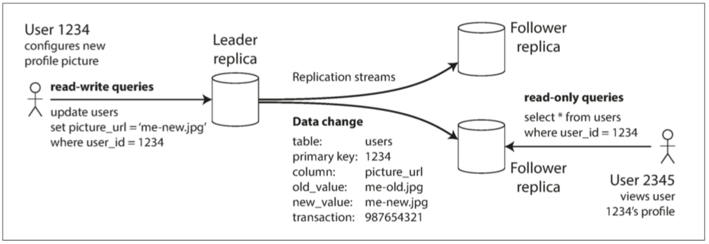
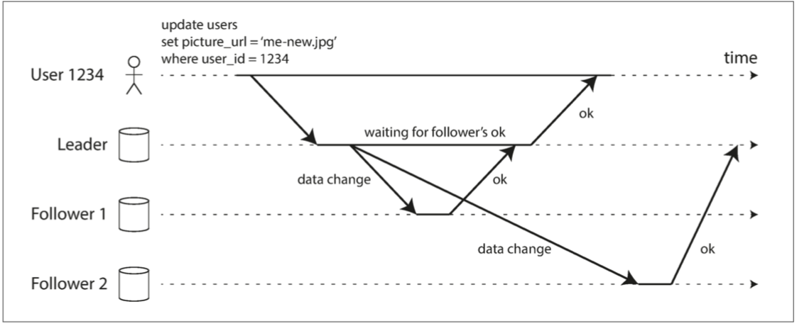
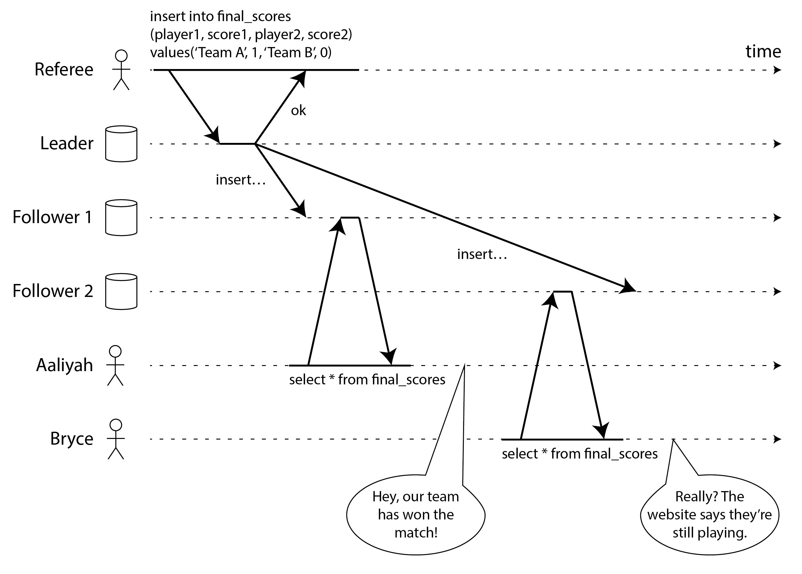
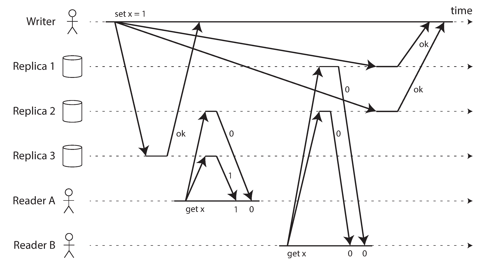
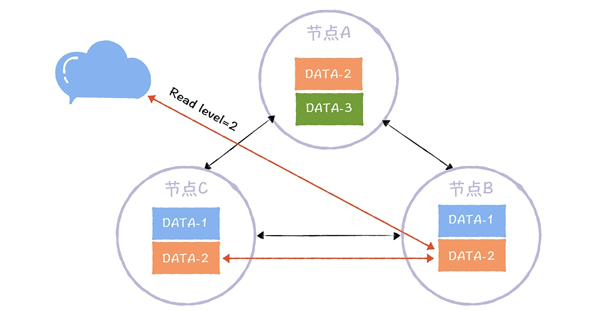

# DDIA

## 5. 复制

复制意味着在通过网络连接的多台机器上保留相同数据的副本。我们希望能复制数据，出于各种各样的原因：
- 使得数据与用户在地理上接近（从而减少延迟）
- 即使系统的一部分出现故障，系统也能继续工作（从而提高可用性）
- 伸缩可以接受读请求的机器数量（从而提高读取吞吐量）

三种流行的变更复制算法：单领导者（single leader，单主），多领导者（multi leader，多主）和无领导者（leaderless，无主）。

复制时需要进行许多权衡：例如，使用同步复制还是异步复制？如何处理失败的副本？

**如何理解最终一致性（eventual consistency）**：最终一致性等问题存在许多误解。需要更加精确地了解最终一致性，读己之写（read-your-writes）和单调读（monotonic read）等

### 领导者与追随者



基于领导者的复制并不仅限于数据库：我遇到的基本都是单领导者，包括ES，kafka...

#### 同步复制与异步复制

从库1的复制是同步的：在向用户报告写入成功并使结果对其他用户可见之前，主库需要等待从库1的确认，确保从库1已经收到写入操作。而从库2的复制是异步的：主库发送消息，但不等待该从库的响应



- 完全同步

    任何一个节点的中断都会导致整个系统停滞不前

- 完全异步

    即使已经向客户端确认成功，写入也不能保证是持久（Durable）的。然而，一个完全异步的配置也有优点：即使所有的从库都落后了，主库也可以继续处理写入

将所有从库都设置为同步的是不切实际的：任何一个节点的中断都会导致整个系统停滞不前。实际上，如果在数据库上启用同步复制，通常意味着其中一个从库是同步的，而其他的从库则是异步的。如果该同步从库变得不可用或缓慢，则将一个异步从库改为同步运行。这保证你至少在两个节点上拥有最新的数据副本：主库和同步从库。这种配置有时也被称为**半同步（semi-synchronous）**

不丢数据但仍能提供良好性能和可用性的复制方法。例如，链式复制（chain replication）是同步复制的一种变体，已经在一些系统（如 Microsoft Azure Storage【10,11】）中成功实现。链式复制我记得在hadoop中遇到过

**复制的一致性与 共识（consensus，使几个节点就某个值达成一致）**: 这个经常会混淆


### 设置新从库(ES, Kafka的做法)

有时候需要设置一个新的从库：也许是为了增加副本的数量，或替换失败的节点。如何确保新的从库拥有主库数据的精确副本？

简单地将数据文件从一个节点复制到另一个节点通常是不够的：客户端不断向数据库写入数据，数据总是在不断地变化，标准的文件复制会看到数据库的不同部分在不同的时间点的内容，其结果可能没有任何意义。

可以通过锁定数据库（使其不可用于写入）来使磁盘上的文件保持一致，但是这会违背高可用的目标。幸运的是，设置新从库通常并不需要停机。从概念上讲，其过程如下所示：

1. 在某个时刻获取主库的一致性快照（如果可能，不必锁定整个数据库）。大多数数据库都具有这个功能，因为它是备份必需的
2. 将快照复制到新的从库节点
3. 从库连接到主库，并拉取快照之后发生的所有数据变更。这要求快照与主库复制日志中的位置精确关联
4. 当从库处理完快照之后积累的数据变更，我们就说它 赶上（caught up）了主库，现在它可以继续及时处理主库产生的数据变化了

### 处理节点宕机

### Partition

分片通常和复制结合使用。每个分片有多个副本，可以分散到多机上去（更泛化一点：多个容错阈）；同时，每个机器含有多个分片，但通常不会有一个分片的两个副本放到一个机器上。


Partition的本质是对数据集合的划分。但在实践中，可以细分为两个步骤：

1. 对数据集进行逻辑划分

   分片过程中，要保证每个分片的数据量多少尽量均匀，否则会有数据偏斜（skew），甚而形成数据热点。

2. 将逻辑分片调度到物理节点

   分片后，需要保存路由信息，给一个KV条目，能知道去哪个机器上去查；稍差一些，可以知道去哪几个机器上去找；最差的，如果需要去所有机器逐一查询，但性能一般不可接受。

#### 对数据集进行逻辑划分

- 按键范围分区

HBase采用了一种自动去“分裂”（split）的方式来动态地进行分区


整个数据表，会按照行键排好序，然后按照连续的行键一段段地分区。如果某一段行键的区间里，写的数据越来越多，占用的存储空间越来越大，那么整个系统会自动地将这个分区一分为二，变成两个分区。而如果某一个区间段的数据被删掉了很多，占用的空间越来越小了，那么我们就会自动把这个分区和它旁边的分区合并到一起

- 键散列（Hash）分区

优势：避免了于偏斜和热点的风险

劣势：失去了键范围分区的高效执行范围查询的能力

- 一个折中的策略是一个列会作为散列的依据，而其他的按照顺序存储在单个分区上

  Example:

  Cassandra中的表可以使用由多个列组成的复合主键来声明。键中只有第一列会作为散列的依据，而其他列则被用SSTables中排序数据的连接索引

  社交媒体网站上，一个用户可能会发布很多更新。如果更新的主键被选择为 (user_id, update_timestamp) ，那么可以有效地检索特定用户在某个时间间隔内按时间戳排序的所有更新。不同的用户可以存储在 不同的分区上，对于每个用户，更新按时间戳顺序存储在单个分区上

  kafka和ES均采用这种方式对数据分区

- 开源组件代码实现
1. ES

   插入的逻辑在IndexRequest#doRun，首先会对插入文档的id字段赋值
    ```Java
       // generate id if not already provided
            if (id == null) {
                String uid = UUIDs.base64UUID();
                id(uid);
            }
    ```

   然后再计算分到哪个shard

    ```Java
    ShardId shardId = clusterService.operationRouting().indexShards(clusterState, concreteIndex, request.id(),
    request.routing()).shardId();
    ```

   具体的计算如下：

    ```Java
     public static int generateShardId(IndexMetadata indexMetadata, @Nullable String id, @Nullable String routing) {
            if (routing == null) {
                assert(indexMetadata.isRoutingPartitionedIndex() == false) : "A routing value is required for gets from a partitioned index";
                effectiveRouting = id;
            } else {
                effectiveRouting = routing;
            }
    
            if (indexMetadata.isRoutingPartitionedIndex()) {
                // hash(id) % routing_partition_size
                partitionOffset = Math.floorMod(Murmur3HashFunction.hash(id), indexMetadata.getRoutingPartitionSize());
            } else {
                // we would have still got 0 above but this check just saves us an unnecessary hash calculation
                partitionOffset = 0;
            }
    
            return calculateScaledShardId(indexMetadata, effectiveRouting, partitionOffset);
        }
    
        private static int calculateScaledShardId(IndexMetadata indexMetadata, String effectiveRouting, int partitionOffset) {
            final int hash = Murmur3HashFunction.hash(effectiveRouting) + partitionOffset;
    
            // we don't use IMD#getNumberOfShards since the index might have been shrunk such that we need to use the size
            // of original index to hash documents
            // indexMetadata.getRoutingNumShards只包含主分片
            return Math.floorMod(hash, indexMetadata.getRoutingNumShards()) / indexMetadata.getRoutingFactor();
        }
    ```

   indexMetadata.getRoutingPartitionSize()配置来减少倾斜的风险。routing_partition_size越大，数据的分布越均匀

   最后计算公式可以合并为：
    <code-block lang="tex"> shardNum=(hash(routing)+hash(id) \% routingPartitionSize) \% numPrimaryShards </code-block>

2. kafka

   KIP-480: Sticky Partitioner引入了UniformStickyPartitioner作为默认的分区器。这个是在Round-robin策略上的优化

   会从本地缓存中拿对应topic的分区，所以具有粘性(Sticky),只有当newBatch或者indexCache为空的情况下才会重新计算分区
    ```Java
       public int partition(String topic, Cluster cluster) {
        Integer part = indexCache.get(topic);
        if (part == null) {
            return nextPartition(topic, cluster, -1);
        }
        return part;
    }
   ```

   newBatch指的是该batch已经满或者到达了发送的时间。UniformStickyPartitioner计算分区也很简单，即随机数

   ```Java
         if (availablePartitions.size() == 1) {
                newPart = availablePartitions.get(0).partition();
            } else {
                while (newPart == null || newPart.equals(oldPart)) {
                    int random = Utils.toPositive(ThreadLocalRandom.current().nextInt());
                    newPart = availablePartitions.get(random % availablePartitions.size()).partition();
                }
            }
   ```

   但是UniformStickyPartitioner有在某些场景下会有问题，在3.3.0废弃，[KIP-794](https://cwiki.apache.org/confluence/display/KAFKA/KIP-794%3A+Strictly+Uniform+Sticky+Partitioner)做了优化，解决**分配倾斜**

   UniformStickyPartitioner会将更多消息分配给速度较慢的broker，并且可能导致“失控”的问题。因为“粘性”时间是由新的批量创建消息驱动的，这与broker的延迟成反比——较慢的broker消耗批量消息的速度较慢，因此它们会比速度更快的分区获得更多的“粘性”时间，从而是消息分配倾斜。

   假设一个生产者写入的消息到3个分区（生产者配置为linger.ms=0），并且一个partition由于某种原因（leader broker选举更换或网络抖动问题等情况）导致稍微变慢了一点。生产者必须一直保留发送到这个partition的批次消息，直到partition变得可用。在保留这些批次消息的同时，因为生产者还没有准备好发送到这个分区，其他批次的消息又大批量发送的并开始堆积，从而可能导致每个批次都可能会被填满。

   KIP-794对UniformStickyPartitioner做了优化，可以采用自适应分区切换

  - 切换策略：分配分区的概率与队列长度成反比

   每次partitionReady之后，更新partition的统计信息
   ```Java
   topicInfo.builtInPartitioner.updatePartitionLoadStats(queueSizes, partitionIds, queueSizesIndex + 1);
    .....
   partitionLoadStats = new PartitionLoadStats(queueSizes, partitionIds, length);
   ```

   PartitionLoadStats的构造函数

      ```Java
        private final static class PartitionLoadStats {
           public final int[] cumulativeFrequencyTable; 
           public final int[] partitionIds;
           public final int length;
      ```

   主要的逻辑是cumulativeFrequencyTable的构造，注释中举了个例子

   ```
   Example: 
     假设有3个partitions的队列长度分别是:
     0 3 1
     最大的queue的长度+1则等于3+1=4，再减去每个queue的长度则是
     4 1 3
     再做前缀和，则cumulativeFrequencyTable数组可以赋值为
     4 5 8
   ```

   那构造了CFT数组如何去用呢，取一个随机数[0..8)，然后看它比CFT数组哪个值比较大则去对应下标。如随机到4的话，选择第二个Partition

#### 将逻辑分片调度到物理节点

xxxxx

#### 分片与次级索引

次级索引通常并不能唯一地标识记录，而是一种搜索记录中出现特定值的方式：查找用户123的所有操作，查找包含词语hogwash的所有文章，查找所有颜色为红色的车辆等等

> 书中说 “次级索引也是Solr和Elasticsearch等搜索服务器的基石”，
> 他指的次级索引可能指的是正排和倒排

- 文档的分区（document-based） 正排？

  

- 基于关键词（term-based）的分区 倒排？


### 事务

   
### 一致性与共识

强一致性方法，关注三个领域：
1. 一个挑战是"强一致性"相当模糊，因此我们将制定一个更精确的定义，明确我们想要实现什么：线性一致性
2. 我们将研究生成ID和时间戳的问题。这可能听起来与一致性无关，但实际上密切相关
3. 我们将探讨分布式系统如何在保持容错的同时实现线性一致性；答案是$共识$算法

线性一致性也称为原子一致性、强一致性、即时一致性或外部一致性

在线性一致系统中，一旦一个客户端成功完成写入，**所有从数据库读取的客户端都必须能够看到刚刚写入的值**。维护单一数据副本的假象意味着保证读取的值是最新的、最新的值，而不是来自过时的缓存或副本

为了避免忘记，还是抄下图片



如果这个数据库是线性一致的，那么Alice的读取要么返回1而不是0，要么Bob的读取返回0而不是 1

**什么系统是必须要实现。线性一致的？**

像Apache ZooKeeper和 etcd 这样的协调服务通常用于实现分布式租约和领导者选举。它们使用共识算法以容错的方式实现线性一致的操作

> 严格来说，ZooKeeper提供线性一致的写入，但读取可能是过时的，因为不能保证它们由当前领导者提供。etcd从版本3开始默认提供线性一致的读取

#### 实现线性一致性系统

书中列举了单主复制，共识算法，多主复制和无主复制；我遇到的大部分是单主复制(kafka, es), 共识算法(etcd)和无主复制(redis)

- 单主复制（可能线性一致）

在单主复制系统中，主节点拥有用于写入的数据主副本，从节点在其他节点上维护数据的备份副本。只要你在主节点上执行所有读写操作，它们很可能是线性一致的。然而，这假设你确定知道谁是主节点。如 “分布式锁和租约” 中所讨论的，一个节点很可能认为自己是主节点，而实际上并不是——如果这个妄想的主节点继续服务请求，很可能会违反线性一致性。使用异步复制，故障切换甚至可能丢失已提交的写入，这违反了持久性和线性一致性。
对单主数据库进行分片，每个分片有一个单独的主节点，不会影响线性一致性，因为它只是单对象保证。跨分片事务是另一回事（见 “分布式事务”）。

- 共识算法（可能线性一致）

一些共识算法本质上是带有自动领导者选举和故障切换的单主复制。它们经过精心设计以防止脑裂，使它们能够安全地实现线性一致的存储。ZooKeeper使用Zab共识算法，etcd使用 Raft，例如。然而，仅仅因为系统使用共识并不能保证其上的所有操作都是线性一致的：如果它允许在不检查节点是否仍然是领导者的情况下在节点上读取，读取的结果可能是过时的，如果刚刚选出了新的领导者。

- 无主复制（可能非线性一致）

对于具有无主复制的系统（Dynamo风格），有时声称可以通过要求仲裁读写（w + r > n）来获得"强一致性"。根据确切的算法，以及你如何定义强一致性，这并不完全正确。

> 刚好看了jraft是如何实现强一致性的，以及Dynamo风格的强一致性的定义，在下面补充下具体细节的实现
 
那为什么有的说，Quorum NWR算法可以实现强一致性，原因是他的强一致性指的是**Werner Vogels 提出的客户端侧一致性模型，不是指线性一致性**



$x$的初始值为0，写入客户端通过向所有三个副本发送写入$n$ = 3，$w$ = 3）将$x$更新为1。同时，客户端$A$从两个节点的仲裁（$r$ = 2）读取，并在其中一个节点上看到新值1。同时与写入并发，客户端$B$从不同的两个节点仲裁读取，并从两者获得旧值0。

仲裁条件得到满足$w + r > n$，但这种执行仍然不是线性一致的：B的请求在A的请求完成后开始，但B返回旧值而A返回新值。

所以说，**Quorum NWR算法没有实现强一致性**，而*客户端侧一致性模型*指的是，客户端$A$写入成功之后，就可以读到最新的值

- 读一致性级别：读取指定数据时，要读$R$副本，然后返回$R$个副本中最新的那份数据

    

- 写一致性：表示成功完成W个副本更新，才完成写操作

在很多读多，写少的场景，不支持读一致性级别，只支持写一致性级别。*可以通过设置写一致性级别为all，来实现强一致性*


可以使Dynamo风格的仲裁线性一致，但代价是降低性能：读者必须同步执行读修复（见 “追赶错过的写入”），然后才能将结果返回给应用程序 24。此外，在写入之前，写入者必须读取节点仲裁的最新状态以获取任何先前写入的最新时间戳，并确保新写入具有更大的时间戳 25 26。然而，Riak 由于性能损失而不执行同步读修复。Cassandra 确实等待仲裁读取时的读修复完成 27，但由于它使用日历时钟作为时间戳而失去了线性一致性


