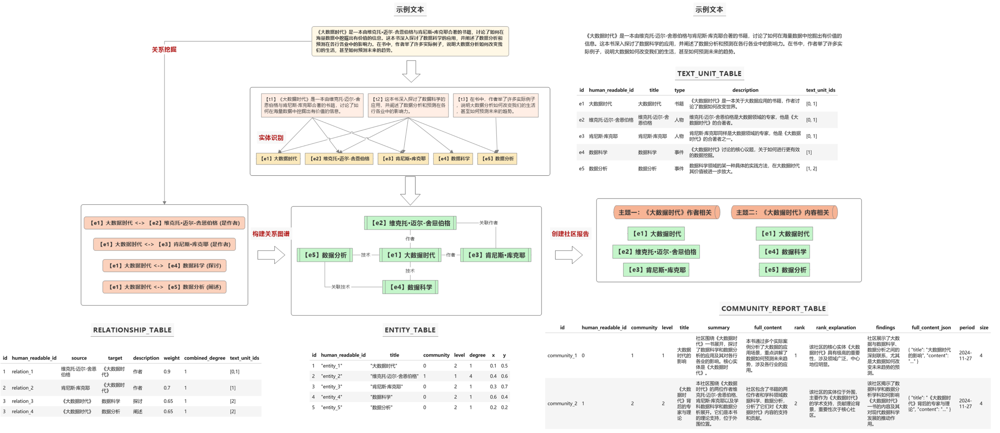
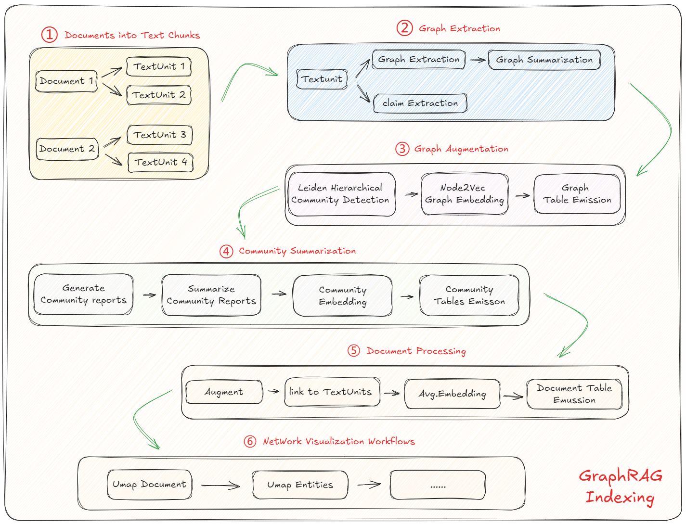
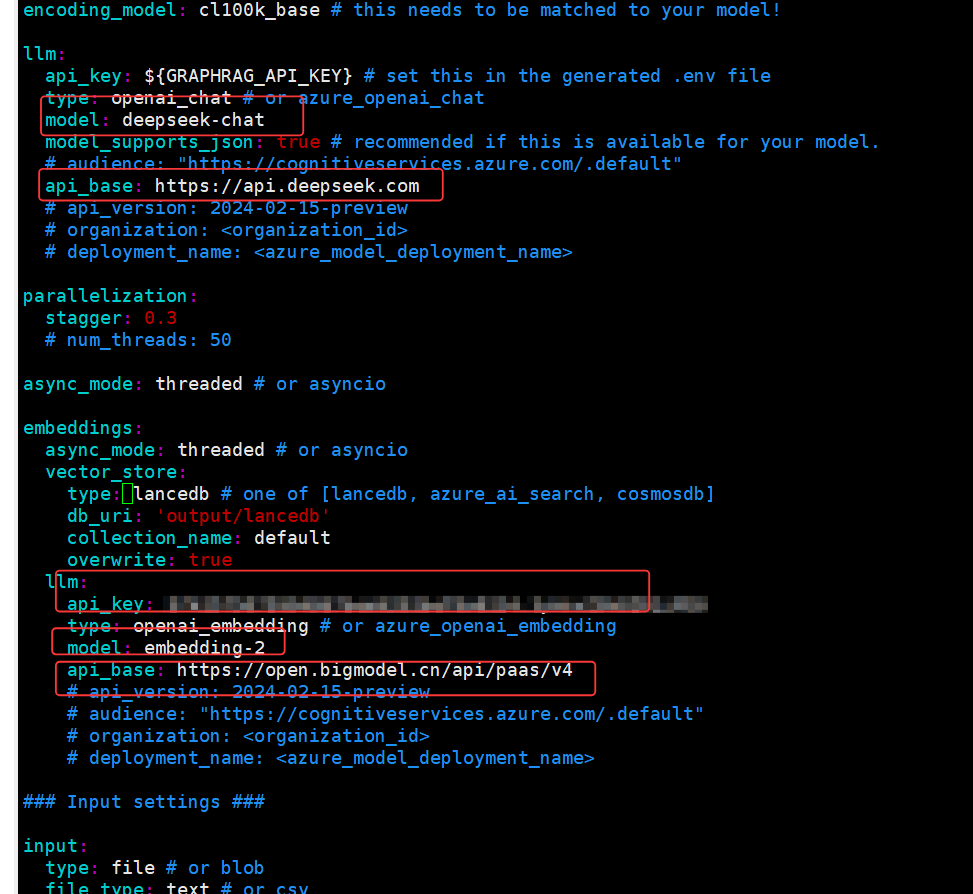

# GraphRag

1. 微软GraphRAG项目介绍与GraphRAG流程回顾
    - GraphRAG项目简介
    - GraphRAG核心特点
    - GraphRAG运行流程
    - GraphRAG核心原理回顾
2. GraphRAG安装与Indexing检索流程实现
    - GraphRAG安装与项目创建
    - GraphRAG索引Indexing过程执行
    - 查看知识图谱相关表格
3. GraphRAG问答流程
    - 导入核心关系组
    - 设置模型参数
    - 构建LocalSearch（本地搜索）搜索引擎并进行问答
    - 构建GlobalSearch（全局搜索）搜索引擎并进行问答
4. GraphRAG中知识图谱可视化方法

&emsp;&emsp;**检索增强生成（RAG）** 是一种通过结合真实世界的信息来提升大型语言模型（LLM）输出质量的技术。RAG 技术是大多数基于
LLM 的工具中的一个重要组成部分。大多数 RAG 方法使用 **向量相似性** 作为检索技术，我们将其称为 **基线 RAG（Baseline RAG）**。

**GraphRAG** 则使用 **知识图谱** 来在推理复杂信息时显著提升问答性能。当需要对复杂数据进行推理时，GraphRAG 展示了优于基线
RAG 的性能，特别是在 **知识图谱** 的帮助下。

&emsp;&emsp;RAG 技术在帮助 LLM 推理私有数据集方面显示了很大的潜力——例如，LLM 没有在训练时接触过的、企业的专有研究、业务文档或通信数据。基线
RAG 技术最初是为了解决这个问题而提出的，但我们观察到，在某些情况下，基线 RAG 的表现并不理想。以下是几个典型的场景：

1. **基线 RAG 很难将信息串联起来**：当一个问题的答案需要通过多个不同的信息片段，并通过它们共享的属性来连接，进而提供新的综合见解时，基线
   RAG 表现得很差。

   例如，在回答类似“如何通过现有的数据推断出新结论”这种问题时，基线 RAG 无法很好地处理这些散布在不同文档中的相关信息，它可能会遗漏一些关键联系点。

2. **基线 RAG 无法有效理解大型数据集或单一大文档的整体语义概念**：当被要求在大量数据或复杂文档中进行总结、提炼和理解时，基线
   RAG 往往表现不佳。

   例如，如果问题要求对整个文档或多篇文档的主题进行总结和理解，基线 RAG 的简单向量检索方法可能无法处理文档间的复杂关系，导致对全局语义的理解不完整。

&emsp;&emsp;为了应对这些挑战，技术社区正在努力开发扩展和增强 RAG 的方法。**微软研究院**（Microsoft Research）提出的 *
*GraphRAG** 方法，使用 **LLM** 基于输入语料库构建 **知识图谱**。这个图谱与社区总结和图谱机器学习输出结合，能够在查询时增强提示（prompt）。GraphRAG
在回答以上两类问题时，展示了 **显著的改进**，尤其是在 **复杂信息的推理能力** 和 **智能性** 上，超越了基线 RAG
之前应用于私有数据集的其他方法。

#### 1.GraphRAG项目简介

&emsp;&emsp;**GraphRAG** 是微软研究院开发的一种先进的增强检索生成（RAG）框架，旨在提升语言模型（LLM）在处理复杂数据时的性能。与传统的
RAG 方法依赖向量相似性检索不同，**GraphRAG** 利用 **知识图谱** 来显著增强语言模型的问答能力，特别是在处理私有数据集或大型、复杂数据集时表现尤为出色。

#### 2.GraphRAG核心特点

&emsp;&emsp;传统的 **Baseline RAG** 方法在某些情况下表现不佳，尤其是当查询需要在不同信息片段之间建立联系时，或是当需要对大规模数据集进行整体理解时。GraphRAG
通过以下方式克服了这些问题：

- **更好的连接信息点**：GraphRAG 能够处理那些需要从多个数据点合成新见解的任务。
- **更全面的理解能力**：GraphRAG 更擅长对大型数据集进行全面理解，能够更好地处理复杂的抽象问题。

&emsp;&emsp;而借助微软开源的GeaphRAG项目，可以快速做到以下事项：

- **基于图的检索**：传统的 RAG 方法使用向量相似性进行检索，而 GraphRAG 引入了知识图谱来捕捉实体、关系及其他重要元数据，从而更有效地进行推理。
- **层次聚类**：GraphRAG 使用 **Leiden** 技术进行层次聚类，将实体及其关系进行组织，提供更丰富的上下文信息来处理复杂的查询。
- **多模式查询**：支持多种查询模式：
    - **全局搜索**：通过利用社区总结来进行全局性推理。
    - **局部搜索**：通过扩展相关实体的邻居和关联概念来进行具体实体的推理。
    - **DRIFT 搜索**：结合局部搜索和社区信息，提供更准确和相关的答案。
- **图机器学习**：集成了图机器学习技术，提升查询响应质量，并提供来自结构化和非结构化数据的深度洞察。
- **Prompt 调优**：提供调优工具，帮助根据特定数据和需求调整查询提示，从而提高结果质量。

#### 3.GraphRAG运行流程

**索引（Indexing）过程**

1. **文本单元切分**：将输入文本分割成 **TextUnits**，每个 TextUnit 是一个可分析的单元，用于提取关键信息。
2. **实体和关系提取**：使用 LLM 从 TextUnits 中提取实体、关系和关键声明。
3. **图构建**：构建知识图谱，使用 Leiden 算法进行实体的层次聚类。每个实体用节点表示，节点的大小和颜色分别代表实体的度数和所属社区。
4. **社区总结**：从下到上生成每个社区及其成员的总结，帮助全局理解数据集。

**查询（Query）过程**        
索引完成后，用户可以通过不同的搜索模式进行查询：

- **全局搜索**：当我们想了解整个语料库或数据集的整体概况时，GraphRAG 可以利用 社区总结 来快速推理和获取信息。这种方式适用于大范围问题，如某个主题的总体理解。
- **局部搜索**：如果问题关注于某个特定的实体，GraphRAG 会向该实体的 邻居（即相关实体）扩展搜索，以获得更详细和精准的答案。
- **DRIFT 搜索**：这是对局部搜索的增强，除了获取邻居和相关概念，还引入了 社区信息 的上下文，从而提供更深入的推理和连接。

**Prompt 调优**        
为了获得最佳性能，GraphRAG 强烈建议进行 **Prompt 调优**，确保模型可以根据你的特定数据和查询需求进行优化，从而提供更准确和相关的答案。

#### 4.GraphRAG核心原理



### 二、GraphRAG安装与Indexing检索流程实现

&emsp;&emsp;`GraphRAG`通过利用大模型从原始文本数据中提取知识图谱来满足跨上下文检索的需求。该知识图将信息表示为互连实体和关系的网络，与简单的文本片段相比，提供了更丰富的数据表示。这种结构化表示使
`GraphRAG` 能够擅长回答需要推理和连接不同信息的复杂问题。具体来看，`GraphRAG`
定义了一个标准化数据模型，整体框架由几个关键组件组成，分别用于表示文档、TextUnit、实体、关系和社区报告等实体。像传统`RAG`一样，
**`GraphRAG` 过程也涉及两个主要阶段：索引和查询**。我们依次展开来进行讨论。

&emsp;&emsp;在索引（Indexing）过程中，输入的文本被分为可管理的块，称为`TextUnits` 。然后大模型从这些文本单元中提取实体、关系和声明，形成知识图。完整的
`Indexing`流程如下图所示：



#### GraphRAG索引阶段执行流程

Step 1. **文本切分（Text Unit Splitting）**

- GraphRAG 需要处理的是一大篇文档或语料库。首先，它会将这些文档切分为 **Text Units**（文本单元），这些 Text Units
  是对输入文档的细分，通常是按照段落、句子或固定长度的文本块来进行切分。
- 这样做的目的是为了便于对文本内容进行分析，尤其是当需要进行 **实体识别** 和 **关系抽取** 时，能够精准地关联到文档中的具体上下文。

Step 2. **实体识别（Entity Extraction）**

- 在文本切分之后，GraphRAG 会使用 **大模型（如 OpenAI GPT 或其他 LLM）** 对每个 Text Unit 进行处理，提取其中的 **实体**
  。这些实体通常是指文档中出现的人物、地点、组织、概念等信息。
- 实体识别的目的是构建 **实体图谱（Entity Graph）**，将所有实体提取出来并为后续的关系挖掘和查询做准备。

Step 3. **关系挖掘（Relationship Extraction）**

- 关系挖掘是从文本中识别出实体之间的 **关系**，例如：谁与谁有关联、某个实体与另一个实体之间的关系是“属于”、“合作”、“对立”等。
- 通过这种关系提取，GraphRAG 可以构建 **关系图谱（Relationship Graph）**，这些关系将有助于后续的 **查询引擎** 理解和推理。

Step 4. **文本嵌入（Text Embedding）**

- 在识别了文本中的实体和关系之后，GraphRAG 会利用 **嵌入模型**（如 OpenAI 的 Embedding
  模型）将文本和实体表示为向量（vectors）。这些向量不仅包括了文本的语义信息，还能为后续的检索和查询提供高效的表示。
- 这些嵌入向量将存储在 **向量数据库**（如 LanceDB）中，为查询时提供快速的相似度搜索。

Step 5. **构建社区和层级结构（Community and Hierarchical Clustering）**

- 通过使用 **图谱聚类算法**（如 Leiden 算法），GraphRAG 会将不同的实体和关系分组，形成多个 **社区**
  （Community）。这些社区是根据实体之间的相似度或关系的密切程度进行划分的。
- 这种分组帮助 GraphRAG 更好地理解不同知识领域的结构，为查询时提供更具层次性的上下文信息。

Step 6. **生成索引文件（Indexing）**

- 完成上述步骤后，所有的 **实体**、**关系**、**社区报告**、**文本单元**等信息都会存储在磁盘上的 Parquet 文件中。
- 这些索引文件实际上就是构建好的 **知识图谱**，包括了文本内容、文本中涉及的实体和关系的结构化表示，并且这些文件是为后续的查询引擎和推理过程提供基础。

总的来说GraphRAG的**索引阶段**是一个**多步骤**的过程，基本流程是：

1. **文本切分**（Text Units）
2. **实体识别**（Entity Extraction）
3. **关系挖掘**（Relationship Extraction）
4. **文本嵌入**（Text Embedding）
5. **社区划分和层级结构**（Clustering）
6. **生成索引文件**（Indexing）

整个过程的目的是将文档中的原始文本转化为可以进行检索和推理的结构化知识图谱。而 **实体识别** 和 **关系挖掘**
通常是在文本切分之后进行的，因为需要先确保文本已经切分成足够小的单元才能进行更精细的分析和抽取。

#### 配置和执行索引阶段

- 安装与项目创建

1. 使用pip安装graphrag

   ```bash
   pip install graphrag=1.8.0
   ```

2. 创建检索项目文件夹

   ```bash
   mkdir -p ./openl/input
   ```

3. 上传数据集到input文件夹

   *数据集必须是utf-8格式的，不然会报错*

4. 初始化项目文件

   ```bash
   graphrag init --root ./openl
   ```

5. 修改项目配置

   这个需要修改两块，一个是llm,一个是embedding的；.env文件填写的是llm的OpenAI API-KEY，我用的是deepseek

   settings.yaml修改如下：

   

6. 开始执行GraphRAG索引过程

   ```bash
   graphrag index --root ./openl
   
   # 如果错误中断，可以执行以下resume
   graphrag index --root openl/ --resume output
   ```

   pipeline:
   ```Text
   ⠋ GraphRAG Indexer 
   ├── Loading Input (InputFileType.text) - 1 files loaded (0 filtered) ━ 100% … 0…
   ├── create_base_text_units
   ├── create_final_documents
   ├── create_base_entity_graph
   ├── create_final_entities
   ├── create_final_nodes
   ├── create_final_communities
   ├── create_final_relationships
   ├── create_final_text_units
   ├── create_final_community_reports
   └── generate_text_embeddings
   ```


- 文件表（Documents Table）

   ```Python
   documents_df = pd.read_parquet("./openl/output/create_final_documents.parquet")
   documents_df
   ```

  | id                                      | human_readable_id | title                     | text                                                                 | text_unit_ids                                      |
     |-----------------------------------------|-------------------|---------------------------|---------------------------------------------------------------------|---------------------------------------------------|
  | acf20671011ed68db... | 1                | 2.txt                     | 第000章 人物介绍\n\n侯龙涛... | [976d32d4d5af0ebc3e29a... |

