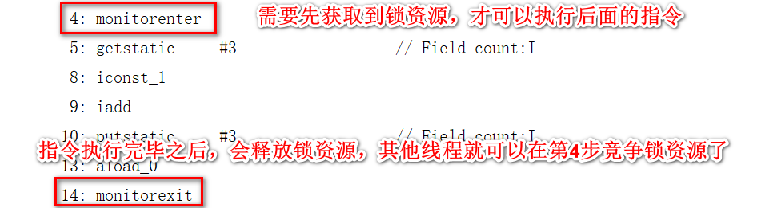

# JUC 

## 1. 基础概念的问题

#### 线程的创建

- 继承Thread类 重写run方法

  为什么创建线程不要直接用thread

- 实现Runnable接口 重写run方法
- 配合FutureTask。实现Callable 重写call方法

##### interrupt方式

共享变量方式

isInterrupted会返回当前状态并且归为为false
```java
public static void main(String[] args) throws InterruptedException {
    // 线程默认情况下，    interrupt标记位：false
    System.out.println(Thread.currentThread().isInterrupted());
    // 执行interrupt之后，再次查看打断信息
    Thread.currentThread().interrupt();
    // interrupt标记位：ture
    System.out.println(Thread.currentThread().isInterrupted());
    // 返回当前线程，并归位为false interrupt标记位：ture
    System.out.println(Thread.interrupted());
    // 已经归位了
    System.out.println(Thread.interrupted());

    // =====================================================
    Thread t1 = new Thread(() -> {
        while(!Thread.currentThread().isInterrupted()){
            // 处理业务
        }
        System.out.println("t1结束");
    });
    t1.start();
    Thread.sleep(500);
    t1.interrupt();
}
```

通过打断WAITING或者TIMED_WAITING状态的线程，从而抛出异常自行处理

下面这种停止线程方式是最常用的一种，在框架和JUC中也是最常见的
```java
public static void main(String[] args) throws InterruptedException {
    Thread t1 = new Thread(() -> {
        while(true){
            // 获取任务
            // 拿到任务，执行任务
            // 没有任务了，让线程休眠
            try {
                Thread.sleep(1000);
            } catch (InterruptedException e) {
                e.printStackTrace();
                System.out.println("基于打断形式结束当前线程");
                return;
            }
        }
    });
    t1.start();
    Thread.sleep(500);
    t1.interrupt(); // 打断上面的sleep
}
```

wait和sleep的区别？
* sleep属于Thread类中的static方法、wait属于Object类的方法
* sleep属于TIMED_WAITING，自动被唤醒、wait属于WAITING，需要手动唤醒。
* sleep方法在持有锁时，执行，不会释放锁资源、wait在执行后，会释放锁资源。
* sleep可以在持有锁或者不持有锁时，执行。 wait方法必须在只有锁时才可以执行。

wait方法会将持有锁的线程从owner扔到WaitSet集合中，这个操作是在修改ObjectMonitor对象，如果没有持有synchronized锁的话，是无法操作ObjectMonitor对象的。

## 2. 三大特性

### 2.1 原子性

JMM（Java Memory Model）。不同的硬件和不同的操作系统在内存上的操作有一定差异的。Java为了解决相同代码在不同操作系统上出现的各种问题，用JMM屏蔽掉各种硬件和操作系统带来的差异。

让Java的并发编程可以做到跨平台。

JMM规定所有变量都会存储在主内存中，在操作的时候，需要从主内存中复制一份到线程内存（CPU内存），在线程内部做计算。**然后再写回主内存中（不一定！）。**

#### 保证并发编程的原子性

- synchronized

因为++操作可以从指令中查看到


可以在方法上追加synchronized关键字或者采用同步代码块的形式来保证原子性

synchronized可以让避免多线程同时操作临街资源，同一时间点，只会有一个线程正在操作临界资源



- CAS

到底什么是CAS

compare and swap也就是比较和交换，他是一条CPU的并发原语。

他在替换内存的某个位置的值时，首先查看内存中的值与预期值是否一致，如果一致，执行替换操作。这个操作是一个原子性操作。

Java中基于Unsafe的类提供了对CAS的操作的方法，JVM会帮助我们将方法实现CAS汇编指令。

但是要清楚CAS只是比较和交换，在获取原值的这个操作上，需要你自己实现。

```java
private static AtomicInteger count = new AtomicInteger(0);

public static void main(String[] args) throws InterruptedException {
    Thread t1 = new Thread(() -> {
        for (int i = 0; i < 100; i++) {
            count.incrementAndGet();
        }
    });
    Thread t2 = new Thread(() -> {
        for (int i = 0; i < 100; i++) {
            count.incrementAndGet();
        }
    });
    t1.start();
    t2.start();
    t1.join();
    t2.join();
    System.out.println(count);
}
```

Doug Lea在CAS的基础上帮助我们实现了一些原子类，其中就包括现在看到的AtomicInteger，还有其他很多原子类……

**CAS的缺点**：CAS只能保证对一个变量的操作是原子性的，无法实现对多行代码实现原子性。

**CAS的问题**：

* **ABA问题**：问题如下，可以引入版本号的方式，来解决ABA的问题。Java中提供了一个类在CAS时，针对各个版本追加版本号的操作。 AtomicStampeReference
* AtomicStampedReference在CAS时，不但会判断原值，还会比较版本信息。
* ```java
  public static void main(String[] args) {
      AtomicStampedReference<String> reference = new AtomicStampedReference<>("AAA",1);

      String oldValue = reference.getReference();
      int oldVersion = reference.getStamp();

      boolean b = reference.compareAndSet(oldValue, "B", oldVersion, oldVersion + 1);
      System.out.println("修改1版本的：" + b);

      boolean c = reference.compareAndSet("B", "C", 1, 1 + 1);
      System.out.println("修改2版本的：" + c);
  }
  ```
* **自旋时间过长问题**：
   * 可以指定CAS一共循环多少次，如果超过这个次数，直接失败/或者挂起线程。（自旋锁、自适应自旋锁）
   * 可以在CAS一次失败后，将这个操作暂存起来，后面需要获取结果时，将暂存的操作全部执行，再返回最后的结果。

## 3. 锁
## 4. 阻塞队列


BlockingQueue继承Queue，Queue继承自Collection。所以Collection最基础的增删改查操作是有的，在这个基础上，多了Queue的特点，在这个基础上又多了阻塞的特点

阻塞方法
- put(E e)：将元素插入队列，如果队列已满，则会阻塞，直到队列有空间为止。
- take()：从队列中取出元素，如果队列为空，则会阻塞，直到队列有元素为止。
- offer(E e, long timeout, TimeUnit unit)：尝试在指定的等待时间内将元素插入队列，如果在指定时间内队列满了，则返回 false，否则插入成功返回 true。
- poll(long timeout, TimeUnit unit)：尝试在指定的等待时间内从队列中取出元素，如果在指定时间内队列为空，则返回 null，否则取出成功返回元素。

非阻塞方法
- add(E e)：将元素插入队列，如果队列已满，则抛出IllegalStateException异常
- remove()：从队列中取出元素，如果队列为空，则抛出NoSuchElementException异常
- element()：获取队列头部的元素，但不移除它，如果队列为空，则抛出NoSuchElementException异常
- peek()：获取队列头部的元素，但不移除它，如果队列为空，则返回null。

#### ArrayBlockingQueue

A bounded blocking queue backed by an array

#### SynchronousQueue
SynchronousQueue队列实现*线程之间的直接交换hand-off*，不存储数据，存储生产者或者是消费者

当存储一个生产者到SynchronousQueue队列中之后，生产者会阻塞（看调用的方法）

进到SynchronousQueue类的内部后，有一个内部类Transferer，提供了一个transfer的方法

```java
abstract static class Transferer<E> {
    abstract E transfer(E e, boolean timed, long nanos);
}
```

当前这个类中提供的transfer方法，就是生产者和消费者在调用读写数据时要用到的核心方法。

生产者在调用上述的transfer方法时，第一个参数e会正常传递数据

消费者在调用上述的transfer方法时，第一个参数e会传递null

SynchronousQueue针对抽象类Transferer做了几种实现。

一共看到了两种实现方式：

- TransferStack
- TransferQueue

这两种类继承了Transferer抽象类，在构建SynchronousQueue时，会指定使用哪种子类

```java
// 到底采用哪种实现，需要把对应的对象存放到这个属性中
private transient volatile Transferer<E> transferer;
// 采用无参时，会调用下述方法，再次调用有参构造传入false
public SynchronousQueue() {
    this(false);
}
// 调用的是当前的有参构造，fair代表公平还是不公平
public SynchronousQueue(boolean fair) {
    // 如果是公平，采用Queue，如果是不公平，采用Stack
    transferer = fair ? new TransferQueue<E>() : new TransferStack<E>();
}
```
当TransferQueue，且先生产数据的情况


当fair是false的时候，是非公平的情况


## 5. 线程池
## 6. 并发集合

### HashMap

```Java
    final V putVal(int hash, K key, V value, boolean onlyIfAbsent,
                   boolean evict) {
        Node<K,V>[] tab; Node<K,V> p; int n, i;
        if ((tab = table) == null || (n = tab.length) == 0)
            n = (tab = resize()).length;
        if ((p = tab[i = (n - 1) & hash]) == null)
            tab[i] = newNode(hash, key, value, null);
        else {
            Node<K,V> e; K k;
            if (p.hash == hash &&
                ((k = p.key) == key || (key != null && key.equals(k))))
                e = p;
            else if (p instanceof TreeNode)
                e = ((TreeNode<K,V>)p).putTreeVal(this, tab, hash, key, value);
            else {
                for (int binCount = 0; ; ++binCount) {
                    if ((e = p.next) == null) {
                        p.next = newNode(hash, key, value, null);
                        if (binCount >= TREEIFY_THRESHOLD - 1) // -1 for 1st
                            treeifyBin(tab, hash);
                        break;
                    }
                    if (e.hash == hash &&
                        ((k = e.key) == key || (key != null && key.equals(k))))
                        break;
                    p = e;
                }
            }
            if (e != null) { // existing mapping for key
                V oldValue = e.value;
                if (!onlyIfAbsent || oldValue == null)
                    e.value = value;
                afterNodeAccess(e);
                return oldValue;
            }
        }
        ++modCount;
        if (++size > threshold)
            resize();
        afterNodeInsertion(evict);
        return null;
    }
```

从问题看源码：
1. 什么条件会树化？

   结论：因此如果某个桶中的链表长度大于等于8了，则会判断当前的hashmap的容量是否大于64，如果小于64，则会进行扩容；如果大于64，则将链表转为红黑树

   桶的个数要大于等于8
   ```
   // TREEIFY_THRESHOLD = 8
   if (binCount >= TREEIFY_THRESHOLD - 1) // -1 for 1st
       treeifyBin(tab, hash);
   ```

   还有个条件，tab的长度要小于MIN_TREEIFY_CAPACITY=64
   ```
    final void treeifyBin(Node<K,V>[] tab, int hash) {
        int n, index; Node<K,V> e;
        if (tab == null || (n = tab.length) < MIN_TREEIFY_CAPACITY)
            resize();
   ```

2. 装填因子为什么是0.75? 很简单，高了xx，低了xx
3. 主数组长度为什么是2^n？
4. 扩容机制？

   当HashMap 的负载因子达到阈值（默认是0.75）时，会触发扩容操作。扩容时，HashMap 的容量会增加一倍,从原来的容量$2^n$扩容到$2^{n+1}$。此时，桶数组的长度从原来的$2^n$变为$2^{n+1}$。

   由于哈希值是通过hash方法计算的，而这个方法的输出是一个32位的整数。在扩容时，桶数组的长度从$2^n$为$2^{n+1}$，这意味着桶数组的索引计算方式从原来的hash%$2^{n}$变为hash%$2^{n+1}$。因此索引计算可以简化为位运算。

5. 初始化容量？默认初始化容量是16，指定的话需要满足$2^n$

### ConcurrentHashMap

CAS：在没有hash冲突时（Node要放在数组上时）

synchronized：在出现hash冲突时（Node存放的位置已经有数据了）

存储的结构：数组+链表+红黑树

#### 1.2 存储操作

**1.2.1 put方法**

```java
public V put(K key, V value) {
    // 在调用put方法时，会调用putVal，第三个参数默认传递为false
    // 在调用putIfAbsent时，会调用putVal方法，第三个参数传递的为true
    // 如果传递为false，代表key一致时，直接覆盖数据
    // 如果传递为true，代表key一致时，什么都不做，key不存在，正常添加（Redis，setnx）
    return putVal(key, value, false);
}
```

```Java
public static void test() {
    Map<String, String> queue = new ConcurrentHashMap<>();
    queue.put("1", "1");
    System.out.println(queue.put("1", "3")); // 1
    System.out.println(queue); // {1=3}
    queue.putIfAbsent("3", "3");
    System.out.println(queue.putIfAbsent("3", "4"));// 3
    System.out.println(queue);// {1=3, 3=3}
}
```

**1.2.2 putVal方法-散列算法**

```java
final V putVal(K key, V value, boolean onlyIfAbsent) {
    // ConcurrentHashMap不允许key或者value出现为null的值，跟HashMap的区别
    if (key == null || value == null) throw new NullPointerException();
    // 根据key的hashCode计算出一个hash值，后期得出当前key-value要存储在哪个数组索引位置
    int hash = spread(key.hashCode());
    // 一个标识，在后面有用！
    int binCount = 0;
    // 省略大量的代码……
}

// 计算当前Node的hash值的方法
static final int spread(int h) {
    // 将key的hashCode值的高低16位进行^运算，最终又与HASH_BITS进行了&运算
    // 将高位的hash也参与到计算索引位置的运算当中
    // 为什么HashMap、ConcurrentHashMap，都要求数组长度为2^n
    // HASH_BITS让hash值的最高位符号位肯定为0，代表当前hash值默认情况下一定是正数，因为hash值为负数时，有特殊的含义
    // static final int MOVED     = -1; // 代表当前hash位置的数据正在扩容！
    // static final int TREEBIN   = -2; // 代表当前hash位置下挂载的是一个红黑树
    // static final int RESERVED  = -3; // 预留当前索引位置……
    return (h ^ (h >>> 16)) & HASH_BITS;
    // 计算数组放到哪个索引位置的方法   (f = tabAt(tab, i = (n - 1) & hash)
    // n：是数组的长度
}
```

```Text
00001101 00001101 00101111 10001111  - h = key.hashCode

运算方式
00000000 00000000 00000000 00001111  - 15 (n - 1)
&
(
(
00001101 00001101 00101111 10001111  - h
^
00000000 00000000 00001101 00001101  - h >>> 16 // 高16位
)
&
01111111 11111111 11111111 11111111  - HASH_BITS // 首位是0
)
```

**1.2.3 putVal方法-添加数据到数组&初始化数组**
```java
final V putVal(K key, V value, boolean onlyIfAbsent) {
    // 省略部分代码…………
    // 将Map的数组赋值给tab，死循环
    for (Node<K,V>[] tab = table;;) {
        // 声明了一堆变量~~
        // n:数组长度
        // i:当前Node需要存放的索引位置
        // f: 当前数组i索引位置的Node对象
        // fn：当前数组i索引位置上数据的hash值
        Node<K,V> f; int n, i, fh;
        // 判断当前数组是否还没有初始化
        if (tab == null || (n = tab.length) == 0)
            // 将数组进行初始化。
            tab = initTable();
        // 基于 (n - 1) & hash 计算出当前Node需要存放在哪个索引位置
        // 基于tabAt获取到i位置的数据
        else if ((f = tabAt(tab, i = (n - 1) & hash)) == null) {
            // 现在数组的i位置上没有数据，基于CAS的方式将数据存在i位置上
            if (casTabAt(tab, i, null,new Node<K,V>(hash, key, value, null)))
                // 如果成功，执行break跳出循环，插入数据成功
                break;   
        }
        // 判断当前位置数据是否正在扩容……
        else if ((fh = f.hash) == MOVED)
            // 让当前插入数据的线程协助扩容
            tab = helpTransfer(tab, f);
        // 省略部分代码…………
    }
    // 省略部分代码…………
}
```

两个同时初始化的时候如何保证线程安全
sizeCtl：是数组在初始化和扩容操作时的一个控制变量
-1：代表当前数组正在初始化
小于-1：低16位代表当前数组正在扩容的线程个数（如果1个线程扩容，值为-2，如果2个线程扩容，值为-3）
0：代表数组还没初始化
大于0：代表当前数组的扩容阈值，或者是当前数组的初始化大小
```Java
// 初始化数组方法
private final Node<K,V>[] initTable() {
    // 声明标识
    Node<K,V>[] tab; int sc;
    // 再次判断数组没有初始化，并且完成tab的赋值
    while ((tab = table) == null || tab.length == 0) {
        // 将sizeCtl赋值给sc变量，并判断是否小于0
        if ((sc = sizeCtl) < 0)
            Thread.yield(); 
        // 可以尝试初始化数组，线程会以CAS的方式，将sizeCtl修改为-1，代表当前线程可以初始化数组
        else if (U.compareAndSwapInt(this, SIZECTL, sc, -1)) {
            // 尝试初始化！
            try {
                // 再次判断当前数组是否已经初始化完毕。
                if ((tab = table) == null || tab.length == 0) {
                    // 开始初始化，
                    // 如果sizeCtl > 0，就初始化sizeCtl长度的数组
                    // 如果sizeCtl == 0，就初始化默认的长度
                    int n = (sc > 0) ? sc : DEFAULT_CAPACITY;
                    // 初始化数组！
                    Node<K,V>[] nt = (Node<K,V>[])new Node<?,?>[n];
                    // 将初始化的数组nt，赋值给tab和table
                    table = tab = nt;
                    // sc赋值为了数组长度 - 数组长度 右移 2位    16 - 4 = 12
                    // 将sc赋值为下次扩容的阈值
                    sc = n - (n >>> 2);
                }
            } finally {
                // 将赋值好的sc，设置给sizeCtl
                sizeCtl = sc;
            }
            break;
        }
    }
    return tab;
}
```

## 7. 并发工具
## 8. 异步编程

### 8.1 FutureTask
### 8.2 CompletableFuture
扩展了Future接口，提供了更多的方法，如thenApply、thenAccept、thenRun、exceptionally等
- 支持链式调用和组合多个异步任务
- 提供了异常处理机制
- 可以通过complete和completeExceptionally方法手动完成任务

如果不提供线程池的话，默认使用的ForkJoinPool，而ForkJoinPool内部是守护线程，如果main线程结束了，守护线程会跟着一起结束

#### 源码分析

不需要把所有源码都看了，更多的是要掌握整个CompletableFuture的源码执行流程，以及任务的执行时机。

#### 当前任务执行方式

将任务和CompletableFuture封装到一起，再执行封住好的具体对象的run方法即可

```java
// 提交任务到CompletableFuture
public static CompletableFuture<Void> runAsync(Runnable runnable) {
    // asyncPool：执行任务的线程池
    // runnable：具体任务。
    return asyncRunStage(asyncPool, runnable);
}

// 内部执行的方法
static CompletableFuture<Void> asyncRunStage(Executor e, Runnable f) {
    // 对任务做非空校验
    if (f == null) throw new NullPointerException();
    // 直接构建了CompletableFuture的对象，作为最后的返回结果
    CompletableFuture<Void> d = new CompletableFuture<Void>();
    // 将任务和CompletableFuture对象封装为了AsyncRun的对象
    // 将封装好的任务交给了线程池去执行
    e.execute(new AsyncRun(d, f));
    // 返回构建好的CompletableFuture
    return d;
}

// 封装任务的AsyncRun类信息
static final class AsyncRun extends ForkJoinTask<Void> implements Runnable, AsynchronousCompletionTask {
    // 声明存储CompletableFuture对象以及任务的成员变量
    CompletableFuture<Void> dep; 
    Runnable fn;

    // 将传入的属性赋值给成员变量
    AsyncRun(CompletableFuture<Void> dep, Runnable fn) {
        this.dep = dep; 
        this.fn = fn;
    }
    // 当前对象作为任务提交给线程池之后，必然会执行当前方法
    public void run() {
        // 声明局部变量
        CompletableFuture<Void> d; Runnable f;
        // 将成员变量赋值给局部变量，并且做非空判断
        if ((d = dep) != null && (f = fn) != null) {
            // help GC，将成员变量置位null，只要当前任务结束后，成员变量也拿不到引用。
            dep = null; fn = null;
            // 先确认任务没有执行。
            if (d.result == null) {
                try {
                    // 直接执行任务
                    f.run();
                    // 当前方法是针对Runnable任务的，不能将结果置位null
                    // 要给没有返回结果的Runnable做一个返回结果
                    d.completeNull();
                } catch (Throwable ex) {
                    // 异常结束！
                    d.completeThrowable(ex);
                }
            }
            d.postComplete();
        }
    }
}
```

#### 任务编排的存储&执行方式

首先如果要在前继任务处理后，执行后置任务的话。

有两种情况：
* 前继任务如果没有执行完毕，后置任务需要先放在stack栈结构中存储
* 前继任务已经执行完毕了，后置任务就应该直接执行，不需要在往stack中存储了。

上面的注释，有两段代码看原因
```Java
    private static void testCompletableFuture1() {
   CompletableFuture<Void> completableFuture = CompletableFuture.runAsync(() -> {
      try {
         Thread.sleep(1000);
      } catch (InterruptedException e) {
         throw new RuntimeException(e);
      }
      System.out.println();
   });
   completableFuture.thenRun(() -> System.out.println(1));
   completableFuture.thenRun(() -> System.out.println(2));
   completableFuture.thenRun(() -> System.out.println(3));
   completableFuture.thenRun(() -> System.out.println(4));
   completableFuture.join();
}
```
output: 4, 3, 2, 1

```Java
    private static void testCompletableFuture2() {
   CompletableFuture<Void> completableFuture = CompletableFuture.runAsync(() -> {
      System.out.println();
   });
   completableFuture.thenRun(() -> System.out.println(1));
   completableFuture.thenRun(() -> System.out.println(2));
   completableFuture.thenRun(() -> System.out.println(3));
   completableFuture.thenRun(() -> System.out.println(4));
   completableFuture.join();
}
```
output: 1, 2, 3, 4

如果单独采用thenRun在一个任务后面指定多个后继任务，CompletableFuture无法保证具体的执行顺序，而影响执行顺序的是前继任务的执行时间，以及后置任务编排的时机。

#### 任务编排流程

```java
// 编排任务，前继任务搞定，后继任务再执行
public CompletableFuture<Void> thenRun(Runnable action) {
    // 执行了内部的uniRunStage方法，
    // null：线程池，现在没给。
    // action：具体要执行的任务
    return uniRunStage(null, action);
}

// 内部编排任务方法
private CompletableFuture<Void> uniRunStage(Executor e, Runnable f) {
    // 后继任务不能为null，健壮性判断
    if (f == null) throw new NullPointerException();
    // 创建CompletableFuture对象d，与后继任务f绑定
    CompletableFuture<Void> d = new CompletableFuture<Void>();
    // 如果线程池不为null，代表异步执行，将任务压栈
    // 如果线程池是null，先基于uniRun尝试下，看任务能否执行
    if (e != null || !d.uniRun(this, f, null)) {
        // 如果传了线程池，这边需要走一下具体逻辑
        // e：线程池
        // d：后继任务的CompletableFuture
        // this：前继任务的CompletableFuture
        // f：后继任务
        UniRun<T> c = new UniRun<T>(e, d, this, f);
        // 将封装好的任务，push到stack栈结构
        // 只要前继任务没结束，这边就可以正常的将任务推到栈结构中
        // 放入栈中可能会失败
        push(c);
        // 无论压栈成功与否，都要尝试执行以下。
        c.tryFire(SYNC);
    }
    // 无论任务执行完毕与否，都要返回后继任务的CompletableFuture
    return d;
}
```

#### 2.3.4 查看后置任务执行时机

任务在编排到前继任务时，因为前继任务已经结束了，这边后置任务会主动的执行

```java
// 后置任务无论压栈成功与否，都需要执行tryFire方法
static final class UniRun<T> extends UniCompletion<T,Void> {

    Runnable fn;
    // executor：线程池
    // dep：后置任务的CompletableFuture
    // src：前继任务的CompletableFuture
    // fn：具体的任务
    UniRun(Executor executor, CompletableFuture<Void> dep,CompletableFuture<T> src, Runnable fn) {
        super(executor, dep, src); this.fn = fn;
    }

    final CompletableFuture<Void> tryFire(int mode) {
        // 声明局部变量
        CompletableFuture<Void> d; CompletableFuture<T> a;
        // 赋值局部变量
        // (d = dep) == null：赋值加健壮性校验
        if ((d = dep) == null ||
            // 调用uniRun。
            // a：前继任务的CompletableFuture
            // fn：后置任务
            // 第三个参数：传入的是this，是UniRun对象
            !d.uniRun(a = src, fn, mode > 0 ? null : this))
            // 进到这，说明前继任务没结束，等！
            return null;
        dep = null; src = null; fn = null;
        return d.postFire(a, mode);
    }
}

// 是否要主动执行任务
final boolean uniRun(CompletableFuture<?> a, Runnable f, UniRun<?> c) {
    // 方法要么正常结束，要么异常结束
    Object r; Throwable x;
    // a == null：健壮性校验
    // (r = a.result) == null：判断前继任务结束了么？
    // f == null：健壮性校验
    if (a == null || (r = a.result) == null || f == null)
        // 到这代表任务没结束。
        return false;
    // 后置任务执行了没？ == null，代表没执行
    if (result == null) {
        // 如果前继任务的结果是异常结束。如果前继异常结束，直接告辞，封装异常结果
        if (r instanceof AltResult && (x = ((AltResult)r).ex) != null)
            completeThrowable(x, r);
        else
            // 到这，前继任务正常结束，后置任务正常执行
            try {
                // 如果基于tryFire(SYNC)进来，这里的C不为null，执行c.claim
                // 如果是因为没有传递executor，c就是null，不会执行c.claim
                if (c != null && !c.claim())
                    // 如果返回false，任务异步执行了，直接return false
                    return false;
                // 如果claim没有基于线程池运行任务，那这里就是同步执行
                // 直接f.run了。
                f.run();
                // 封装Null结果
                completeNull();
            } catch (Throwable ex) {
                // 封装异常结果
                completeThrowable(ex);
            }
    }
    return true;
}

// 异步的线程池处理任务
final boolean claim() {
    Executor e = executor;
    if (compareAndSetForkJoinTaskTag((short)0, (short)1)) {
        // 只要有线程池对象，不为null
        if (e == null)
            return true;
        executor = null; // disable
        // 基于线程池的execute去执行任务
        e.execute(this);
    }
    return false;
}
```

前继任务执行完毕后，基于嵌套的方式执行后置。

```java
// A：嵌套了B+C，  B：嵌套了D+E
// 前继任务搞定，遍历stack执行后置任务
// A任务处理完，解决嵌套的B和C
final void postComplete() {
    // f：前继任务的CompletableFuture
    // h：存储后置任务的栈结构
    CompletableFuture<?> f = this; Completion h;
    // (h = f.stack) != null：赋值加健壮性判断，要确保栈中有数据
    while ((h = f.stack) != null ||
            // 循环一次后，对后续节点的赋值以及健壮性判断，要确保栈中有数据
           (f != this && (h = (f = this).stack) != null)) {
        // t：当前栈中任务的后续任务
        CompletableFuture<?> d; Completion t;
        // 拿到之前的栈顶h后，将栈顶换数据
        if (f.casStack(h, t = h.next)) {
            if (t != null) {
                if (f != this) {
                    pushStack(h);
                    continue;
                }
                h.next = null;    // detach
            }
            // 执行tryFire方法，
            f = (d = h.tryFire(NESTED)) == null ? this : d;
        }
    }
}

// 回来了  NESTED == -1
final CompletableFuture<Void> tryFire(int mode) {
    CompletableFuture<Void> d; CompletableFuture<T> a;
    if ((d = dep) == null ||
        !d.uniRun(a = src, fn, mode > 0 ? null : this))
        return null;
    dep = null; src = null; fn = null;
    // 内部会执行postComplete，运行B内部嵌套的D和E
    return d.postFire(a, mode);
}
```

### 2.4 CompletableFuture执行流程图


stage代表了一个异步执行的动作，而动作和动作之间可以用stage关联起来，有触发的先后顺序

<p>

</p>

可以异步或者同步
- 同步执行就是当前执行stage2的线程和stage1是同一个线程
- 异步执行就是当前执行stage2的线程和stage1不是同一个线程

CompletionStage接口：
- 名字 () 同步执行动作；如thenRun
- 名字Async () 异步执行动作，也即放入线程池中执行；如thenRunAsync

<p>

</p>

A CompletableFuture may have dependent completion actions, collected in a linked stack


**为什么要采取上面这种结构？completion的出现到底是为了什么？**

线程池接纳的必须是runnable future。而completeFuture呢？联合forkJoin使用。forkJoin池只接收forkJoinTask


为什么不直接把runnable放到asyncPool，没有结果，需要包装

```Java
 public static CompletableFuture<Void> runAsync(Runnable runnable) {
     return asyncRunStage(asyncPool, runnable);
 }
```

```Java
 static CompletableFuture<Void> asyncRunStage(Executor e, Runnable f) {
     if (f == null) throw new NullPointerException();
     CompletableFuture<Void> d = new CompletableFuture<Void>();
     e.execute(new AsyncRun(d, f));
     return d;
 }
```
AsyncRun是一个包装对象。执行f，回调d

```Java
volatile Object result; 
volatile Completion stack;

    static final class AsyncRun extends ForkJoinTask<Void>
            implements Runnable, AsynchronousCompletionTask {
        CompletableFuture<Void> dep; Runnable fn;
        AsyncRun(CompletableFuture<Void> dep, Runnable fn) {
            this.dep = dep; this.fn = fn;
        }

        public final Void getRawResult() { return null; }
        public final void setRawResult(Void v) {}
        public final boolean exec() { run(); return true; }

        public void run() {
            CompletableFuture<Void> d; Runnable f;
            if ((d = dep) != null && (f = fn) != null) {
            // help gc
                dep = null; fn = null;
                // 代表d没有被执行过，只能执行一次f
                if (d.result == null) {
                    try {
                        f.run();
                        // 占位
                        d.completeNull();
                    } catch (Throwable ex) {
                        d.completeThrowable(ex);
                    }
                }
                d.postComplete();
            }
        }
    }
```
为什么需要继承ForkJoinTask和Runnable？ 因为可能会把放到不是ForkJoin的线程池

```Java
 `final void postComplete() {
     CompletableFuture<?> f = this; Completion h;
     while ((h = f.stack) != null ||
            (f != this && (h = (f = this).stack) != null)) {
         CompletableFuture<?> d; Completion t;
         if (f.casStack(h, t = h.next)) {
             if (t != null) {
                 if (f != this) {
                     pushStack(h);
                     continue;
                 }
                 h.next = null;    // detach
             }
             f = (d = h.tryFire(NESTED)) == null ? this : d;
         }
     }
 }`
```


thenRun方法
```Java
public CompletableFuture<Void> thenRun(Runnable action) {
     return uniRunStage(null, action);
 }
 
// e是线程池，f就是线程执行体
private CompletableFuture<Void> uniRunStage(Executor e, Runnable f) {
    if (f == null) throw new NullPointerException();
    
    // 新的stage
    CompletableFuture<Void> d = new CompletableFuture<Void>();
    // 如果e不等于空，也即线程池不为空，那么表明需要异步执行，这时包装UniRun中
    // d是新的CompletableFuture, this是d依赖的上个stage
    if (e != null || !d.uniRun(this, f, null)) {
        UniRun<T> c = new UniRun<T>(e, d, this, f);
        // 如果上一个stage没有完成，则将其压入当前CompletableFuture Completion栈中
        this.push(c);
        // 由于压入可能失败，这是由于当前CompletableFuture已经执行完成了，那么需要补救一下
        c.tryFire(SYNC);
    }
    return d;
}

 final boolean uniRun(CompletableFuture<?> a, Runnable f, UniRun<?> c) {
     Object r; Throwable x;
     // (r = a.result) == null : 看下上个stage有没有完成
     if (a == null || (r = a.result) == null || f == null)
         return false;
     // 判断当前的stage的result是不是等于null
     if (result == null) {
         if (r instanceof AltResult && (x = ((AltResult)r).ex) != null)
             completeThrowable(x, r);
         else
             try {
                 if (c != null && !c.claim())
                     return false;
                 // 直接执行f，完成当前stage
                 f.run();
                 completeNull();
             } catch (Throwable ex) {
                 completeThrowable(ex);
             }
     }
     return true;
 }
```

```Java
final void push(UniCompletion<?, ?> c) {
    if (c != null) {
        // 由于循环CAS压入Completion栈中的条件必须为"当前stage结果为null,也即未完成状态"
        while (result == null && !tryPushStack(c))
            lazySetNext(c, null); // clear on failure
    }
}
```

```Java
final boolean uniRun(CompletableFuture<?> a, Runnable f, UniRun<?> c) {
    Object r; Throwable x;
    // 如果a未完成，那么返回false，由外部压入依赖Completion栈中
    if (a == null || (r = a.result) == null || f == null)
        return false;
    // 到这里，那么a已经完成。当前stage未完成，也即保证只调用一次
    if (result == null) {
        // 如果依赖的a stage出现执行异常，那么completeThrowable
        if (r instanceof AltResult && (x = ((AltResult)r).ex) != null)
            completeThrowable(x, r);
        else {
            // 正常完成
            try {
                if (c != null && !c.claim())
                    return false;
                // 直接执行f，然后完成当前stage
                f.run();
                completeNull();
            } catch (Throwable ex) {
                completeThrowable(ex);
            }
        }
    }
    return true;
}
```

上述代码是异步执行不保证顺序的原因所在

接下去分析下
```Java
static final class UniRun<T> extends UniCompletion<T,Void> {
```

Completion模板类

由于completion需要放入普通线程池和forkJoin线程池都必须兼容。所以我们必须让它继承自ForkJoinTask，并且也实现runnable
```Java
abstract static class Completion extends ForkJoinTask<Void>
   implements Runnable, AsynchronousCompletionTask {
    volatile Completion next;  // 指向栈中下一个Completion

    // 执行动作并返回所需要传播执行完成的stage，SYNC同步执行，ASYNC异步执行，NESTED嵌套执行
    abstract CompletableFuture<?> tryFire(int mode);
    
    // 
    abstract boolean isLive();

    // 兼容普通线程池执行
    public final void run() { tryFire(ASYNC); }

    // 兼容ForkJoinPool执行
    public final boolean exec() { tryFire(ASYNC); return true; }

    public final Void getRawResult() { return null; }
    public final void setRawResult(Void v) {}
}
```

UniCompletion模板类

Uni指的是单个
```Java
abstract static class UniCompletion<T, V> extends Completion {
    Executor executor;       // 执行使用的线程池
    CompletableFuture<V> dep; // 依赖完成的stage
    CompletableFuture<T> src; // 动作源

    UniCompletion(Executor executor, CompletableFuture<V> dep,
                   CompletableFuture<T> src) {
        this.executor = executor; this.dep = dep; this.src = src;
    }

    // 判断当前completion是否可以被执行
    final boolean claim() {
        Executor e = executor;
        // 通过ForkJoinTask的Tag标记位从0->1，这时将当前completion放入线程池中执行并返回true
        if (compareAndSetForkJoinTaskTag((short) 0, (short) 1)) {
            if (e == null)
                return true;
            executor = null; // 解除线程池的引用 帮助GC
            e.execute(this);
        }
        return false;
    }
}
```

```Java
 static final class UniRun<T> extends UniCompletion<T,Void> {
     Runnable fn;
     UniRun(Executor executor, CompletableFuture<Void> dep,
            CompletableFuture<T> src, Runnable fn) {
         super(executor, dep, src); this.fn = fn;
     }
     
     // 依赖的stage完成之后回调
     final CompletableFuture<Void> tryFire(int mode) {
         CompletableFuture<Void> d; CompletableFuture<T> a;
         if ((d = dep) == null ||
             !d.uniRun(a = src, fn, mode > 0 ? null : this))
             return null;
         dep = null; src = null; fn = null;
         return d.postFire(a, mode);
     }
 }

```

**阶段总结：**

第一句是异步执行的，并返回一个 CompletableFuture。第二句当调用thenRun的时候，会生成一个UniRun的Completion对象，并将其压入到CompletableFuture的执行栈中。
此时，当前的动作还没有执行完成，Completion对象会被压入到CompletableFuture的执行队列中，随后其他的Completion对象也会依次压入。
当这个方法执行完成之后，也就是asyncRun方法执行完成之后，会触发postComplete回调。postComplete会遍历已经压入的Completion对象，并回调它们的tryFire方法。
这样，这些Completion对象就可以被执行了。这相当于各个阶段（stage）之间的依赖是用什么来绑定在一起的呢？是使用stage加上Completion对象来实现的
```Java
CompletableFuture<Void>  completableFuture = CompletableFuture.runAsync(() -> {
   System.out.println();
});
completableFuture.thenRun(() -> System.out.println(1));
```


以面试题为主

https://maimai.cn/article/detail?fid=1547702195&efid=YHFWJkmaQFqBh6aKg8auxg

https://blog.csdn.net/weixin_44772566/article/details/136317453

Countdown官方的样例如下
```
 // Sample usage:
 // Here is a pair of classes in which a group of worker threads use two countdown latches:
 // The first is a start signal that prevents any worker from proceeding until the driver is ready for them to proceed;
 // The second is a completion signal that allows the driver to wait until all workers have completed.
 
  class Driver { // ...
    void main() throws InterruptedException {
      CountDownLatch startSignal = new CountDownLatch(1);
      CountDownLatch doneSignal = new CountDownLatch(N);
 
      for (int i = 0; i < N; ++i) // create and start threads
        new Thread(new Worker(startSignal, doneSignal)).start();
 
      doSomethingElse();            // don't let run yet
      startSignal.countDown();      // let all threads proceed
      doSomethingElse();
      doneSignal.await();           // wait for all to finish
    }
  }
 
  class Worker implements Runnable {
    private final CountDownLatch startSignal;
    private final CountDownLatch doneSignal;
    Worker(CountDownLatch startSignal, CountDownLatch doneSignal) {
      this.startSignal = startSignal;
      this.doneSignal = doneSignal;
    }
  public void run() {
      try {
        startSignal.await();
        doWork();
        doneSignal.countDown();
      } catch (InterruptedException ex) {} // return;
   }
 
    void doWork() { ... }
```

底层使用的是AQS的共享锁，


CountDownLatch

CountDownLatch是JDK提供的一个同步工具，它可以让一个或多个线程等待，一直等到其他线程中执行完成一组操作

await 不等于0的情况下，放到aqs挂起，等待唤醒

## Java线程与常用线程池体系


### Executor
线程池顶级接口
```Java
public interface Executor {

    /**
     * 根据Exector的实现判断，可能在新线程、线程池、线程调用中执行
     */
    void execute(Runnable command);
}
```

### ExecutorService
线程池次级接口，对Executor做了一些扩展，增加了一些功能

ExecutorService = Executor + Service；等于说是围绕着Executor提供什么样的功能
```Java
public interface ExecutorService extends Executor{

// 关闭线程池，不再接受新任务，但已经提交的任务会执行完成
void shutdown();
/*
 * 立即关闭线程池，尝试停止正在运行的任务，未执行的任务将不再执行
 * 被迫停止及未执行的任务将以列表的形式返回
 */
List<Runnable> shutdownNow();

// 检查线程池是否已关闭
boolean isShutdown();

// 检查线程池是否已终止，只有在shutdown()或shutdownNow()之后调用才有可能为true
boolean isTerminated();

// 在指定时间内线程池达到终止状态了才会返回true
boolean awaitTermination (long timeout, TimeUnit unit) throws InterruptedException;

// 执行有返回值的任务，任务的返回值为task.call()的结果
<T> Future<T> submit ( Callable<T> task);

/*
 * 执行有返回值的任务，任务的返回值为这里传入的result
 * 当然只有当任务执行完成了调用get()时才会返回
 */
<T> Future<T> submit ( Runnable task, T result);

// 批量执行任务，只有当这些任务都完成了这个方法才会返回
<T> List<Future<T>> invokeAll ( Collection<? extends Callable<T>> tasks) throws InterruptedException;

/**
 * 在指定时间内批量执行任务，未执行完成的任务将被取消
 * 这里的timeout是所有任务的总时间，不是单个任务的时间
 */
<T> List<Future<T>> invokeAll ( Collection<? extends Callable<T>> tasks, long timeout, TimeUnit unit) throws InterruptedException;

// 返回任意一个已完成任务的执行结果，未执行完成的任务将被取消
<T> T invokeAny ( Collection<? extends Callable<T>> tasks) throws InterruptedException, ExecutionException;

// 在指定时间内如果有任务已完成，则返回任意一个已完成任务的执行结果，未执行完成的任务将被取消
<T> T invokeAny ( Collection<? extends Callable<T>> tasks, long timeout, TimeUnit unit) throws InterruptedException, ExecutionException, TimeoutException;
```

### ScheduledExecutorService
对ExecutorService做了一些扩展，增加一些定时任务相关的功能；
### AbstractExecutorService
抽象类，运用模板方法设计模式实现了一部分方法

没有实现具体的execute方法，由子类实现，但是定义了submit方法
```Java
public Future<?> submit(Runnable task) {
    if (task == null) throw new NullPointerException();
    RunnableFuture<Void> ftask = newTaskFor(task, null);
    execute(ftask);
    return ftask;
}

// 接口组合就是功能级别的整合
public interface RunnableFuture<V> extends Runnable, Future<V> {
    void run();
}
```


Future是Runnable的代理对象，负责对执行体的观察..
<p>

</p>

可知RunnableFuture又可以执行，又可以代理功能；具体的实现类是FutureTask

invokeAll方法

模板方法，子类只需要复写execute就行
```Java
public <T> List<Future<T>> invokeAll(Collection<? extends Callable<T>> tasks)
    throws InterruptedException {
    if (tasks == null)
        throw new NullPointerException();
    ArrayList<Future<T>> futures = new ArrayList<>(tasks.size());
    try {
        for (Callable<T> t : tasks) {
            RunnableFuture<T> f = newTaskFor(t); // FutureTask
            futures.add(f);
            execute(f);
        }
        for (int i = 0, size = futures.size(); i < size; i++) {
            Future<T> f = futures.get(i);
            if (!f.isDone()) {
                try { f.get(); }
                catch (CancellationException | ExecutionException ignore) {}
            }
        }
        return futures;
    } catch (Throwable t) {
        cancelAll(futures);
        throw t;
    }
}
```

invokeAny方法实际调用的是doInvokeAny；
1. 先会去执行第一个task，ecs.submit(it.next()) --> ExecutorCompletionService会调用, 包装的FutureTask，即QueueingFuture(f, completionQueue)
2. 执行完成之后会调用done函数，放入到completionQueue里面
3. 会尝试拿completionQueue队列的结果，如果为空，则执行其他task
4. 没有其他的task，则阻塞ecs.take()
5. 有结果则返回

```Java
public ExecutorCompletionService(Executor executor) {
    if (executor == null)
        throw new NullPointerException();
    this.executor = executor;
    this.aes = (executor instanceof AbstractExecutorService) ?
        (AbstractExecutorService) executor : null;
    this.completionQueue = new LinkedBlockingQueue<Future<V>>();
}

// doInvokeAny中的ecs.submit(it.next())调用
public Future<V> submit(Callable<V> task) {
    if (task == null) throw new NullPointerException();
    RunnableFuture<V> f = newTaskFor(task);
    executor.execute(new QueueingFuture<V>(f, completionQueue));
    return f;
}

private static class QueueingFuture<V> extends FutureTask<Void> {
    QueueingFuture(RunnableFuture<V> task,
                   BlockingQueue<Future<V>> completionQueue) {
        super(task, null);
        this.task = task;
        this.completionQueue = completionQueue;
    }
    private final Future<V> task;
    private final BlockingQueue<Future<V>> completionQueue;
    
    // hook function，task执行完成之后调用
    protected void done() { completionQueue.add(task); }
}
```

```Java
    private <T> T doInvokeAny(Collection<? extends Callable<T>> tasks,
                              boolean timed, long nanos)
        throws InterruptedException, ExecutionException, TimeoutException {
        if (tasks == null)
            throw new NullPointerException();
        int ntasks = tasks.size();
        if (ntasks == 0)
            throw new IllegalArgumentException();
        ArrayList<Future<T>> futures = new ArrayList<>(ntasks);
        ExecutorCompletionService<T> ecs =
            new ExecutorCompletionService<T>(this);

        try {
            // Record exceptions so that if we fail to obtain any
            // result, we can throw the last exception we got.
            ExecutionException ee = null;
            final long deadline = timed ? System.nanoTime() + nanos : 0L;
            Iterator<? extends Callable<T>> it = tasks.iterator();

            // Start one task for sure; the rest incrementally
            // 先会去执行第一个task
            futures.add(ecs.submit(it.next()));
            --ntasks;
            int active = 1;

            for (;;) {
                Future<T> f = ecs.poll();
                if (f == null) {
                    if (ntasks > 0) {
                        --ntasks;
                        futures.add(ecs.submit(it.next()));
                        ++active;
                    }
                    else if (active == 0)
                        break;
                    else if (timed) {
                        f = ecs.poll(nanos, NANOSECONDS);
                        if (f == null)
                            throw new TimeoutException();
                        nanos = deadline - System.nanoTime();
                    }
                    else
                        f = ecs.take();
                }
                if (f != null) {
                    --active;
                    try {
                        return f.get();
                    } catch (ExecutionException eex) {
                        ee = eex;
                    } catch (RuntimeException rex) {
                        ee = new ExecutionException(rex);
                    }
                }
            }

            if (ee == null)
                ee = new ExecutionException();
            throw ee;

        } finally {
            cancelAll(futures);
        }
    }
```

- ThreadPoolExecutor：普通线程池类，包含最基本的一些线程池操作相关的方法实现

设计原理
<p>

</p>

```Java
public ThreadPoolExecutor(int corePoolSize,
                              int maximumPoolSize,
                              long keepAliveTime,
                              TimeUnit unit,
// additionally supports operations that wait for the queue to become non-empty when retrieving an element,
                              BlockingQueue<Runnable> workQueue,
                              ThreadFactory threadFactory,
                              RejectedExecutionHandler handler) {
```


使用
```Java
ThreadPoolExecutor threadPoolExecutor = new ThreadPoolExecutor(5, 5, 
        0L, TimeUnit.MILLISECONDS, new LinkedBlockingQueue<>());
```

默认的线程工厂ThreadFactory是什么？

创建的线程不是Daemon
```Java
private static class DefaultThreadFactory implements ThreadFactory {
    private static final AtomicInteger poolNumber = new AtomicInteger(1);
    private final ThreadGroup group;
    private final AtomicInteger threadNumber = new AtomicInteger(1);
    private final String namePrefix;

    DefaultThreadFactory() {
        SecurityManager s = System.getSecurityManager();
        group = (s != null) ? s.getThreadGroup() :
                              Thread.currentThread().getThreadGroup();
        namePrefix = "pool-" +
                      poolNumber.getAndIncrement() +
                     "-thread-";
    }

    public Thread newThread(Runnable r) {
        Thread t = new Thread(group, r,
                              namePrefix + threadNumber.getAndIncrement(),
                              0);
        // 继承的是ThreadGroup的isDaemon          
        if (t.isDaemon())
            t.setDaemon(false);
        if (t.getPriority() != Thread.NORM_PRIORITY)
            t.setPriority(Thread.NORM_PRIORITY);
        return t;
    }
}
```

那默认的拒绝策略是什么？
```Java
private static final RejectedExecutionHandler defaultHandler =
        new AbortPolicy();
```

经典的四个策略：
1. CallerRunsPolicy

   这种策略会将被拒绝的任务直接在调用execute方法的线程中运行。如果线程池已经关闭，则任务会被丢弃。
   这种方式可以减缓新任务的提交速度--**背压**，因为它依赖于任务提交的线程来执行任务

2. AbortPolicy

   这是**默认**的拒绝策略。当任务无法被线程池执行时，会抛出一个RejectedExecutionException异常。
   这种策略适用于必须对任务被拒绝的情况做出响应的场景。

3. DiscardPolicy
   当任务无法被线程池执行时，任务将被直接丢弃，不抛出异常，也不执行任务。
   这种策略适用于那些任务完成不是必须的罕见情况

4. DiscardOldestPolicy

   当任务无法被线程池执行时，线程池会丢弃队列中最旧的任务，然后尝试再次提交当前任务。
   这种策略很少被使用，因为它可能会导致其他线程等待的任务被取消，或者必须记录失败的情况

```Java
// 整形变量的高三位
// 29, 因为线程需要5个状态，3位，2^3
ivate static final int COUNT_BITS = Integer.SIZE - 3;

// 0x1FFFFFFF（29个1）
private static final int COUNT_MASK = (1 << COUNT_BITS) - 1;

// runState is stored in the high-order bits
// 111 0000....000
private static final int RUNNING    = -1 << COUNT_BITS;
// 000 0000....000
private static final int SHUTDOWN   =  0 << COUNT_BITS;
private static final int STOP       =  1 << COUNT_BITS;
// 010 0000....000
private static final int TIDYING    =  2 << COUNT_BITS;
// 011 0000....000
private static final int TERMINATED =  3 << COUNT_BITS;
```

ThreadPool的五种状态
- RUNNING：接收新任务和进程队列任务
- SHUTDOWN：不接受新任务，但是接收进程队列任务
- STOP：不接受新任务也不接受进程队列任务，并且打断正在进行中的任务
- TIDYING：所有任务终止，待处理任务数量为0，线程转换为TIDYING，将会执行terminated钩子函数
- TERMINATED：terminated()执行完成

```Mermaid
stateDiagram-v2
    [*] --> Running: Initialize
    Running --> Shutdown: shutdown()
    Running --> Stop: shutdownNow()
    Shutdown --> Stop: shutdownNow()
    Shutdown --> Tidying: All tasks are done
    Stop --> Tidying: All tasks cancelled/interrupted
    Tidying --> Terminated: Terminated() hook executed
```

shutdown()
```Java
public void shutdown() {
    final ReentrantLock mainLock = this.mainLock;
    mainLock.lock();
    try {
        checkShutdownAccess();
        advanceRunState(SHUTDOWN);
        // 中断Idle线程
        interruptIdleWorkers();
        onShutdown(); // hook for ScheduledThreadPoolExecutor
    } finally {
        mainLock.unlock();
    }
    tryTerminate();
}
```

shutdownNow()
```Java
public List<Runnable> shutdownNow() {
    List<Runnable> tasks;
    final ReentrantLock mainLock = this.mainLock;
    mainLock.lock();
    try {
        checkShutdownAccess();
        advanceRunState(STOP);
        // 中断所有Worker线程
        interruptWorkers();
        // 清空Queue，后续可能要做些补偿操作，所以返回tasks
        tasks = drainQueue();
    } finally {
        mainLock.unlock();
    }
    tryTerminate();
    return tasks;
}
```

demo源码分析：
```Java
ThreadPoolExecutor threadPoolExecutor = new ThreadPoolExecutor(5, 5, 
        0L, TimeUnit.MILLISECONDS, new LinkedBlockingQueue<>());
threadPoolExecutor.execute(() -> {});
threadPoolExecutor.shutdown();
threadPoolExecutor.awaitTermination(1, TimeUnit.SECONDS);
```
1. 向ThreadPool提交任务：execute()
2. 创建新线程：addWorker(Runnable firstTask, boolean core)
3. 线程的主循环：Worker.runWorker(Worker w)
4. 从队列中获取排队的任务：getTask()
5. 线程结束：processWorkerExit(Worker w, boolean completedAbruptly)
6. 关闭线程池的方法：shutdown()、shutdownNow()、tryTerminate()

```Java
 public void execute(Runnable command) {
        if (command == null)
            throw new NullPointerException();
        int c = ctl.get();
        if (workerCountOf(c) < corePoolSize) {
            if (addWorker(command, true))
                return;
            // 多个线程的情况，ctl已经改了，把值重新获取
            c = ctl.get();
        }
        // 放到工作队列
        if (isRunning(c) && workQueue.offer(command)) {
            // 假如其他线程把线程池关闭，需要移除队列
            int recheck = ctl.get();
            if (!isRunning(recheck) && remove(command))
                reject(command);
            // 临界：allowCoreThreadTimeOut, 允许将Core释放的情况
            else if (workerCountOf(recheck) == 0)
                addWorker(null, false);
        }
        // 工作队列已经满了
        else if (!addWorker(command, false))
            reject(command);
    }
```

```Java
private boolean addWorker(Runnable firstTask, boolean core) {
    // 判断状态，且对工作线程+1
    retry:
    for (int c = ctl.get();;) {
        // Check if queue empty only if necessary.
        if (runStateAtLeast(c, SHUTDOWN)
            && (runStateAtLeast(c, STOP)
                || firstTask != null
                || workQueue.isEmpty()))
            return false;

        for (;;) {
            // core/非core的情况下，工作线程判断
            if (workerCountOf(c)
                >= ((core ? corePoolSize : maximumPoolSize) & COUNT_MASK))
                return false;
            // 工作线程+1；先改状态，有问题再回退
            if (compareAndIncrementWorkerCount(c))
                break retry;
            // 多线程导致失败，重新读
            c = ctl.get();  // Re-read ctl
            if (runStateAtLeast(c, SHUTDOWN))
                continue retry;
            // else CAS failed due to workerCount change; retry inner loop
        }
    }

    boolean workerStarted = false;
    boolean workerAdded = false;
    Worker w = null;
    try {
        w = new Worker(firstTask);
        final Thread t = w.thread;
        if (t != null) {
            // 多线程保持添加的完整性
            final ReentrantLock mainLock = this.mainLock;
            mainLock.lock();
            try {
                // Recheck while holding lock.
                // Back out on ThreadFactory failure or if
                // shut down before lock acquired.
                int c = ctl.get();

                if (isRunning(c) ||
                    (runStateLessThan(c, STOP) && firstTask == null)) {
                    if (t.isAlive()) // precheck that t is startable
                        throw new IllegalThreadStateException();
                    workers.add(w);
                    int s = workers.size();
                    if (s > largestPoolSize)
                        largestPoolSize = s;
                    workerAdded = true;
                }
            } finally {
                mainLock.unlock();
            }
            // 添加成功启动线程
            if (workerAdded) {
                t.start();
                workerStarted = true;
            }
        }
    } finally {
    // 启动失败则减少数量，和上文对应起来了
        if (! workerStarted)
            addWorkerFailed(w);
    }
    return workerStarted;
}

private void addWorkerFailed(Worker w) {
    final ReentrantLock mainLock = this.mainLock;
    mainLock.lock();
    try {
        if (w != null)
            workers.remove(w);
        // 减少Worker数量
        decrementWorkerCount();
        // 钩子函数
        tryTerminate();
    } finally {
        mainLock.unlock();
    }
}
```

开始执行线程
```Java
final void runWorker(Worker w) {
    Thread wt = Thread.currentThread();
    Runnable task = w.firstTask;
    w.firstTask = null;
    // 现在开始允许线程中断了
    w.unlock(); // allow interrupts
    boolean completedAbruptly = true;
    try {
        // 如果第一次执行完成task==null的话，从getTask()里面拿
        while (task != null || (task = getTask()) != null) {
            // 执行期间是不允许中断的，所以需要lock
            w.lock();
            // If pool is stopping, ensure thread is interrupted;
            // if not, ensure thread is not interrupted.  This
            // requires a recheck in second case to deal with
            // shutdownNow race while clearing interrupt
            if ((runStateAtLeast(ctl.get(), STOP) ||
                 (Thread.interrupted() &&
                  runStateAtLeast(ctl.get(), STOP))) &&
                !wt.isInterrupted())
                wt.interrupt();
            try {
                beforeExecute(wt, task);
                try {
                    task.run();
                    afterExecute(task, null);
                } catch (Throwable ex) {
                    afterExecute(task, ex);
                    throw ex;
                }
            } finally {
                task = null;
                w.completedTasks++;
                w.unlock();
            }
        }
        completedAbruptly = false;
    } finally {
        processWorkerExit(w, completedAbruptly);
    }
}
```

所以可以衍生出来几个问题：如何去捕获任务执行的异常：
1. 复写afterExecute(task, ex)
2. task.run()；task里面捕获异常


### ScheduledThreadPoolExecutor
定时任务线程池类，用于实现定时任务相关功能；
### ForkJoinPool
新型线程池类，java7中新增的线程池类，基于工作窃取理论实现，运用于大任务拆小任务，任务无限多的场景；
### Executors
线程池工具类，定义了一些快速实现线程池的方法

```Java
ScheduledThreadPoolExecutor复用了ThreadPoolExecutor的构造函数
public ScheduledThreadPoolExecutor(int corePoolSize) {
    super(corePoolSize, Integer.MAX_VALUE,
          DEFAULT_KEEPALIVE_MILLIS, MILLISECONDS,
          new DelayedWorkQueue());
}
```

DelayedWorkQueue是无界还是有界队列，因为无界的话，maximumPoolSize等参数是无用的

**是无界的**
```Java
private void grow() {
    int oldCapacity = queue.length;
    int newCapacity = oldCapacity + (oldCapacity >> 1); // grow 50%
    if (newCapacity < 0) // overflow
        newCapacity = Integer.MAX_VALUE; // 是无界的
    queue = Arrays.copyOf(queue, newCapacity);
}
```

```Java
public <V> ScheduledFuture<V> schedule(Callable<V> callable,
                                       long delay,
                                       TimeUnit unit) {
    if (callable == null || unit == null)
        throw new NullPointerException();
    RunnableScheduledFuture<V> t = decorateTask(callable,
        new ScheduledFutureTask<V>(callable,
                                   triggerTime(delay, unit),
                                   sequencer.getAndIncrement()));
    delayedExecute(t);
    return t;
}
```

RunnableScheduledFuture里面代表了单一职责原则，用到了接口隔离和接口组合
```Java
public interface RunnableScheduledFuture<V> extends RunnableFuture<V>, ScheduledFuture<V> {
    // 是否是周期性的任务
    boolean isPeriodic();
}

public interface RunnableFuture<V> extends Runnable, Future<V> {
    void run();
}

// 组合了Future和Delayed，返回超时时间
public interface ScheduledFuture<V> extends Delayed, Future<V> {
}
```

比较重要的是leader的使用
```Java
public RunnableScheduledFuture<?> take() throws InterruptedException {
    final ReentrantLock lock = this.lock;
    // 以响应中断的方式进行加锁等待
    lock.lockInterruptibly();
    try {
        for (;;) {
            RunnableScheduledFuture<?> first = queue[0];
            if (first == null)
                available.await();
            else {
                long delay = first.getDelay(NANOSECONDS);
                // 已经超时
                if (delay <= 0L)
                    return finishPoll(first);
                first = null; // don't retain ref while waiting
                // 为什么需要leader? 多个线程，一次可能唤醒多个线程；惊群
                if (leader != null)
                // 第二个线程过来直接等待就行
                    available.await();
                else {
                    Thread thisThread = Thread.currentThread();
                    leader = thisThread;
                    try {
                        available.awaitNanos(delay);
                    } finally {
                        if (leader == thisThread)
                            leader = null;
                    }
                }
            }
        }
    } finally {
       // 没有任务的直接解锁；否则，唤醒
        if (leader == null && queue[0] != null)
            available.signal();
        lock.unlock();
    }
}
```

```Java
public void run() {
    if (!canRunInCurrentRunState(this))
        cancel(false);
    else if (!isPeriodic())
        super.run();
    // 恢复线程状态，等待下一次执行
    else if (super.runAndReset()) {
        setNextRunTime();
        reExecutePeriodic(outerTask);
    }
}

private void setNextRunTime() {
        long p = period;
        if (p > 0)
            time += p;
        else
            time = triggerTime(-p);
    }
```