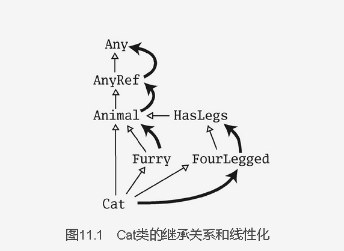

# Scala -- 3 week
### 1. 函数和闭包

调用某个函数并传入需要的参数，实际是将这个函数应用到(apply to)这些入参：

```Scala
def sum(a: Int, b: Int, c: Int) = a + b + c

sum(1, 2, 3)

// 由编译器生成的这个类有一个接收3个参数的apply方法
sum.apply(1,2, 3)
```

#### SAM
在Java中，lambda表达式可以被应用到任何需要只包含单个抽象方法（single abstract method，即SAM）的类或接口实例的地方

```Scala
trait Increaser:
  def increase(i: Int): Int

def increaseOne(increaser: Increaser) : Int = increaser.increase(1)

// 可以直接使用函数字面量，因为Increaser特质是SAM类型的
increaseOne(i => i + 7)
```

#### 尾递归

尾递归优化仅适用于某个方法或嵌套函数在最后一步操作中直接调用自己，并且没有经过函数值或其他中间环节的场合

第一版：
```
object Padding :
  def padLines(text: String, minWidth: Int): String =
    val paddedLines =
      for line <- text.linesIterator yield
        padLine(line, minWidth)
    paddedLines.mkString("\n")

  private def padLine(line: String, minWidth: Int): String =
    if line.length >= minWidth then line
    else line + " " * (minWidth - line.length)
```

第二版：padLine是局部函数(local function)
```
object Padding :
  def padLines(text: String, minWidth: Int): String =
    def padLine(line: String, minWidth: Int): String =
      if line.length >= minWidth then line
      else line + " " * (minWidth - line.length)
    val paddedLines =
      for line <- text.linesIterator yield
        padLine(line, minWidth)
    paddedLines.mkString("\n")
```

第三版：局部函数可以访问包含它的函数的参数
```
object Padding :
  def padLines(text: String, minWidth: Int): String =
    def padLine(line: String): String =
      if line.length >= minWidth then line
      else line + " " * (minWidth - line.length)
    val paddedLines =
      for line <- text.linesIterator yield
        padLine(line)
    paddedLines.mkString("\n")
```

运行时从这个函数字面量创建出来的函数值（对象）被称作闭包（closure）。该名称源于“捕获”其自由变量从而“闭合”该函数字面量的动作

函数值是通过闭合这个开放语（open term）的动作产生的；more是个变量值
```
var more = 1
val addMore = (x : Int) => x + more
addMore(10)

more = 10
println(addMore(20))
```

#### 柯里化
```Java
def plainOldSum(x: Int, y: Int) = x + y
plainOldSum(1, 2)

def curriedSum(x: Int)(y: Int) = x + y
curriedSum(1)(2)
```

柯里化的好处：
- 提高函数的复用性
- 增强代码的可读性
- 支持函数式编程
- 实现延迟计算

贷出模式，因为如withPrintWriter打开某个资源并将这个资源“贷出”给函数的。withPrintWriter将一个PrintWriter“贷出”给op函数。当函数完成时，它会表明自己不再需要这个“贷入”的资源。

这时这个资源就在finally代码块中被关闭了，这样能确保无论函数是正常返回还是抛出异常，资源都会被正常关闭

```Scala
def withPrintWriter(file: File, op: PrintWriter => Unit) =
val writer = new PrintWriter(file)
try op(writer)
finally writer.close()
withPrintWriter(new File("data.txt"), writer => writer.println(new Date()))
```

```Scala
// 柯里化
def withPrintWriterCarried(file: File)(op: PrintWriter => Unit) =
val writer = new PrintWriter(file)
try op(writer)
finally writer.close()
// 可以用花括号而不是圆括号来表示参数列表，这样调用方的代码看上去就更像在使用内建的控制结构一样
withPrintWriterCarried(new File("data.txt")){
writer => writer.println(new Date())
}
```

#### 组合和继承

组合和继承是两种用其他已有的类来定义新类的方式。如果你主要追求的是代码复用，则一般来说应当优先选择组合而不是继承

继承要建模的这个关系是“is-a”的关系

书中的工厂对象其实就是Java的静态方法，非严格意义上的工厂设计模式

```Scala
object Element {

  // VectorElement、LineElement和UniformElement这些子类就可以变成私有的，因为它们不再需要被使用方直接访问了
  private class VectorElement(val contents: Vector[String]) extends Element

  private class LineElement(s: String) extends Element :
    val contents = Vector(s)
    override def width: Int = s.length
    override def height: Int = 1

  private class UniformElement(ch: Char, override val width: Int, override val height: Int) extends Element :
    private val line = ch.toString * width
    def contents: Vector[String] = Vector.fill(height)(line)

  def elem(contents: Vector[String]): Element =
    VectorElement(contents)

  def elem(chr: Char, width: Int, height: Int): Element =
    UniformElement(chr, width, height)

  def elem(line: String): Element =
    LineElement(line)
}
```

### 2. 特质
extends --> abstract 或with关键字 ---> trait将它混入类中。Scala混入特质，而不是从特质继承，因为混入特质与其他许多编程语言中的多重继承有重要的区别

- 瘦接口(Skinny Trait)
  是一种只包含抽象方法的接口，不包含任何具体实现。它类似于Java中的接口，主要用于定义类的行为规范，而不提供具体的实现细节

- 富接口(Rich Trait)
  一种包含具体实现的接口。不仅可以定义抽象方法，还可以提供具体的方法实现、字段、默认值等。富接口通常用于提供一些通用的实现逻辑，使得实现类可以复用这些逻辑

```
abstract class IntQueue {
  def get(): Int

  def put(x: Int): Unit
}

import scala.collection.mutable.ArrayBuffer

class BasicIntQueue extends IntQueue {
  private val buf = ArrayBuffer.empty[Int]

  override def get(): Int = buf.remove(0)

  override def put(x: Int): Unit =
    println(s"--$x")
    buf += x
}

// 在放入队列时对整数翻倍的特质Doubling
trait Doubling extends IntQueue {
  abstract override def put(x: Int): Unit = super.put(2 * x)
}

// 或者
class MyQueue extends BasicIntQueue, Doubling

val myQueue = new MyQueue
myQueue.put(10)
println(myQueue.get()) //20

// 混入特质的顺序
// Filtering特质的put方法最先被调用，所以它首先过滤掉了那些负整数
val queue2 = new BasicIntQueue with Filtering with Incrementing
```

#### 如何解决多重继承的问题

特质的线性化（linearization）

当用new关键字实例化一个类的时候，Scala会将类及它所有继承的类和特质都拿出来，将它们“线性”地排列在一起

下面为例：
```Scala
class Animal
trait Furry extends Animal
trait HasLegs extends Animal
trait FourLegged extends HasLegs
class Cat extends Animal,Furry,FourLegged
```



特质的线性化是这么来的：
1. Animal必须包含，而Animal的父类是AnyRef和Any，故而
    <code-block lang="plantuml">
    <![CDATA[
    @startmindmap
    * Animal
        * AnyRef
            * Any
    @endmindmap
    ]]>
    </code-block>

2. Furry的父类是Animal，而任何已经在超类或首个混入中复制过的类都不再重复出现，则直接
    <code-block lang="plantuml">
    <![CDATA[
    @startmindmap
    * Furry
        * Animal
            * AnyRef
                * Any
    @endmindmap
    ]]>
    </code-block>

3. FourLegged的父类是HasLegs，HasLegs的父类是Animal
   <code-block lang="plantuml">
    <![CDATA[
    @startmindmap
    * FourLegged
        * HasLegs
            * Furry
                * Animal
                    * AnyRef
                        * Any
    @endmindmap
    ]]>
    </code-block>

4. 最后，cat的线性化是
   <code-block lang="plantuml">
    <![CDATA[
    @startmindmap
    * Cat
        * FourLegged
            * HasLegs
                * Furry
                    * Animal
                        * AnyRef
                            * Any
    @endmindmap
    ]]>
    </code-block>

scala的特质和Java的默认方法的不同在哪里?

- Scala特质

  特质可以包含抽象方法和具体方法，支持多重继承，一个类可以实现多个特质

- Java默认方法

  默认方法只能定义在接口中，且必须使用default关键字。Java不支持多重继承，
  但可以通过接口的默认方法来实现类似的功能，如果多个接口提供了相同方法的实现，Java要求在实现类中显式地解决冲突

### 3. 样例类和模式匹配
样例类是Scala用来对对象进行模式匹配而并不需要大量的样板代码的方式;**最大的好处是支持模式匹配**

```Scala
trait Expr

case class Var(name: String) extends Expr

case class Num(number: Double) extends Expr

case class UnOp(operator: String, arg: Expr) extends Expr

case class BinOp(operator: String, left: Expr, right: Expr) extends Expr
```
使用这个修饰符会让Scala编译器对类添加一些语法上的便利
1. 添加一个与类同名的工厂方法。这意味着我们可以用Var("×")来构造一个Var对象
    ```Scala
    val v = Var("x")
    val op = BinOp("+", Num(1), v)
    ```
2. 参数列表中的参数都隐式地获得了—个val前缀
    ```Scala
     v.name
     op.left
    ```
3. 实现toString、hashCode和equals方法
4. 添加一个copy方法用于制作修改过的副本。这个方法可以用于制作除一两个属性不同之外其余完全相同的该类的新实例
    ```Scala
     println(op.copy(operator = "-")) //BinOp(-,Num(1.0),Var(x))
    ```

```Scala
// "+"和1: 常量模式 constant pattern
// e: 变量模式（variable pattern）可以匹配任何值
// _: 通配模式（wildcard pattern，即_）可匹配任何值
def simplifyTop(expr: Expr): Expr =
  expr match
    case UnOp("-", UnOp("-", e)) => e // Double negation
    case BinOp("+", e, Num(0)) => e // Adding zero
    case BinOp("*", e, Num(1)) => e // Multiplying by one
    // 如果没有一个模式匹配上，则会抛出名称为MatchError的异常。这意味着你需要确保所有的case被覆盖到，
    // 哪怕这意味着你需要添加一个什么都不做的默认case
    case _ => expr  
```

不同的模式种类：
1. 通配模式
    ```Scala
    case _ => // 默认情况
    ```
2. 常量模式
    ```Scala
    case 5 => "five"
    ```
3. 变量模式
   将对应的变量绑定成匹配上的对象。在绑定之后，就可以用这个变量对对象做进一步的处理
   ```Scala
    expr match
     case 0 => "zero"
     case somethingElse => s"not zero $somethingElse"
    ```
4. 构造方法模式
   构造方法模式可以真正体现出模式匹配的威力
   ```Scala
    expr match
     case BinOp("+", e, Num(0)) => "a deep match"
     case _ => ""
    ```
5. 序列模式
   匹配固定长度的序列模式
   ```Scala
    xs match
     case List(0, _, _) => "found it"
     case _ => ""
    ```
   匹配任意长度的序列模式
   ```Scala
    xs match
     case List(0, _*) => "found it"
     case _ => ""
    ```
6. 元组模式
7. 带类型的模式


### 4. 列表

Scala的列表类型是协变covariant的，意思是对于每一组类型S和T，如果S是T的子类型，List[S]就是List[T]的子类型
