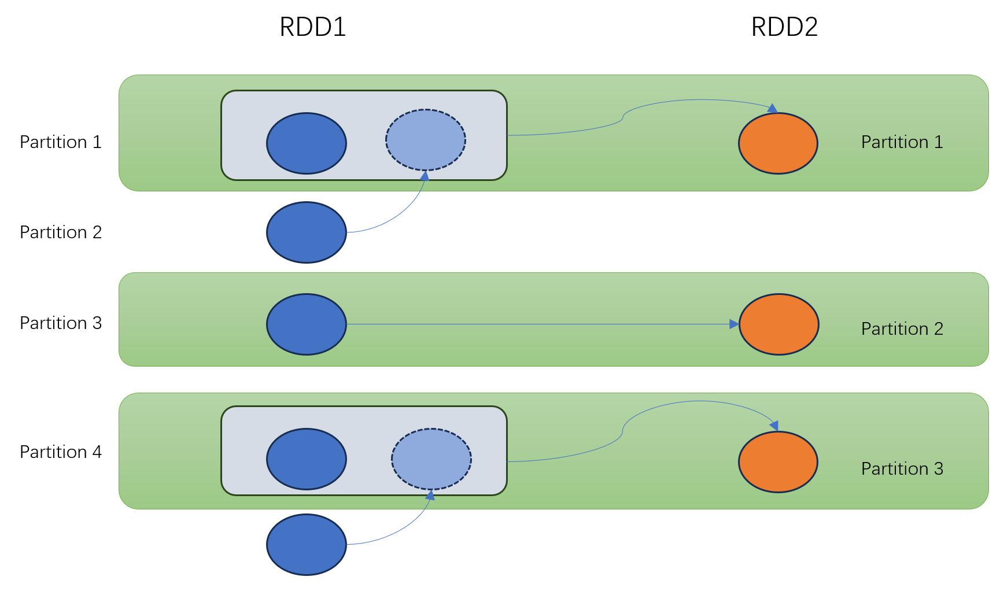
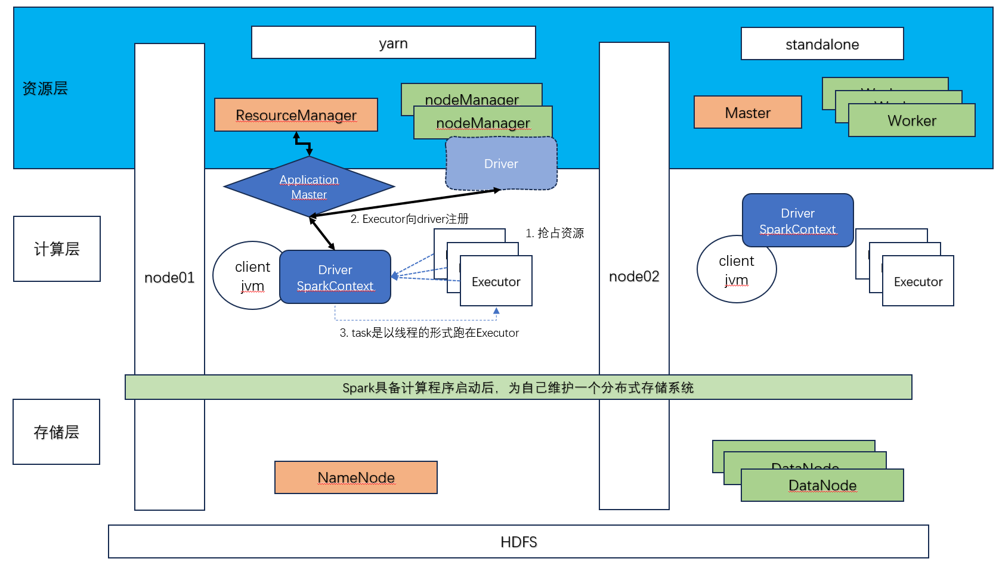
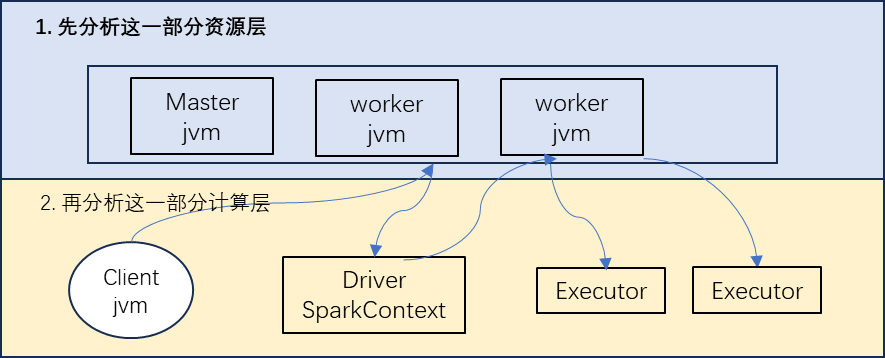
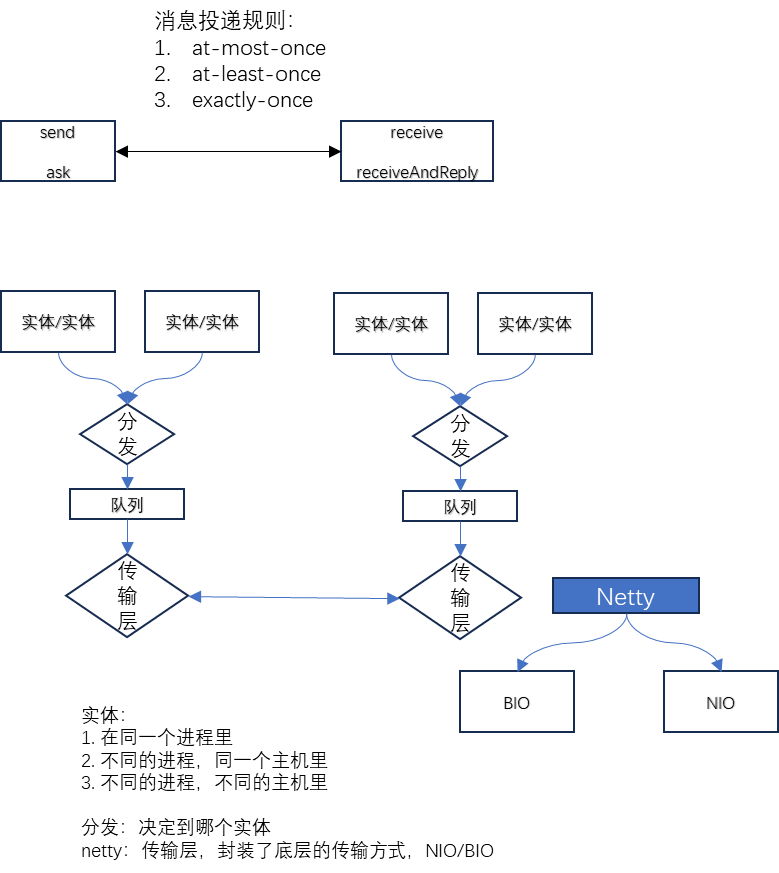

# Spark


## 1. 论文

Resilient Distributed Datasets: A Fault-Tolerant Abstraction for In-Memory Cluster Computing

计算模型：

一个是支持多轮迭代的MapReduce模型。不过它在实现层面，又和MapReduce完全不同。通过引入RDD这样一个函数式对象的数据集的概念，Spark在多轮的数据迭代里，不需要像MapReduce一样反反复复地读写硬盘，大大提升了处理数据的性能

主要有以下几点：

1. RDD是一个什么概念，它是通过什么方式来优化分布式数据处理的
2. 在系统设计层面，如何针对正常情况下和异常情况下的性能进行权衡和选择的

首先看下MapReduce的瓶颈在哪里：


Map函数的输出结果会输出到所在节点的本地硬盘上。Reduce函数会从Map函数所在的节点里拉取它所需要的数据，然后再写入本地

性能的瓶颈：**任何一个中间环节，都需要去读写硬盘**

可靠性的瓶颈：**Map或者Reduce的节点出现故障了怎么办？**
任何一个Map节点故障，意味着Reduce只收到了部分数据，而且它还不知道是哪一部分。那么Reduce任务只能失败掉，然后等Map节点重新来过。而且，Reduce的失败，还会导致其他的Map节点计算的数据也要重来一遍，引起连锁反应，最终等于是整个任务重来一遍

**可靠性的瓶颈是有疑问的？Map失败也可以单独重新计算啊，看下源码？？？**

可以优化的点:

1. 可以把数据缓存在内存里 ---> RDD
2. 记录我们运算数据生成的“拓扑图” ---> DAG
3. 通过检查点来在特定环节把数据写入到硬盘 ---> checkpoint

#### RDD

RDD 是只读的、已分区的记录集合，RDD 只能通过明确的操作，以及通过两种数据创建：稳定存储系统中的数据；其他RDD。

明确的操作，是指 map、filter 和 join 这样的操作，以和其他的操作区分开来。

按照这个定义，可以看到这个是对于数据的一个抽象。我们的任何一个数据集，进行一次转换就是一个新的RDD，但是这个RDD
并不需要实际输出到硬盘上。实际上，这个数据都不会作为一个完整的数据集缓存在内存中，而只是一个 RDD 的“抽象概念”。只有当我们对某一个
RDD 实际调用 persistent 函数的时候，这个 RDD 才会实际作为一个完整的数据集，缓存在内存中。

一旦被缓存到内存里，这个 RDD 就能够再次被下游的其他数据转换反复使用。一方面，这个数据不需要写入到硬盘，所以我们减少了一次数据写。另一方面，下游的其他转化也不需要再从硬盘读数据，于是，我们就节省了大量的硬盘
I/O 的开销。


RDD的设计也可以对应到惰性求值（Lazy-Evaluation）和数据库里的视图

视图：为了查询方便，对于复杂的多表关联，很多时候我们会预先建好一张数据库的逻辑视图。那么我们在查询逻辑视图的时候，其实还是通过一个多表关联
SQL 去查询原始表的，这个就好像我们并没有调用 persistent，把数据实际持久化下来

Spark代码对于RDD是这么描述的：

Internally, each RDD is characterized by five main properties:

1. A list of partitions

   partitions和splits一个意思, 读取文件，假如文件有十个块，fileRDD则有十个分区
    ```Scala
     val fileRDD: RDD[String] = sc.textFile("...")
    ```
2. A function for computing each split

   一个RDD只会传一个函数，但是这个函数会作用在每个分区的每条记录上
    ```Scala
    val words: RDD[String] = fileRDD.flatMap((x:String)=>{x.split(" ")})
    ```
3. A list of dependencies on other RDDs

   有可能一个RDD来源于多个RDD
4. Optionally, a Partitioner for key-value RDDs (e.g. to say that the RDD is hash-partitioned)
5. Optionally, a list of preferred locations to compute each split on (e.g. block locations for
   an HDFS file)

#### 宽依赖关系和检查点

如果一个节点失效了，导致的数据重新计算，需要影响的节点太多，那么我们就把计算结果输出到硬盘上。而如果影响的节点少，那么我们就只是单独重新计算被响应到的那些节点就好了

- 窄依赖

  如果一个RDD的一个分区，只会影响到下游的一个节点，即使重算一遍，也只是影响一条线上的少数几个节点
- 宽依赖

  如果一个RDD的一个分区，会影响到下游的多个节点，对应的多个下游节点，都需要重新从这个节点拉取数据并重新计算，需要占用更多的网络带宽和计算资源


论文里提到，除了对 RDD 持久化之外，我们还可以自己定义 RDD 如何进行分区，并且提到了可以对存储优化有用，比如把两个需要 Join
操作的数据集进行相同的哈希分区。那么，为什么这么做会对存储优化有用呢？它在应用层面到底优化了什么？

## 2. 基础知识

### 2.1 基本术语


- Application: 一个分布式计算程序,1个app：1个job

- stage：1个job：1-2个stage，描述的是**可以在一台机器完成的所有计算**;stage和stage之间是shuffle

- task，1个stage：n个task

- job，多个mr的job可以组成作业链

- 其他术语参见[官网](https://spark.apache.org/docs/2.3.4/cluster-overview.html)

> SparkContext, 源码的实现，rpc，netty，nio，序列化，零拷贝.....

以wordCount为例子

```Scala
object WordCountScala {
  def main(args: Array[String]): Unit = {
    val conf = new SparkConf()
    conf.setAppName("wordcount")
    conf.setMaster("local")  //单击本地运行

    val sc = new SparkContext(conf)
    //单词统计
    //DATASET
    val fileRDD: RDD[String] = sc.textFile("testdata.txt")
    //hello world
    val words: RDD[String] = fileRDD.flatMap((x:String)=>{x.split(" ")})
    //hello
    //world
    val pairWord: RDD[(String, Int)] = words.map((x:String)=>{new Tuple2(x,1)})
    //(hello,1)
    //(hello,1)
    //(world,1)
    val res: RDD[(String, Int)] = pairWord.reduceByKey( (x:Int,y:Int)=>{x+y} )
    //X:oldValue  Y:value
    //(hello,2)  -> (2,1)
    //(world,1)   -> (1,1)
    //(msb,2)   -> (2,1)

    val fanzhuan: RDD[(Int, Int)] = res.map((x)=>{  (x._2,1)  })
    val resOver: RDD[(Int, Int)] = fanzhuan.reduceByKey(_+_)

    resOver.foreach(println)
    res.foreach(println)
    Thread.sleep(Long.MaxValue)
  }
}

```

下面的图有两个job，原因是两个foreach

```Scala
// 第一个执行完成之后再执行第二个
 resOver.foreach(println)
 res.foreach(println)
```


stage和stage中间是shuffle


为什么是灰色还有skipped？RDD数据集复用


## wordCount源码分析

从数据加工流水线的维度


```Scala
val fileRDD: RDD[String] = sc.textFile("...")
val pair: RDD[(String, Int)] = file.map(line=> (line.split("\t")(5),1))
val reduce: RDD[(String, Int)] = pair.reduceByKey(_+_)
reduce.foreach(println)
```

第一行代码分析：

```Scala
val fileRDD: RDD[String] = sc.textFile("...")
``` 

```Scala
// minPartitions: 和path块比较的最大值
def textFile(
    path: String,
    minPartitions: Int = defaultMinPartitions): RDD[String] = withScope {
  assertNotStopped()
  hadoopFile(path, classOf[TextInputFormat], classOf[LongWritable], classOf[Text],
    minPartitions).map(pair => pair._2.toString).setName(path)
}


def hadoopFile[K, V](
    path: String,
    inputFormatClass: Class[_ <: InputFormat[K, V]],
    keyClass: Class[K],
    valueClass: Class[V],
    minPartitions: Int = defaultMinPartitions): RDD[(K, V)] = withScope {
  assertNotStopped()

  new HadoopRDD().setName(path)
}

class HadoopRDD[K, V](
    sc: SparkContext,
    broadcastedConf: Broadcast[SerializableConfiguration],
    initLocalJobConfFuncOpt: Option[JobConf => Unit],
    inputFormatClass: Class[_ <: InputFormat[K, V]],
    keyClass: Class[K],
    valueClass: Class[V],
    minPartitions: Int)
  extends RDD[(K, V)](sc, Nil) // 传给了父类两个参数，sc，nil
  
 // deps: 前面依赖的RDD，HadoopRDD是第一次操作，所以是个nil
  abstract class RDD[T: ClassTag](
    @transient private var _sc: SparkContext,
    @transient private var deps: Seq[Dependency[_]]
  ) extends Serializable with Logging {
 
 }
```

接下去看HadoopRDD是如何计算切片的, RDD.scala#getPartitions

```Scala
  override def getPartitions: Array[Partition] = {
  val jobConf = getJobConf()
  // add the credentials here as this can be called before SparkContext initialized
  SparkHadoopUtil.get.addCredentials(jobConf)
  // 重要：面向文件操作的时候，Partition其实和切片是一个概念
  val allInputSplits = getInputFormat(jobConf).getSplits(jobConf, minPartitions)
}
```

compute函数对应的是RDD中第二个特性，A function for computing each split

是如何返回一个iterator对象的，是不保存数据的

```Scala
  override def compute(theSplit: Partition, context: TaskContext): InterruptibleIterator[(K, V)] = {
    val iter = new NextIterator[(K, V)] {
      
    }
    new InterruptibleIterator[(K, V)](context, iter)
  }
```

第二行代码分析：
```Scala
val words: RDD[String] = fileRDD.flatMap((x:String)=>{x.split(" ")})
```

```Scala
def flatMap[U: ClassTag](f: T => TraversableOnce[U]): RDD[U] = withScope {
    val cleanF = sc.clean(f) // 检查是不是可序列化的
    // this: 前一个RDD
    // iter.flatMap(cleanF)：迭代器调用了flatMap
    new MapPartitionsRDD[U, T](this, (context, pid, iter) => iter.flatMap(cleanF)) 
}
```

MapPartitionsRDD
```Scala
private[spark] class MapPartitionsRDD[U: ClassTag, T: ClassTag](
    var prev: RDD[T],
    f: (TaskContext, Int, Iterator[T]) => Iterator[U],  // (TaskContext, partition index, iterator)
    preservesPartitioning: Boolean = false,
    isOrderSensitive: Boolean = false)
  extends RDD[U](prev) {

  // RDD[U](prev)
  def this(@transient oneParent: RDD[_]) =
    // oneParent.context: 上一个RDD的上下文
    // OneToOneDependency: 1:1对应关系
    this(oneParent.context, List(new OneToOneDependency(oneParent)))
}
```

主要看compute#MapPartitionsRDD是如何操作的
```Scala
 override def compute(split: Partition, context: TaskContext): Iterator[U] =
 // firstParent.iterator(..): 是前一个RDD方法的迭代器，iterator是父类RDD的方法
    f(context, split.index, firstParent[T].iterator(split, context))
```

如果外界调用iterator缓存，持久化找不到的话，会调用自己的compute方法
```Scala
  // iterator#RDD, computeOrReadCheckpoint#RDD
  /**
   * Internal method to this RDD; will read from cache if applicable, or otherwise compute it.
   * This should ''not'' be called by users directly, but is available for implementors of custom
   * subclasses of RDD.
   */
  final def iterator(split: Partition, context: TaskContext): Iterator[T] = {
    if (storageLevel != StorageLevel.NONE) {
      getOrCompute(split, context)
    } else {
      computeOrReadCheckpoint(split, context)
    }
  }
  
  // computeOrReadCheckpoint
   /**
   * Compute an RDD partition or read it from a checkpoint if the RDD is checkpointing.
   */
  private[spark] def computeOrReadCheckpoint(split: Partition, context: TaskContext): Iterator[T] =
  {
    if (isCheckpointedAndMaterialized) {
      firstParent[T].iterator(split, context)
    } else {
      compute(split, context) // 自己的compute方法
    }
  }
```

第三行代码分析:
```Scala
// reduceByKey: 关注的同一个key下的一组数据
val res: RDD[(String, Int)] = pairWord.reduceByKey((x: Int, y: Int) => {
  x + y
})
```
reduceByKey一定会触发shuffle，分区器一定会让相同的key得到一个相同的分区号，默认使用的是HashPartitioner分区器

```Scala
def reduceByKey(func: (V, V) => V): RDD[(K, V)] = self.withScope {
    reduceByKey(defaultPartitioner(self), func)
}

def defaultPartitioner(rdd: RDD[_], others: RDD[_]*): Partitioner = {
    val rdds = (Seq(rdd) ++ others)
    val hasPartitioner = rdds.filter(_.partitioner.exists(_.numPartitions > 0))

    val defaultNumPartitions = if (rdd.context.conf.contains("spark.default.parallelism")) {
      rdd.context.defaultParallelism
    } else {
      rdds.map(_.partitions.length).max
    }

    // If the existing max partitioner is an eligible one, or its partitions number is larger
    // than the default number of partitions, use the existing partitioner.
    if (hasMaxPartitioner.nonEmpty && (isEligiblePartitioner(hasMaxPartitioner.get, rdds) ||
        defaultNumPartitions < hasMaxPartitioner.get.getNumPartitions)) {
      hasMaxPartitioner.get.partitioner.get
    } else {
      // 默认是HashPartitioner
      new HashPartitioner(defaultNumPartitions)
    }
  }
```

combiner函数是用于压缩，减少IO的，比如(k, 1), (k, 1), (k, 1), (k, 1) => (k, 4)

spark不用自己写combiner函数，combineByKeyWithClassTag函数已经底层优化
```Scala
  /**
   * Merge the values for each key using an associative and commutative reduce function. This will
   * also perform the merging locally on each mapper before sending results to a reducer, similarly
   * to a "combiner" in MapReduce.
   */
   // (v: V) => v： 第一条记录到达的时候
   // func： 后续记录到达的时候
   // func： 合并的时候处理
  def reduceByKey(partitioner: Partitioner, func: (V, V) => V): RDD[(K, V)] = self.withScope {
    combineByKeyWithClassTag[V]((v: V) => v, func, func, partitioner)
  }
  
  
  def combineByKeyWithClassTag[C](
      createCombiner: V => C,
      mergeValue: (C, V) => C,
      mergeCombiners: (C, C) => C,
      partitioner: Partitioner,
      mapSideCombine: Boolean = true, // 重要：map端是否需要Combine
      serializer: Serializer = null)(implicit ct: ClassTag[C]): RDD[(K, C)] = self.withScope {
    require(mergeCombiners != null, "mergeCombiners must be defined") // required as of Spark 0.9.0
    if (keyClass.isArray) {
      if (mapSideCombine) {
        throw new SparkException("Cannot use map-side combining with array keys.")
      }
      if (partitioner.isInstanceOf[HashPartitioner]) {
        throw new SparkException("HashPartitioner cannot partition array keys.")
      }
    }
    val aggregator = new Aggregator[K, V, C](
      self.context.clean(createCombiner),
      self.context.clean(mergeValue),
      self.context.clean(mergeCombiners))
    if (self.partitioner == Some(partitioner)) {
      self.mapPartitions(iter => {
        val context = TaskContext.get()
        new InterruptibleIterator(context, aggregator.combineValuesByKey(iter, context))
      }, preservesPartitioning = true)
    } else {
      new ShuffledRDD[K, V, C](self, partitioner)
        .setSerializer(serializer)
        .setAggregator(aggregator)
        .setMapSideCombine(mapSideCombine)
    }
  }

```

HadoopRDD，MapPartitionsRDD不需要其他数据的参与，而ShuffledRDD是拿前面的RDD计算形成的文件，所以不需要前面的RDD的序列化，不然会重复计算
```Scala
  class ShuffledRDD[K: ClassTag, V: ClassTag, C: ClassTag](
    // @transient: 不序列化
    @transient var prev: RDD[_ <: Product2[K, V]],
    part: Partitioner)
  extends RDD[(K, C)](prev.context, Nil) {}
```

ShuffledRDD传入的deps是Nil，会由getDependencies#ShuffledRDD重写
```Scala
  override def getDependencies: Seq[Dependency[_]] = {
    val serializer = userSpecifiedSerializer.getOrElse {
      val serializerManager = SparkEnv.get.serializerManager
      if (mapSideCombine) {
        serializerManager.getSerializer(implicitly[ClassTag[K]], implicitly[ClassTag[C]])
      } else {
        serializerManager.getSerializer(implicitly[ClassTag[K]], implicitly[ClassTag[V]])
      }
    }
    // ShuffleDependency传参：
    // prev: 前面的RDD
    // part: 分区器
    // serializer： 序列化器
    // keyOrdering: key是否排序
    // aggregator: 聚合器，第一条数据杂么办，后面的杂么办
    // mapSideCombine: 
    List(new ShuffleDependency(prev, part, serializer, keyOrdering, aggregator, mapSideCombine))
  }
  
```

ShuffledRDD的compute没有和之前的RDD一样调父类的迭代器
```Scala
  override def compute(split: Partition, context: TaskContext): Iterator[(K, C)] = {
    val dep = dependencies.head.asInstanceOf[ShuffleDependency[K, V, C]]
    SparkEnv.get.shuffleManager.getReader(dep.shuffleHandle, split.index, split.index + 1, context)
      .read()
      .asInstanceOf[Iterator[(K, C)]]
  }
```

ShuffleMapTask的write和read方法
```Scala
  override def runTask(context: TaskContext): MapStatus = {
  // Deserialize the RDD using the broadcast variable.
  val threadMXBean = ManagementFactory.getThreadMXBean
  val deserializeStartTime = System.currentTimeMillis()
  val deserializeStartCpuTime = if (threadMXBean.isCurrentThreadCpuTimeSupported) {
    threadMXBean.getCurrentThreadCpuTime
  } else 0L
  val ser = SparkEnv.get.closureSerializer.newInstance()
  val (rdd, dep) = ser.deserialize[(RDD[_], ShuffleDependency[_, _, _])](
    ByteBuffer.wrap(taskBinary.value), Thread.currentThread.getContextClassLoader)
  _executorDeserializeTime = System.currentTimeMillis() - deserializeStartTime
  _executorDeserializeCpuTime = if (threadMXBean.isCurrentThreadCpuTimeSupported) {
    threadMXBean.getCurrentThreadCpuTime - deserializeStartCpuTime
  } else 0L

  var writer: ShuffleWriter[Any, Any] = null
  try {
    val manager = SparkEnv.get.shuffleManager
    writer = manager.getWriter[Any, Any](dep.shuffleHandle, partitionId, context)
    // 这个是最后一个rdd
    writer.write(rdd.iterator(partition, context).asInstanceOf[Iterator[_ <: Product2[Any, Any]]])
    writer.stop(success = true).get
  }
}
```

第四行代码分析：
```Scala
  /**
   * Applies a function f to all elements of this RDD.
   */
  def foreach(f: T => Unit): Unit = withScope {
    val cleanF = sc.clean(f)
    sc.runJob(this, (iter: Iterator[T]) => iter.foreach(cleanF))
  }
```

RDD的类型如下：


RDD的依赖关系如下：

其中NarrowDependency的关系是1:1或者是n:1的


## Spark算子

Spark算子在有些情况下使用会有问题，比如mapPartitionsWithIndex和分区调优

首先看从外关联sql查询场景，有三个代码的版本

版本1: 每个元素调用一下connectDB方法，所以会不停的close
```Scala
 val data: RDD[Int] = sc.parallelize(1 to 10, 2)

 println("------case 1--------------")
 val connectDB: Unit = {
   println("------conn--mysql----")
   Thread.sleep(1000)
 }

 val t1 = System.currentTimeMillis()
 val res01: RDD[String] = data.map(
   (value: Int) => {
     connectDB
     println(s"-----select $value-----")
     println("-----close--mysql------")
     value + "selected"
   }
 )
 ```
```Text
 output:
    ------case 1--------------
   ------conn--mysql----
   -----select 1-----
   -----close--mysql------
   1selected
   -----select 2-----
   -----close--mysql------
   2selected
   -----select 3-----
   -----close--mysql------
   3selected
```

版本2：每个partition连接mysql，**有bug**
```Scala
 val t2 = System.currentTimeMillis()
 val res02: RDD[String] = data.mapPartitionsWithIndex(
   (index, piter) => {
   //这么写是有问题的，spark就是一个pipeline，迭代器嵌套的模式
     val lb = new ListBuffer[String]  
     //数据不会再内存积压
     println("------conn--mysql----")
     Thread.sleep(1000)
     while (piter.hasNext) {
       val value: Int = piter.next()
       println(s"---$index--select $value-----")
       lb.+=(value + "selected")
     }
     println("-----close--mysql------")
     lb.iterator
   }
 )
 res02.foreach(println)
 ```

```Text
 output:
    -----case 2---------------
   ------conn--mysql----
   ---0--select 1-----
   ---0--select 2-----
   ---0--select 3-----
   ---0--select 4-----
   ---0--select 5-----
   -----close--mysql------
   1selected
   2selected
   3selected
   4selected
   5selected
   ------conn--mysql----
   ---1--select 6-----
   ---1--select 7-----
```

这个问题在哪里呢？假如数据是1T，内存只有10G，则每条数据都会先放入ListBuffer，导致内存溢出


版本2：构造自己的一个迭代器
```Scala
val res03: RDD[String] = data.mapPartitionsWithIndex(
   (pindex, piter) => {
     new Iterator[String] {
       println("------conn--mysql----")
       Thread.sleep(1000)

       override def hasNext: Boolean = if (!piter.hasNext) {
         println(s"---$pindex---close--mysql"); false
       } else true

       override def next(): String = {
         val value: Int = piter.next()
         println(s"---$pindex--select $value-----")
         value + "selected"
       }
     }
   }
 )
 res03.foreach(println)
```

#### 分区优化

repartition是通过shuffle将数据进行重分区，那如何选择分区数 // todo
```Scala
 val repartition: RDD[(Int, Int)] = data1.coalesce(3, shuffle = false)
 val res: RDD[(Int, (Int, Int))] = repartition.mapPartitionsWithIndex(
   (pi, pt) => {
     pt.map(e => (pi, e))
   }
 )
```
为什么可以分区改变而不用shuffle?

分布式情况下数据的移动方式：IO，shuffle
- shuffle
  需要计算，每条数据应该去哪里
- IO
  每条数据不区分对待，只是换个地方，窄依赖

分区由多变少，可以是IO；反之，必须是shuffle

如何理解data1.coalesce(3, shuffle = false)是窄依赖呢？

如下图所示，RDD1中的P1和P2会结合向RDD2中的P1移动，即所谓的IO移动



## 集群架构



架构分为三层，分别是：资源层、计算层和存储层

资源层可以是yarn，standalone或者是mesos/k8s

ApplicationMaster：归属于yarn，等于说是yarn暴露出来的一个接口，计算层只需要通过调用它就可以申请资源

资源层：
1. Driver: 调度和资源申请。包含sparkContext，可以在client里面，也可以独立在机器上。
   所以spark有两种模式，client和cluster。

   MR简单，只有两个阶段，每到一步，具体申请资源，任务是JVM级别的，计算逻辑是已知的。相对应的spark，逻辑是未知的。每个人的程序，job，stage不一。

   DAG：把一个job切换成几个stage；**spark默认抢占资源**

   - 在new SparkContext()的时候就完成了executor的申请
   - 任务：task是以线程的形式跑在Executor进程里
   
   详细的说就是spark会把程序窄依赖部分序列化发送给某一个executor，等到其他executor需要这些数据的时候就从那个executor里面拉取

   spark的中间结果可以存在内存，自己的分布式存储系统或者HDFS

2. 官网的cluster mode


存储层可以是hdfs或者Spark具备计算程序启动后，为自己维护一个分布式存储系统

## 4. 源码部分

主要是看资源层和计算层





### 4.1 RpcEnv

启动spark,调用的是start-all.sh

```Shell
sbin/start-all.sh
```

下面先分析Master的启动，再分析Workers的启动

```Shell
# Start Master
"${SPARK_HOME}/sbin"/start-master.sh

# Start Workers
"${SPARK_HOME}/sbin"/start-slaves.sh
```

#### Start Master

```Shell
CLASS="org.apache.spark.deploy.master.Master"
....
"${SPARK_HOME}/sbin"/spark-daemon.sh start $CLASS 1 \
  --host $SPARK_MASTER_HOST --port $SPARK_MASTER_PORT --webui-port $SPARK_MASTER_WEBUI_PORT \
  $ORIGINAL_ARGS
```

```Scala
def main(argStrings: Array[String]) {
  // 启动rpc，等待连接
  val (rpcEnv, _, _) = startRpcEnvAndEndpoint(args.host, args.port, args.webUiPort, conf)
  rpcEnv.awaitTermination()
}
```

```Scala
def startRpcEnvAndEndpoint(
    host: String,
    port: Int,
    webUiPort: Int,
    conf: SparkConf): (RpcEnv, Int, Option[Int]) = {
  val securityMgr = new SecurityManager(conf)
  val rpcEnv = RpcEnv.create(SYSTEM_NAME, host, port, conf, securityMgr)
  
  // 将Master注册到rpcEnv环境
  val masterEndpoint = rpcEnv.setupEndpoint(ENDPOINT_NAME,
    new Master(rpcEnv, rpcEnv.address, webUiPort, securityMgr, conf))
  val portsResponse = masterEndpoint.askSync[BoundPortsResponse](BoundPortsRequest)
  (rpcEnv, portsResponse.webUIPort, portsResponse.restPort)
}
```

RpcEnv.create中，调用了netty