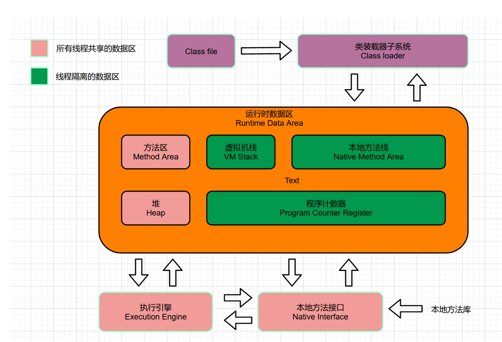
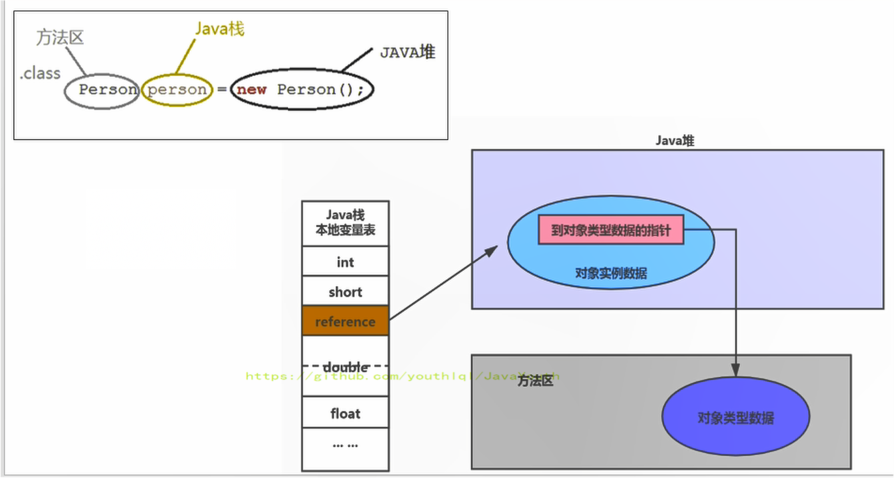
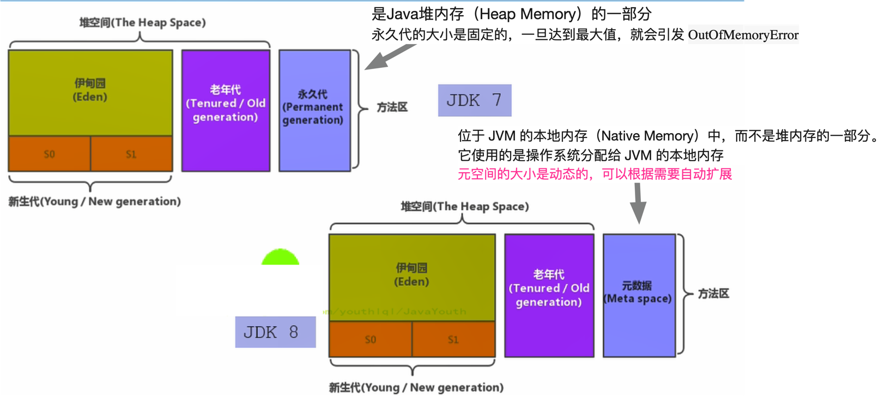
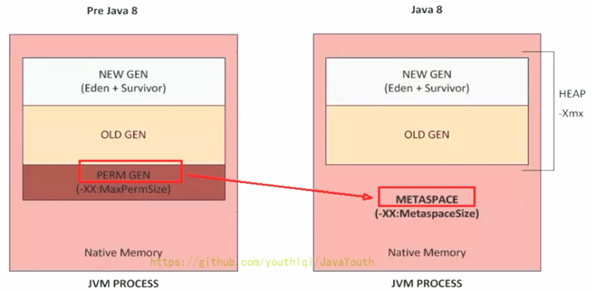
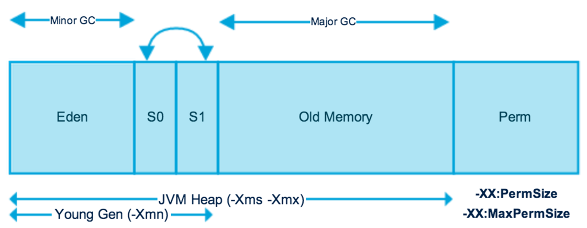
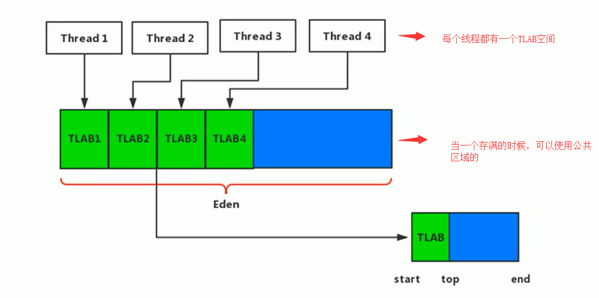

# Java Basic

## 1. 代码设计

### 1.1 面向对象

1. 接口vs抽象类的区别？如何用普通的类模拟抽象类和接口？

   从语法特性来说

   抽象类

   - 抽象类不允许被实例化，只能被继承。
      - 抽象类可以包含属性和方法
      - 子类继承抽象类，必须实现抽象类中的所有抽象方法

   接口

   - 接口不能包含属性（也就是成员变量）
      - 接口只能声明方法，方法不能包含代码实现
      - 类实现接口的时候，必须实现接口中声明的所有方法

   从设计的角度，相对于抽象类的
   is-a关系来说，接口表示一种has-a关系，表示具有某些功能。对于接口，有一个更加形象的叫法，那就是协议（contract)

   应用场景

   如果要表示一种is-a的关系，并且是为了解决代码复用问题，我们就用抽象类；如果要表示一种has-a关系，并且是为了解决抽象而非代码复用问题，那我们就用接口

2. 为什么基于接口而非实现编程？有必要为每个类都定义接口吗？

   应用这条原则，可以**将接口和实现相分离，封装不稳定的实现，暴露稳定的接口**
   。上游系统面向接口而非实现编程，不依赖不稳定的实现细节，这样当实现发生变化的时候，上游系统的代码基本上不需要做改动，以此来降低耦合性，提高扩展性

   在设计接口的时候，要多思考一下，这样的接口设计是否足够通用，是否能够做到在替换具体的接口实现的时候，不需要任何接口定义的改动

   样例：
    ```Java
    public class AliyunImageStore {
      //...省略属性、构造函数等...
      
      public void createBucketIfNotExisting(String bucketName) {
        // ...创建bucket代码逻辑...
        // ...失败会抛出异常..
      }
      
      public String generateAccessToken() {
        // ...根据accesskey/secrectkey等生成access token
      }
      
      public String uploadToAliyun(Image image, String bucketName, String accessToken) {
        //...上传图片到阿里云...
        //...返回图片存储在阿里云上的地址(url）...
      }
      
      public Image downloadFromAliyun(String url, String accessToken) {
        //...从阿里云下载图片...
      }
    }
    ```

   问题：
   1. AliyunImageStore 类中有些函数命名暴露了实现细节，比如，uploadToAliyun()
   2. 将图片存储到阿里云的流程，跟存储到私有云的流程，可能并不是完全一致的。比如，阿里云的图片上传和下载的过程中，需要access
      token，而私有云不需要access token

    ```Java
    // 函数的命名不能暴露任何实现细节
    public interface ImageStore {
      String upload(Image image, String bucketName);
      Image download(String url);
    }
    
    // 具体的实现类都依赖统一的接口定义
    public class AliyunImageStore implements ImageStore {
      //...省略属性、构造函数等...
    
      public String upload(Image image, String bucketName) {
        createBucketIfNotExisting(bucketName);
        String accessToken = generateAccessToken();
        //...上传图片到阿里云...
        //...返回图片在阿里云上的地址(url)...
      }
    
      public Image download(String url) {
      // 封装具体的实现细节,不应该暴露给调用者
        String accessToken = generateAccessToken();
        //...从阿里云下载图片...
      }
    
      private void createBucketIfNotExisting(String bucketName) {
        // ...创建bucket...
        // ...失败会抛出异常..
      }
    
      private String generateAccessToken() {
        // ...根据accesskey/secrectkey等生成access token
      }
    }
    
    // 上传下载流程改变：私有云不需要支持access token
    public class PrivateImageStore implements ImageStore  {
      public String upload(Image image, String bucketName) {
        createBucketIfNotExisting(bucketName);
        //...上传图片到私有云...
        //...返回图片的url...
      }
    
      public Image download(String url) {
        //...从私有云下载图片...
      }
    
      private void createBucketIfNotExisting(String bucketName) {
        // ...创建bucket...
        // ...失败会抛出异常..
      }
    }
    
    ```

3. 为何说要多用组合少用继承？如何决定该用组合还是继承？
   - 继承的问题

   继承是面向对象的四大特性之一，用来表示类之间的 is-a
   关系，可以解决代码复用的问题。虽然继承有诸多作用，但继承层次过深、过复杂，也会影响到代码的可维护性。在这种情况下，应该尽量少用，甚至不用继承

   举例：鸟 飞 叫，是否会飞？是否会叫？两个行为搭配起来会产生四种情况：会飞会叫、不会飞会叫、会飞不会叫、不会飞不会叫，如果用继承

<p>

</p>

    - 可以利用组合（composition）、接口、委托（delegation）三个技术手段，一块儿来解决刚刚继承存在的问题

    ```Java
    public interface Flyable {
      void fly()；
    }
    public class FlyAbility implements Flyable {
      @Override
      public void fly() { //... }
    }
    //省略Tweetable/TweetAbility/EggLayable/EggLayAbility
    
    public class Ostrich implements Tweetable, EggLayable {//鸵鸟
      private TweetAbility tweetAbility = new TweetAbility(); //组合
      private EggLayAbility eggLayAbility = new EggLayAbility(); //组合
      //... 省略其他属性和方法...
      @Override
      public void tweet() {
        tweetAbility.tweet(); // 委托
      }
      @Override
      public void layEgg() {
        eggLayAbility.layEgg(); // 委托
      }
    }
    ```

### 1.2 设计原则

每种设计原则给出概念，举一个例子

SOLID、KISS、YAGNI、DRY、LOD

#### 1.2.1 单一职责原则（SRP）

一个类或者模块只负责完成一个职责（或者功能）

一个类只负责完成一个职责或者功能。不要设计大而全的类，要设计粒度小、功能单一的类。单一职责原则是为了实现代码高内聚、低耦合，提高代码的复用性、可读性、可维护性

- 内聚

每个模块尽可能独立完成自己的功能，不依赖于模块外部的代码。

- 耦合

模块与模块之间接口的复杂程度。模块之间联系越复杂耦合度越高，牵一发而动全身。

目的：使得模块的“可重用性”、“移植性“大大增强。

#### 1.2.2 开闭原则

23种经典设计模式中，大部分设计模式都是为了解决代码的扩展性问题而存在的，主要遵从的设计原则就是开闭原则

主要描述为：添加一个新的功能应该是，在已有代码基础上扩展代码（新增模块、类、方法等），而非修改已有代码（修改模块、类、方法等）

比如，我们代码中通过Kafka来发送异步消息。对于这样一个功能的开发，我们要学会将其抽象成一组跟具体消息队列（Kafka）无关的异步消息接口。所有上层系统都依赖这组抽象的接口编程，并且通过依赖注入的方式来调用。
当我们要替换新的消息队列的时候，比如将 Kafka 替换成 RocketMQ，可以很方便地拔掉老的消息队列实现，插入新的消息队列实现
下面的例子是通过多态、依赖注入、基于接口而非实现编程提高代码扩展性
```Java
// 这一部分体现了抽象意识
public interface MessageQueue { //... }
    public class KafkaMessageQueue implements MessageQueue { //... }
        public class RocketMQMessageQueue implements MessageQueue {//...}

            public interface MessageFromatter { //... }
                public class JsonMessageFromatter implements MessageFromatter {//...}

                    public class ProtoBufMessageFromatter implements MessageFromatter {//...}

                        public class Demo {
                            private MessageQueue msgQueue; // 基于接口而非实现编程

                            public Demo(MessageQueue msgQueue) { // 依赖注入
                                this.msgQueue = msgQueue;
                            }

                            // msgFormatter：多态、依赖注入
                            public void sendNotification(Notification notification, MessageFormatter msgFormatter) {
                                //...    
                            }
                        }
                    }
                }
            }
        }
    }
}
```

#### 1.2.3 里式替换（LSP）

子类对象能够替换程序中父类对象出现的**任何地方**，并且保证原来程序的逻辑行为不变及正确性不被破坏

```Java
public class Transporter {
   private HttpClient httpClient;

   public Transporter(HttpClient httpClient) {
      this.httpClient = httpClient;
   }

   public Response sendRequest(Request request) {
      // ...use httpClient to send request
   }
}

public class SecurityTransporter extends Transporter {
   private String appId;
   private String appToken;

   // ...................

   @Override
   public Response sendRequest(Request request) {
      if (StringUtils.isNotBlank(appId) && StringUtils.isNotBlank(appToken)) {
         request.addPayload("app-id", appId);
         request.addPayload("app-token", appToken);
      }
      return super.sendRequest(request);
   }
}

public class Demo {
   public void demoFunction(Transporter transporter) {
      Reuqest request = new Request();
      //...省略设置request中数据值的代码...
      Response response = transporter.sendRequest(request);
      //...省略其他逻辑...
   }
}

// 里式替换原则
Demo demo = new Demo();
demo.demofunction(new SecurityTransporter(/*省略参数*/));
```

demo.demofunction(xxx); // xxxx可以用Transporter或者SecurityTransporter替换

- LSP和多态的区别？

```Java
// 改造后：
public class SecurityTransporter extends Transporter {
   //...省略其他代码..
   @Override
   public Response sendRequest(Request request) {
      if (StringUtils.isBlank(appId) || StringUtils.isBlank(appToken)) {
         throw new NoAuthorizationRuntimeException(...);
      }
      request.addPayload("app-id", appId);
      request.addPayload("app-token", appToken);
      return super.sendRequest(request);
   }
}
```

改造后后违反了LSP，因为没有appId或者appToken会抛出异常，和原逻辑不符合

里式替换原则，最核心的就是理解“design by contract，按照协议来设计”这几个字。父类定义了函数的“约定”（或者叫协议），那子类可以改变函数的内部实现逻辑，但不能改变函数原有的“约定”。

#### 迪米特法则（LOD）

不该有直接依赖关系的类之间，不要有依赖；有依赖关系的类之间，尽量只依赖必要的接口

- 什么是“高内聚、松耦合”？

  高内聚，就是指相近的功能应该放到同一个类中，不相近的功能不要放到同一个类中。相近的功能往往会被同时修改，放到同一个类中，修改会比较集中，代码容易维护。单一职责原则是实现代码高内聚非常有效的设计原则

  松耦合，代码中，类与类之间的依赖关系简单清晰。即使两个类有依赖关系，一个类的代码改动不会或者很少导致依赖类的代码改动。依赖注入、接口隔离、基于接口而非实现编程

   - 有哪些代码设计是明显违背迪米特法则的？对此又该如何重构？

```Java
public class NetworkTransporter {
   // 省略属性和其他方法...
   public Byte[] send(HtmlRequest htmlRequest) {
      //...
   }
}

public class HtmlDownloader {
   private NetworkTransporter transporter;//通过构造函数或IOC注入

   public Html downloadHtml(String url) {
      Byte[] rawHtml = transporter.send(new HtmlRequest(url));
      return new Html(rawHtml);
   }
}

public class Document {
   private Html html;
   private String url;

   public Document(String url) {
      this.url = url;
      HtmlDownloader downloader = new HtmlDownloader();
      this.html = downloader.downloadHtml(url);
   }
   //...
}
```

1. 作为一个底层网络通信类要尽可能通用，而不只是服务于下载HTML，所以，不应该直接依赖对象HtmlRequest。从这一点上讲，NetworkTransporter类的设计违背迪米特法则，依赖了不该有直接依赖关系的HtmlRequest类
    ```Java
    public class NetworkTransporter {
        // 省略属性和其他方法...
        public Byte[] send(String address, Byte[] data) {
          //...
        }
    }
    
    public class HtmlDownloader { 
       private NetworkTransporter transporter;//通过构造函数或IOC注入
       
       // HtmlDownloader这里也要有相应的修改
       public Html downloadHtml(String url) {
          HtmlRequest htmlRequest = new HtmlRequest(url);
          Byte[] rawHtml = transporter.send(
          htmlRequest.getAddress(), htmlRequest.getContent().getBytes());
          return new Html(rawHtml);
       }
    }
    ```

2. Document类
   - 构造函数中的 downloader.downloadHtml() 逻辑复杂，耗时长，不应该放到构造函数中，会影响代码的可测试性
   - HtmlDownloader对象在构造函数中通过new来创建，违反了基于接口而非实现编程的设计思想
   - Document网页文档没必要依赖HtmlDownloader类，违背了迪米特法则

     ```Java
        public class Document {
          private Html html;
          private String url;
         
          public Document(String url, Html html) {
            this.html = html;
            this.url = url;
          }
          //...
        }
       
        // 通过一个工厂方法来创建Document
        public class DocumentFactory {
          private HtmlDownloader downloader;
         
          public DocumentFactory(HtmlDownloader downloader) {
            this.downloader = downloader;
          }
         
          public Document createDocument(String url) {
            Html html = downloader.downloadHtml(url);
            return new Document(url, html);
          }
        }
     ```

## 2. Design Pattern

### 创建型

主要解决对象的创建问题，封装复杂的创建过程，解耦对象的创建代码和使用代码

#### 建造者模式

1. 必填属性都放到构造函数中设置，那构造函数就又会出现参数列表很长的问题
2. 如果类的属性之间有一定的依赖关系或者约束条件，我们继续使用构造函数配合set()方法的设计思路，那这些依赖关系或约束条件的校验逻辑就无处安放了
   ```Java
   public class ResourcePoolConfig {
     private ResourcePoolConfig(Builder builder) {
       this.name = builder.name;
       this.maxTotal = builder.maxTotal;
       this.maxIdle = builder.maxIdle;
       this.minIdle = builder.minIdle;
     }
     //...省略getter方法...
   
     //我们将Builder类设计成了ResourcePoolConfig的内部类。
     //我们也可以将Builder类设计成独立的非内部类ResourcePoolConfigBuilder。
     public static class Builder {
    
       public ResourcePoolConfig build() {
         // 校验逻辑放到这里来做，包括必填项校验、依赖关系校验、约束条件校验等
         if (StringUtils.isBlank(name)) {
           throw new IllegalArgumentException("...");
         }
         if (maxIdle > maxTotal) {
           throw new IllegalArgumentException("...");
         }
         if (minIdle > maxTotal || minIdle > maxIdle) {
           throw new IllegalArgumentException("...");
         }
         return new ResourcePoolConfig(this);
       }
     }
   }
   
   // 这段代码会抛出IllegalArgumentException，因为minIdle>maxIdle
   ResourcePoolConfig config = new ResourcePoolConfig.Builder()
           .setName("dbconnectionpool")
           .setMaxTotal(16)
           .setMaxIdle(10)
           .setMinIdle(12)
           .build();
   ```

3. 希望创建不可变对象,不能在类中暴露set()方法

### 行为型

主要解决的就是“类或对象之间的交互”问题

#### 职责链模式（常用）

多个处理器（也就是刚刚定义中说的“接收对象”）依次处理同一个请求。一个请求先经过 A 处理器处理，然后再把请求传递给 B 处理器，B
处理器处理完后再传递给 C 处理器，以此类推，形成一个链条。链条上的每个处理器各自承担各自的处理职责，所以叫作职责链模式

#### 模板模式（常用）

在一个方法中定义一个算法骨架，并将某些步骤推迟到子类中实现。模板方法模式可以让子类在不改变算法整体结构的情况下，重新定义算法中的某些步骤

两大作用：

- 复用

  所有的子类可以复用父类中提供的模板方法的代码
- 扩展

  提供功能扩展点，让框架用户可以在不修改框架源码的情况下，基于扩展点定制化框架的功能

#### 迭代器模式（常用）

- 迭代器模式封装集合内部的复杂数据结构，开发者不需要了解如何遍历，直接使用容器提供的迭代器即可
- 迭代器模式将集合对象的遍历操作从集合类中拆分出来，放到迭代器类中，让两者的职责更加单一
- 迭代器模式让添加新的遍历算法更加容易，更符合开闭原则

遍历集合的同时，为什么不能增删集合元素？Java如何删除元素？

为了保持数组存储数据的连续性，数组的删除操作会涉及元素的搬移

每次调用迭代器上的 hasNext()、next()、currentItem()函数，都会检查集合上modCount是否等于expectedModCount，看在创建完迭代器之后，modCount是否改变过

有改变则选择fail-fast解决方式，抛出运行时异常，结束掉程序

```Java
 public Iterator<E> iterator() {
   return new Itr();
}

/**
 * An optimized version of AbstractList.Itr
 */
private class Itr implements Iterator<E> {
    int cursor;       // index of next element to return
    int lastRet = -1; // index of last element returned; -1 if no such
    int expectedModCount = modCount; //拿迭代器的时候会直接将modCount赋值进去

    // prevent creating a synthetic constructor
    Itr() {
    }

    public boolean hasNext() {
        return cursor != size;
    }

    @SuppressWarnings("unchecked")
    public E next() {
        checkForComodification();

        // 每次调用迭代器上的 hasNext()、next()、currentItem()函数，都会检查集合上的 modCount是否等于expectedModCount
        final void checkForComodification () {
            if (modCount != expectedModCount)
                throw new ConcurrentModificationException();
        }
    }
}
```

- 如何在遍历的同时安全地删除集合元素？

   1. 通过Iterator的remove方法

      迭代器类新增了一个lastRet成员变量，用来记录游标指向的前一个元素。通过迭代器去删除这个元素的时候，可以更新迭代器中的游标和lastRet值，来保证不会因为删除元素而导致某个元素遍历不到
      ```Java
      Iterator iterator = names.iterator();
      iterator.next(); 
      iterator.remove();
      iterator.remove(); //报错，抛出IllegalStateException异常
      ```

   2. removeIf

### 结构型

主要总结了一些类或对象组合在一起的经典结构，这些经典的结构可以解决特定应用场景的问题

#### 代理模式

在不改变原始类（或叫被代理类）代码的情况下，通过引入代理类来给原始类附加功能

```Java
public interface IUserController {
   UserVo login(String telephone, String password);
}

public class UserController implements IUserController {
   //...省略其他属性和方法...

   @Override
   public UserVo login(String telephone, String password) {
      //...省略login逻辑...
      //...返回UserVo数据...
   }
}

public class UserControllerProxy implements IUserController {
   private MetricsCollector metricsCollector;
   private UserController userController;

   public UserControllerProxy(UserController userController) {
      this.userController = userController;
      this.metricsCollector = new MetricsCollector();
   }

   @Override
   public UserVo login(String telephone, String password) {
      long startTimestamp = System.currentTimeMillis();

      // 委托
      UserVo userVo = userController.login(telephone, password);

      long endTimeStamp = System.currentTimeMillis();
      long responseTime = endTimeStamp - startTimestamp;
      RequestInfo requestInfo = new RequestInfo("login", responseTime, startTimestamp);
      metricsCollector.recordRequest(requestInfo);

      return userVo;
   }
}

//UserControllerProxy使用举例
//因为原始类和代理类实现相同的接口，是基于接口而非实现编程
//将UserController类对象替换为UserControllerProxy类对象，不需要改动太多代码
IUserController userController = new UserControllerProxy(new UserController());
```
动态代理主要有两种：
1. 增强型代理：不改变原有的功能，增强的功能和核心功能无关，且具有通用性

   AOP, 日志打印，声明式事务，监控

2. 链接型代码：不改变产品属性，举例：外卖把东西送到
   - RPC: 代理实现了协议处理，异常处理等一系列
   - Mybatis Mapper映射：


动态代理是为了解决如下的问题：
1. 需要在代理类中，将原始类中的所有的方法，都重新实现一遍，并且为每个方法都附加相似的代码逻辑
2. 如果要添加的附加功能的类有不止一个，需要针对每个类都创建一个代理类

```Java
public class MetricsCollectorProxy {
   private MetricsCollector metricsCollector;

   public MetricsCollectorProxy() {
      this.metricsCollector = new MetricsCollector();
   }

   public Object createProxy(Object proxiedObject) {
      Class<?>[] interfaces = proxiedObject.getClass().getInterfaces();
      DynamicProxyHandler handler = new DynamicProxyHandler(proxiedObject);
      return Proxy.newProxyInstance(proxiedObject.getClass().getClassLoader(), interfaces, handler);
   }

   private class DynamicProxyHandler implements InvocationHandler {
      private Object proxiedObject;

      public DynamicProxyHandler(Object proxiedObject) {
         this.proxiedObject = proxiedObject;
      }

      // 会在代理对象的方法被调用时被触发
      @Override
      public Object invoke(Object proxy, Method method, Object[] args) throws Throwable {
         long startTimestamp = System.currentTimeMillis();
         Object result = method.invoke(proxiedObject, args);
         long endTimeStamp = System.currentTimeMillis();
         long responseTime = endTimeStamp - startTimestamp;
         String apiName = proxiedObject.getClass().getName() + ":" + method.getName();
         RequestInfo requestInfo = new RequestInfo(apiName, responseTime, startTimestamp);
         metricsCollector.recordRequest(requestInfo);
         return result;
      }
   }
}

//MetricsCollectorProxy使用举例
MetricsCollectorProxy proxy = new MetricsCollectorProxy();
IUserController userController = (IUserController) proxy.createProxy(new UserController());
```

Mybatis动态代理实现

下列代码实现了数据插入的功能
```Java
try (SqlSession sqlSession = sqlSessionFactory.openSession()) {
BlobMapper blobMapper = sqlSession.getMapper(BlobMapper.class);

byte[] myblob = new byte[] {1, 2, 3, 4, 5};
BlobRecord blobRecord = new BlobRecord(1, myblob);
int rows = blobMapper.insert(blobRecord);
assertEquals(1, rows);
}
```

而看insert方法，则只定义了接口，没有具体的实现，如何调用的
```Java
public interface BlobMapper {
   int insert(BlobRecord blobRecord);

   List<BlobRecord> selectAll();

   List<BlobRecord> selectAllWithBlobObjects();
}
```

```Java
BlobMapper blobMapper = sqlSession.getMapper(BlobMapper.class);

// 由代理工厂来创建的
public <T> T getMapper(Class<T> type, SqlSession sqlSession) {
   final MapperProxyFactory<T> mapperProxyFactory = (MapperProxyFactory<T>) knownMappers.get(type);
   if (mapperProxyFactory == null) {
      throw new BindingException("Type " + type + " is not known to the MapperRegistry.");
   }
   try {
      return mapperProxyFactory.newInstance(sqlSession);
   } catch (Exception e) {
      throw new BindingException("Error getting mapper instance. Cause: " + e, e);
   }
}
```

下面是动态代理的核心代码了
```Java
protected T newInstance(MapperProxy<T> mapperProxy) {
   return (T) Proxy.newProxyInstance(mapperInterface.getClassLoader(), new Class[] { mapperInterface }, mapperProxy);
}

public T newInstance(SqlSession sqlSession) {
   final MapperProxy<T> mapperProxy = new MapperProxy<>(sqlSession, mapperInterface, methodCache);
   return newInstance(mapperProxy);
}
```

很明显，mapperProxy肯定是继承了InvocationHandler，最后会调用invoke方法
```Java
@Override
public Object invoke(Object proxy, Method method, Object[] args) throws Throwable {
   try {
      if (Object.class.equals(method.getDeclaringClass())) {
         return method.invoke(this, args);
      } else {
         return cachedInvoker(method).invoke(proxy, method, args, sqlSession);
      }
   } catch (Throwable t) {
      throw ExceptionUtil.unwrapThrowable(t);
   }
}
```
cachedInvoker(method)是方法映射，对应的是每个方法
```Java
public Object invoke(Object proxy, Method method, Object[] args, SqlSession sqlSession) throws Throwable {
   return mapperMethod.execute(sqlSession, args);
}
```

```Java
public Object execute(SqlSession sqlSession, Object[] args) {
    Object result;
    switch (command.getType()) {
        case INSERT: {
            Object param = method.convertArgsToSqlCommandParam(args);
            result = rowCountResult(sqlSession.insert(command.getName(), param));
            break;
        }
    }
}
```

整个流程主要是为了将执行mapper方法封装在动态代理里面

#### 组合模式(略)

#### 桥接模式

将抽象和实现解耦，让它们可以独立变化

以告警系统为例

```Java
  public void notify(NotificationEmergencyLevel level, String message) {
   if (level.equals(NotificationEmergencyLevel.SEVERE)) {
      //...自动语音电话
   } else if (level.equals(NotificationEmergencyLevel.URGENCY)) {
      //...发微信
   } else if (level.equals(NotificationEmergencyLevel.NORMAL)) {
      //...发邮件
   } else if (level.equals(NotificationEmergencyLevel.TRIVIAL)) {
      //...发邮件
   }
}
```

将不同渠道的发送逻辑剥离出来，形成独立的消息发送类（MsgSender相关类）。Notification类相当于抽象，MsgSender类相当于实现，两者可以独立开发，通过组合关系（也就是桥梁）任意组合在一起。所谓任意组合的意思就是，不同紧急程度的消息和发送渠道之间的对应关系，不是在代码中固定写死的，我们可以动态地去指定（比如，通过读取配置来获取对应关系）

```Java
public interface MsgSender {
   void send(String message);
}

public class TelephoneMsgSender implements MsgSender {
   private List<String> telephones;

   public TelephoneMsgSender(List<String> telephones) {
      this.telephones = telephones;
   }

   @Override
   public void send(String message) {
      //...
   }
}

public class EmailMsgSender implements MsgSender {
   // 与TelephoneMsgSender代码结构类似...
}

public abstract class Notification {
   protected MsgSender msgSender; //组合

   public Notification(MsgSender msgSender) {
      this.msgSender = msgSender;
   }

   public abstract void notify(String message);
}

public class SevereNotification extends Notification {
   public SevereNotification(MsgSender msgSender) {
      super(msgSender);
   }

   @Override
   public void notify(String message) {
      msgSender.send(message); //委托
   }
}
```

#### 门面模式

门面模式为子系统提供一组统一的接口，定义一组高层接口让子系统**更易用**

假设有一个系统A，提供了a、b、c、d四个接口。系统B完成某个业务功能，需要调用A系统的a、b、d 接口。利用门面模式，我们提供一个包裹a、b、d
接口调用的门面接口 x，给系统 B 直接使用。

这个就很简单了，比如游戏的起始页接口，背后是猜你想搜和你可能还喜欢两个接口

#### 装饰器模式

Java IO 类库非常庞大和复杂，有几十个类，负责 IO 数据的读取和写入。如果对 Java IO
类做一下分类，我们可以从下面两个维度将它划分为四类:
InputStream, OutputStream, Reader, Writer

照继承的方式来实现的话，就需要再继续派生出 DataFileInputStream、DataPipedInputStream
等类。如果我们还需要既支持缓存、又支持按照基本类型读取数据的类，那就要再继续派生出
BufferedDataFileInputStream、BufferedDataPipedInputStream 等 n
多类。这还只是附加了两个增强功能，如果我们需要附加更多的增强功能，那就会导致组合爆炸，类继承结构变得无比复杂，代码既不好扩展，也不好维护

装饰器模式就是简单的“用组合替代继承”，有两个比较特殊的地方:

- 装饰器类和原始类继承同样的父类，这样我们可以对原始类“嵌套”多个装饰器类

```Java
public class BufferedInputStream extends InputStream {
   protected volatile InputStream in;

   protected BufferedInputStream(InputStream in) {
      this.in = in;
   }

   //...实现基于缓存的读数据接口...  
}

public class DataInputStream extends InputStream {
   protected volatile InputStream in;

   protected DataInputStream(InputStream in) {
      this.in = in;
   }

   //...实现读取基本类型数据的接口
}
```

- 装饰器类是对功能的增强，这也是装饰器模式应用场景的一个重要特点

用法：
```Java
InputStream in = new FileInputStream("/user/wangzheng/test.txt");
InputStream bin = new BufferedInputStream(in);
DataInputStream din = new DataInputStream(bin);
int data = din.readInt();
```

#### 享元模式

所谓“享元”，顾名思义就是被共享的单元。享元模式的意图是复用对象，节省内存，前提是享元对象是不可变对象。具体来讲，当一个系统中存在大量重复对象的时候，我们就可以利用享元模式，将对象设计成享元，在内存中只保留一份实例，供多处代码引用

在工厂类中，通过一个Map或者List来缓存已经创建好的享元对象，以达到复用的目的

```Java
public class RuleConfigParserFactory {
   private static final Map<String, RuleConfigParser> cachedParsers = new HashMap<>();

   static {
      // 各个Parser对象可能会被重复使用，缓存已经创建好的对象，以达到复用的目的
      cachedParsers.put("json", new JsonRuleConfigParser());
      cachedParsers.put("xml", new XmlRuleConfigParser());
      cachedParsers.put("yaml", new YamlRuleConfigParser());
      cachedParsers.put("properties", new PropertiesRuleConfigParser());
   }

   public static IRuleConfigParser createParser(String configFormat) {
      if (configFormat == null || configFormat.isEmpty()) {
         return null;//返回null还是IllegalArgumentException全凭你自己说了算
      }
      IRuleConfigParser parser = cachedParsers.get(configFormat.toLowerCase());
      return parser;
   }
}
```

- 享元模式 vs 单例、缓存、对象池

区别不同的设计，不能光看代码实现，而是要看设计意图

单例模式是为了保证对象全局唯一。应用享元模式是为了实现对象复用，节省内存。缓存是为了提高访问效率，而非复用。池化技术中的“复用”理解为“重复使用”，主要是为了节省时间

- 享元模式在 Java Integer 中的应用

```Java
Integer i1 = 56;
Integer i2 = 56;
Integer i3 = 129;
Integer i4 = 129;
System.out.println(i1 == i2); // true
System.out.println(i3 == i4); // false
```

在 IntegerCache 的代码实现中，当这个类被加载的时候，缓存的享元对象会被集中一次性创建好。毕竟整型值太多了，不可能预先创建好所有的整型值，
只能选择缓存对于大部分应用来说最常用的整型值，也就是一个字节的大小（-128到127之间的数据）。

```Java
private static class IntegerCache {
   static final int low = -128;
   static final int high;
   static final Integer cache[];

   static {
      // high value may be configured by property
      int h = 127;
      if (integerCacheHighPropValue != null) {
         try {
            int i = parseInt(integerCacheHighPropValue);
            i = Math.max(i, 127);
            // Maximum array size is Integer.MAX_VALUE
            h = Math.min(i, Integer.MAX_VALUE - (-low) -1);
         } catch( NumberFormatException nfe) {
         }
      }
      high = h;
      cache = new Integer[(high - low) + 1];
      int j = low;
      for(int k = 0; k < cache.length; k++)
         cache[k] = new Integer(j++);
   }
}
```

所以，对于i1 == i2，会从IntegerCache取值，拿到相同的值，而i3 == i4会创建新的值


## 3. JVM



### 3.1 方法区

栈、堆、方法区的交互关系

**方法区主要存放的是Class，而堆中主要存放的是实例化的对象，方法区又称为非堆**

《Java虚拟机规范》中明确说明：尽管所有的方法区在逻辑上是属于堆的一部分，但一些简单的实现可能不会选择去进行垃圾收集或者进行压缩。但对于HotSpotJVM而言，方法区还有一个别名叫做Non-Heap（非堆），目的就是要和堆分开。

所以，*方法区可以看作是一块独立于Java堆的内存空间*




涉及了对象的访问定位：
1. Person类的 .class信息存放在方法区中
2. person变量存放在 Java栈的局部变量表中
3. 真正person对象存放在Java堆中
4. 在person对象中，有个指针指向方法区中的person类型数据，表明这个person对象是用方法区中的Person类new出来的

方法区的大小决定了系统可以保存多少个类，如果系统定义了太多的类，导致方法区溢出，
虚拟机同样会抛出内存溢出错误：java.lang.OutofMemoryError:PermGen space或者java.lang.OutOfMemoryError:Metaspace
- 加载大量的第三方的jar包
- Tomcat部署的工程过多（30~50个）
- 大量动态的生成反射类




### 3.2 堆

1. 一个JVM实例只存在一个堆内存，堆也是Java内存管理的核心区域。
2. Java堆区在JVM启动的时候即被创建，其空间大小也就确定了，堆是JVM管理的最大一块内存空间，并且堆内存的大小是可以调节的
3. 堆可以处于物理上不连续的内存空间中，但在逻辑上它应该被视为连续的
4. 所有的线程共享Java堆，在这里还可以划分线程私有的缓冲区TLAB
5. Java虚拟机规范中对Java堆的描述是：所有的对象实例以及数组都应当在运行时分配在堆上

   从实际使用角度看：“几乎”所有的对象实例都在堆分配内存，但并非全部。
   由于*即时编译*技术的进步，尤其是*逃逸分析*技术的日渐强大，*栈上分配*、*标量替换*优化手段已经导致一些微妙的变化悄然发生，所以说Java对象实例都分配在堆上也渐渐变得不是那么绝对了

6. 数组和对象可能永远不会存储在栈上（不一定），因为栈帧中保存引用，这个引用指向对象或者数组在堆中的位置
7. 在方法结束后，堆中的对象不会马上被移除，仅仅在垃圾收集的时候才会被移除;也就是触发了GC的时候，才会进行回收.如果堆中对象马上被回收，那么用户线程就会收到影响，因为有stop the word
8. 堆，是GC执行垃圾回收的重点区域

空间内部结构，JDK1.8之前从永久代替换成元空间



**设置堆内存**

Java堆区用于存储Java对象实例，堆的大小在JVM启动时就已经设定好了，通过选项-Xms和-Xmx设置

- Xms表示堆区的起始内存，等价于-XX:InitialHeapSize

- Xmx表示堆区的最大内存，等价于-XX:MaxHeapSize

*通常会将-Xms和-Xmx两个参数配置相同的值*,避免频繁扩容和缩容



- 配置新生代与老年代在堆结构的占比:

  默认-XX:NewRatio=2，表示新生代占1，老年代占2，新生代占整个堆的1/3

  可以修改-XX:NewRatio=4，表示新生代占1，老年代占4，新生代占整个堆的1/5

- 在HotSpot中，Eden空间和另外两个survivor空间缺省所占的比例是8 : 1 : 1，

- 可以通过选项-XX:SurvivorRatio调整这个空间比例。比如-XX:SurvivorRatio=8

- 几乎所有的Java对象都是在Eden区被new出来的。

- 绝大部分的Java对象的销毁都在新生代进行了（有些大的对象在Eden区无法存储时候，将直接进入老年代），IBM公司的专门研究表明，新生代中80%的对象都是“朝生夕死”的。

- 可以使用选项"-Xmn"设置新生代最大内存大小，但这个参数一般使用默认值就可以了。


不断的进行对象生成和垃圾回收，当Survivor中的对象的年龄达到15的时候，将会触发一次 Promotion 晋升的操作，也就是将年轻代中的对象晋升到老年代中

**关于垃圾回收：频繁在新生区收集，很少在养老区收集，几乎不在永久区/元空间收集**

**对象分配的特殊情况**

1.  如果来了一个新对象，先看看Eden是否放的下
   *   如Ede放得下，则直接放到Ede区
   *   如果Eden放不下，则触发YGC，执行垃圾回收，看看还能不能放下
2.  将对象放到老年区又有两种情况：
   *   如果Eden执行了YGC还是无法放不下该对象，那没得办法，只能说明是超大对象，只能直接放到老年代
   *   那万一老年代都放不下，则先触发FullGC，再看看能不能放下，放得下最好，但如果还是放不下，那只能报OOM
3.  如果Eden区满了，将对象往幸存区拷贝时，发现幸存区放不下啦，那只能便宜了某些新对象，让他们直接晋升至老年区

#### GC分类
1.  要尽量的避免垃圾回收，因为在垃圾回收的过程中，容易出现STW（Stop the World）的问题，**而Major GC和Full GC出现STW的时间，是Minor GC的10倍以上**
2.  JVM在进行GC时，并非每次都对上面三个内存区域一起回收的，大部分时候回收的都是指新生代。针对Hotspot VM的实现，它里面的GC按照回收区域又分为两大种类型：一种是部分收集（Partial GC），一种是整堆收集（FullGC）

- 部分收集：不是完整收集整个Java堆的垃圾收集。其中又分为：
   - **新生代收集**（Minor GC/Young GC）：只是新生代（Eden，s0，s1）的垃圾收集
   - **老年代收集**（Major GC/Old GC）：只是老年代的圾收集。
   - 目前，只有CMS GC会有单独收集老年代的行为。
   - 注意，很多时候Major GC会和Full GC混淆使用，需要具体分辨是老年代回收还是整堆回收。
   - 混合收集（Mixed GC）：收集整个新生代以及部分老年代的垃圾收集。目前，只有G1 GC会有这种行为

- **整堆收集**（Full GC）：收集整个java堆和方法区的垃圾收集。

> 由于历史原因，外界各种解读，majorGC和Full GC有些混淆。

**年轻代 GC（Minor GC）触发机制**
1.  当年轻代空间不足时，就会触发Minor GC，这里的年轻代满指的是Eden代满。Survivor满不会主动引发GC，在Eden区满的时候，会顺带触发s0区的GC，也就是被动触发GC（每次Minor GC会清理年轻代的内存）
2.  因为Java对象大多都具备朝生夕灭的特性，所以Minor GC非常频繁，一般回收速度也比较快。这一定义既清晰又易于理解。
3.  Minor GC会引发STW（Stop The World），暂停其它用户的线程，等垃圾回收结束，用户线程才恢复运行

```Text
[GC (Allocation Failure) [PSYoungGen: 33280K->808K(38400K)] 33280K->816K(125952K), 0.0483350 secs] [Times: user=0.00 sys=0.00, real=0.06 secs]
```

1. GC触发原因

   [GC (Allocation Failure) GC：表示这是一次垃圾回收事件。

   Allocation Failure：表示这次GC的触发原因是内存分配失败。通常是因为新生代（Young Generation）空间不足，无法分配新的对象。

2. 新生代垃圾回收

   [PSYoungGen: 33280K->808K(38400K)]

   PSYoungGen：表示这次垃圾回收是针对新生代（Young Generation），并且使用了Parallel Scavenge垃圾回收器。

   33280K->808K(38400K)： 33280K：表示GC之前新生代的内存使用量为33280KB。 808K：表示GC之后新生代的内存使用量为808KB。 38400K：表示新生代的总内存容量为38400KB。

3. 整个堆内存的变化

   33280K->816K(125952K).33280K：表示GC之前整个堆内存的使用量为33280KB。 816K：表示GC之后整个堆内存的使用量为816KB。 125952K：表示整个堆内存的总容量为125952KB。

4. GC耗时

   0.0483350 secs

   表示这次垃圾回收总共耗时0.0483350秒。

5. 时间统计

   [Times: user=0.00 sys=0.00, real=0.06 secs]

   user=0.00：表示用户态（User Mode）的CPU时间消耗为0.00秒。这是垃圾回收线程在用户态运行的时间。

   sys=0.00：表示内核态（Kernel Mode）的CPU时间消耗为0.00秒。这是垃圾回收线程在内核态运行的时间。

   real=0.06 secs：表示实际（Wall Clock）时间，即从GC开始到结束的总时间，为0.06秒。

#### Major/Full GC

**老年代GC（MajorGC）触发机制**
1.  指发生在老年代的GC，对象从老年代消失时，说 “Major Gc” 或 “Full GC” 发生了
2.  出现了MajorGc，经常会伴随至少一次的Minor GC。（但非绝对的，在Parallel Scavenge收集器的收集策略里就有直接进行MajorGC的策略选择过程）
3.  Major GC的速度一般会比Minor GC慢10倍以上，STW的时间更长。
4.  如果Major GC后，内存还不足，就报OOM了

**Full GC 触发机制**

**触发Full GC执行的情况有如下五种：**
1.  调用System.gc()时，系统建议执行FullGC，但是不必然执行
2.  老年代空间不足
3.  方法区空间不足
4.  通过Minor GC后进入老年代的平均大小大于老年代的可用内存
5.  由Eden区survivor space0（From Space）区向survivor space1（To Space）区复制时，对象大小大于To Space可用内存，则把该对象转存到老年代，且老年代的可用内存小于该对象大小

Full GC是开发或调优中尽量要避免的。这样STW时间会短一些

**TLAB**

Thread Local Allocation Buffer，也就是为每个线程单独分配了一个缓冲区。在堆中划分出一块区域，为每个线程所独占

堆区是线程共享区域，任何线程都可以访问到堆区中的共享数据

由于对象实例的创建在JVM中非常频繁，因此在并发环境下从堆区中划分内存空间是线程不安全的

为避免多个线程操作同一地址，需要使用加锁等机制，进而影响分配速度。

尽管不是所有的对象实例都能够在TLAB中成功分配内存，但JVM确实是**将TLAB作为内存分配的首选**。

一旦对象在TLAB空间分配内存失败时，JVM就会尝试着通过使用加锁机制确保数据操作的原子性，从而直接在Eden空间中分配内存



**逃逸分析**

如何将堆上的对象分配到*栈*(线程私有)，需要使用逃逸分析手段。

逃逸分析的基本行为就是分析对象动态作用域：当一个对象在方法中被定义后，对象只在方法内部使用，则认为没有发生逃逸

*堆是分配对象的唯一选择么？*

不是的。如果经过逃逸分析（Escape Analysis）后发现，一个对象并没有逃逸出方法的话，那么就可能被优化成栈上分配

> 在Java 8中，逃逸分析（Escape Analysis）默认是关闭的。在Java 11中是默认开启的

```Java
/**
 * 逃逸分析
 * 如何快速的判断是否发生了逃逸分析，就看new的对象是否在方法外被调用。
 */
public class EscapeAnalysis {

    public EscapeAnalysis obj;

    /**
     * 方法返回EscapeAnalysis对象，发生逃逸
     * @return
     */
    public EscapeAnalysis getInstance() {
        return obj == null ? new EscapeAnalysis():obj;
    }

    /**
     * 为成员属性赋值，发生逃逸
     */
    public void setObj() {
        this.obj = new EscapeAnalysis();
    }

    /**
     * 对象的作用于仅在当前方法中有效，没有发生逃逸
     */
    public void useEscapeAnalysis() {
        EscapeAnalysis e = new EscapeAnalysis();
    }

    /**
     * 引用成员变量的值，发生逃逸
     */
    public void useEscapeAnalysis2() {
        EscapeAnalysis e = getInstance();
        // getInstance().XXX  发生逃逸
    }
}
```

使用逃逸分析，编译器可以对代码做如下**代码优化**：
- 栈上分配：将堆分配转化为栈分配。如果一个对象在子程序中被分配，要使指向该对象的指针永远不会发生逃逸，对象可能是栈上分配的候选，而不是堆上分配
- 同步省略：如果一个对象被发现只有一个线程被访问到，那么对于这个对象的操作可以不考虑同步。
- 分离对象或标量替换：有的对象可能不需要作为一个连续的内存结构存在也可以被访问到，那么对象的部分（或全部）可以不存储在内存，而是存储在CPU寄存器中。

**分离对象和标量替换**

标量（scalar）是指一个无法再分解成更小的数据的数据。Java中的原始数据类型就是标量。

相对的，那些还可以分解的数据叫做聚合量（Aggregate），Java中的对象就是聚合量，因为他可以分解成其他聚合量和标量。

在JIT阶段，如果经过逃逸分析，发现一个对象不会被外界访问的话，那么经过JIT优化，就会把这个对象拆解成若干个其中包含的若干个成员变量来代替。这个过程就是标量替换。

```Java
public static void main(String args[]) {
    alloc();
}
class Point {
    private int x;
    private int y;
}
private static void alloc() {
    Point point = new Point(1,2);
    System.out.println("point.x" + point.x + ";point.y" + point.y);
}
```

以上代码，经过标量替换后，就会变成
```Java
private static void alloc() {
    int x = 1;
    int y = 2;
    System.out.println("point.x = " + x + "; point.y=" + y);
}
```

### 双亲委派

1. 什么是双亲委派？


2. 为什么需要双亲委派，不委派有什么问题？
   - 避免类的重复加载,当父加载器已经加载过某一个类时，子加载器就不会再重新加载这个类
   - 沙箱安全机制:
     自定义String类，但是在加载自定义String类的时候会率先使用引导类加载器加载，而引导类加载器在加载的过程中会先加载jdk自带的文件（rt.jar包中java\lang\String.class），报错信息说没有main方法，就是因为加载的是rt.jar包中的string类。这样可以保证对java核心源代码的保护，这就是沙箱安全机制


3. "父加载器"和"子加载器"之间的关系是继承的吗？

   使用组合（Composition）关系来复用父加载器的代码的
   ```Java
   public abstract class ClassLoader {
       // The parent class loader for delegation
       private final ClassLoader parent;
   }
   ```


4. 双亲委派是怎么实现的？

   java.lang.ClassLoader的loadClass()

   ```Java
    protected Class<?> loadClass(String name, boolean resolve)
        throws ClassNotFoundException
    {
        synchronized (getClassLoadingLock(name)) {
            // First, check if the class has already been loaded-- 先检查类是否已经被加载过
            Class<?> c = findLoadedClass(name); 
            if (c == null) {
                long t0 = System.nanoTime();
                try {
                    if (parent != null) {
                        c = parent.loadClass(name, false); // 若没有加载则调用父加载器的loadClass()方法进行加载 
                    } else {
                        c = findBootstrapClassOrNull(name); // 若父加载器为空则默认使用启动类加载器作为父加载器
                    }
                } catch (ClassNotFoundException e) {
                    // ClassNotFoundException thrown if class not found
                    // from the non-null parent class loader
                }

                if (c == null) {
                    // If still not found, then invoke findClass in order
                    // to find the class.
                    long t1 = System.nanoTime();
                    c = findClass(name); // 如果父类加载失败，再调用自己的findClass()方法进行加载

                    // this is the defining class loader; record the stats
                    PerfCounter.getParentDelegationTime().addTime(t1 - t0);
                    PerfCounter.getFindClassTime().addElapsedTimeFrom(t1);
                    PerfCounter.getFindClasses().increment();
                }
            }
            if (resolve) {
                resolveClass(c);
            }
            return c;
        }
    }
    ```
   不需要破坏双亲委派的话，只需要实现findClass(), 破坏双亲委派的话，只需要实现loadClass(),然后通过
   ```Java
   MyClassLoader mcl = new MyClassLoader();        
   Class<?> c1 = Class.forName("com.xrq.classloader.Person", true, mcl); 
   Object obj = c1.newInstance();
   ```


5. 我能不能主动破坏这种双亲委派机制？怎么破坏？
6. 为什么重写loadClass方法可以破坏双亲委派，这个方法和findClass（）、defineClass（）区别是什么？
7. 说一说你知道的双亲委派被破坏的例子吧
8. 为什么JNDI、JDBC等需要破坏双亲委派？
9. 为什么TOMCAT要破坏双亲委派？ 1
10. 谈谈你对模块化技术的理解吧

## 字节码

- 类文件结构有几个部分
- 知道字节码吗？字节码都有哪些？Integer x = 5; int y = 5; 比较x == y 都经过哪些步骤
