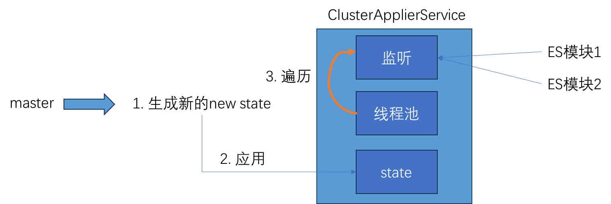

# Elasticsearch

搜索全部课件整理：
https://www.yuque.com/xiaoliujiangyuanma/cs1x7i/vslxb4zsg03capni?singleDoc# 《搜索课件》 密码：hots

通过以下几点来分析：
1. ES的数据模型 
2. ES module之间的调用
3. ES写入流程 
4. 根据DDIA-5 分区分析 
5. 根据DDIA-6 复制分析

## 1. ES的数据模型

### 1.1 ES文档data-replication对数据模型问题的解释

Elasticsearch的数据复制模型基于leader/follower模型，在PacificA论文中得到了很好的描述。
该模型基于复制组中有一个副本作为主分片。其他副本被称为副本分片。主分片是所有索引操作的主要入口。它负责验证操作并确保其正确性。一旦索引操作被主分片接受，主分片还负责将操作复制到其他副本

本节的目的是对Elasticsearch的复制模型进行高层次的概述，并讨论它对读写操作之间各种交互的影响

#### 写入模型


Bully算法Leader选举的基本算法之一。它假定所有节点都有一个唯一的ID，使用该ID对节点进行排序。任何时候的当前Leader都是参与集群的最高ID节点。

该算法的优点是易于实现。但是，当拥有最大ID的节点处于不稳定状态的场景下会有问题。例如，Master负载过重而假死，集群拥有第二大ID的节点被选为新主，这时原来的Master恢复，再次被选为新主，然后又假死……

ZenDiscovery的选主过程如下：每个节点计算最小的已知节点ID，该节点为临时Master。向该节点发送领导投票。
如果一个节点收到足够多的票数，并且该节点也为自己投票，那么它将扮演领导者的角色，开始发布集群状态。所有节点都会参与选举，并参与投票，但是，只有有资格成为Master的节点（node.master为true）的投票才有效．获得多少选票可以赢得选举胜利，就是所谓的法定人数。
在 ES 中，法定大小是一个可配置的参数。配置项：discovery.zen.minimum_master_nodes。为了避免脑裂，最小值应该是有Master资格的节点数n/2+1。


在看模块的功能之前，先看下ES是如何做模块插件化和内部是如何路由调用module的

## 模块插件化
以NetworkModule为例，所有的Network模块会extends Plugin implements NetworkPlugin，在Node.java初始化的时候，把所有的NetworkPlugin实现传入到NetworkModule的构造方法
```Java
final NetworkModule networkModule = new NetworkModule(settings, false, pluginsService.filterPlugins(NetworkPlugin.class),
                threadPool, bigArrays, pageCacheRecycler, circuitBreakerService, namedWriteableRegistry, xContentRegistry,
```
然后以key-value的形式保存到map中

```Java
for (NetworkPlugin plugin : plugins) {
    // 获取插件中定义的HttpTransport实现
    Map<String, Supplier<HttpServerTransport>> httpTransportFactory = plugin.getHttpTransports(settings, threadPool, bigArrays,
        pageCacheRecycler, circuitBreakerService, xContentRegistry, networkService, dispatcher, clusterSettings);
    if (transportClient == false) {
        for (Map.Entry<String, Supplier<HttpServerTransport>> entry : httpTransportFactory.entrySet()) {
            registerHttpTransport(entry.getKey(), entry.getValue());
        }
    }
```

使用的时候，根据配置文件的指定对应的实现或者使用默认值

```Java
/**
 * 返回注册的HTTP传输模块
 */
public Supplier<HttpServerTransport> getHttpServerTransportSupplier() {
    final String name;
    // 配置中是否指定了实现
    if (HTTP_TYPE_SETTING.exists(settings)) {
        // 可以配置 nio....
        name = HTTP_TYPE_SETTING.get(settings);
    } else {
        // 默认netty4
        name = HTTP_DEFAULT_TYPE_SETTING.get(settings);
    }
```

## module的调用

```Java
void inboundMessage(TcpChannel channel, InboundMessage message){
    final long startTime = threadPool.relativeTimeInMillis();
    channel.getChannelStats().markAccessed(startTime);
    TransportLogger.logInboundMessage(channel, message);

    if (message.isPing()) {
        keepAlive.receiveKeepAlive(channel);
    } else {
        messageReceived(channel, message, startTime); // 接收到请求
    }
    
    
private void messageReceived(...) {
   。。。。。
   if (header.isRequest()) {
      handleRequest(channel, header, message);
   }
}

private <T extends TransportRequest> 
    void handleRequest(TcpChannel channel, Header header, InboundMessage message){
    final String action = header.getActionName();
    ....
    // 根据action的名字取拿对应的Handlers
    final RequestHandlerRegistry<T> reg = requestHandlers.getHandler(action);
```

这些Handlers主要是两个地方注册:
1. ActionModule->setupActions(..)方法 会向guice IOC框架提供一组需要实例化的Transport*Action的类型, 该类型比较特殊,都是继承自HandledTransportAction类型，该类型的构造方法会负责将本handler注册到这里
2. 代码层使用TransportService->registerRequestHandler(...)方法强制向requestHandlers map中加入请求处理器

```Java
public MembershipAction(...) {
    this.transportService = transportService;
    this.listener = listener;

    transportService.registerRequestHandler(DISCOVERY_JOIN_ACTION_NAME,
       ThreadPool.Names.GENERIC, JoinRequest::new, new JoinRequestRequestHandler());
```
## 选举流程

1. 加入master节点的流程是什么？
2. 如果本节点被选为master，接下去做什么
3. 普通节点如何监控master健康状态
4. master如何监控普通节点健康状态
5. ES如何避免脑裂？它有哪些举措？

ES 7.0之前默认用的是内置的ZenDiscovery，在Node.java中启动
```Java
// start before cluster service so that it can set initial state on ClusterApplierService
discovery.start(); 
discovery.startInitialJoin(); // 选主
```

ZenDiscovery核心属性:
```Text
TransportService: 通信服务
ZenPing：UnicastZenPing，Ping工具
MasterFaultDetection: Node监控Master节点状态服务
JoinThreadControl: 加入集群线程控制器
NodeJoinController: 被选中节点，控制普通节点连接的逻辑
ClusterApplier: 集群状态“应用”服务
ThreadPool: es封装的线程池，以后课程分析

MasterService: 主节点服务
publishClusterState: 发布集群状态服务
NodesFaultDetection: Master监控普通节点状态服务
MembershipAction: 处理成员请求事件
PendingClusterStatesQueue: 集群状态Pending队列
AtomicReference<ClusterState> committedState: 最后一次提交的状态
ElectMasterService: 选举主节点服务
```

discovery.start()调用，只是初始化一些默认值
```Java
protected void doStart() {
    // 获取表示本地节点信息的node对象
    DiscoveryNode localNode = transportService.getLocalNode();
    assert localNode != null;
    synchronized (stateMutex) {
        // set initial state
        assert committedState.get() == null;
        assert localNode != null;

        // 集群状态构造器
        ClusterState.Builder builder = ClusterState.builder(clusterName);
        ClusterState initialState = builder
            .blocks(ClusterBlocks.builder()
                .addGlobalBlock(STATE_NOT_RECOVERED_BLOCK) // 集群未恢复
                .addGlobalBlock(noMasterBlockService.getNoMasterBlock())) // 集群无主状态
            .nodes(DiscoveryNodes.builder().add(localNode).localNodeId(localNode.getId()))
            .build();

        // 将初始的集群信息写给committedState。因为committedState要始终保持最新的集群状态
        committedState.set(initialState);

        // clusterApplier内部封装了应用集群状态的逻辑
        // 内部注册了一些Listener，Listener收到newState之后，做什么事情，由它决定。
        clusterApplier.setInitialState(initialState);

        // nodesFD: 普通node节点join到master之后，启动，会定时1s向master发起ping，用于监控master存活
        // 这里设置localNode，是因为ping的request中包含了local信息
        nodesFD.setLocalNode(localNode);

        // joinThreadControl：该Control用于当前节点控制joinThread，避免本地同时有多个joinThread去工作。确保
        // 在需要joinThread工作的时候，仅仅只有一个该线程。内部封装了启动 joinThread 的逻辑。
        // start()仅仅是设置running开关为true，并不会启动线程。
        joinThreadControl.start();
    }
    zenPing.start();
}
```

discovery.startInitialJoin()则是启动一个异步任务，放到generic线程池中

找不到则不停地循环，如果选举失败，node会开启一个新的joinThread去顶替当前线程的工作
```Java
 while (masterNode == null && joinThreadControl.joinThreadActive(currentThread)) {
    masterNode = findMaster();
}
```

选举失败的流程在innerJoinCluster方法的最后, 将joinThreadControl->currentJoinThread字段设置为null, 
让zenDiscovery->executePool重新提交runnable任务，会再次开启一个新线程去做join的事情. 最终形成了一个闭环
```Java
  synchronized (stateMutex) {
    if (success) {
        ......
    } else {
        // failed to join. Try again...
        joinThreadControl.markThreadAsDoneAndStartNew(currentThread);
    }
```

findMaster会向discovery.zen.ping.unicast.hosts配置项的节点发送ping请求，并且线程等待对端响应，返回的是PingResponse对象，包含对端节点和集群的信息
```Java
// 内部还封装了ping失败后，重试等等逻辑...
List<ZenPing.PingResponse> fullPingResponses = pingAndWait(pingTimeout).toList();

class PingResponse implements Writeable {
    // 返回的PingResponse对象
    private final long id;
    // 对方节点的集群名
    private final ClusterName clusterName;
    // 对方节点的基本信息
    private final DiscoveryNode node;
    // 对方所在master的节点的基本信息
    private final DiscoveryNode master;
    // 集群状态版本号
    private final long clusterStateVersion;

// 本地节点加入到PingResponse
fullPingResponses.add(new ZenPing.PingResponse(localNode,null,this.

    clusterState()));

    // 默认情况下，全部节点都是默认投票权，如果配置ignore_non_master_pings=true的配置的话，则会过滤掉非master权限
    final List<ZenPing.PingResponse> pingResponses = filterPingResponses(fullPingResponses, masterElectionIgnoreNonMasters, logger);

    // masterCandidates: 该列表保存所有可能成为master节点的信息
    List<ElectMasterService.MasterCandidate> masterCandidates = new ArrayList<>();
for(
    ZenPing.PingResponse pingResponse :pingResponses)

    {
        if (pingResponse.node().isMasterNode()) {
            masterCandidates.add(new ElectMasterService.MasterCandidate(pingResponse.node(), pingResponse.getClusterStateVersion()));
        }
    }

// CASE1: 当前集群无主
if(activeMasters.isEmpty())
    {

        // 判断是否有足够数量的候选者
        if (electMaster.hasEnoughCandidates(masterCandidates)) {

            // 从候选者列表中，选举winner：对masterCandidates进行sort，先按照集群版本大小排序，大的靠前，如果
            // 集群版本号一致，则再按照 masterCandidate->node->id进行排序，小的靠前..
            // 排序完之后，选择 list.get(0)为胜出者
            final ElectMasterService.MasterCandidate winner = electMaster.electMaster(masterCandidates);
            logger.trace("candidate {} won election", winner);
            return winner.getNode();
        } else {
            // if we don't have enough master nodes, we bail, because there are not enough master to elect from
            logger.warn("not enough master nodes discovered during pinging (found [{}], but needed [{}]), pinging again",
                    masterCandidates, electMaster.minimumMasterNodes());
            return null;
        }
    } else

    {
        // CASE2: 当前集群有主
        assert !activeMasters.contains(localNode) :
                "local node should never be elected as master when other nodes indicate an active master";
        // lets tie break between discovered nodes
        return electMaster.tieBreakActiveMasters(activeMasters);
    }
}
```

### Cluster模块

Cluster模块封装了在集群层面要执行的任务。例如，把分片分配给节点属于集群层面的工作，在节点间迁移分片以保持数据均衡，集群健康、集群级元信息管理，以及节点管理都属于集群层面工作



ClusterService 是上层模块（如创建索引、删除索引、快照等）与集群状态更新机制的统一入口
```Java
public class ClusterService extends AbstractLifecycleComponent {
    // 仅主节点使用，负责接收并执行集群状态更新任务（如分片分配、索引创建等）
    private final MasterService masterService;

    // 所有节点（包括主节点和数据节点）都会使用，负责将Master节点生成的新集群状态应用到本地，并通知各个模块（如 IndicesClusterStateService、GatewayService 等）
    private final ClusterApplierService clusterApplierService;
}
```

如果某个模块需要处理集群状态，则调用addStateApplier方法添加一个处理器。如果想监听集群状态的变化，则通过addListener添加一个监听器。Applier负责将集群状态应用到组件内部，对Applier的调用在集群状态可见（ClusterService#state获取到的）之前，对Listener的通知在新的集群状态可见之后

| 接口/类名                             | 作用                                     | 触发时机                                                           | 典型用途                                                      |
|-----------------------------------|----------------------------------------|----------------------------------------------------------------|-----------------------------------------------------------|
| **ClusterStateApplier**（集群状态应用器）  | 负责将新的集群状态“应用”到节点内部，更新节点的状态、数据结构、磁盘目录等。 | 在集群状态**正式生效前**调用，即集群状态对节点可见（`ClusterService#state`获取到的状态更新）之前。 | 例如 `IndicesClusterStateService` 实现该接口，根据新状态创建或删除索引、分配分片等。 |
| **ClusterStateListener**（集群状态监听器） | 监听集群状态变更，执行状态变更后的额外逻辑。                 | 在集群状态**正式生效后**调用，即集群状态对节点可见之后。                                 | 例如某些服务需要在状态变更后执行清理、日志记录、触发后续操作等。                          |


```Text
[外部模块]
│
▼
[ClusterService] ←——— 封装入口 ———→ [MasterService]（仅主节点）
│                                    │
│                                    ▼
│                            [生成新集群状态]
│                                    │
│                                    ▼
[ClusterApplierService] ←——— 接收并应用状态 ———— [所有节点]
│
▼
[模块应用状态并响应]
```

#### 提交任务

内部模块通过clusterService.submitStateUpdateTask来提交一个集群任务

```Java
public <T extends ClusterStateTaskConfig & ClusterStateTaskExecutor<T> & ClusterStateTaskListener>
    void submitStateUpdateTask(String source, T updateTask) {
    submitStateUpdateTask(source, updateTask, updateTask, updateTask, updateTask);
}
```

- ClusterStateTaskConfig: 任务配置主要含任务优先级、超时信息的定义
- ClusterStateTaskExecutor: 定义了execute(..) 抽象方法，让实现者完成任务的具体逻辑（定义任务具体逻辑）
- ClusterStateTaskListener: 任务监听器; onFailure(e)任务执行失败调用、clusterStateProcessed(..)任务执行完毕调用

ClusterStateTaskListener的子类AckedClusterStateTaskListener，ack指的是下发应用newState时，普通节点给master的回执

举个例子，可以根据这个走下流程：

客户端修改mapping => master修改mapping任务 => master执行任务 => 生成new状态 => 下发其它节点 => 等待半数以上master-eligible节点

```Text
2PC
    阶段一: 发送配置, master知道已经有足够数量的master-eligible持有newState了，等待master下发commit请求
    阶段二: commit
    普通或master-eligible节点收到commit请求，本地应用newState，应用完毕newState给master， commit ack =>
    master收到集群节点总数-1个commit ack => master就知道整个集群都应用了newState => master也要去应用这个newState
    => 当master也应用完newState之后，回调任务相关联的 AckedClusterStateTaskListener#onAllNodesAcked(null)方法
```

tasks: 一般情况下，task内部只有一个entry，key是task本身，value是任务关联的listener
```Java
    public <T> void submitStateUpdateTasks(final String source,
                                           final Map<T, ClusterStateTaskListener> tasks, final ClusterStateTaskConfig config,
                                           final ClusterStateTaskExecutor<T> executor) {
        if (!lifecycle.started()) {
            return;
        }
        final ThreadContext threadContext = threadPool.getThreadContext();
        final Supplier<ThreadContext.StoredContext> supplier = threadContext.newRestorableContext(true);
        try (ThreadContext.StoredContext ignore = threadContext.stashContext()) {
            threadContext.markAsSystemContext();
            
            List<Batcher.UpdateTask> safeTasks = tasks.entrySet().stream()
                // 参数1：config.priority() 任务优先级
                // 参数2：source source 任务源描述信息
                // 参数3：task值e.getKey()，表示任务事件信息，就是一个obj
                // 参数4：listener 值e.getValue()，任务关联的监听器
                // 参数5：executor 任务的逻辑封装
                .map(e -> taskBatcher.new UpdateTask(config.priority(), source, e.getKey(), safe(e.getValue(), supplier), executor))
                .collect(Collectors.toList());
            
            // taskBatcher: 任务批量处理器，主要处理batchingKey一致的任务
            // 一组{task1}{task2}{task3}{task4}{task5}，如果它们的executor一致，则
            // 仅执行task1关联的executor即可，然后将结果赋值给{task1}{task2}{task3}{task4}{task5}
            taskBatcher.submitTasks(safeTasks, config.timeout());
        } catch (EsRejectedExecutionException e) {
            // ignore cases where we are shutting down..., there is really nothing interesting
            // to be done here...
            if (!lifecycle.stoppedOrClosed()) {
                throw e;
            }
        }
    }
```

以ElectionContext#closeAndBecomeMaster为例子

```Java
public synchronized void closeAndBecomeMaster() {
    Map<JoinTaskExecutor.Task, ClusterStateTaskListener> tasks = getPendingAsTasks("become master");
    final String source = "zen-disco-elected-as-master ([" + tasks.size() + "] nodes joined)";

    // noop listener, the election finished listener determines result
    // 这里面并没有task的执行逻辑
    tasks.put(JoinTaskExecutor.newBecomeMasterTask(), (source1, e) -> {});
    tasks.put(JoinTaskExecutor.newFinishElectionTask(), electionFinishedListener);
    // joinTaskExecutor执行完task之后将结果放到tasks的ClusterStateTaskListener
    masterService.submitStateUpdateTasks(source, tasks, ClusterStateTaskConfig.build(Priority.URGENT), joinTaskExecutor);
}
```

tasks只是put了Task和监听器，什么时候调用呢？tasks是同一个joinTaskExecutor的逻辑，joinTaskExecutor执行完task之后将结果放到tasks的ClusterStateTaskListener

```Java
public abstract class TaskBatcher {

    private final Logger logger;

    // 线程池，Master主节点执行任务的线程池
    private final PrioritizedEsThreadPoolExecutor threadExecutor;

    // 用于任务去重的，即 提交了一组任务，但是一组任务只关联一个 executor ，这种情况
    // key：batchingKey （ps: batchingKey其实是executor）
    // value：关注这个executor结果的这一批 task
    final Map<Object, LinkedHashSet<BatchedTask>> tasksPerBatchingKey = new HashMap<>();

    public void submitTasks(List<? extends BatchedTask> tasks, @Nullable TimeValue timeout) throws EsRejectedExecutionException {
        synchronized (tasksPerBatchingKey) {
            LinkedHashSet<BatchedTask> existingTasks = tasksPerBatchingKey.computeIfAbsent(firstTask.batchingKey,
                    k -> new LinkedHashSet<>(tasks.size()));
            for (BatchedTask existing : existingTasks) {
                // check that there won't be two tasks with the same identity for the same batching key
                BatchedTask duplicateTask = tasksIdentity.get(existing.getTask());
                if (duplicateTask != null) {
                    throw new IllegalStateException("task [" + duplicateTask.describeTasks(
                            Collections.singletonList(existing)) + "] with source [" + duplicateTask.source + "] is already queued");
                }
            }

            // existingTasks Set集合存放的是同一批关注executor结果的任务
            existingTasks.addAll(tasks);
        }

        if (timeout != null) {
            threadExecutor.execute(firstTask, timeout, () -> onTimeoutInternal(tasks, timeout));
        } else {
            threadExecutor.execute(firstTask);
        }
    }
```

submitTasks的核心工作就是将待执行任务加入任务队列。每个任务都有优先级，线程池的任务队列也是支持优先级的PriorityBlockingQueue

实际调用的是firstTask的run方法
```Java
public void run() {
    runIfNotProcessed(this);
}

void runIfNotProcessed(BatchedTask updateTask) {
    //....
    // 执行任务
    // 参数1：updateTask.batchingKey 其实就是firstTask#executor
    // 参数2：toExecute 关注结果的那一组task
    // 参数3：tasksSummary 任务描述信息
    run(updateTask.batchingKey, toExecute, tasksSummary);
}

// TaskInputs 任务输入参数封装对象
// 1. 任务执行逻辑（executor接口实现）
// 2. 关注结果的那一组task（UpdateTask对象 --内部持有-- 原始任务Task）
// 3. 任务描述
private class TaskInputs {
    final String summary;
    final List<Batcher.UpdateTask> updateTasks;
    final ClusterStateTaskExecutor<Object> executor;

    TaskInputs(ClusterStateTaskExecutor<Object> executor, List<Batcher.UpdateTask> updateTasks, String summary) {
        this.summary = summary;
        this.executor = executor;
        this.updateTasks = updateTasks;
    }

    boolean runOnlyWhenMaster() {
        return executor.runOnlyOnMaster();
    }

    void onNoLongerMaster() {
        updateTasks.forEach(task -> task.listener.onNoLongerMaster(task.source()));
    }
}

private void runTasks(TaskInputs taskInputs) {
    final String summary = taskInputs.summary;
    
    // 执行任务之前的集群状态
    final ClusterState previousClusterState = state();
    
    // 执行任务的入口
    // 参数1：TaskInputs 任务输入参数封装对象
    // 参数2：previousClusterState执行任务之前的集群状态
    // 返回值：taskOutputs
    
    // 任务执行结果输出对象
    // 1. taskInputs 任务输入
    // 2. previousClusterState 执行任务之前的集群状态
    // 3. newClusterState 执行任务之后产生的新的集群状态
    // 4. 未失败任务列表（UpdateTask对象列表）
    // 5. 任务执行结果（map<key:原始task，value：result>）
    final TaskOutputs taskOutputs = calculateTaskOutputs(taskInputs, previousClusterState);
    taskOutputs.notifyFailedTasks();
    final TimeValue computationTime = getTimeSince(computationStartTime);
    logExecutionTime(computationTime, "compute cluster state update", summary);

    // 执行任务并未改变集群状态
    if (taskOutputs.clusterStateUnchanged()) {
        final long notificationStartTime = threadPool.relativeTimeInMillis();

        // 1. 调用任务相关联的listener->onAllNodesAcked(null),需要集群所有节点都应用newState之后才会回调,这里未产生新的集群状态，所以直接回调
        // 2. 调用任务相关联的listener->clusterStateProcessed(task.source(), newClusterState, newClusterState)表示任务已经执行过了
        // 场景：
        // ElectionContext中，它提交的任务关联的listener类型为：ClusterStateTaskListener,该类型的监听器，并不会执行1定义的onAllNodesAcked，因为它不是ackedListener。
        // 只会执行2，clusterStateProcessed(..) 接口方法。
        // 但是提交的任务是AckedClusterStateUpdateTask，那么关联的listener就是AckedListener了.. 就会执行1和2
        taskOutputs.notifySuccessfulTasksOnUnchangedClusterState();
        final TimeValue executionTime = getTimeSince(notificationStartTime);
        logExecutionTime(executionTime, "notify listeners on unchanged cluster state", summary);
    } else {
        final ClusterState newClusterState = taskOutputs.newClusterState;
        if (logger.isTraceEnabled()) {
            logger.trace("cluster state updated, source [{}]\n{}", summary, newClusterState);
        } else {
            logger.debug("cluster state updated, version [{}], source [{}]", newClusterState.version(), summary);
        }
        final long publicationStartTime = threadPool.relativeTimeInMillis();
        try {
            ClusterChangedEvent clusterChangedEvent = new ClusterChangedEvent(summary, newClusterState, previousClusterState);
            // new cluster state, notify all listeners
            // 根据新老两个集群状态，计算出来节点的增量信息
            // 1. 新上线的node
            // 2. 掉线的node
            final DiscoveryNodes.Delta nodesDelta = clusterChangedEvent.nodesDelta();
            if (nodesDelta.hasChanges() && logger.isInfoEnabled()) {
                String nodesDeltaSummary = nodesDelta.shortSummary();
                if (!nodesDeltaSummary.isEmpty()) {
                    logger.info("{}, term: {}, version: {}, delta: {}",
                            summary, newClusterState.term(), newClusterState.version(), nodesDeltaSummary);
                }
            }

            logger.debug("publishing cluster state version [{}]", newClusterState.version());
            publish(clusterChangedEvent, taskOutputs, publicationStartTime);
        } catch (Exception e) {
            handleException(summary, publicationStartTime, newClusterState, e);
        }
    }
}
```


