# Kafka
## 1. 背景

**为什么我们需要Kafka这样一个桥梁**，连接起我们的应用系统、大数据批处理系统，以及大数据流式处理系统

1. 性能瓶颈

   没有kafka之前，一般数据是存放在HDFS上，但是**HDFS（GFS）这样的分布式文件系统，对于单个文件，只适合一个客户端顺序大批量的写入**，所以facebook开源的日志收集器Scribe做了改良，它并不是实时不断地向HDFS写入数据，而是定时地向HDFS上转存（Dump）文件

   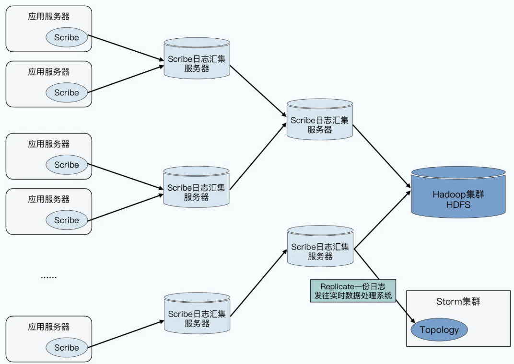

   还是存在一些问题： 
   - 如果需要收集1min的日志，需要每分钟执行一个MapReduce的任务，不是一个高效的解决问题的办法 
   - 隐式依赖：可能会出现网络中断、硬件故障等等的问题，所以很有可能，在运行MapReduce任务去分析数据的时候，Scribe还没有把文件放到
      HDFS上。那么，MapReduce分析程序，就需要对这种情况进行容错，比如，下一分钟的时候，它需要去读取最近5分钟的数据，看看
      Scribe上传的新文件里，是否会有本该在上一分钟里读到的数据。而这些机制，意味着下游的 MapReduce任务，需要去了解上游的日志收集器的实现机制。并且两边根据像文件名规则之类的隐式协议产生了依赖

2. 和传统的“消息队列”系统有什么不同

   传统的消息队列，则关注的是小数据量下，是否每一条消息都被业务系统处理完成了。因为这些消息队列里的消息，可能就是一笔实际的业务交易，需要等待consumer处理完成，确认结果才行。但是整个系统的吞吐量却没有多大

   Scribe这样的日志收集系统，考虑的是能否高吞吐量地去传输日志，至于下游如何处理日志，它是不关心的。

   Kafka的整体设计，则考虑的是不仅要**实时传输数据**，而且需要下**游有大量不同的业务应用，去消费实时产生的日志文件**。并且，这些数据处理也不是非常重要的金融交易，而是对于大量数据的实时分析，然后反馈到线上

   > kafka后面幂等性，事务，exactly once能否支撑金融交易？
   
## 2.架构

### 2.1 Lambda架构

既然已经可以获得分钟级别的统计数据，那还需要 MapReduce 这样的批处理程序吗？

流式数据处理的问题：
1. 只能保障“至少一次（At Least Once）”的数据处理模式
   
   这个后续的kafka已经实现了exactly once

2. 批处理程序很容易修改，而流式处理程序则没有那么容易

   重放日志需要花费很多时间(没有kafka的情况下)、或者短时间内会消耗很多计算资源

Lambda架构的基本思想

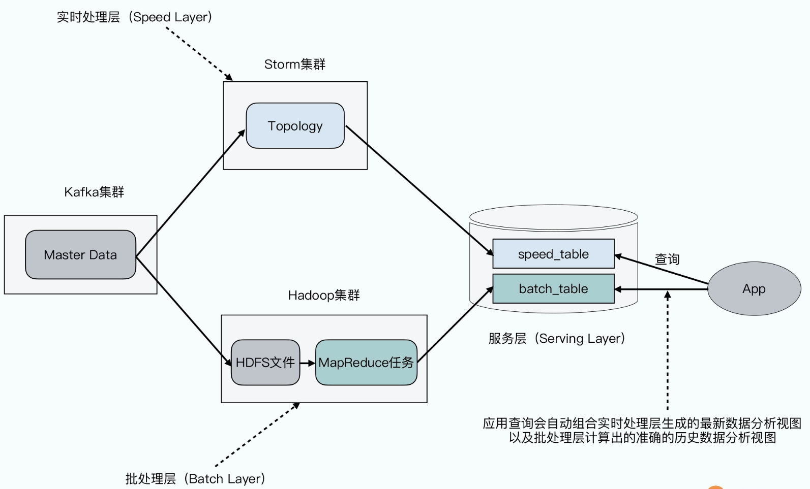

整个数据处理流程抽象成$View = Query(Data)$这样一个函数。我们所有的报表、看板、数据分析结果，都是来自对于原始日志的分析

原始日志就是主数据（Master Data），不管是批处理还是流式处理，都是对于原始数据的一次查询（Query）。而这些计算结果，其实就是一个基于特定查询的视图（View）

Lambda 结构，是由这样几部分组成的：
- 第一部分是输入数据，也就是**Master Data**，这部分就是原始日志
- 然后是一个**批处理层**（Batch Layer）和一个**实时处理层**（Speed Layer），它们分别是一系列MapReduce的任务，和一组Storm的Topology，获取相同的输入数据，然后各自计算出自己的计算结果
- 最后是一个**服务层**（Serving Layer），通常体现为一个数据库。批处理层的计算结果和实时处理层的结果，会写入到这个数据库里。后生成的批处理层的结果，会不断替代掉实时处理层的计算结果，也就是对于最终计算的数据进行修正
- 对于**外部用户**来说，他不需要和批处理层以及实时处理层打交道，而只需要通过像SQL这样的查询语言，直接去查询服务层就好了

### 2.2 Kappa架构

Lambda架构有一个显著的缺点，也就是什么事情都需要做两遍

1. 所有的视图，既需要在实时处理层计算一次，又要在批处理层计算一次。**即使没有修改任何程序，也需要双倍的计算资源**
2. 我们所有的数据处理的程序，也要撰写两遍。MapReduce 的程序和 Storm 的程序虽然要计算的是同样的视图，但是因为底层的框架完全不同，**代码我们就需要写两套。这样意味着，需要双倍的开发资源**

Kafka还没有成熟的时候，把数据分成批处理层和实时处理层是很难避免的。主要问题在于，我们重放实时处理层的日志是个开销很大的动作

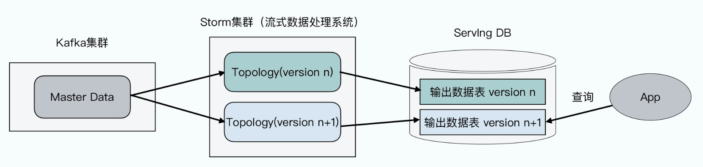

相比于Lambda架构，Kappa架构去掉了Lambda 架构的批处理层，而是在**实时处理层，支持了多个视图版本**

如果要对Query进行修改，原来的实时处理层的代码可以先不用动，而是可以先部署一个新版本的代码，比如一个新的Topology。然后，对这个Topology对应日志的重放，在服务层生成一份新的数据结果表，也就是视图的一个新的版本

在日志重放完成之前，外部的用户仍然会查询旧的实时处理层产生的结果。而一旦日志重放完成，新的Topology能够赶上进度，处理到最新产生的日志，那么就可以让查询，切换到新的视图版本上来，旧的实时处理层的代码也就可以停掉了

> 流批一体

## 3. 应用与源码

### 3.1 生产者

生产者客户端的整体架构，如下所示：

<p>
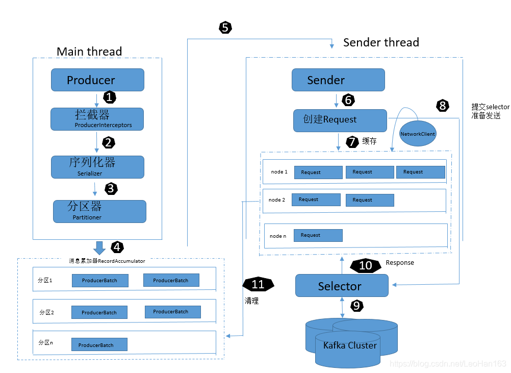
</p>

从以下几个方面来看它的实现： 
- 数据分区分配策略 
- meta更新策略 
- RecordAccumulator的实现，即内存管理和分配 
- 网络层

**数据分区分配策略**

有3种分配策略：DefaultPartitioner, RoundRobinPartitioner和UniformStickyPartitioner

- RoundRobinPartitioner

  每次均匀分配,无论是否有key

- DefaultPartitioner

  1. 若消息指定了分区，则使用该分区
  2. 若未指定分区但存在key，则根据key的哈希值对分区数取模选择分区，确保相同key的消息写入同一分区
  3. 若既未指定分区又无key，则采用UniformStickyPartitioner，随机选择一个分区，并尽可能一直使用该分区，直到该分区的批次已满（batch.size）或linger.ms时间到，再重新选择分区

- UniformStickyPartitioner

    KIP-480: Sticky Partitioner引入了UniformStickyPartitioner。这个是在Round-robin策略上的优化
    
    会从本地缓存中拿对应topic的分区，所以具有粘性(Sticky)，只有当newBatch或者indexCache为空的情况下才会重新计算分区
    
    newBatch指的是该batch已经满或者到达了发送的时间。UniformStickyPartitioner计算分区也很简单，即随机数
    
    ```Text
    if (availablePartitions.size() == 1) {
           newPart = availablePartitions.get(0).partition();
       } else {
           while (newPart == null || newPart.equals(oldPart)) {
               int random = Utils.toPositive(ThreadLocalRandom.current().nextInt());
               newPart = availablePartitions.get(random % availablePartitions.size()).partition();
           }
    }
    ```
    
    但是UniformStickyPartitioner有在某些场景下会有问题，在3.3.0废弃，[KIP-794](https://cwiki.apache.org/confluence/display/KAFKA/KIP-794%3A+Strictly+Uniform+Sticky+Partitioner)做了优化，解决**分配倾斜**
    
    UniformStickyPartitioner会将更多消息分配给速度较慢的broker，并且可能导致“失控”的问题。因为“粘性”时间是由新的批量创建消息驱动的，这与broker的延迟成反比——较慢的broker消耗批量消息的速度较慢，因此它们会比速度更快的分区获得更多的“粘性”时间，从而是消息分配倾斜。
    
    假设一个生产者写入的消息到3个分区（生产者配置为linger.ms=0），并且一个partition由于某种原因（leader broker选举更换或网络抖动问题等情况）导致稍微变慢了一点。生产者必须一直保留发送到这个partition的批次消息，直到partition变得可用。
    在保留这些批次消息的同时，因为生产者还没有准备好发送到这个分区，其他批次的消息又大批量发送的并开始堆积，从而可能导致每个批次都可能会被填满。
    
    KIP-794对UniformStickyPartitioner做了优化，可以采用自适应分区切换
    
    **切换策略**：分配分区的概率与队列长度成反比
    
    每次partitionReady之后，更新partition的统计信息, PartitionLoadStats的构造函数
    ```Java
      private final static class PartitionLoadStats {
        public final int[] cumulativeFrequencyTable;
        public final int[] partitionIds;
        public final int length;
    }
    ```
    
    主要的逻辑是cumulativeFrequencyTable的构造，注释中举了个例子
    ```Text
    Example: 
      假设有3个partitions的队列长度分别是:
      0 3 1
      最大的queue的长度+1则等于3+1=4，再减去每个queue的长度则是
      4 1 3
      再做前缀和，则cumulativeFrequencyTable数组可以赋值为
      4 5 8
    ```
    那构造了CFT数组如何去用呢，取一个随机数[0..8)，然后看它比CFT数组哪个值比较大则去对应下标。如随机到4的话，选择第二个Partition

**RecordAccumulator的实现，即内存管理和分配**

RecordAccumulator主要用来缓存消息以便Sender线程可以批量发送，进而减少网络传输的资源消耗以提升性能

<p>
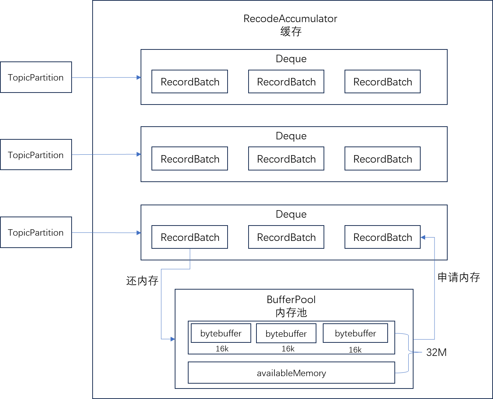
</p>


另外的sender线程会不断的执行runOnce，从RecodeAccumulator拉取准备好的数据
```Java
    void runOnce() {
        long currentTimeMs = time.milliseconds();
        // 有元数据的情况下进行
        // 网络没有建立好，是不会发送消息的
        long pollTimeout = sendProducerData(currentTimeMs);
        // 第一次的话去拉取元数据
        // 真正执行网络操作的都是这个NetworkClient组件，包括发送请求，接受响应
        client.poll(pollTimeout, currentTimeMs);
    }
```

那什么条件可以发送数据？

```Java
// Sender.java
private long sendProducerData(long now) {
    // 第二次进来的话已经有元数据
    Cluster cluster = metadata.fetch(); // 获取元数据
    // get the list of partitions with data ready to send
    // 判断哪些partition哪些队列可以发送，获取partition的leader partition对应的broker主机
    RecordAccumulator.ReadyCheckResult result = this.accumulator.ready(cluster, now);

    // create produce requests
    // 要发送的partition有很多个，很有可能有一些partition的leader partition是在同一台服务器上的
    // 按照broker的partition进行分组
    Map<Integer, List<ProducerBatch>> batches = this.accumulator.drain(cluster, result.readyNodes, this.maxRequestSize, now);
    addToInflightBatches(batches);
}
```

注释的很清楚，当然，元数据没有的情况下也无法发送
A destination node is ready to send data if:
1. There is at least one partition that is not backing off its send
2. and those partitions are not muted (to prevent reordering if "max.in.flight.requests.per.connection" is set to one)
3. and any of the following are true
   The record set is full
   The record set has sat in the accumulator for at least lingerMs milliseconds
   The accumulator is out of memory and threads are blocking waiting for data (in this case all partitions are immediately considered ready).
   The accumulator has been closed

```Java
public ReadyCheckResult ready(Cluster cluster, long nowMs) {
        Set<Node> readyNodes = new HashSet<>();
        long nextReadyCheckDelayMs = Long.MAX_VALUE;
        Set<String> unknownLeaderTopics = new HashSet<>();

        // free.queued()判断的是BufferPool的this.waiters.size()
        // waiters>0说明内存不够, BufferPool分配内存不够的时候，会执行this.waiters.addLast(moreMemory);
        boolean exhausted = this.free.queued() > 0;
        
        // 遍历所有的分区
        for (Map.Entry<TopicPartition, Deque<ProducerBatch>> entry : this.batches.entrySet()) {
            Deque<ProducerBatch> deque = entry.getValue();
            synchronized (deque) {
                // When producing to a large number of partitions, this path is hot and deques are often empty.
                // We check whether a batch exists first to avoid the more expensive checks whenever possible.
                ProducerBatch batch = deque.peekFirst();
                if (batch != null) {
                    TopicPartition part = entry.getKey();
                    // 根据分区可以获取分区在哪一台leader partition上
                    Node leader = cluster.leaderFor(part);
                    if (leader == null) {
                        // This is a partition for which leader is not known, but messages are available to send.
                        // Note that entries are currently not removed from batches when deque is empty.
                        unknownLeaderTopics.add(part.topic());
                    } else if (!readyNodes.contains(leader) && !isMuted(part)) {
                        long waitedTimeMs = batch.waitedTimeMs(nowMs);
                        
                        // backingOff: 重新发送的数据的时间到了
                        boolean backingOff = batch.attempts() > 0 && waitedTimeMs < retryBackoffMs;
                        
                        // 等待的发送时间在重试的状态下取得是重试等待时间，否则取的是lingerMs，默认是0，来一条消息发送一条消息
                        long timeToWaitMs = backingOff ? retryBackoffMs : lingerMs;
                        
                        // deque.size() > 1说明至少有一个批次已经写满了，因为最少有2个，那第一个肯定是写满的
                       // batch.isFull()说明批次写满了
                        boolean full = deque.size() > 1 || batch.isFull();
                        boolean expired = waitedTimeMs >= timeToWaitMs;
                        boolean transactionCompleting = transactionManager != null && transactionManager.isCompleting();
                        /**
                         * 1. full: 批次写满了发送无论时间有没有到
                         * 2. expired ：时间到了，批次没写满也得发送
                         * 3. exhausted: 内存不够，消息发送之后，会自动释放内存
                         * 4. closed: 关闭现场需要将缓存的数据发生出去
                         */
                        boolean sendable = full
                            || expired
                            || exhausted
                            || closed
                            || flushInProgress()
                            || transactionCompleting;
                        if (sendable && !backingOff) {
                            readyNodes.add(leader);
                        } else {
                            long timeLeftMs = Math.max(timeToWaitMs - waitedTimeMs, 0);
                            // Note that this results in a conservative estimate since an un-sendable partition may have
                            // a leader that will later be found to have sendable data. However, this is good enough
                            // since we'll just wake up and then sleep again for the remaining time.
                            nextReadyCheckDelayMs = Math.min(timeLeftMs, nextReadyCheckDelayMs);
                        }
                    }
                }
            }
        }
        return new ReadyCheckResult(readyNodes, nextReadyCheckDelayMs, unknownLeaderTopics);
    }
```

**meta更新策略**

当客户端中没有需要使用的元数据信息时，比如没有指定的主题信息，或者超过metadata.max.age.ms，即5分钟没有更新元数据都会引起元数据的更新操作

Kafka的元数据（Metadata）更新过程是一个异步、重试、最终一致的机制，由Producer主线程和Sender子线程协同完成

| 阶段   | 动作                                                           | 关键源码/方法                                           |
|------|--------------------------------------------------------------|---------------------------------------------------|
| ① 触发 | 首次发送、Topic 不存在、Leader 切换、收到 `NOT_LEADER_FOR_PARTITION` 等异常   | `waitOnMetadata()` → `requestUpdate()`            |
| ② 发起 | Sender 线程挑选 **负载最小的节点**（leastLoadedNode）发送 `MetadataRequest` | `maybeUpdate()` → `sendInternalMetadataRequest()` |
| ③ 接收 | NetworkClient 收到 `MetadataResponse`                          | `handleSuccessfulResponse()`                      |
| ④ 更新 | 解析响应 → 更新本地 `MetadataCache` → `version` 自增 → 通知等待线程          | `metadata.update()`                               |

leastLoadedNode，即所有Node中负载最小的那一个，如何确定负载最小，即判断*InFlightRequests中还未确认的请求决定的，未确认的请求越多则认为负载越大*

把失败分为 “可恢复” 与 “不可恢复”，采用指数回退+重试机制

| 机制       | 说明                                                                                           | 相关字段/默认值           |
|----------|----------------------------------------------------------------------------------------------|--------------------|
| **指数回退** | 失败后在 `refreshBackoffMs`（默认 100 ms）基础上指数级推迟下一次重试                                              | `refreshBackoffMs` |
| **失败标记** | 调用 `metadata.failedUpdate(now)` 仅更新 `lastRefreshMs`，不更新 `lastSuccessfulRefreshMs`，因此仍被视为“过期” | `failedUpdate()`   |
| **重试循环** | Sender 线程在下一次 `poll()` 时再次挑选可用节点重发请求，循环直到成功                                                  | `maybeUpdate()`    |
| **超时兜底** | 主线程在 `max.block.ms`（默认 60 s）内等不到有效元数据则抛 `TimeoutException` 给调用方                              | `max.block.ms`     |
| **异常传递** | 不可恢复错误（如 `TopicAuthorizationException`）立即抛出，不再重试                                             | `waitOnMetadata()` |

**client网络层**

<p>
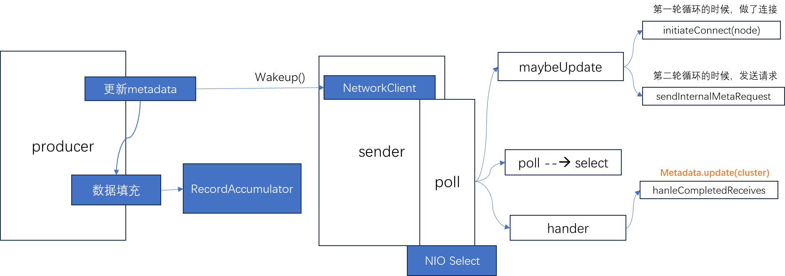
</p>

wakeup()方法用于唤醒在select()或select(long)方法调用中被阻塞的线程。当selector上的channel无就绪事件时，如果想要唤醒阻塞在select()操作上的线程去处理一些别的工作，可以调用wakeup()方法

<p>
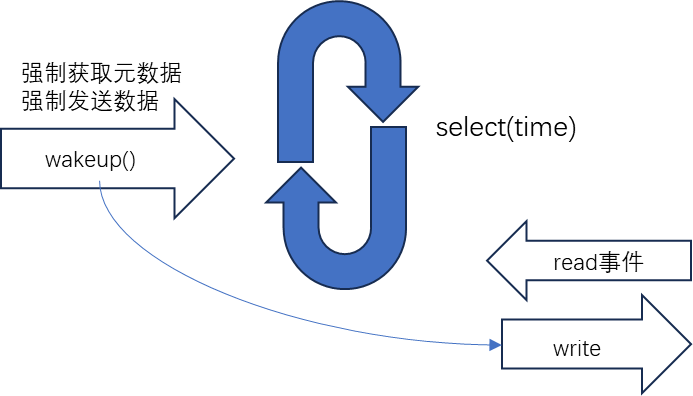
</p>

多路复用器获取的是**事件**而不是读取数据, read的情况下首先产生的是事件，然后selector再处理

写事件不需要注册，依赖send-queue，数据准备好之后，再注册写事件，wakeup马上发送数据

producer不是单Reactor单线程；是一个后台 I/O 线程（Sender） + 一个 Java NIO Selector，但业务线程（KafkaProducer 主线程）与I/O 线程分离
```Text
Sender 线程
   │
   ├─ produce response 解析完成
   └─ 把batch丢进completed队列
        ▲
        │  投递
        │
KafkaProducer 主线程
   │
   ├─ send()/flush()/close()/get()
   └─ runCompletedCallbacks()
        └─ 遍历 completed → 真正执行用户 Callback
```

主线程不监听队列，而是每次自己动（send、flush、close、get）时，主动去拉accum.completed()并立即执行；Sender线程只负责“把回调塞进completed队列

- 处理粘包和拆包？

https://www.cnblogs.com/longfurcat/p/18664750

https://blog.csdn.net/qq_33204709/article/details/137098027

- Java生产者是如何管理TCP连接的？

- 多线程客户端

- reactor

https://blog.csdn.net/weixin_43767015/article/details/120303920

### 3.2 Server请求处理模块

整体架构:

<p>
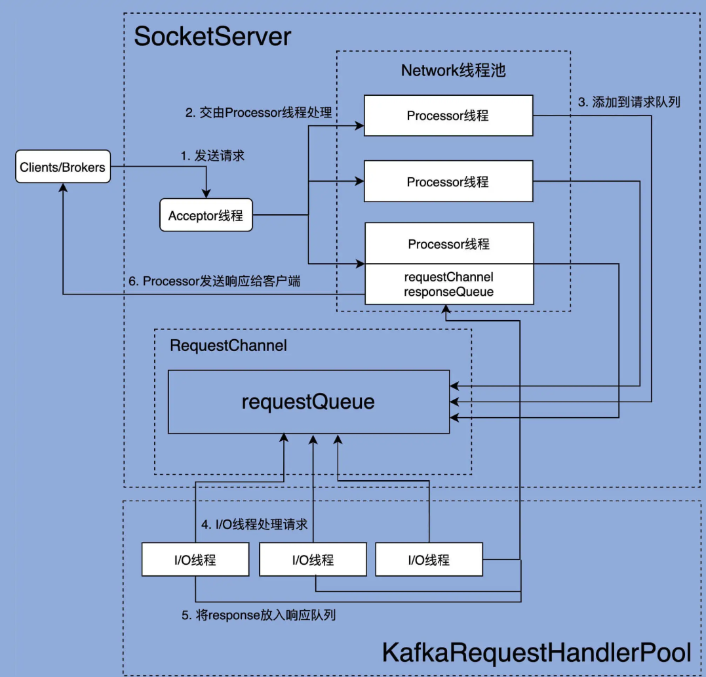
</p>

KafkaServer.startup()初始化各个组件, 包括kafkaController，groupCoordinator等,初始化和请求处理模块使用SocketServer.startup

和请求处理模块相关的如下：
```Scala
socketServer = new SocketServer(config, metrics, time, credentialProvider, apiVersionManager)
// 开始连接和处理线程
socketServer.startup(startProcessingRequests = false)
```

startup函数创建了接受连接的Acceptor和处理读写的Processor，endpoints是ip+port，每一个都会新建一个Acceptor和多个处理Processor(num.network.threads)
```Scala
// SocketServer.scala
private val dataPlaneProcessors = new ConcurrentHashMap[Int, Processor]()
private[network] val dataPlaneAcceptors = new ConcurrentHashMap[EndPoint, Acceptor]()
val dataPlaneRequestChannel = new RequestChannel(maxQueuedRequests, DataPlaneMetricPrefix, time, apiVersionManager.newRequestMetrics)

def startup(startProcessingRequests: Boolean = true,
            controlPlaneListener: Option[EndPoint] = config.controlPlaneListener,
            dataPlaneListeners: Seq[EndPoint] = config.dataPlaneListeners): Unit = {
  this.synchronized {
    createControlPlaneAcceptorAndProcessor(controlPlaneListener)
    createDataPlaneAcceptorsAndProcessors(config.numNetworkThreads, dataPlaneListeners)
    if (startProcessingRequests) {
      this.startProcessingRequests()
    }
  }
}

// endpoints是ip+port，每一个都会新建一个Acceptor
private def createDataPlaneAcceptorsAndProcessors(dataProcessorsPerListener: Int,
                                                  endpoints: Seq[EndPoint]): Unit = {
   endpoints.foreach { endpoint =>
      connectionQuotas.addListener(config, endpoint.listenerName)
      val dataPlaneAcceptor = createAcceptor(endpoint, DataPlaneMetricPrefix)
      
      // 处理Processor
      addDataPlaneProcessors(dataPlaneAcceptor, endpoint, dataProcessorsPerListener)
      dataPlaneAcceptors.put(endpoint, dataPlaneAcceptor)
      info(s"Created data-plane acceptor and processors for endpoint : ${endpoint.listenerName}")
   }
}
```

Processor类主要的结构有newConnections，用于保存的是要创建的新连接信息；responseQueue

处理的流程就是dataPlaneAcceptor处理完连接之后，会选择一个Processor

Acceptor.run();和通常的NIO相似，注册OP_ACCEPT事件，不断循环
```Scala
def run(): Unit = {
 serverChannel.register(nioSelector, SelectionKey.OP_ACCEPT)
 // 等待Acceptor线程启动完成
 startupComplete()
 try {
   while (isRunning) {
     try {
       acceptNewConnections()
       closeThrottledConnections()
     }
     catch {
     }
   }
 } finally {
 }
}
```

acceptNewConnections;轮询选择和Acceptor关联的processor，然后把SocketChannel放入到processor的newConnections就结束了
```Scala
  private def acceptNewConnections(): Unit = {
    // 每500毫秒获取一次就绪I/O事件
    val ready = nioSelector.select(500)
    if (ready > 0) {
      val keys = nioSelector.selectedKeys()
      val iter = keys.iterator()
      while (iter.hasNext && isRunning) {
        try {
          val key = iter.next
          iter.remove()

          if (key.isAcceptable) {
            // 调用accept方法创建Socket连接
            accept(key).foreach { socketChannel =>
              var retriesLeft = synchronized(processors.length)
              var processor: Processor = null
              do {
                retriesLeft -= 1
                processor = synchronized {
                  // 指定由哪个Processor线程进行处理
                  currentProcessorIndex = currentProcessorIndex % processors.length
                  processors(currentProcessorIndex)
                }
                // 更新Processor线程序号
                currentProcessorIndex += 1
              } while (!assignNewConnection(socketChannel, processor, retriesLeft == 0))
            }
          } else
            throw new IllegalStateException("Unrecognized key state for acceptor thread.")
        } catch {
        }
      }
    }
  }
```

同时，processor也在循环拿newConnections的SocketChannel注册OP_READ
```Scala
override def run(): Unit = {
 startupComplete() // 等待Processor线程启动完成
 try {
   while (isRunning) {
     try {
       // setup any new connections that have been queued up
       configureNewConnections() // 创建新连接
       // register any new responses for writing
       processNewResponses() // 发送Response，并将Response放入到inflightResponses临时队列
       processCompletedReceives() // 将接收到的Request放入Request队列
       processCompletedSends() // 为临时Response队列中的Response执行回调逻辑
       processDisconnected() // 处理因发送失败而导致的连接断开
       closeExcessConnections() // 关闭超过配额限制部分的连接
     } catch {
     }
   }
 } finally {
 }
}
```

configureNewConnections
```Scala
  private def configureNewConnections(): Unit = {
    var connectionsProcessed = 0 // 当前已配置的连接数计数器
   // 如果没超配额并且有待处理新连接
    while (connectionsProcessed < connectionQueueSize && !newConnections.isEmpty) { 
      val channel = newConnections.poll() // 从连接队列中取出SocketChannel
      try {
        // 用给定Selector注册该Channel
        // 底层就是调用Java NIO的SocketChannel.register(selector, SelectionKey.OP_READ)
        selector.register(connectionId(channel.socket), channel)
        connectionsProcessed += 1 // 更新计数器
      } catch {
      }
    }
  }
```

以上流程可以总结为：

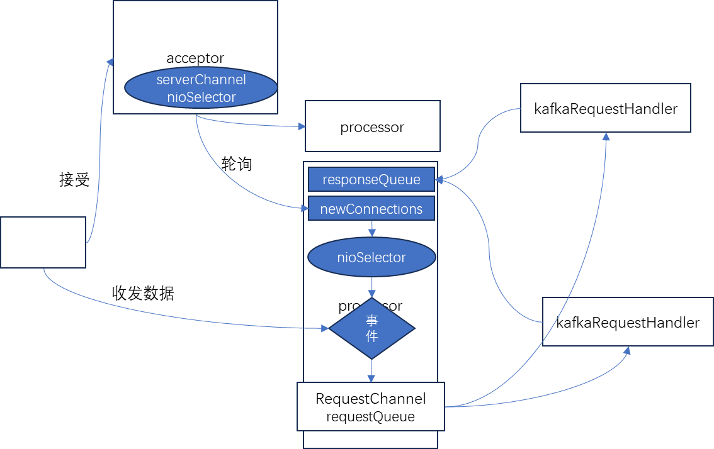

processCompletedReceives处理接收到的读写消息，正常情况下将会把receive转换成req对象，然后requestChannel将Request添加到Request队列requestQueue
```Scala
  // Processor从底层Socket 通道不断读取已接收到的网络请求，然后转换成Request实例，并将其放入到Request队列
  private def processCompletedReceives(): Unit = {
    // 遍历所有已接收的Request
    selector.completedReceives.forEach { receive =>
      try {
        // 保证对应连接通道已经建立
        openOrClosingChannel(receive.source) match {
          case Some(channel) =>
            val header = parseRequestHeader(receive.payload)
            if (header.apiKey == ApiKeys.SASL_HANDSHAKE && channel.maybeBeginServerReauthentication(receive,
              () => time.nanoseconds()))
              trace(s"Begin re-authentication: $channel")
            else {
              val nowNanos = time.nanoseconds()
              // 如果认证会话已过期，则关闭连接
              if (channel.serverAuthenticationSessionExpired(nowNanos)) {
           
              } else {
                val connectionId = receive.source
                val context = new RequestContext(header, connectionId, channel.socketAddress,
                  channel.principal, listenerName, securityProtocol,
                  channel.channelMetadataRegistry.clientInformation, isPrivilegedListener, channel.principalSerde)

                val req = new RequestChannel.Request(processor = id, context = context,
                  startTimeNanos = nowNanos, memoryPool, receive.payload, requestChannel.metrics, None)
                 
                if (header.apiKey == ApiKeys.API_VERSIONS) {
                  val apiVersionsRequest = req.body[ApiVersionsRequest]
                  if (apiVersionsRequest.isValid) {
                    channel.channelMetadataRegistry.registerClientInformation(new ClientInformation(
                      apiVersionsRequest.data.clientSoftwareName,
                      apiVersionsRequest.data.clientSoftwareVersion))
                  }
                }
                // 核心代码：将Request添加到Request队列
                requestChannel.sendRequest(req)
                selector.mute(connectionId)
                handleChannelMuteEvent(connectionId, ChannelMuteEvent.REQUEST_RECEIVED)
              }
            }
          case None =>
            // This should never happen since completed receives are processed immediately after `poll()`
            throw new IllegalStateException(s"Channel ${receive.source} removed from selector before processing completed receive")
        }
      } catch {
      }
    }
    selector.clearCompletedReceives()
  }
```

dataPlaneRequestChannel是传输Request/Response的**通道**, 作为参数传入到processor里面
```Scala
val dataPlaneRequestChannel = new RequestChannel(maxQueuedRequests, DataPlaneMetricPrefix, time, apiVersionManager.newRequestMetrics)

val processor = newProcessor(nextProcessorId, dataPlaneRequestChannel, connectionQuotas,
   listenerName, securityProtocol, memoryPool, isPrivilegedListener)
```

同时它作为参数传入到处理工作线程池里面
```Scala
/* start processing requests */
dataPlaneRequestProcessor = new KafkaApis(socketServer.dataPlaneRequestChannel, zkSupport, replicaManager, groupCoordinator, transactionCoordinator,
    autoTopicCreationManager, config.brokerId, config, configRepository, metadataCache, metrics, authorizer, quotaManagers,
    fetchManager, brokerTopicStats, clusterId, time, tokenManager, apiVersionManager)

// 处理线程池
dataPlaneRequestHandlerPool = new KafkaRequestHandlerPool(config.brokerId, socketServer.dataPlaneRequestChannel, dataPlaneRequestProcessor, time,
    config.numIoThreads, s"${SocketServer.DataPlaneMetricPrefix}RequestHandlerAvgIdlePercent", SocketServer.DataPlaneThreadPrefix)
```

所以工作线程启动的时候是去拿dataPlaneRequestChannel的数据, 然后调用KafkaApis.handle
```Scala
 def run(): Unit = {
    while (!stopped) {
      val req = requestChannel.receiveRequest(300)
      req match {
        case RequestChannel.ShutdownRequest =>
          completeShutdown()
          return
        case request: RequestChannel.Request =>
          try {
            request.requestDequeueTimeNanos = endTime
            apis.handle(request, requestLocal)
          } catch {
          }
        case null => // continue
      }
    }
    completeShutdown()
  }
```

```Scala
  override def handle(request: RequestChannel.Request, requestLocal: RequestLocal): Unit = {
  try {
    trace(s"Handling request:${request.requestDesc(true)} from connection ${request.context.connectionId};" +
      s"securityProtocol:${request.context.securityProtocol},principal:${request.context.principal}")

    if (!apiVersionManager.isApiEnabled(request.header.apiKey)) {
      // The socket server will reject APIs which are not exposed in this scope and close the connection
      // before handing them to the request handler, so this path should not be exercised in practice
      throw new IllegalStateException(s"API ${request.header.apiKey} is not enabled")
    }

    request.header.apiKey match {
      case ApiKeys.PRODUCE => handleProduceRequest(request, requestLocal)
      case ApiKeys.FETCH => handleFetchRequest(request)
      case ApiKeys.LIST_OFFSETS => handleListOffsetRequest(request)
      case ApiKeys.METADATA => handleTopicMetadataRequest(request)
      case ApiKeys.LEADER_AND_ISR => handleLeaderAndIsrRequest(request)
      case ApiKeys.STOP_REPLICA => handleStopReplicaRequest(request)
    }
  }
}
```

由于req是包含了processor和RequestContext等信息，所以结束处理的时候，可以对应发送到RequestChannel.Response,再有processor的processNewResponses发送

上述就回答了一个问题：服务端如何管理这么多的连接，完成请求和响应的正确匹配

第二个问题：生产者会在Socket中按顺序把消息发送，工作线程是多线程会乱序处理，如何保证顺序的？

processCompletedReceives的selector.mute(connectionId)

mute: 把read的长注册改成读一次之后，就把read事件取消注册

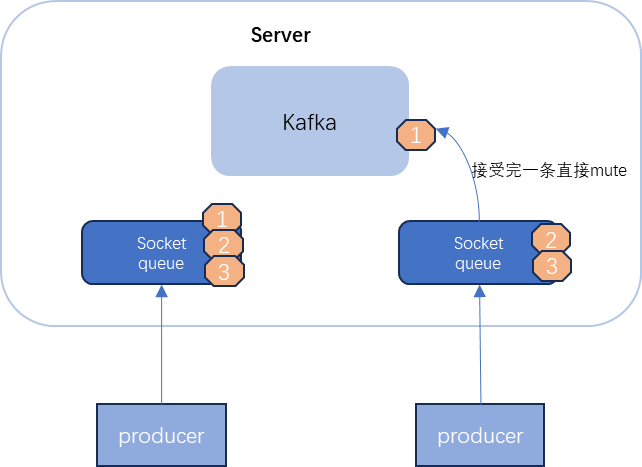

producer通过协商，将message发送到server侧的socket queue, 如果没有mute的情况，会将消息全部接受，不能保证有序性

第三个问题：请求是如何区分优先级？

Kafka请求类型划分为两大类：数据类请求和控制类请求。Data plane和Control plane的字面意思是数据面和控制面，各自对应数据类请求和控制类请求，也就是说Data plane负责处理数据类请求，Control plane负责处理控制类请求

Controller与Broker交互的请求类型有3种：LeaderAndIsrRequest、StopReplicaRequest和UpdateMetadataRequest。这3类请求属于控制类请求，通常应该被赋予高优先级。PRODUCE和FETCH请求，就是典型的数据类请求

```Scala
// control-plane 
// 用于处理控制类请求的Processor线程 
// 注意：目前定义了专属的Processor线程而非线程池处理控制类请求 
private var controlPlaneProcessorOpt : Option[Processor] = None 
private[network] var controlPlaneAcceptorOpt : Option[Acceptor] = None
// 处理控制类请求专属的RequestChannel对象 
val controlPlaneRequestChannelOpt: Option[RequestChannel] = config.controlPlaneListenerName
        .map(_ => new RequestChannel(20, ControlPlaneMetricPrefix))
```

Control plan的Processor线程就只有1个，Acceptor线程也是1个。另外，对应的RequestChannel的请求队列长度被硬编码成了20，而不是一个可配置的值。
*即控制类请求的数量应该远远小于数据类请求，因而不需要为它创建线程池和较深的请求队列。*

**所以**社区定义了多套监听器以及底层处理线程的方式来区分这两大类请求。在实际应用中，由于数据类请求的数量要远多于控制类请求，
因此，为控制类请求单独定义处理资源的做法，实际上就等同于拔高了控制类请求的优先处理权。间接实现了优先级的区别对待

### 3.3 Controller

Controller在ZooKeeper的帮助下管理和协调整个Kafka

1. 选举控制器的规则

   第一个成功创建/controller节点的Broker会被指定为控制器

2. 控制器是做什么？
    - 主题管理（创建、删除、增加分区）
    - 分区重分配
    - Preferred 领导者选举
    - 集群成员管理（新增Broker、Broker主动关闭、Broker宕机）
    - 数据服务：控制器上保存了最全的集群元数据信息，其他所有Broker会定期接收控制器发来的元数据更新请求，从而更新其内存中的缓存数据

   **数据控制：** ZooKeeper是整个Kafka集群元数据的“真理之源（Source of Truth）”，那么，Controller承载了ZooKeeper上的所有元数据。
   事实上，集群Broker是不会与ZooKeeper直接交互去获取元数据的。相反地，它们总是与Controller进行通信，获取和更新最新的集群数据

3. 控制器故障转移（Failover）
   当运行中的控制器突然宕机或意外终止时，Kafka能够快速地感知到，并立即启用备用控制器来代替之前失败的控制器

   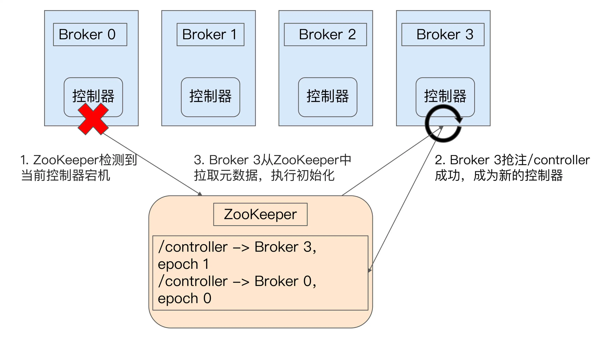
   
   Broker 0是控制器。当Broker 0宕机后，ZooKeeper通过Watch机制感知到并删除了/controller临时节点，然后进行重新选举

4. 元数据的处理方式

**从下面3个方面来看Controller相关功能的源码实现:**
1. Controller的初始化和选举，其中包括了如何处理事件event
2. ControllerChannelManager：维护Controller到所有Broker的Socket连接、把请求批量发出去、把响应收回来，属于**通信层**
3. kafka新建topic的时候，controller是如何操作的，包括了MetaData,ReplicaStateMachine和PartitionStateMachine

Controller是在KafkaServer.scala#startup中初始化并且启动的

```Scala
/* start kafka controller */
kafkaController = new KafkaController(config, zkClient, time, metrics,
  brokerInfo, brokerEpoch, tokenManager, brokerFeatures, featureCache, threadNamePrefix)
kafkaController.startup()
```

Controller单线程事件队列处理模型及其基础组件以下几个类：

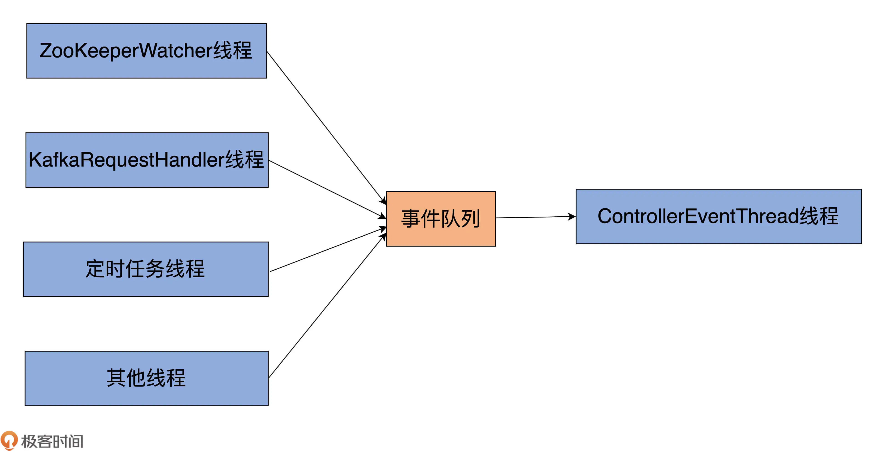

- ControllerEventProcessor：Controller端的事件处理器接口。
- ControllerEvent：Controller事件，也就是事件队列中被处理的对象。
- ControllerEventManager：事件处理器，用于创建和管理ControllerEventThread。
- ControllerEventThread：专属的事件处理线程，唯一的作用是处理不同种类的ControllEvent。这个类是ControllerEventManager类内部定义的线程类

kafkaController的startup会注册ZooKeeper状态变更监听器，以及放入一个Startp事件

Startp事件的定义
```Scala
sealed trait ControllerEvent {
  def state: ControllerState
  // preempt() is not executed by `ControllerEventThread` but by the main thread.
  def preempt(): Unit
}

case object Startup extends ControllerEvent {
  override def state: ControllerState = ControllerState.ControllerChange
  override def preempt(): Unit = {}
}

```

```Scala
// KafkaController.scala
private[controller] val eventManager = new ControllerEventManager(config.brokerId, this, time,
  controllerContext.stats.rateAndTimeMetrics)
def startup() = {
  // 第1步：注册ZooKeeper状态变更监听器，它是用于监听Zookeeper会话过期的
  zkClient.registerStateChangeHandler(new StateChangeHandler {
    override val name: String = StateChangeHandlers.ControllerHandler

    override def afterInitializingSession(): Unit = {
      eventManager.put(RegisterBrokerAndReelect)
    }

    override def beforeInitializingSession(): Unit = {
      val queuedEvent = eventManager.clearAndPut(Expire)
      queuedEvent.awaitProcessing()
    }
  })

  // 第2步：写入Startup事件到事件队列
  eventManager.put(Startup)

  // 第3步：启动ControllerEventThread线程，开始处理事件队列中的ControllerEvent
  eventManager.start()
}
```

ControllerEventThread启动之后会从ControllerEventManager里面的queue拉取事件，然后执行相关流程
```Scala
  class ControllerEventThread(name: String) extends ShutdownableThread() {
  logIdent = s"[ControllerEventThread controllerId=$controllerId] "

  override def doWork(): Unit = {
    val dequeued = pollFromEventQueue()
    dequeued.event match {
      case ShutdownEventThread => 
      case controllerEvent =>
        _state = controllerEvent.state
        try {
          // 执行定义的event事件
          def process(): Unit = dequeued.process(processor)

          rateAndTimeMetrics.get(state) match {
            case Some(timer) => timer.time { process() }
            case None => process()
          }
        } catch {
        }

        _state = ControllerState.Idle
    }
  }
}
```

大致流程如下，这张图对应源码的版本比较老，新的3.x版本中event事件的process在ControllerEventProcessor中，即它的子类KafkaController匹配的

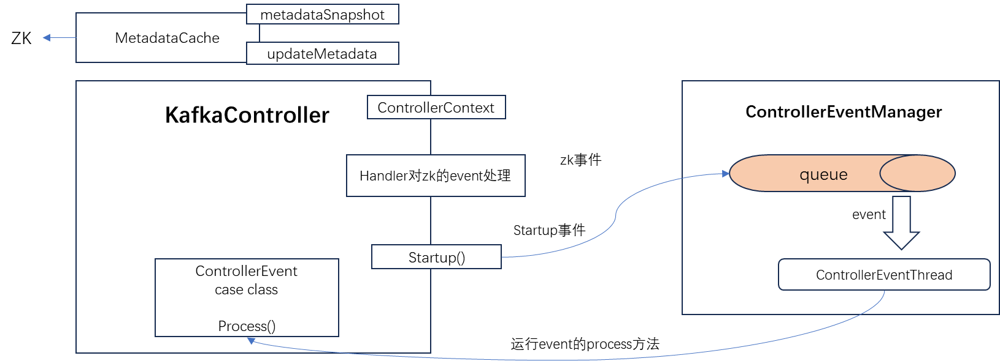

Startup匹配到了processStartup(),zk注册带了controllerChangeHandler，也就是说，响应回来就会调用controllerChangeHandler
```Scala
  private def processStartup(): Unit = {
    zkClient.registerZNodeChangeHandlerAndCheckExistence(controllerChangeHandler)
    elect()
  }
```

上面分为两个步骤，
```Scala
    zkClient.registerZNodeChangeHandlerAndCheckExistence(controllerChangeHandler)
```
1. watch controllerChangeHandler定义的path，/controller
2. 一旦发现变化，则根据类型匹配下面的Creation，Deletion，DataChange
```Scala
class ControllerChangeHandler(eventManager: ControllerEventManager) extends ZNodeChangeHandler {
  override val path: String = ControllerZNode.path

  override def handleCreation(): Unit = eventManager.put(ControllerChange)

  override def handleDeletion(): Unit = eventManager.put(Reelect)

  override def handleDataChange(): Unit = eventManager.put(ControllerChange)
}
```

Creation，Deletion，DataChange分别是什么时机触发的？分别会有什么行为？


elect是选主的具体流程：
```Scala
private def elect(): Unit = {
   // 1. 看zk有没有ControllerId
 activeControllerId = zkClient.getControllerId.getOrElse(-1)

 if (activeControllerId != -1) {
   debug(s"Broker $activeControllerId has been elected as the controller, so stopping the election process.")
   return
 }

 try {
    // 这边的处理会比较奇怪，没有注册成功则直接抛异常了
   val (epoch, epochZkVersion) = zkClient.registerControllerAndIncrementControllerEpoch(config.brokerId)
   controllerContext.epoch = epoch
   controllerContext.epochZkVersion = epochZkVersion
   activeControllerId = config.brokerId

   info(s"${config.brokerId} successfully elected as the controller. Epoch incremented to ${controllerContext.epoch} " +
     s"and epoch zk version is now ${controllerContext.epochZkVersion}")

    // 只有成功注册到的controller节点才会走到这一步
   onControllerFailover()
 } catch {
   case e: ControllerMovedException =>
     maybeResign()

     if (activeControllerId != -1)
       debug(s"Broker $activeControllerId was elected as controller instead of broker ${config.brokerId}", e)
     else
       warn("A controller has been elected but just resigned, this will result in another round of election", e)
   case t: Throwable =>
     error(s"Error while electing or becoming controller on broker ${config.brokerId}. " +
       s"Trigger controller movement immediately", t)
     triggerControllerMove()
 }
}
```

只有成功注册到的controller节点才会走到这一步
```Scala
  private def onControllerFailover(): Unit = {
  maybeSetupFeatureVersioning()

  info("Registering handlers")

  // 注册the listeners to get broker/topic callbacks
  val childChangeHandlers = Seq(brokerChangeHandler, topicChangeHandler, topicDeletionHandler, logDirEventNotificationHandler,
    isrChangeNotificationHandler)
  childChangeHandlers.foreach(zkClient.registerZNodeChildChangeHandler)

  val nodeChangeHandlers = Seq(preferredReplicaElectionHandler, partitionReassignmentHandler)
  nodeChangeHandlers.foreach(zkClient.registerZNodeChangeHandlerAndCheckExistence)

  // 重要
  initializeControllerContext()

  topicDeletionManager.init(topicsToBeDeleted, topicsIneligibleForDeletion)

  // We need to send UpdateMetadataRequest after the controller context is initialized and before the state machines
  // are started. The is because brokers need to receive the list of live brokers from UpdateMetadataRequest before
  // they can process the LeaderAndIsrRequests that are generated by replicaStateMachine.startup() and
  // partitionStateMachine.startup().
  info("Sending update metadata request")
  sendUpdateMetadataRequest(controllerContext.liveOrShuttingDownBrokerIds.toSeq, Set.empty)

  replicaStateMachine.startup()
  partitionStateMachine.startup()

  info(s"Ready to serve as the new controller with epoch $epoch")

  initializePartitionReassignments()
  topicDeletionManager.tryTopicDeletion()
  val pendingPreferredReplicaElections = fetchPendingPreferredReplicaElections()
  onReplicaElection(pendingPreferredReplicaElections, ElectionType.PREFERRED, ZkTriggered)
  info("Starting the controller scheduler")
  kafkaScheduler.startup()
}
```


比较主要的几个参数
```Scala
// 维护Controller到所有Broker的网络
var controllerChannelManager = new ControllerChannelManager(controllerContext, config, time, metrics,
   stateChangeLogger, threadNamePrefix)

// 用于管理事件处理线程和事件队列
private[controller] val eventManager = new ControllerEventManager(config.brokerId, this, time,
   controllerContext.stats.rateAndTimeMetrics)

// 用于zk事件的处理
private val controllerChangeHandler = new ControllerChangeHandler(eventManager)

// 三个状态机
val replicaStateMachine: ReplicaStateMachine = new ZkReplicaStateMachine(config, stateChangeLogger, controllerContext, zkClient,
   new ControllerBrokerRequestBatch(config, controllerChannelManager, eventManager, controllerContext, stateChangeLogger))
val partitionStateMachine: PartitionStateMachine = new ZkPartitionStateMachine(config, stateChangeLogger, controllerContext, zkClient,
   new ControllerBrokerRequestBatch(config, controllerChannelManager, eventManager, controllerContext, stateChangeLogger))
val topicDeletionManager = new TopicDeletionManager(config, controllerContext, replicaStateMachine,
   partitionStateMachine, new ControllerDeletionClient(this, zkClient))

// Returns true if this broker is the current controller.
def isActive: Boolean = activeControllerId == config.brokerId
```


**broker如何确定自己是不是controller**


Controller承载了ZooKeeper上的所有元数据，所以先看zk的初始化

初始化zk，并且创建目录
```Scala
initZkClient(time)

private def initZkClient(time: Time): Unit = {
   // ..............
   // 创建zk目录
   _zkClient.createTopLevelPaths()

   // These are persistent ZK paths that should exist on kafka broker startup.
   val PersistentZkPaths = Seq(
      ConsumerPathZNode.path, // old consumer path
      BrokerIdsZNode.path,
      TopicsZNode.path,
      ConfigEntityChangeNotificationZNode.path,
      DeleteTopicsZNode.path,
      BrokerSequenceIdZNode.path,
      IsrChangeNotificationZNode.path,
      ProducerIdBlockZNode.path,
      LogDirEventNotificationZNode.path
   ) ++ ConfigType.all.map(ConfigEntityTypeZNode.path)
}
```

checkedEphemeralCreate创建临时节点
```Scala
val brokerInfo = createBrokerInfo
val brokerEpoch = zkClient.registerBroker(brokerInfo)

def registerBroker(brokerInfo: BrokerInfo): Long = {
   val path = brokerInfo.path
   val stat = checkedEphemeralCreate(path, brokerInfo.toJsonBytes)
   info(s"Registered broker ${brokerInfo.broker.id} at path $path with addresses: " +
           s"${brokerInfo.broker.endPoints.map(_.connectionString).mkString(",")}, czxid (broker epoch): ${stat.getCzxid}")
   stat.getCzxid
}
```

临时节点的作用：如ZooKeeper中/controller节点
```Text
{"version":1,"brokerid":0,"timestamp":"1585098432431"}
cZxid = 0x1a
ctime = Wed Mar 25 09:07:12 CST 2020
mZxid = 0x1a
mtime = Wed Mar 25 09:07:12 CST 2020
pZxid = 0x1a
cversion = 0
dataVersion = 0
aclVersion = 0
ephemeralOwner = 0x100002d3a1f0000
dataLength = 54
numChildren = 0
```
一旦 Broker 与 ZooKeeper 的会话终止，该节点就会消失
- Controller Broker Id是0，表示序号为0的Broker是集群Controller
- ephemeralOwner字段不是 0x0，说明这是一个临时节点

一旦Broker与ZooKeeper的会话终止，该节点就会消失，产生**event事件**

<p>
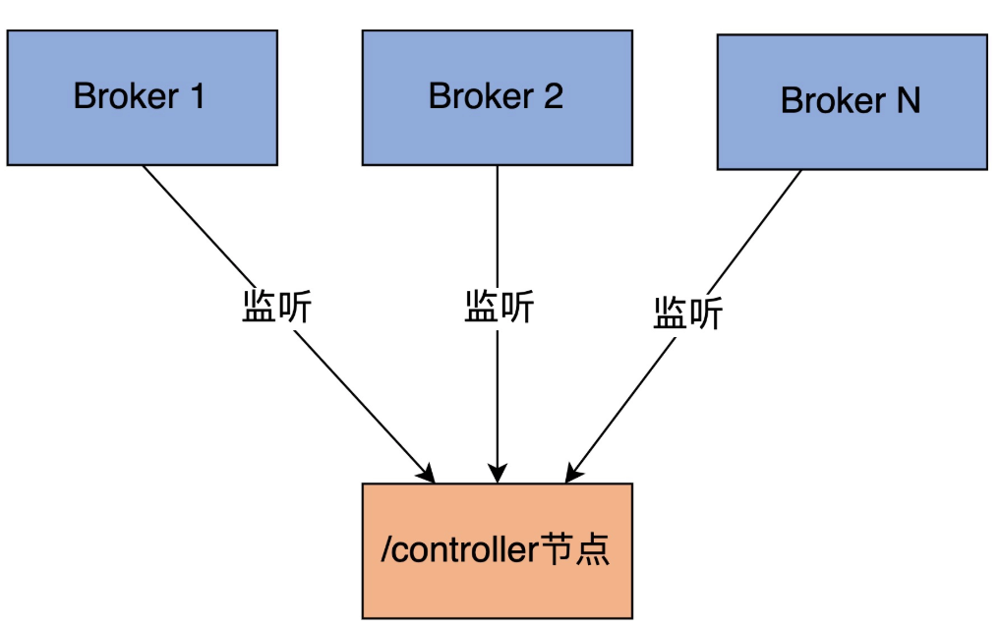
</p>


- **创建新的topic之后，controller是如何处理的?**

controller选举成功之后，会在onControllerFailover中注册topicChangeHandler，当zk的topic注册的时候，处理此Handler

```Scala
class TopicChangeHandler(eventManager: ControllerEventManager) extends ZNodeChildChangeHandler {
  override val path: String = TopicsZNode.path

  override def handleChildChange(): Unit = eventManager.put(TopicChange)
}
```

对应的代码如下：
```Scala
 private def processTopicChange(): Unit = {
    if (!isActive) return
    val topics = zkClient.getAllTopicsInCluster(true)
    // zk的topic为准，而controllerContext是kafka集群的缓存
    val newTopics = topics -- controllerContext.allTopics
    val deletedTopics = controllerContext.allTopics.diff(topics)
    controllerContext.setAllTopics(topics)

    // 注册了新的topic的回调，被删除会继续感知
    registerPartitionModificationsHandlers(newTopics.toSeq)
    val addedPartitionReplicaAssignment = zkClient.getReplicaAssignmentAndTopicIdForTopics(newTopics)
    deletedTopics.foreach(controllerContext.removeTopic)
    processTopicIds(addedPartitionReplicaAssignment)

    addedPartitionReplicaAssignment.foreach { case TopicIdReplicaAssignment(_, _, newAssignments) =>
      newAssignments.foreach { case (topicAndPartition, newReplicaAssignment) =>
        controllerContext.updatePartitionFullReplicaAssignment(topicAndPartition, newReplicaAssignment)
      }
    }
    info(s"New topics: [$newTopics], deleted topics: [$deletedTopics], new partition replica assignment " +
      s"[$addedPartitionReplicaAssignment]")
    if (addedPartitionReplicaAssignment.nonEmpty) {
      val partitionAssignments = addedPartitionReplicaAssignment
        .map { case TopicIdReplicaAssignment(_, _, partitionsReplicas) => partitionsReplicas.keySet }
        .reduce((s1, s2) => s1.union(s2))
      onNewPartitionCreation(partitionAssignments)
    }
  }
```


### 3.4 副本管理模块


## 延时操作模块

因未满足条件而暂时无法被处理的Kafka请求

举个例子，配置了acks=all的生产者发送的请求可能一时无法完成，因为Kafka必须确保ISR中的所有副本都要成功响应这次写入。因此，通常情况下，这些请求没法被立即处理。只有满足了条件或发生了超时，Kafka才会把该请求标记为完成状态

### 怎么实现延时请求呢？

#### 1. 为什么不用Java的DelayQueue

DelayQueue有一个弊端：它插入和删除队列元素的时间复杂度是O(logN)。对于Kafka这种非常容易积攒几十万个延时请求的场景来说，该数据结构的性能是瓶颈

```Java
public class DelayQueue<E extends Delayed> extends AbstractQueue<E>
    implements BlockingQueue<E> {

    private final transient ReentrantLock lock = new ReentrantLock();
    private final PriorityQueue<E> q = new PriorityQueue<E>();

    /**
     * Thread designated to wait for the element at the head of
     * the queue.  This variant of the Leader-Follower pattern
     * (http://www.cs.wustl.edu/~schmidt/POSA/POSA2/) serves to
     * minimize unnecessary timed waiting.  When a thread becomes
     * the leader, it waits only for the next delay to elapse, but
     * other threads await indefinitely.  The leader thread must
     * signal some other thread before returning from take() or
     * poll(...), unless some other thread becomes leader in the
     * interim.  Whenever the head of the queue is replaced with
     * an element with an earlier expiration time, the leader
     * field is invalidated by being reset to null, and some
     * waiting thread, but not necessarily the current leader, is
     * signalled.  So waiting threads must be prepared to acquire
     * and lose leadership while waiting.
     */
    private Thread leader;

    /**
     * Condition signalled when a newer element becomes available
     * at the head of the queue or a new thread may need to
     * become leader.
     */
    private final Condition available = lock.newCondition();

}
```

这边说用了Leader-Follower
pattern，刚开始没看懂，[stackoverflow](https://stackoverflow.com/questions/48493830/what-exactly-is-the-leader-used-for-in-delayqueue)
说的比较清楚。
Leader的用处主要是minimize unnecessary timed
waiting，其实是多个线程不必要的唤醒和睡眠。如果让所有线程都available.awaitNanos(delay)
进入take方法，它们将同时被调用，但只有一个可以真正从队列中获取元素，其他线程将再次陷入休眠，这是不必要的且浪费资源。

采用Leader-Follower模式，Leader available.awaitNanos(delay)、Follower available.await()
。因此Leader将首先醒来并检索过期的元素，然后在必要时向另一个等待线程发出信号。这样效率更高

主要的实现是take和offer方法

```Java
public boolean offer(E e) {
     final ReentrantLock lock = this.lock;
     lock.lock();
     try {
         q.offer(e); // q保存的是Delayed类型的数据，根据Comparable比较的小根堆
         if (q.peek() == e) { // 如果插入的元素在堆顶，唤醒其他可能在等待的线程
             leader = null;
             available.signal();
         }
         return true;
     } finally {
         lock.unlock();
     }
 }
```

take方法的实现
```Java
 public E take() throws InterruptedException {
     final ReentrantLock lock = this.lock;
     lock.lockInterruptibly();
     try {
         for (;;) {
             E first = q.peek();
             if (first == null)
                 available.await();
             else {
                 long delay = first.getDelay(NANOSECONDS);
                 if (delay <= 0L)
                     return q.poll();
                 first = null; // don't retain ref while waiting
                 if (leader != null) // leader在则等leader线程先获取，等待唤醒
                     available.await();
                 else {
                     Thread thisThread = Thread.currentThread();
                     leader = thisThread;
                     try {
                         available.awaitNanos(delay); // leader拿到的堆顶的元素，等待delay时间
                     } finally {
                         if (leader == thisThread)
                             leader = null;
                     }
                 }
             }
         }
     } finally {
         if (leader == null && q.peek() != null)
             available.signal();
         lock.unlock();
     }
 }
```

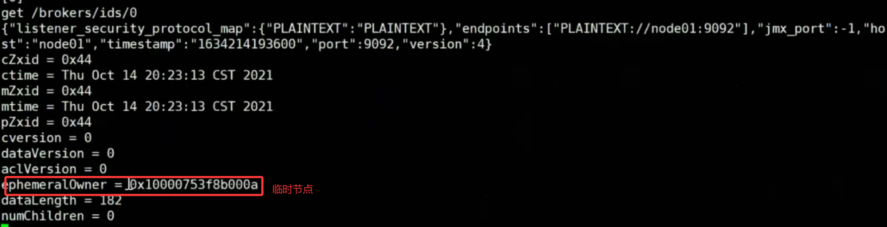

基于这种临时节点的机制，Controller 定义了 BrokerChangeHandler 监听器，专门负责监听 /brokers/ids 下的子节点数量变化。
一旦发现新增或删除 Broker，/brokers/ids 下的子节点数目一定会发生变化。这会被 Controller 侦测到，进而触发 BrokerChangeHandler 的处理方法，即 handleChildChange 方法。


config.brokerId：静态的配置文件

/**
* Returns true if this broker is the current controller.
  */
def isActive: Boolean = activeControllerId == config.brokerId

broker咋确定自己是不是Controller，成为Controller的成本


```Scala
  def registerZNodeChangeHandlerAndCheckExistence(zNodeChangeHandler: ZNodeChangeHandler): Boolean = {
    zooKeeperClient.registerZNodeChangeHandler(zNodeChangeHandler)
    val existsResponse = retryRequestUntilConnected(ExistsRequest(zNodeChangeHandler.path))
    existsResponse.resultCode match {
      case Code.OK => true
      case Code.NONODE => false
      case _ => throw existsResponse.resultException.get
    }
  }
```

```Text
 case Startup => processStartup()
```

```Scala
  private def processStartup(): Unit = {
    zkClient.registerZNodeChangeHandlerAndCheckExistence(controllerChangeHandler)
    elect()
  }  
  
  private def elect(): Unit = {
  // 1. 看数据能不能取回
    activeControllerId = zkClient.getControllerId.getOrElse(-1)
    /*
     * We can get here during the initial startup and the handleDeleted ZK callback. Because of the potential race condition,
     * it's possible that the controller has already been elected when we get here. This check will prevent the following
     * createEphemeralPath method from getting into an infinite loop if this broker is already the controller.
     */
    if (activeControllerId != -1) {
      debug(s"Broker $activeControllerId has been elected as the controller, so stopping the election process.")
      return
    }

    try {
      // 这边抛异常
      val (epoch, epochZkVersion) = zkClient.registerControllerAndIncrementControllerEpoch(config.brokerId)
      
      // 只有controller才会走下面的逻辑
      controllerContext.epoch = epoch
      controllerContext.epochZkVersion = epochZkVersion
      // 2. 临时设置自己为Controller
      activeControllerId = config.brokerId

      info(s"${config.brokerId} successfully elected as the controller. Epoch incremented to ${controllerContext.epoch} " +
        s"and epoch zk version is now ${controllerContext.epochZkVersion}")

      onControllerFailover()
    } catch {
      case e: ControllerMovedException =>
        maybeResign()

        if (activeControllerId != -1)
          debug(s"Broker $activeControllerId was elected as controller instead of broker ${config.brokerId}", e)
        else
          warn("A controller has been elected but just resigned, this will result in another round of election", e)
      case t: Throwable =>
        error(s"Error while electing or becoming controller on broker ${config.brokerId}. " +
          s"Trigger controller movement immediately", t)
        triggerControllerMove()
    }
  }
  
```

MetadataCache

## 3.5 Consumer

- coordinator
- kafka是如何分配GroupConndinator， 如果GroupConndinator承载的broker挂了，咋么办
- 需要leader来分配分区
- 分配策略*
- offset是如何持久化的
- 消费的时候，同步，异步，性能优化(IOthreads-workerthread)的如何做的

为什么不能让多个consumer去消费一个partition，是因为要保证**数据的有序**

## 3.6 日志模块

数据库在内部使用了一个仅追加（append-only）的数据文件。有很多的情况需要考虑，如并发控制，回收磁盘空间以避免日志无限增长，处理错误与部分写入的记录为了高效查找数据库中特定键的值，我们需要**索引**

### 3.6.1 哈希索引

保留一个内存中的哈希映射，其中每个键都映射到一个数据文件中的字节偏移量，指明了可以找到对应值的位置，当将新的键值对追加写入文件中时，还要更新散列映射，以反映刚刚写入的数据的偏移量。
查找一个值时，使用哈希映射来查找数据文件中的偏移量，寻找该位置并读取该值

局限性:
1. 哈希表必须能放进内存
2. 不支持范围查询

#### 工程实践

- 将日志分为特定大小的段

  当日志增长到特定大小时关闭当前段文件，并开始写入一个新的段文件，也可以对这些段进行compaction

- 文件格式
- 删除记录

  如果要删除一个键及其关联的值，则必须在数据文件（有时称为逻辑删除）中附加一个特殊的删除记录。当日志段被合并时，逻辑删除告诉合并过程放弃删除键的任何以前的值

- 崩溃恢复

  如果数据库重新启动，则内存散列映射将丢失。原则上，您可以通过从头到尾读取整个段文件并在每次按键时注意每个键的最近值的偏移量来恢复每个段的哈希映射。如果段文件很大可能需要很长时间

- 部分写入记录

  数据库可能随时崩溃，包括将记录附加到日志中途。校验和，允许检测和忽略日志的这些损坏部分

- 并发控制

  由于写操作是以严格顺序的顺序附加到日志中的，所以常见的实现选择是只有一个写入器线程。数据文件段是附加的，否则是不可变的，所以它们可以被多个线程同时读取

#### 为什么不更新文件，用新值覆盖旧值？

1. 追加和分段合并是顺序写入操作
2. 如果段文件是附加的或不可变的，并发和崩溃恢复就简单多了,不必担心在覆盖值时发生崩溃的情况，而将包含旧值和新值的一部分的文件保留在一起

#### 3.6.2 kafka日志模块

kafka的索引和哈希索引还不太一样，因为不是以key为hash构建的，能够支持范围查找

##### 格式

Kafka中每一个分区副本都对应一个Log，而Log又可以分为多个日志分段

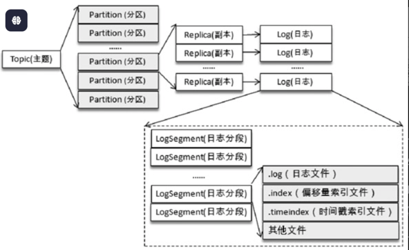

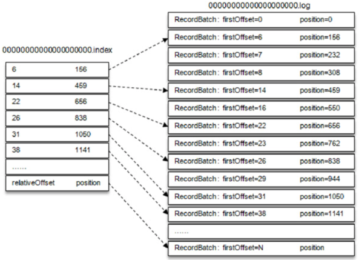

kafka对于日志的注释写的很详细:
```
A segment of the log. Each segment has two components: a log and an index. The log is a FileRecords containing
the actual messages. The index is an OffsetIndex that maps from logical offsets to physical file positions. Each
segment has a base offset which is an offset <= the least offset of any message in this segment and > any offset in
any previous segment.

A segment with a base offset of [base_offset] would be stored in two files, a [base_offset].index and a [base_offset].log file.
```

日志有两个重要的模块：log和index，下面对这两块分别记录下看下它们是如何实现的

## 3.7 事务

> kafka的事务的边界指的是**生产侧**

### 幂等性

在**分区级别**保证了同一PID、同一Epoch下的消息批次严格按序、仅持久化一次，从而兑现幂等承诺。
**这个承诺是只对“已提交”的消息（committed message）**

#### 无消息丢失配置怎么实现？

一句话概括，Kafka只对“已提交”的消息（committed message）做**有限度**的持久化保证

“消息丢失”案例
1. 生产者端
    - 设置acks=all。代表了对“已提交”消息的定义
    - Producer要使用带有回调通知producer.send(msg,callback)的发送API，不要使用producer.send(msg)。一旦出现消息提交失败的情况，可以有针对性地进行处理
    - 设置retries为一个较大的值。当出现网络的瞬时抖动时，消息发送可能会失败，配置了retries>0的Producer能够自动重试消息发送，避免消息丢失
2. 消费者端
    - 维持先消费消息，再更新位移
    - enable.auto.commit=false，手动提交位移
3. broker端
    - 设置replication.factor>= 3，目前防止消息丢失的主要机制就是冗余
    - unclean.leader.election.enable=false。控制哪些Broker有资格竞选分区的Leader。不允许一个Broker落后原先的Leader太多当Leader

但是在一些情况下，可能会导致数据重复，比如：网络请求延迟等导致的重试操作，在发送请求重试时Server端并不知道这条请求是否已经处理（没有记录之前的状态信息），
所以就会有可能导致数据请求的重复发送，这是Kafka自身的机制（异常时请求重试机制）导致的数据重复

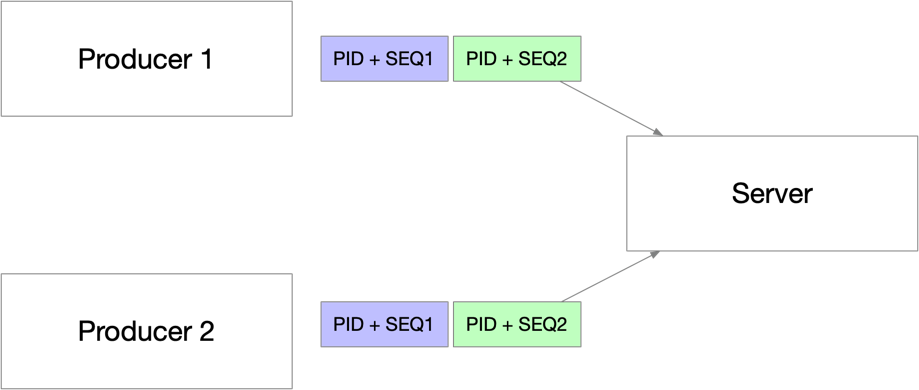

kafka的幂等性是同一个partition的维度，所以通过<Producer ID, sequence number>来唯一标识：

**看具体的代码之前，就有了三个问题**
1. Producer ID是如何申请以及来保证唯一的？
2. server端是如何去重的？
3. 发送失败的时候，sequence number是如何保证连续的？

**问题1： Producer ID是如何申请以及来保证唯一的？**

Client通过向Server发送一个InitProducerIdRequest请求获取PID，在幂等性的情况下，直接通过ProducerIdManager的generateProducerId()方法产生一个PID，
- 在本地的PID端用完了或者处于新建状态时，申请PID段（默认情况下，每次申请1000个PID）
- TransactionCoordinator 对象通过 generateProducerId方法获取下一个可以使用的PID