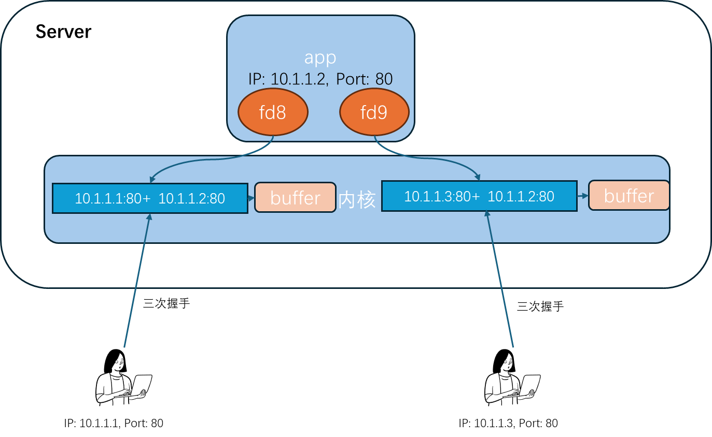
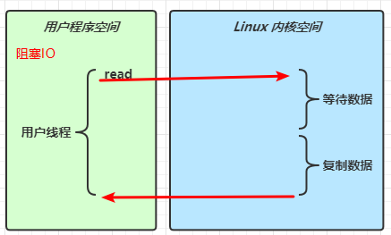
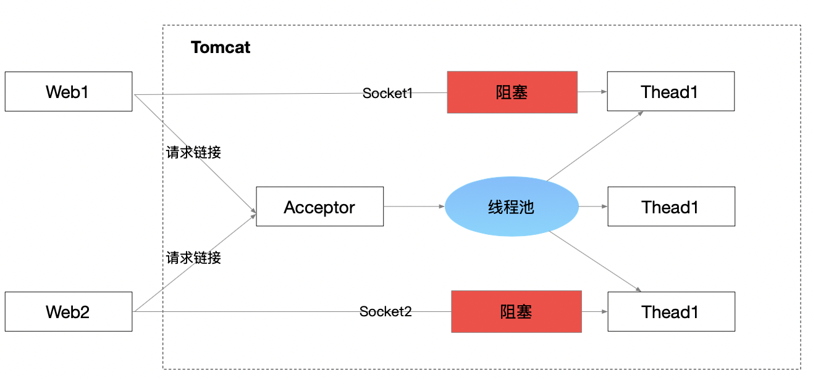
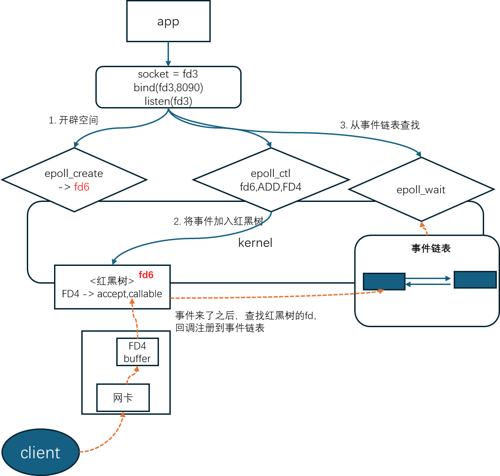
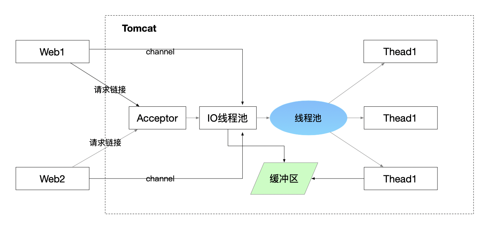
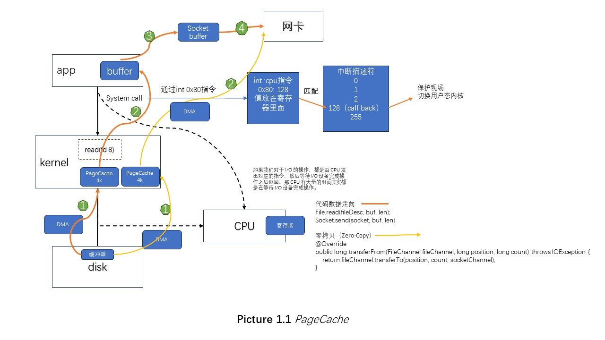
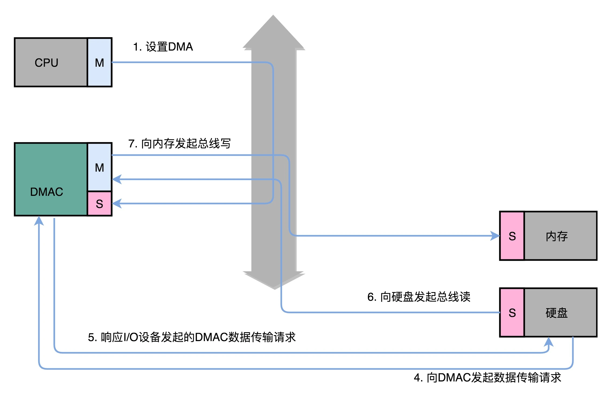
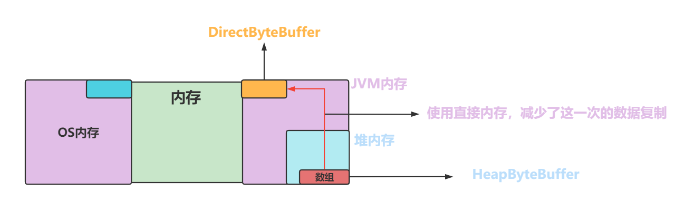
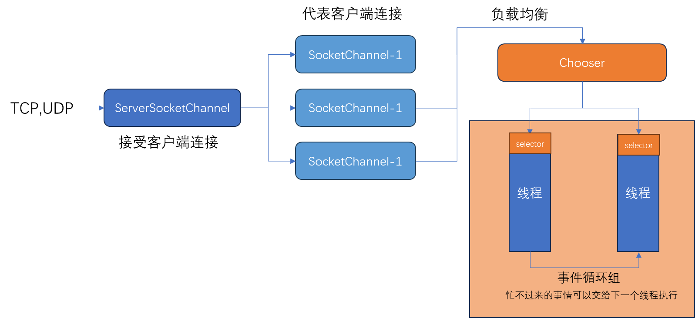
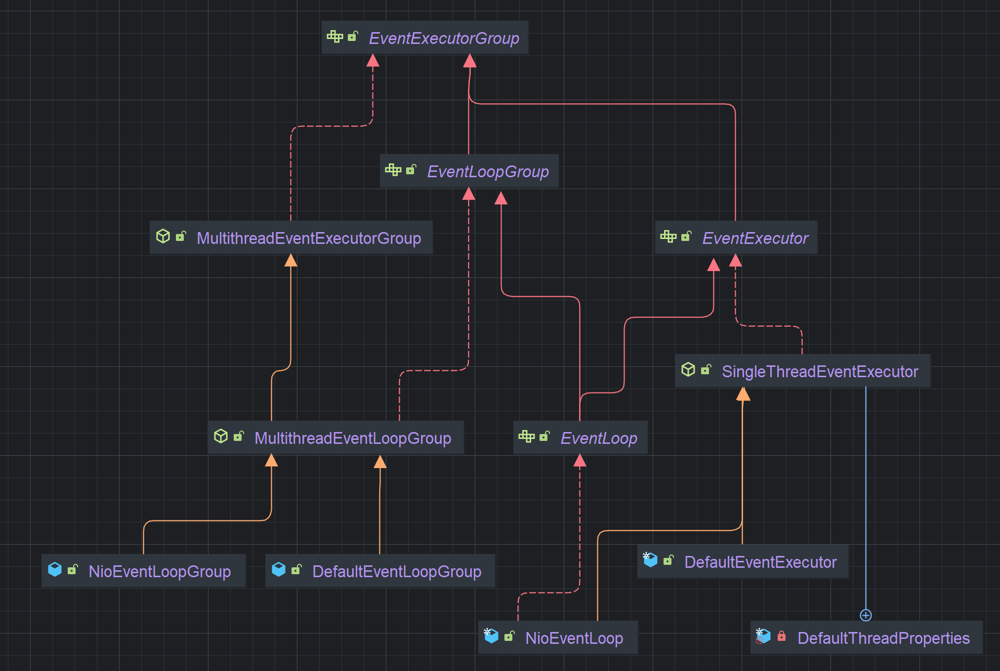

# Netty

1. 阻塞是阻塞在哪里，非阻塞是非阻塞在哪里
2. 为什么有channel 和 buffer两个概念

分成以下几部分去总结：
1. 网络基础
2. 事件循环组
3. 内存管理系统
4. 编码器

## 1. 网络基础



### 网络IO变化，模型

同步，异步，阻塞，非阻塞

按照同步的流程

在accept和recv阶段会产生阻塞
<p>

</p>

- BIO

<p>

</p>

BIO的阻塞在哪里
1. accept的时候就一直在等待着客户端的连接，这个等待过程中主线程就一直在阻塞
2. 连接建立之后，clone thread的时候会系统调用，在读取到socket信息之前，线程也是一直在等待，一直处于阻塞的状态下



当客户端并发访问量增加后，服务端的线程个数和客户端并发访问数呈 1:1 的正比关系，线程数量快速膨胀后，系统的性能将急剧下降

thread池化的问题：如果发生读取数据较慢时（比如数据量大、网络传输慢等），慢的连接会阻塞占用线程，而其他接入的消息，只能一直等待

Tomcat的BIO



- NIO
1. JDK new IO
2. Non-blocking

<p>

</p>

```Java
public test() {
   LinkedList<SocketChannel> clients = new LinkedList<>();
   ServerSocketChannel ss = ServerSocketChannel.open(); // 服务端开启监听：接受客户端
   ss.bind(new InetSocketAddress(9090));
   ss.configureBlocking(false); // 重点: OS NONBLOCKING!!!, 只让接受客户端, 不阻塞

   while (true) {
       // 接受客户端的连接
      SocketChannel client = ss.accept();
      if(client ==null){
         // 如果没有连接，直接返回null
      }else{
         // 读取数据流程
      }
   }
}
```

NIO慢在哪里：

while循环中，每次都需要全量遍历，用户态内核切换才能实现
<p>

</p>

因此引入了多路复用器：select， poll， epoll

多路复用器的两个好处：

1. 该模型能够在同一个线程内同时监听多个IO请求，系统不必创建大量的线程，从而大大减小了系统的开销
2. 等待的方式能减少无效的系统调用，减少了对CPU资源的消耗

<p>

</p>

linux以及netty

同步阻塞：程序自己读取，调用了方法一直等待有效返回结果（BIO）

同步非阻塞：程序自己读取，调用方法一瞬间，给出是否读到（NIO）

- select

select有fd大小的限制，而poll没有，FD_SETSIZE(1024)
<p>

</p>
    
> 无论NIO,SELECT,POLL都是要遍历所有的IO，并且询问状态；
> 只不过，NIO遍历的成本在用户态内核态切换，
> 而SELECT,POLL只触发了一次系统调用，把需要的fds传递给内核，内核重新根据用户这次调用传过来的fds，遍历修改状态

select的问题
1. 每次都要重新传递fds
2. 每次内核被调用之后，针对这次调用，触发一个遍历fds全量的复杂度

- epoll



三个函数：
1. epoll_create: 开辟一个红黑树空间
2. epoll_ctl: 将fd注册到红黑树
3. epoll_wait：查找事件链表相关fd的事件

时间复杂度：

select, poll: O(n)

epoll: O(1)

#### Java示例
```Java
public class SocketMultiplexingSingleThreadv1 {
    private ServerSocketChannel server = null;
    // 可以通过-D指定
    // -Djava.nio.channels.spi.SelectorProvider=sun.nio.ch.EPollSelectorProvider
    private Selector selector = null; //linux多路复用器（可以是select poll epoll）
    int port = 9090;

    public void initServer() {
        try {
            server = ServerSocketChannel.open();
            server.configureBlocking(false);
            server.bind(new InetSocketAddress(port));

            // 如果在epoll模型下，epoll_create -> fd3
            selector = Selector.open(); // 优先选择：epoll

            // select，poll:jvm里开辟一个数组fd4放进去
            // epoll：epoll_ctl(fd3,ADD,fd4,EPOLLIN
            server.register(selector, SelectionKey.OP_ACCEPT);
        } catch (IOException e) {
            e.printStackTrace();
        }
    }

    public void start() {
        initServer();
        try {
            while (true) {  //死循环
                Set<SelectionKey> keys = selector.keys();
                System.out.println(keys.size()+"size");
                //1,调用多路复用器(select,poll or epoll(epoll_wait))
                /*
                select():
                1，select，poll: select(fd4), poll(fd4)
                2，epoll：epoll_wait()
                参数可以带时间：没有时间，0:阻塞，有时间设置一个超时
                selector.wakeup() 结果返回0

                懒加载:
                其实再触碰到selector.select()调用的时候触发了epoll_ctl的调用
                 */
                while (selector.select() > 0) {
                    Set<SelectionKey> selectionKeys=selector.selectedKeys(); //返回的有状态的fd集合
                    Iterator<SelectionKey> iter=selectionKeys.iterator();
                    // 多路复用器只给状态，还得一个个的去处理R/W
                    // NIO对每一个fd调用系统调用，浪费资源，这里调用了一次select方法，知道那些可以R/W
                    while (iter.hasNext()) {
                        SelectionKey key = iter.next();
                        iter.remove(); //set 不移除会重复循环处理
                        if (key.isAcceptable()) {
                            //看代码的时候，这里是重点，如果要去接受一个新的连接
                            //语义上，accept接受连接且返回新连接的FD
                            //那新的FD怎么办？
                            //select，poll，因为他们内核没有空间，那么在jvm中保存和前边的fd4那个listen的一起
                            //epoll：希望通过epoll_ctl把新的客户端fd注册到内核空间
                            acceptHandler(key);
                        } else if (key.isReadable()) {
                            readHandler(key); //read还有write都处理了
                            //在当前线程，这个方法可能会阻塞,所以，为什么提出了IO THREADS
                            //redis是不是用了epoll，redis是不是有个io threads的概念，redis是不是单线程的
                        }  else if(key.isWritable()){ 
                            //写事件<-- send-queue(netstat -anp), 只要是空的，就一定会返回可以写的事件，就会回调写方法
                            //什么时候写？不是依赖send-queue是不是有空间
                            key.cancel();
                            key.interestOps(key.interestOps() & ~SelectionKey.OP_WRITE);
                            writeHandler(key);
                        }
                    }
                }
            }
        }
    }

    public void acceptHandler(SelectionKey key) {
        try {
            ServerSocketChannel ssc = (ServerSocketChannel)key.channel();
            SocketChannel client = ssc.accept(); //目的是调用accept接受客户端fd7
            client.configureBlocking(false);

            ByteBuffer buffer = ByteBuffer.allocate(8192);

            //调用了register
            /*
            select，poll：jvm里开辟一个数组fd7放进去
            epoll：epoll_ctl(fd3,ADD,fd7,EPOLLIN
             */
            client.register(selector, SelectionKey.OP_READ, buffer);
        }
    }

    public void readHandler(SelectionKey key) {}
```

写事件处理：

send-queue(netstat -anp可以显示), 只要是空的，就一定会返回可以写的事件，就会回调写方法

什么时候写？不是依赖send-queue是不是有空间
1. 你准备好要写什么了，这是第一步
2. 第二步你才关心send-queue是否有空间
3. 读 read 一开始就要注册，但是write依赖以上关系，用的时候注册
4. 如果一开始就注册了write的事件，进入死循环，一直调起

Tomcat的Reactor模型，属于“主从 Reactor 多线程”实现




## 1. PageCache

app不能直接访问cpu网卡和硬盘，要通过kernel系统调用，修改PageCache之后标记为脏，可以通过调优参数，什么时候flush到磁盘。



| 参数                           | 含义                                                                                                      |
|------------------------------|---------------------------------------------------------------------------------------------------------|
| vm.dirty_background_ratio    | 内存可以填充脏数据的百分比。脏数据稍后会写入磁盘，pdflush/flush/kdmflush这些后台进程会清理脏数据。有32G内存，超过3.2G的话就会有后台进程来清理                   |
| vm.dirty_background_bytes    | 如果设置_bytes版本，则_ratio版本将变为0，反之亦然                                                                         |
| vm.dirty_ratio               | 脏数据填充的绝对最大系统内存量，当系统到达此点时，必须将所有脏数据提交到磁盘，同时所有新的I/O块都会被阻塞，直到脏数据被写入磁盘。这通常是长I/O卡顿的原因，但这也是保证内存中不会存在过量脏数据的保护机制 |
| vm.dirty_bytes               | 如果设置_bytes版本，则_ratio版本将变为0，反之亦然                                                                         |
| vm.dirty_writeback_centisecs | 指定多长时间 pdflush/flush/kdmflush 这些进程会唤醒一次，然后检查是否有缓存需要清理                                                   |
| vm.dirty_expire_centisecs    | 指定脏数据能存活的时间。在这里它的值是30秒。当 pdflush/flush/kdmflush 在运行的时候，他们会检查是否有数据超过这个时限，如果有则会把它异步地写到磁盘中                 |

### DMA

DMA技术就是我们在主板上放一块独立的芯片。在进行内存和 I/O 设备的数据传输的时候，我们不再通过 CPU 来控制数据传输，而直接通过
DMA 控制器（DMA Controller，简称 DMAC）。这块芯片，我们可以认为它其实就是一个协处理器（Co-Processor）。

DMAC 其实也是一个特殊的 I/O 设备，它和 CPU 以及其他 I/O
设备一样，通过连接到总线来进行实际的数据传输。总线上的设备呢，其实有两种类型。一种我们称之为主设备（Master），另外一种，我们称之为从设备（Slave）。



数据传输的流程如下：

1. CPU 还是作为一个主设备，向 DMAC 设备发起请求。这个请求，其实就是在 DMAC 里面修改配置寄存器
2. 如果我们要从硬盘上往内存里面加载数据，这个时候，硬盘就会向 DMAC 发起一个数据传输请求。这个请求并不是通过总线，而是通过一个额外的连线。
3. DMAC 需要再通过一个额外的连线响应这个申请
4. DMAC 这个芯片，就向硬盘的接口发起要总线读的传输请求。数据就从硬盘里面，读到了 DMAC 的控制器里面
5. DMAC 再向我们的内存发起总线写的数据传输请求，把数据写入到内存里面
6. DMAC 会反复进行上面第 4、5 步的操作，直到 DMAC 的寄存器里面设置的数据长度传输完成

Kafka 里面会有两种常见的海量数据传输的情况。一种是从网络中接收上游的数据，然后需要落地到本地的磁盘上，确保数据不丢失。另一种情况呢，则是从本地磁盘上读取出来，通过网络发送出去
而后一种情况的 零拷贝就是通过DMA完成的，具体流程参见Picture 1.1

## 2. Netty部分

### Reactor反应器模式

也叫做分发者模式或通知者模式，是一种将就绪事件派发给对应服务处理程序的事件设计模式


Netty is an **asynchronous event-driven** network application framework
for rapid development of **maintainable high performance protocol** servers & clients.

#### 前置知识

这里以文件输入输出流：FileInputStream、FileOutputStream为例。继承自InputStream和OutputStream，可以看到读写文件的时候，就需要创建两个流对象

<p>

</p>

#### 抽象类描述

InputStream流程如下：
1. read(byte b[]) 直接调用read(byte b[], int off, int len)函数，每次调用read()都可能触发系统调用，开销大
2. 校验byte数组是否为空
3. 校验读取范围是否正确
4. 校验读取长度
5. 调用read()函数读入一个字节
6. 验证字节是否到达了文件的末尾
7. 将该字节数据保存到b数组中
8. 循环将文件的数据，逐字节的从磁盘中读入放入b字节数组中

```java
// 只以文件流为例
public abstract class InputStream implements Closeable {
    public int read(byte b[]) throws IOException {
        return read(b, 0, b.length); // 直接调用read(byte b[], int off, int len)函数
    }
    
    public int read(byte b[], int off, int len) throws IOException {
        if (b == null) { // 校验byte数组是否为空
            throw new NullPointerException();
        } else if (off < 0 || len < 0 || len > b.length - off) { // 校验读取范围是否正确
            throw new IndexOutOfBoundsException();
        } else if (len == 0) { // 校验读取长度
            return 0;
        }
        // 调用read()函数读入一个字节
        int c = read(); 
        if (c == -1) { // 验证字节是否到达了文件的末尾
            return -1;
        }
        b[off] = (byte)c; // 将该字节数据保存到b数组中
        int i = 1;
        try {
            // 将文件的数据，逐字节的从磁盘中读入放入b字节数组中
            for (; i < len ; i++) {
                c = read();
                if (c == -1) {
                    break;
                }
                b[off + i] = (byte)c;
            }
        } catch (IOException ee) {
        }
        return i;
    }
}
```

FileInputStream流程如下：
1. read(byte b[]) 方法直接调用read(byte b[], int off, int len)方法
2. read(byte b[], int off, int len)方法直接调用readBytes(byte b[], int off, int len)方法
3. 可以看到readBytes方法为native，称之为JNI（Java Native Interface）方法

```java
public class FileInputStream extends InputStream{
    public int read(byte b[]) throws IOException {
        // 直接调用read(byte b[], int off, int len)方法
        return readBytes(b, 0, b.length); 
    }
    
    public int read(byte b[], int off, int len) throws IOException {
        // 直接调用readBytes(byte b[], int off, int len)方法
        return readBytes(b, off, len);
    }
    
    // 可以看到该方法为native，称之为JNI（Java Native Interface）方法
    private native int readBytes(byte b[], int off, int len) throws IOException;
}
```

关键流程如下：
1. malloc分配一片空间
2. 调用read函数读取数据
3. 将数据保存放入堆内存的bytes数组中

下图是readBytes的原理图：
<p>

</p>

```c
jint readBytes(JNIEnv *env, jobject this, jbyteArray bytes,
              jint off, jint len, jfieldID fid){
    ...
    if (len == 0) {
        return 0;
    } else if (len > BUF_SIZE) {
        buf = malloc(len); // 分配一片空间
    }
    ...
    if (fd == -1) {
       ...
    } else {
        nread = IO_Read(fd, buf, len); // 调用read函数读取数据
        if (nread > 0) {
            // 将数据保存放入堆内存的bytes数组中
            (*env)->SetByteArrayRegion(env, bytes, off, nread, (jbyte *)buf);
        }
        ...
    }
    ...
}
```

当然，也可以是BufferedInputStream，调用的是readBytes(byte[] b, int off, int len)

这时，可以引入NIO模型，不需要再为了传输数据创建两个数据流，只需要在两个通讯对象之间，创建channel，将对象抽象为buffer，这时我们只需要双方在该channel
通道传输buffer即可，数据放入buffer

<p>

</p>

- 直接内存和堆内存

1. 在JVM内存中分配的空间为：直接内存缓冲区（DirectByteBuffer）
2. 在JVM内存中的堆内存中开辟的空间为：堆内存缓冲区（HeapByteBuffer），操作系统想和JVM沟通，先从堆内存放到DirectByteBuffer，再拷贝到OS内存



零拷贝：指的是在JVM内存这个上下文中，直接从DirectBuffer里面读/写，避免拷贝到堆内内存

```java
// Buffer的基类，其中定义了四个索引下标的用法
public abstract class Buffer {
    // 不变性质: mark <= position <= limit <= capacity
    private int mark = -1; // 标记索引下标
    private int position = 0; // 当前处理索引下标
    private int limit; // 限制索引下标（通常用于在写入后，标记读取的最终位置）
    private int capacity; // 容量索引下标

    // 用于指向DirectByteBuffer的地址
    long address;
}

// 直接继承自Buffer基类，实现了字节缓冲区的基本操作和创建实际Buffer实例的工厂方法
public abstract class ByteBuffer extends Buffer implements Comparable<ByteBuffer>{
    final byte[] hb;                  // 用于HeapByteBuffer中的字节数组

    // 默认分配的为堆内存
    public static ByteBuffer allocate(int capacity) {
        if (capacity < 0)
            throw new IllegalArgumentException();
        return new HeapByteBuffer(capacity, capacity); // 创建堆内存对象
    }

    // 可以通过该方法创建直接内存缓冲区
    public static ByteBuffer allocateDirect(int capacity) {
        return new DirectByteBuffer(capacity); // 创建直接内存缓冲区
    }
}

// 该类继承自ByteBuffer，实现了堆内存中字节数组的实现，该类不是public共有类，只能通过ByteBuffer来创建实例
class HeapByteBuffer extends ByteBuffer{
    HeapByteBuffer(int cap, int lim) {
        super(-1, 0, lim, cap, new byte[cap], 0); // 直接初始化hb字节数组
    }
}

// 该类继承自ByteBuffer，提供了文件fd与用户空间地址的映射
public abstract class MappedByteBuffer extends ByteBuffer{
    private final FileDescriptor fd; // 文件fd
    MappedByteBuffer(int mark, int pos, int lim, int cap,FileDescriptor fd)
    {
        super(mark, pos, lim, cap);
        this.fd = fd;
    }
    
    MappedByteBuffer(int mark, int pos, int lim, int cap) { // 不使用FD映射，支撑DirectByteBuffer
        super(mark, pos, lim, cap);
        this.fd = null;
    }
}

// 该类继承自MappedByteBuffer，提供了直接内存缓冲区的实现
class DirectByteBuffer extends MappedByteBuffer implements DirectBuffer{
    protected static final Unsafe unsafe = Bits.unsafe(); // 操作的Unsafe对象
    DirectByteBuffer(int cap) {                   // package-private
        super(-1, 0, cap, cap); // 初始化父类
        boolean pa = VM.isDirectMemoryPageAligned();
        int ps = Bits.pageSize();
        long size = Math.max(1L, (long)cap + (pa ? ps : 0));
        Bits.reserveMemory(size, cap);

        long base = 0;
        try {
            base = unsafe.allocateMemory(size); // 分配直接内存
        } catch (OutOfMemoryError x) {
            Bits.unreserveMemory(size, cap);
            throw x;
        }
        unsafe.setMemory(base, size, (byte) 0);
        if (pa && (base % ps != 0)) {
            // Round up to page boundary
            address = base + ps - (base & (ps - 1));
        } else {
            address = base;
        }
        cleaner = Cleaner.create(this, new Deallocator(base, size, cap)); // 用于清理分配的直接内存
        att = null;
    }
}
```

如下图所示：Buffer等于四个变量+分配在JVM堆内存（DirectByteBuffer）或者堆内存中的数组空间（HeapByteBuffer）
<p>

</p>

### 事件循环组


#### 如何异步执行？Promise

1. Future接口
2. 通过Future接口获取任务执行结果即可

Future弊端：总得调用方来获取再执行步骤，如何解决？

Netty使用了观察者模式，当执行任务完成时，自动在执行线程回调callback;Promise, 加了监听器,和runnable组合即可

<p>

</p>

默认实现是DefaultPromise，使用方式
```Java
    private final Promise<?> terminationFuture = new DefaultPromise<Void>(GlobalEventExecutor.INSTANCE);
    private final FutureListener<Object> childTerminationListener = new FutureListener<Object>() {
        @Override
        public void operationComplete(Future<Object> future) throws Exception {
            // Inefficient, but works.
            if (isTerminated()) {
            // 触发监听器
                terminationFuture.trySuccess(null);
            }
        }
    };
    
    private boolean setValue0(Object objResult) {
        if (RESULT_UPDATER.compareAndSet(this, null, objResult) ||
                RESULT_UPDATER.compareAndSet(this, UNCANCELLABLE, objResult)) {
            if (checkNotifyWaiters()) {
                notifyListeners();
            }
            return true;
        }
        return false;
    }
```

promise的两种用法，一种是直接包装返回
```Java
 final ChannelFuture initAndRegister() {
    Channel channel = null;
    try {
        channel = channelFactory.newChannel();
        init(channel);
    } catch (Throwable t) {
        if (channel != null) {
            // channel can be null if newChannel crashed (eg SocketException("too many open files"))
            channel.unsafe().closeForcibly();
            // as the Channel is not registered yet we need to force the usage of the GlobalEventExecutor
            return new DefaultChannelPromise(channel, GlobalEventExecutor.INSTANCE).setFailure(t);
        }
        // as the Channel is not registered yet we need to force the usage of the GlobalEventExecutor
        // 直接包装返回
        return new DefaultChannelPromise(new FailedChannel(), GlobalEventExecutor.INSTANCE).setFailure(t);
    }
}
```

一种是和runnable组合
```Java
 if (eventLoop.inEventLoop()) {
            register0(promise);
        } else {
            try {
                eventLoop.execute(new Runnable() {
                    @Override
                    public void run() {
                        register0(promise);
                    }
                });
                
                
```

### 事件循环组
事件循环组的线程应该有哪些特性？
1. 负载均衡
2. 周期性调度的工作

事件循环组集成图



```Java
// EventExecutor继承EventExecutorGroup，是一个特殊的组，next指向他自己
public interface EventExecutor extends EventExecutorGroup {
    /**
     * Returns a reference to itself.
     * 永远指向自己
     */
    @Override
    EventExecutor next();
}
```

EventExecutorGroup组里面有多个线程，通过next函数返回**一个(one of the EventExecutor)**，具有调度功能

```Java
public interface EventExecutorGroup extends ScheduledExecutorService, Iterable<EventExecutor>

/**
     * Returns one of the {@link EventExecutor}s managed by this {@link EventExecutorGroup}.
     */
    EventExecutor next();
```

EventLoopGroup，是一个循环组，它的next()代表了，选择的EventLoop会是一个循环的概念
```Java
/**
 * Special {@link EventExecutorGroup} which allows registering {@link Channel}s that get
 * processed for later selection during the event loop.
 *
 */
public interface EventLoopGroup extends EventExecutorGroup {
    /**
     * Return the next {@link EventLoop} to use
     */
    @Override
    EventLoop next();

    ChannelFuture register(Channel channel);
}
```

EventLoop是一个标志接口，代表了EventLoopGroup的一个EventLoop
```Java
// EventLoop是一个线程，但也是一个特殊的循环组
public interface EventLoop extends OrderedEventExecutor, EventLoopGroup
```

**总结如下：**
EventExecutorGroup继承自ScheduledExecutorService拥有了调度执行的功能，并且通过next()获取一个EventExecutor，EventExecutor是EventExecutorGroup里面专门执行事件的执行器，
是一个特殊的EventExecutorGroup。引入EventLoopGroup，注册channel，而且把线程连起来，形成循环组；EventLoop是一个线程，但也是一个特殊的循环组

MultithreadEventExecutorGroup: 上面继承图漏了AbstractEventExecutorGroup，结合上面图看
```Java
public abstract class MultithreadEventExecutorGroup extends AbstractEventExecutorGroup {
    private final EventExecutor[] children;
    private final Set<EventExecutor> readonlyChildren;
    private final AtomicInteger terminatedChildren = new AtomicInteger();
    private final Promise<?> terminationFuture = new DefaultPromise(GlobalEventExecutor.INSTANCE);

    // chooser选择children里面的EventExecutor
    private final EventExecutorChooserFactory.EventExecutorChooser chooser;

    @Override
    public EventExecutor next() {
        return chooser.next();
    }

// MultithreadEventExecutorGroup的构造方法
// nThreads：创建几个线程
// threadFactory：线程的构造方法
// chooserFactory：选择器

    protected MultithreadEventExecutorGroup(int nThreads, Executor executor,
                                            EventExecutorChooserFactory chooserFactory, Object... args) {
        checkPositive(nThreads, "nThreads");

        if (executor == null) {
            executor = new ThreadPerTaskExecutor(newDefaultThreadFactory());
        }

        children = new EventExecutor[nThreads];

        for (int i = 0; i < nThreads; i++) {
            boolean success = false;
            try {
                children[i] = newChild(executor, args);
                success = true;
            }
        }
    }
}
```

线程是如何构造的，很简单，直接new一个Thread
```Java
public final class ThreadPerTaskExecutor implements Executor {
    private final ThreadFactory threadFactory;

    public ThreadPerTaskExecutor(ThreadFactory threadFactory) {
        this.threadFactory = ObjectUtil.checkNotNull(threadFactory, "threadFactory");
    }

    @Override
    public void execute(Runnable command) {
        threadFactory.newThread(command).start();
    }
}
```

children数组包含的是EventExecutor的类型，由子类去实现；NioEventLoopGroup的实现里面，children存放的是NioEventLoop
```Java
@Override
protected EventLoop newChild(Executor executor, Object... args) throws Exception {
    SelectorProvider selectorProvider = (SelectorProvider) args[0];
    SelectStrategyFactory selectStrategyFactory = (SelectStrategyFactory) args[1];
    RejectedExecutionHandler rejectedExecutionHandler = (RejectedExecutionHandler) args[2];
    EventLoopTaskQueueFactory taskQueueFactory = null;
    EventLoopTaskQueueFactory tailTaskQueueFactory = null;

    int argsLength = args.length;
    if (argsLength > 3) {
        taskQueueFactory = (EventLoopTaskQueueFactory) args[3];
    }
    if (argsLength > 4) {
        tailTaskQueueFactory = (EventLoopTaskQueueFactory) args[4];
    }
    return new NioEventLoop(this, executor, selectorProvider,
            selectStrategyFactory.newSelectStrategy(),
            rejectedExecutionHandler, taskQueueFactory, tailTaskQueueFactory);
}
```

Chooser的实现: DefaultEventExecutorChooserFactory.INSTANCE
```Java
public EventExecutorChooser newChooser(EventExecutor[] executors) {
    if (isPowerOfTwo(executors.length)) {
        return new PowerOfTwoEventExecutorChooser(executors);
    } else {
        return new GenericEventExecutorChooser(executors);
    }
}
```
对于2的指数使用PowerOfTwoEventExecutorChooser，否则直接取模操作
```Java
public EventExecutor next() {
    return executors[idx.getAndIncrement() & executors.length - 1];
}
```

Netty主方法的解释：
1. channel的参数跟的是母亲的角色，她下面有很多的childHandler跟着SocketChannel的
2. option参数是对NioServerSocketChannel生效的，而childOption是对SocketChannel生效的
3. boss接受请求，是处理ServerSocket连接；而worker执行请求，从连接里面取出来的Socket对象

```Java
public static void main(String[] args) throws Exception {
    // Configure SSL.
    final SslContext sslCtx = ServerUtil.buildSslContext();

    // Configure the server.
    EventLoopGroup bossGroup = new NioEventLoopGroup(1);
    EventLoopGroup workerGroup = new NioEventLoopGroup();
    final EchoServerHandler serverHandler = new EchoServerHandler();
    try {
         // 启动类
        ServerBootstrap b = new ServerBootstrap();
        b.group(bossGroup, workerGroup)
        // channel的参数跟的是母亲的角色，她下面有很多的childHandler跟着的SocketChannel类型
         .channel(NioServerSocketChannel.class)
         .option(ChannelOption.SO_BACKLOG, 100)
         .handler(new LoggingHandler(LogLevel.INFO))
         .childHandler(new ChannelInitializer<SocketChannel>() {
             @Override
             public void initChannel(SocketChannel ch) throws Exception {
                 ChannelPipeline p = ch.pipeline();
                 if (sslCtx != null) {
                     p.addLast(sslCtx.newHandler(ch.alloc()));
                 }
                 //p.addLast(new LoggingHandler(LogLevel.INFO));
                 p.addLast(serverHandler);
             }
         });

        // Start the server.
        ChannelFuture f = b.bind(PORT).sync();

        // Wait until the server socket is closed.
        f.channel().closeFuture().sync();
    } finally {
        // Shut down all event loops to terminate all threads.
        bossGroup.shutdownGracefully();
        workerGroup.shutdownGracefully();
    }
}
```

上面注册的pipeline会在哪里执行？

bind方法下：
```Java
    final ChannelFuture initAndRegister() {
    Channel channel = null;
    try {
        channel = channelFactory.newChannel();
        init(channel);

// ServerBootstrap.java
        @Override
        void init (Channel channel){


            ChannelPipeline p = channel.pipeline();

// todo 这个不是主线程执行的?
            p.addLast(new ChannelInitializer<Channel>() {
                @Override
                public void initChannel(final Channel ch) {
                    final ChannelPipeline pipeline = ch.pipeline();
                    ChannelHandler handler = config.handler();
                    if (handler != null) {
                        pipeline.addLast(handler);
                    }

                    ch.eventLoop().execute(new Runnable() {
                        @Override
                        public void run() {
                            pipeline.addLast(new ServerBootstrapAcceptor(
                                    ch, currentChildGroup, currentChildHandler, currentChildOptions, currentChildAttrs,
                                    extensions));
                        }
                    });
                }
            });
        }
    }
}
```
上面只是添加了ChannelInitializer，那真正是在哪里展开的呢？

AbstractChannel.java
```Java
 private void register0(ChannelPromise promise) {
        try {
            // check if the channel is still open as it could be closed in the mean time when the register
            // call was outside of the eventLoop
            if (!promise.setUncancellable() || !ensureOpen(promise)) {
                return;
            }
            boolean firstRegistration = neverRegistered;
            doRegister();
            neverRegistered = false;
            registered = true;


            // Ensure we call handlerAdded(...) before we actually notify the promise. This is needed as the
            // user may already fire events through the pipeline in the ChannelFutureListener.
            pipeline.invokeHandlerAddedIfNeeded();

            safeSetSuccess(promise);
            pipeline.fireChannelRegistered();
        } catch (java.lang.Exception e) {
            throw new RuntimeException(e);
        }
}
```

上面这段代码是观察者？是咋操作的啊

### 内存管理系统

内存池设计

内存分配的问题：
1. 内碎片

    

2. 外碎片

    

### 粘包和半包

根本原因：**TCP 是流式协议，消息无边界**

UDP像邮寄的包裹，虽然一次运输多个，但每个包裹都有“界限”，一个一个签收， 所以无粘包、半包问题

粘包的主要原因：
- 发送方每次写入数据 < 套接字缓冲区大小
- 接收方读取套接字缓冲区数据不够及时

半包的主要原因：
- 发送方写入数据 > 套接字缓冲区大小
- 发送的数据大于协议的MTU，必须拆包

**解决问题的根本手段：找出消息的边界：**

| 方式\比较 | 寻找消息边界方式                  | 优点 | 缺点                     | 推荐度 |
| --- |---------------------------| --- |------------------------| --- |
| TCP连接改成短连接，一个请求一个短连接 | 建立连接到释放连接之间的信息即为传输信息      | 简单 | 效率低下                   | 不推荐 |
| 固定长度 `ABC|DEF|GHI`                    | 满足固定长度即可 | 简单 | 空间浪费 | 不推荐 |
| 分割符`ABC\ndef\nghi` | 分隔符之间                     | 空间不浪费，也比较简单 | 内容本身出现分隔符时需转义，所以需要扫描内容 | 推荐 |
| 固定长度字段存个内容的长度信息`Length | Actual Content` | 先解析固定长度的字段获取长度，然后读取后续内容 | 精确定位用户数据，内容也不用转义 | 长度理论上有限制，需提前预知内容可能的最大长度从而定义长度占用字节数 | 推荐+ |
| 其他方式 | 每种都不同，例如JSON可以看{}是否已经成对   | 衡量实际应用场景，很多是对现有协议的支持 |                        |  |

Netty对三种常用封帧方式的支持:

| 方式\支持 | 解码 | 编码 |
| --- | --- | --- |
| 固定长度 | FixedLengthFrameDecoder | 简单 |
| 分割符 | DelimiterBasedFrameDecoder | 简单 |
| 固定长度字段存个内容的长度信息 | LengthFieldBasedFrameDecoder | LengthFieldPrepender |

1. 解码核心工作流程？

   解码的工作是在将字节解码为消息ByteToMessageDecoder#channelRead
   ```Java
   public abstract class ByteToMessageDecoder extends ChannelInboundHandlerAdapter {
      public void channelRead(ChannelHandlerContext ctx, Object msg) throws Exception {
          if (msg instanceof ByteBuf) {
              selfFiredChannelRead = true;
              CodecOutputList out = CodecOutputList.newInstance();
              try {
                  // cumulation是数据积累器
                  first = cumulation == null;
                  cumulation = cumulator.cumulate(ctx.alloc(),
                          first ? Unpooled.EMPTY_BUFFER : cumulation, (ByteBuf) msg);
                  callDecode(ctx, cumulation, out);
              }
          }
      }
   }
   ```
   cumulation是数据积累器, 默认是MERGE_CUMULATOR，callDecode会拿积累器的数据进行解码。

2. 解码中两种数据积累器（Cumulator）的区别?
   - MERGE_CUMULATOR: Cumulate ByteBufs by merge them into one ByteBuf's, using **memory copies**
   - COMPOSITE_CUMULATOR: no memory copy, 像list一样组合起来

   为什么选择MERGE_CUMULATOR作为默认的：
   因为组合的方式没有经过充分的证明：证明在所有场景下肯定比内存复制的性能要好（毕竟组合方式的指针维护复杂些，如果解码是把组合的直接能拆出来就可以用）