# Redis

从几个角度来学习Redis的基础
1. 可靠性
   - 数据的可靠性- 数据尽量少丢失，AOF和RDB保证
   - 集群的可靠性- 服务尽量少中断，增加副本冗余量
   - 数据的一致性保证，脑裂如何处理
2. 为什么redis那么快？网络
3. Redis的数据结构
4. 缓存雪崩、缓存穿透、基于布隆过滤器解决缓存穿透的问题、缓存击穿、基于缓存击穿工作实际案例
5. 分布式锁
6. LRU算法概述、查看默认内存、默认是如何删除数据、缓存淘汰策略
7. Redission
8. 项目遇到的问题

## 1. 可靠性

### 数据的可靠性

1. 数据真的不会丢失吗？ -- 刚执行完一个命令，还没有来得及写AOF日志就宕机/写完AOF还没刷磁盘
2. 如何让数据尽量不丢失，且快速恢复？ -- AOF + RDB

数据不能丢失时，RDB和AOF的混合使用是一个很好的选择

#### AOF

AOF日志和WAL相似，不同的是**AOF是写后日志**，是指Redis先执行命令，把数据写入内存，然后才记录日志

为什么要先执行命令再记日志？

传统数据库的日志，例如redo log（重做日志），记录的是修改后的数据，而AOF里记录的是Redis收到的每一条命令，这些命令是以文本形式保存的

```
// AOF文件
*3
$3 // 3个字符
set
$7
testkey
$9
testvalue
```

为了避免额外的检查开销，Redis在向AOF里面记录日志的时候，并不会先去对这些命令进行语法检查

AOF的问题：
1. 数据丢失：刚执行完一个命令，还没有来得及记日志就宕机了，那么这个命令和相应的数据就有丢失的风险
2. AOF日志也是在**主线程**中执行的，如果在把日志文件写入磁盘时，磁盘写压力大，就会导致写盘很慢

解决AOF的问题有两个策略：

1. AOF的写回策略

   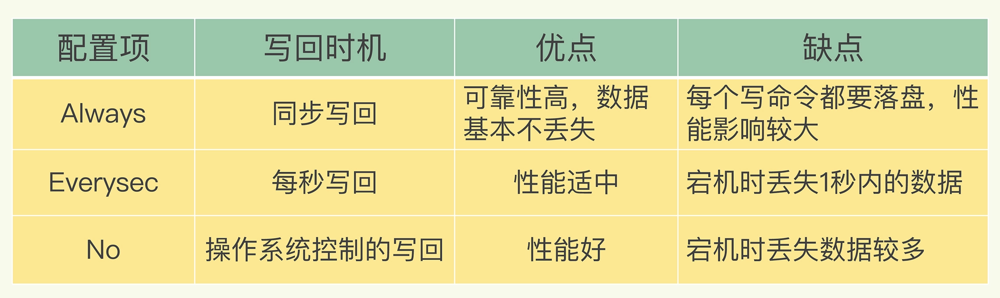
   
   选择合适的写回策略可以在数据丢失和写盘很慢中"trade-off"

2. AOF重写机制

有两个配置项在控制AOF重写的触发时机：

auto-aof-rewrite-min-size: 表示运行AOF重写时文件的最小大小，默认为64MB

auto-aof-rewrite-percentage：当前AOF文件大小和上一次重写后AOF文件大小的差值，再除以上一次重写后AOF文件大小。也就是当前AOF文件比上一次重写后AOF文件的增量大小，和上一次重写后AOF文件大小的比值。

为什么需要重写：

1. 文件系统本身对文件大小有限制，无法保存过大的文件
2. 如果文件太大，之后再往里面追加命令记录的话，效率也会变低
3. 如果发生宕机，AOF中记录的命令要一个个被重新执行，用于故障恢复，如果日志文件太大，整个恢复过程就会非常缓慢，这就会影响到Redis的正常使用

重写的流程：一个拷贝，两处日志

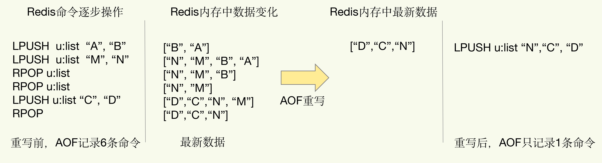

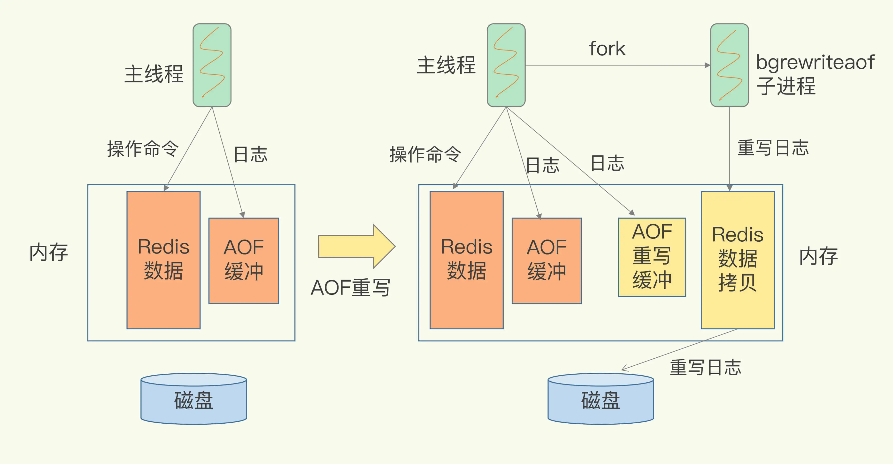

“一个拷贝”就是指，每次执行重写时，主线程fork出后台的bgrewriteaof子进程

“两处日志”就是指，第一处日志就是指正在使用的AOF日志，Redis会把这个操作写到它的缓冲区。第二处日志，就是指新的 AOF 重写日志。这个操作也会被写到重写日志的缓冲区。这样，重写日志也不会丢失最新的操作。等到拷贝数据的所有操作记录重写完成后，重写日志记录的这些最新操作也会写入新的AOF文件，以保证数据库最新状态的记录。此时，我们就可以用新的AOF文件替代旧文件了

#### 问题
1. AOF日志重写的时候，是由bgrewriteaof子进程来完成的，不用主线程参与，我们今天说的非阻塞也是指子进程的执行不阻塞主线程。这个重写过程有没有其他潜在的阻塞风险呢？如果有的话，会在哪里阻塞？

   潜在的阻塞风险包括：fork子进程和AOF重写过程中父进程产生写入的场景

   a、fork子进程，fork这个瞬间一定是会阻塞主线程的，fork采用操作系统提供的写实复制(Copy On Write)机制，就是为了避免一次性拷贝大量内存数据给子进程造成的长时间阻塞问题，但fork子进程需要拷贝进程必要的数据结构，其中有一项就是拷贝内存页表（虚拟内存和物理内存的映射索引表），这个拷贝过程会消耗大量CPU资源，拷贝完成之前整个进程是会阻塞的，阻塞时间取决于整个实例的内存大小，实例越大，内存页表越大，fork阻塞时间越久。拷贝内存页表完成后，子进程与父进程指向相同的内存地址空间，也就是说此时虽然产生了子进程，但是并没有申请与父进程相同的内存大小。那什么时候父子进程才会真正内存分离呢？“写实复制”顾名思义，就是在写发生时，才真正拷贝内存真正的数据，这个过程中，父进程也可能会产生阻塞的风险，就是下面介绍的场景。

   b、fork出的子进程指向与父进程相同的内存地址空间，此时子进程就可以执行AOF重写，把内存中的所有数据写入到AOF文件中。但是此时父进程依旧是会有流量写入的，如果父进程操作的是一个已经存在的key，那么这个时候父进程就会真正拷贝这个key对应的内存数据，申请新的内存空间，这样逐渐地，父子进程内存数据开始分离，父子进程逐渐拥有各自独立的内存空间。因为内存分配是以页为单位进行分配的，默认4k，如果父进程此时操作的是一个bigkey，重新申请大块内存耗时会变长，可能会产阻塞风险。另外，如果操作系统开启了内存大页机制(Huge Page，页面大小2M)，那么父进程申请内存时阻塞的概率将会大大提高，所以在Redis机器上需要关闭Huge Page机制。Redis每次fork生成RDB或AOF重写完成后，都可以在Redis log中看到父进程重新申请了多大的内存空间。

2. AOF重写也有一个重写日志，为什么它不共享使用AOF本身的日志呢？

一个原因是父子进程写同一个文件必然会产生竞争问题，控制竞争就意味着会影响父进程的性能。二是如果AOF重写过程中失败了，那么原本的AOF文件相当于被污染了，无法做恢复使用。所以Redis AOF重写一个新文件，重写失败的话，直接删除这个文件就好了，不会对原先的AOF文件产生影响。等重写完成之后，直接替换旧文件即可。

#### RDB（内存快照）

指内存中的数据在某一个时刻的状态记录

1. RDB为什么快？为什么主从库间的复制不使用AOF？
   - RDB文件内容是经过压缩的二进制数据（不同数据类型数据做了针对性优化），文件很小。而AOF文件记录的是每一次写操作的命令，写操作越多文件会变得很大，其中还包括很多对同一个key的多次冗余操作
   - 因为RDB文件存储的都是二进制数据，从库直接按照RDB协议解析还原数据即可，速度会非常快，而AOF需要依次重放每个写命令，这个过程会经历冗长的处理逻辑

2. 对哪些数据做快照？这关系到快照的执行效率问题

   Redis 的数据都在内存中，为了提供所有数据的可靠性保证，它执行的是全量快照

3. 做快照时，数据还能被增删改吗？

   提供了两个命令来生成RDB文件，分别是save和bgsave

   - save：在主线程中执行，会导致阻塞
   - bgsave：创建一个子进程，专门用于写入RDB文件，避免了主线程的阻塞，这也是Redis RDB文件生成的默认配置

为了快照而暂停写操作，肯定是不能接受的。所以这个时候，Redis就会借助操作系统提供的写时复制技术（Copy-On-Write, COW），在执行快照的同时，正常处理写操作


如果主线程要修改一块数据C，那么，这块数据就会被复制一份，生成该数据的副本（键值对 C’）。然后，主线程在这个数据副本上进行修改。bgsave子进程可以继续把原来的数据（键值对 C）写入RDB文件

可以每秒做一次快照吗？

虽然bgsave执行时不阻塞主线程，但是，如果频繁地执行全量快照，也会带来两方面的开销
1. 频繁将全量数据写入磁盘，会给磁盘带来很大压力
2. 虽然，子进程在创建后不会再阻塞主线程，但是，fork这个创建过程本身会阻塞主线程，而且主线程的内存越大，阻塞时间越长

Redis 4.0中提出了一个混合使用AOF日志和内存快照的方法能利用RDB的快速恢复，又能以较小的开销做到尽量少丢数据

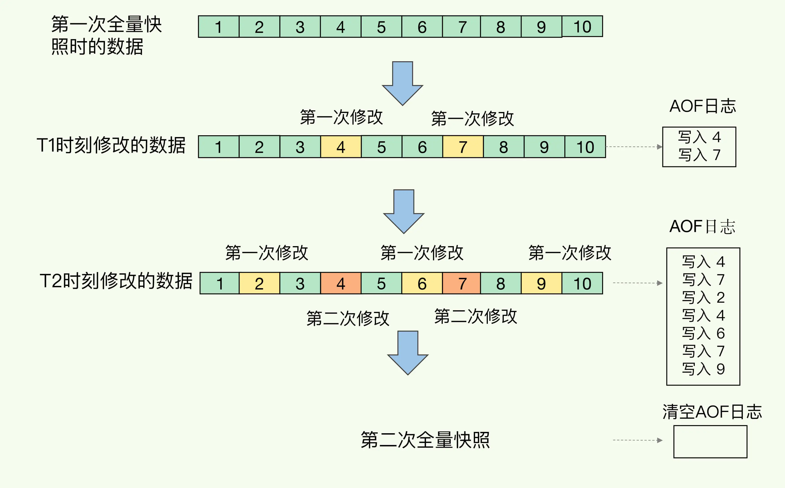

AOF+RDB的选择：
1. 数据不能丢失时，内存快照和AOF 的混合使用是一个很好的选择
2. 如果允许分钟级别的数据丢失，可以只使用RDB
3. 如果只用AOF，优先使用everysec的配置选项，因为它在可靠性和性能之间取了一个平衡

### Cluster

#### 主从库模式

保证数据副本的一致，采用的是**读写分离**的方式

- 读操作：主库、从库都可以接收
- 写操作：首先到主库执行，然后，主库将写操作同步给从库

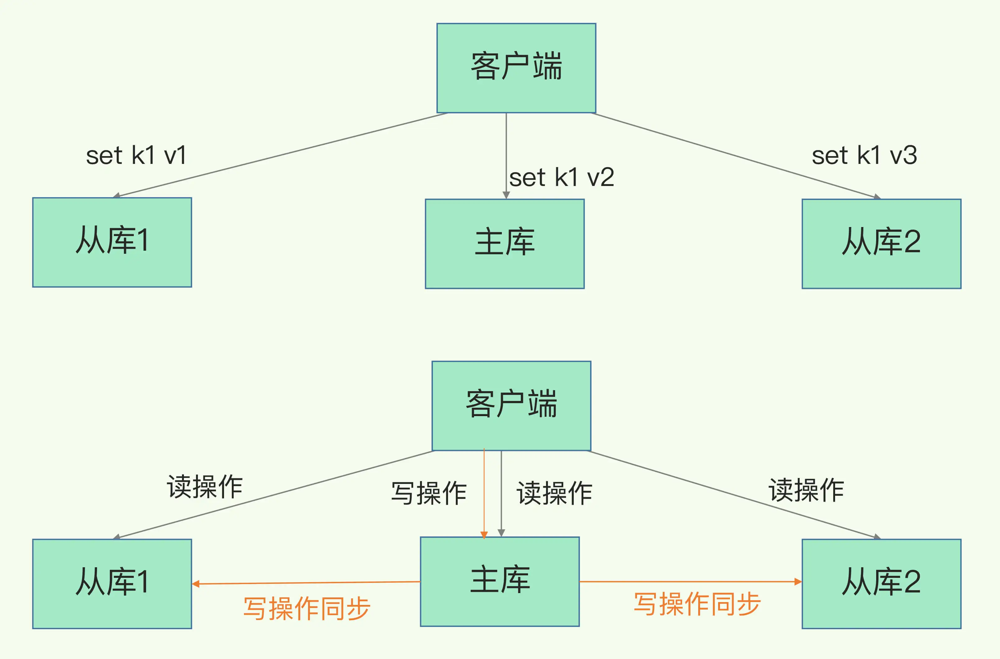

可以通过主从级联模式分担全量复制时的主库压力

```
replicaof  所选从库的IP 6379
```
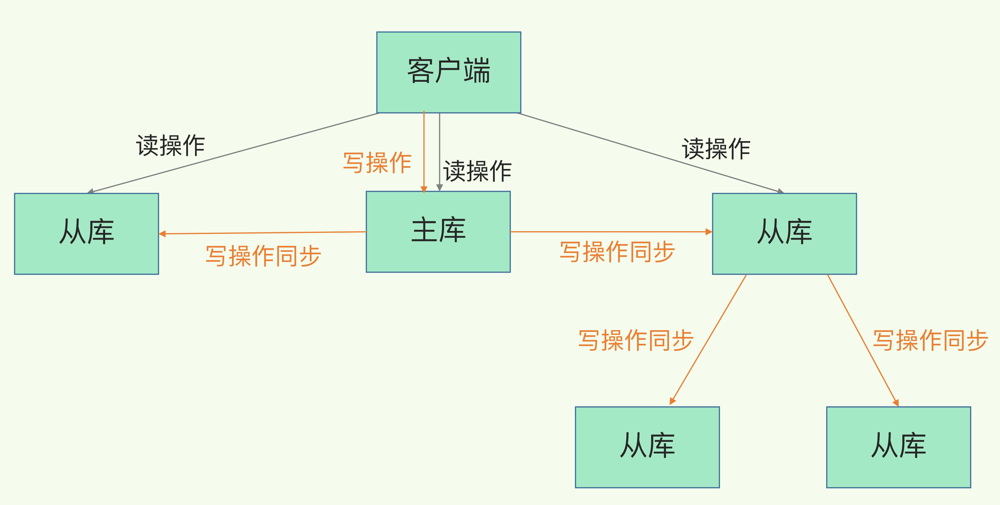

**主从库同步流程**

例如，现在有实例1（ip：172.16.19.3）和实例2（ip：172.16.19.5），实例1是主库，实例2从实例1上复制数据：
```
replicaof 172.16.19.3 6379
```

- 第一次主从同步流程

    

1. 主从库间建立连接、协商同步；FULLRESYNC响应表示第一次复制采用的全量复制
2. 主库将所有数据同步给从库。从库收到数据后，在本地完成数据加载
3. 主库会把第二阶段执行过程中新收到的写命令，再发送给从库

- repl_backlog_buffer和replication buffer理解

  - repl_backlog_buffer: 主从间的增量同步。主节点只有一个repl_backlog_buffer缓冲区，各个从节点的offset偏移量都是相对该缓冲区而言的
  
  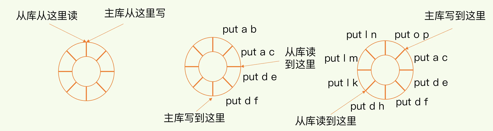

     为了从库断开之后，找到主从差异数据而设计的环形缓冲区，避免全量同步带来的性能开销。如果从库断开时间太久，repl_backlog_buffer环形缓冲区被主库的写命令覆盖了，那么从库连上主库后只能乖乖地进行一次全量同步，所以repl_backlog_buffer配置尽量大一些，可以降低主从断开后全量同步的概率

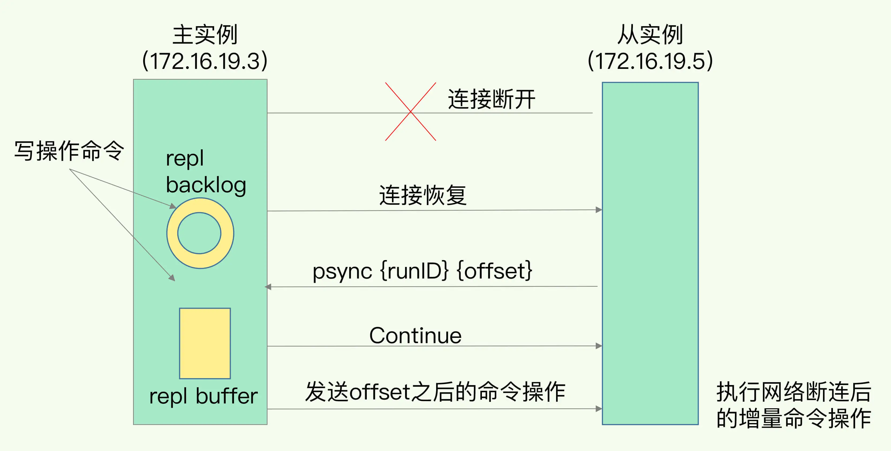

  - replication buffer: 这个buffer专门用来传播用户的写命令到从库，保证主从数据一致，我们通常把它叫做replication buffer;用于主节点与各个从节点间数据的批量交互。主节点为各个从节点分别创建一个缓冲区，由于各个从节点的处理能力差异，各个缓冲区数据可能不同

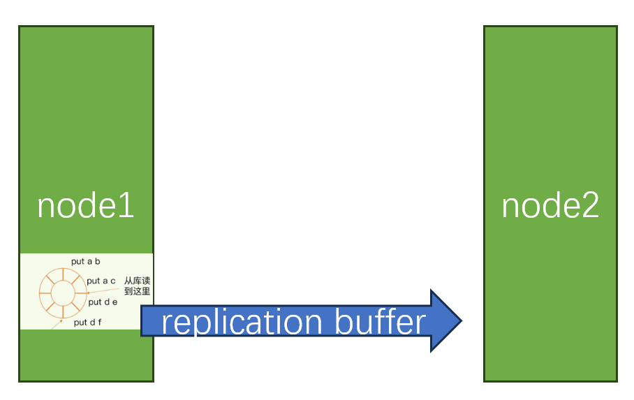

#### 哨兵机制

用于解决主库发生故障的情况

1. 主库真的挂了吗？
2. 该选择哪个从库作为主库？
3. 怎么把新主库的相关信息通知给从库和客户端呢？

哨兵主要负责的就是三个任务：监控、选主（选择主库）和通知

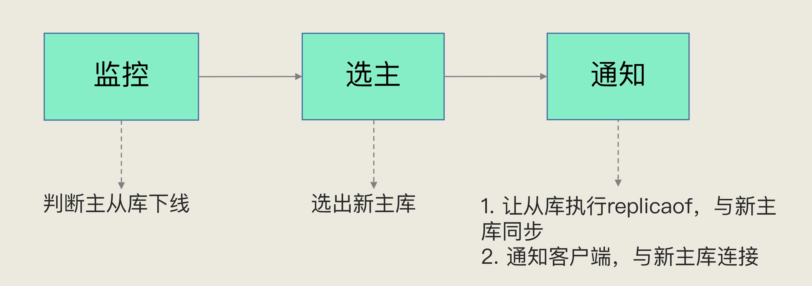

**监控**
- 主观下线

    哨兵进程会使用PING命令检测它自己和主、从库的网络连接情况，用来判断实例的状态。如果哨兵发现主库或从库对PING命令的响应超时了，那么，哨兵就会先把它标记为“主观下线”。
  - 客观下线

      在判断主库是否下线时，不能由一个哨兵说了算，只有大多数的哨兵实例，都判断主库已经“主观下线”了，主库才会被标记为“客观下线”
  
  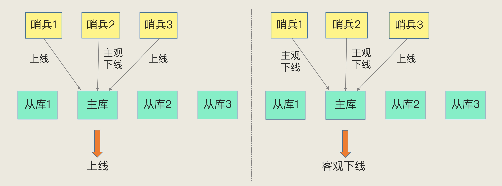

**选主**

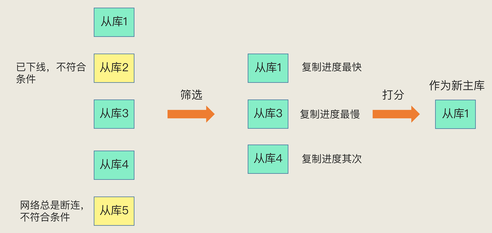

## 2. 应用

### 2.1 替换策略

一共提供了 8 种数据淘汰策略, 一种是所有数据都是候选集，一种是设置了过期时间的数据是候选集。


默认情况下，Redis在使用的内存空间超过maxmemory值时，并不会淘汰数据，也就是设定的noeviction策略（在redis3.0之前，默认是volatile-lru；在redis3.0之后（包括3.0），默认淘汰策略则是noeviction）。
对应到 Redis 缓存，也就是指，一旦缓存被写满了，再有写请求来时，Redis 不再提供服务，而是直接返回错误。

如volatile-lru和allkeys-lru的区别：

- volatile-lru

  仅淘汰设置了过期时间（TTL）的键，不会删除没有设置过期时间的键，因此可以保证持久数据的安全性

- allkeys-lru

  淘汰所有键（无论是否设置了过期时间）。

**那LRU和LFU分别用在什么场景？**

1. LRU

  具有时间局部性：如果数据的访问模式是基于时间顺序的，即最近访问过的数据在未来很可能会再次被访问，LRU 策略可以有效利用这种局部性。**但是对突发访问不敏感**

2. LFU-淘汰访问频率最低的键

  需要长期保留高频数据：如果某些数据需要长期保留，因为它们的访问频率较高，LFU 策略可以更好地适应这种需求。

使用建议:
- **优先使用allkeys-lru策略**。这样，可以充分利用LRU这一经典缓存算法的优势，把最近最常访问的数据留在缓存中，提升应用的访问性能。如果你的业务数据中有明显的冷热数据区分，建议使用allkeys-lru策略
- 如果业务应用中的数据访问频率相差不大，没有明显的冷热数据区分，建议使用allkeys-random策略，随机选择淘汰的数据就行
- **如果你的业务中有置顶的需求**，比如置顶新闻、置顶视频，那么，可以使用volatile-lru策略，同时不给这些置顶数据设置过期时间。这样一来，这些需要置顶的数据一直不会被删除，而其他数据会在过期时根据LRU规则进行筛选

**引出了一个问题，为什么设置了数据的expire(删除数据)，但是内存占用率还是很高？**

内存碎片

- 内因

  例如，Redis 申请一个 20 字节的空间保存数据，jemalloc 就会分配 32 字节，此时，如果应用还要写入 10 字节的数据，Redis 就不用再向操作系统申请空间了

- 外因

    这些键值对会被修改和删除，这会导致空间的扩容和释放


```Text
INFO memory
# Memory
used_memory:1073741736 // Redis为了保存数据实际申请使用的空间
used_memory_human:1024.00M
used_memory_rss:1997159792 // 操作系统实际分配给Redis的物理内存空间
used_memory_rss_human:1.86G
…
mem_fragmentation_ratio:1.86
```

$mem\_fragmentation\_ratio=used\_memory\_rss/used\_memory$

一般来说，大于1但小于1.5。这种情况是合理的

**如何清理内存碎片？**

```Text
config set activedefrag yes
```

下面四个条件，避免清理内存碎片导致的性能下降：

在清理的过程中，只要有一个条件不满足了，就停止自动清理。
- active-defrag-ignore-bytes 100mb：表示内存碎片的字节数达到 100MB 时，开始清理
- active-defrag-threshold-lower 10：表示内存碎片空间占操作系统分配给 Redis 的总空间比例达到 10% 时，开始清理

自动内存碎片清理功能在执行时，还会监控清理操作占用的 CPU 时间，而且还设置了两个参数，分别用于控制清理操作占用的 CPU 时间比例的上、下限
- active-defrag-cycle-min 25：表示自动清理过程所用 CPU 时间的比例不低于 25%，保证清理能正常开展
- active-defrag-cycle-max 75：表示自动清理过程所用 CPU 时间的比例不高于 75%，一旦超过，就停止清理，从而避免在清理时，大量的内存拷贝阻塞 Redis，导致响应延迟升高

#### **缓存更新策略**
当一个系统引入缓存时，需要面临最大的问题就是，如何保证缓存和后端数据库的一致性问题，最常见的3个解决方案分别是Cache Aside、Read/Write Throught和Write Back缓存更新策略。

1. Cache Aside策略：就是文章所讲的只读缓存模式。读操作命中缓存直接返回，否则从后端数据库加载到缓存再返回。写操作直接更新数据库，然后删除缓存。这种策略的优点是一切以后端数据库为准，可以保证缓存和数据库的一致性。缺点是写操作会让缓存失效，再次读取时需要从数据库中加载。这种策略是我们在开发软件时最常用的，在使用Memcached或Redis时一般都采用这种方案。

2. Read/Write Throught策略：应用层读写只需要操作缓存，不需要关心后端数据库。应用层在操作缓存时，缓存层会自动从数据库中加载或写回到数据库中，这种策略的优点是，对于应用层的使用非常友好，只需要操作缓存即可，缺点是需要缓存层支持和后端数据库的联动。

3. Write Back策略：类似于文章所讲的读写缓存模式+异步写回策略。写操作只写缓存，比较简单。而读操作如果命中缓存则直接返回，否则需要从数据库中加载到缓存中，在加载之前，如果缓存已满，则先把需要淘汰的缓存数据写回到后端数据库中，再把对应的数据放入到缓存中。这种策略的优点是，写操作飞快（只写缓存），缺点是如果数据还未来得及写入后端数据库，系统发生异常会导致缓存和数据库的不一致。这种策略经常使用在操作系统Page Cache中，或者应对大量写操作的数据库引擎中。


### 2.2 旁路缓存

为什么称为旁路：在数据处理流程中，并不直接参与核心的业务逻辑处理

**缓存的类型**
1. 只读缓存

    

2. 读写缓存

   除了读请求会发送到缓存进行处理（直接在缓存中查询数据是否存在)，所有的写请求也会发送到缓存，在缓存中直接对数据进行增删改操作。应用的最新数据可能会丢失，给应用业务带来风险

    

**如何选择缓存的类型 ：**

在商品大促的场景中，商品的库存信息会一直被修改。如果每次修改都需到数据库中处理，就会拖慢整个应用，此时，我们通常会选择读写缓存的模式。
而在短视频App的场景中，虽然视频的属性有很多，但是，一般确定后，修改并不频繁，此时，在数据库中进行修改对缓存影响不大，所以只读缓存模式是一个合适的选择。