# SQL

## 1. MySQL

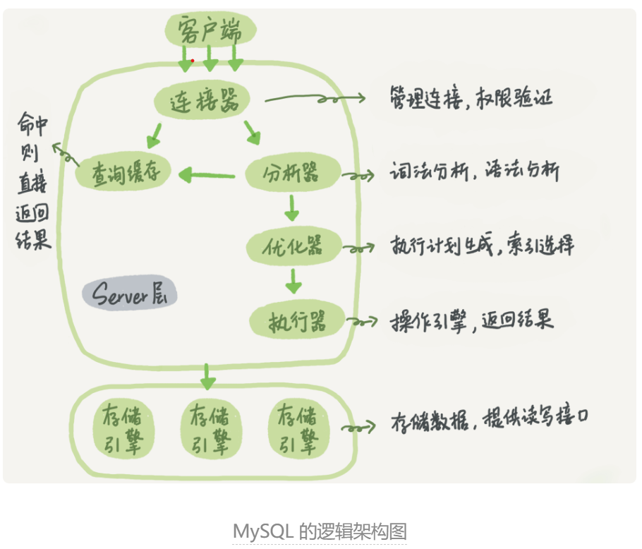

问题:
1. 如果表 T 中没有字段 k，而你执行了这个语句 select * from T where k=1, 那肯定是会报“不存在这个列”的错误： “Unknown column ‘k’ in ‘where clause’”。你觉得这个错误是在我们上面提到的哪个阶段报出来的呢？

   答：分析器

2. 判断一下你对这个表 T 有没有执行查询的权限是在哪个阶段？

   答：有些时候，SQL语句要操作的表不只是SQL字面上那些。比如如果有个触发器，得在执行器阶段（过程中）才能确定。优化器阶段前是无能为力的

总结一下在评论中看到的问题的解答
1. 连接器是从权限表里边查询用户权限并保存在一个变量里边以供查询缓存，分析器，执行器在检查权限的时候使用。
2. sql执行过程中可能会有触发器这种在运行时才能确定的过程，分析器工作结束后的precheck是不能对这种运行时涉及到的表进行权限校验的，所以需要在执行器阶段进行权限检查。另外正是因为有precheck这个步骤，才会在报错时报的是用户无权，而不是 k字段不存在（为了不向用户暴露表结构）。
3. 词法分析阶段是从information schema里面获得表的结构信息的。
4. 可以使用连接池的方式，将短连接变为长连接。
5. mysql_reset_connection是mysql为各个编程语言提供的api，不是sql语句。
6. wait_timeout是非交互式连接的空闲超时，interactive_timeout是交互式连接的空闲超时。执行时间不计入空闲时间。这两个超时设置得是否一样要看情况。

### 高级应用

- 视图
- 存储过程
- 游标
- 触发器

#### 视图

重用SQL语句。
- 简化复杂的SQL操作。在编写查询后，可以方便地重用它而不必知道它的基本查询细节。
- 使用表的组成部分而不是整个表。
- 保护数据。可以给用户授予表的特定部分的访问权限而不是整个表的访问权限。*这个项目用到过*

面试题

MySQL视图（View）是一种虚拟表，它是基于SQL语句的结果集创建的。
视图可以包含多个表中的列，也可以包含计算字段。视图的主要作用是简化复杂的查询，使得查询更加直观和容易理解。

以下是一些常见的MySQL视图面试题：

1. **视图的优缺点是什么？**
    - **优点：**
        - 提供了一种方法来简化复杂的查询。
        - 可以作为安全机制，限制对底层表的访问。
        - 可以跨数据库使用。
    - **缺点：**
        - 视图本身不存储数据，每次查询时都需要重新计算，可能会影响性能。
        - 视图定义可能会变得复杂，难以维护。

2. **如何创建视图？**
    - 使用 `CREATE VIEW` 语句创建视图：
    ```sql
   CREATE VIEW view_name AS
   SELECT column1, column2
   FROM table_name
   WHERE condition;
    ```

3. **如何修改视图？**
    - 视图是只读的，不能直接修改视图。要修改视图，需要先删除旧视图，然后重新创建一个新的视图。

4. **视图和表有什么区别？**
    - 表是实际存储数据的结构，而视图是基于 SQL 语句的结果集。
    - 表可以直接修改数据，而视图需要通过修改定义的 SQL 语句来修改。
    - 表有索引，视图没有。

5. **视图可以包含哪些类型的数据？**
    - 视图可以包含来自一个或多个表的数据。
    - 视图可以包含计算字段（如聚合函数）。
    - 视图可以跨数据库。

6. **视图可以用于哪些场景？**
    - 简化复杂查询。
    - 报表生成。
    - 数据分析。
    - 数据迁移。

7. **视图有哪些限制？**
    - 视图不能包含 AUTO_INCREMENT 字段。
    - 视图不能包含 BLOB 列。
    - 视图不能包含生成列（GENERATED COLUMNS）。

8. **如何删除视图？**
    使用 `DROP VIEW` 语句删除视图：

9. **视图可以跨数据库吗？**
    - 是的，视图可以跨数据库。

10. **视图可以包含哪些 SQL 函数？**
    - 视图可以包含大部分 SQL 函数，但有些函数（如随机数生成函数）可能不被支持。

#### 存储过程

一、提高性能方面

- 减少网络通信
   当需要对数据库进行一系列复杂的操作时，比如在电商系统中，用户下单后需要同时更新库存表、订单表、支付状态表等多个表。如果这些操作通过应用程序逐条发送SQL语句到数据库，每条SQL语句的执行都需要一次网络通信。而使用存储过程，可以将这些操作封装在存储过程内部，在数据库服务器端一次性执行，大大减少了网络通信次数，从而提高了系统的性能。

- 预编译优势

   存储过程在第一次被调用时，数据库会对其进行语法检查、优化并生成执行计划。之后每次调用存储过程时，数据库可以直接使用这个预先编译好的执行计划。例如，在一个数据仓库环境中，经常需要对海量数据进行复杂的查询和聚合操作。使用存储过程可以避免每次查询都重新编译SQL语句，利用预编译的执行计划快速执行，提高查询效率。

- 批量操作

   对于大量数据的插入、更新或删除操作，存储过程可以更高效地处理。例如，在一个企业资源规划（ERP）系统中，需要批量导入员工的考勤数据。通过存储过程可以一次处理多个数据记录，而不是逐条发送SQL语句，这样可以减少数据库的I/O操作，提高数据处理的速度。

二、增强安全性方面

- 限制用户对数据的直接访问

   可以通过存储过程来控制用户对数据库表的访问权限。例如，在一个银行系统中，普通柜员用户不能直接访问客户账户余额表，而是通过调用存储过程来查询余额。存储过程可以对用户输入进行严格的验证，防止用户执行非法操作，如直接修改账户余额等。这样可以避免用户直接对数据库表进行操作可能带来的安全风险，如SQL注入攻击等。

- 实现复杂的业务逻辑安全验证

   当业务逻辑比较复杂时，存储过程可以在数据库层面进行安全验证。以一个在线教育平台为例，学生提交作业后，需要验证作业是否符合课程要求、是否在截止日期之前提交等多种条件。这些复杂的验证逻辑可以在存储过程中实现，确保只有符合所有安全和业务规则的操作才能对数据库进行修改，从而保护数据的完整性和安全性。

*感觉存储过程可以类比成函数？*

#### 游标
#### 触发器

想要某条语句（或某些语句）在事件发生时自动执行，例如：每当订购一个产品时，都从库存数量中减去订购的数量

*触发器*是MySQL响应以下任意语句而自动执行的一条MySQL语句（或位于BEGIN和END语句之间的一组语句）,DELETE, INSERT, UPDATE


### 索引

1. 为什么用B+树

常见模型

| 模型     | 缺点                                                                                      |
|--------|-----------------------------------------------------------------------------------------|
| 哈希表    | 适用于只有等值查询的场景                                                                            |
| 有序数组   | 更新数据的时候，插入一个记录就必须得挪动后面所有的记录，成本太高                                                        |
| 二叉搜索树  | 可能劣化成有序数组                                                                               |
| 平衡二叉树  | 保持这棵树是平衡二叉树，时间复杂度也是 O(log(N))；二叉树是搜索效率最高的，但是实际上大多数的数据库存储却并不使用二叉树。其原因是，索引不止存在内存中，还要写到磁盘上 |
| B-tree | B+树可以更好地利用磁盘预读特性, 更快地进行范围查询                                                             |

100 万节点的平衡二叉树，树高 20。一次查询可能需要访问 20 个数据块。在机械硬盘时代，从磁盘随机读一个数据块需要 10 ms 左右的寻址时间。也就是说，对于一个 100 万行的表，如果使用二叉树来存储，单独访问一个行可能需要 20 个 10 ms 的时间

InnoDB 的一个整数字段索引为例，这个 N 差不多是 1200。这棵树高是 4 的时候，就可以存 1200 的 3 次方个值，这已经 17 亿了。考虑到树根的数据块总是在内存中的，一个 10 亿行的表上一个整数字段的索引，查找一个值最多只需要访问 3 次磁盘。其实，树的第二层也有很大概率在内存中，那么访问磁盘的平均次数就更少了

2. InnoDB 的索引组织结构

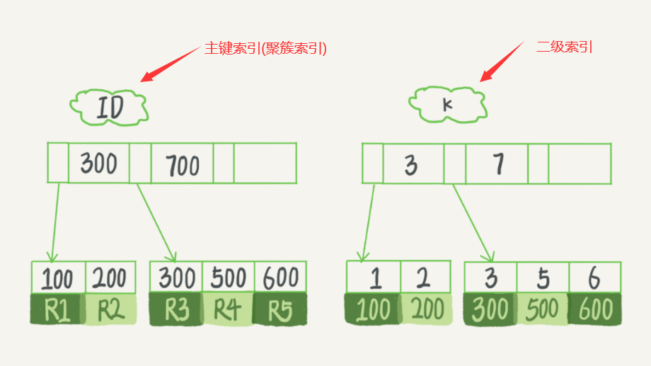

- 基于主键索引和普通索引的查询有什么区别？

  如果语句是 select * from T where ID=500，即主键查询方式，则只需要搜索 ID 这棵 B+ 树；

  如果语句是 select * from T where k=5，即普通索引查询方式，则需要先搜索 k 索引树，得到 ID 的值为 500，再到 ID 索引树搜索一次。这个过程称为`回表`。

- 在一些建表规范里面要求建表语句里一定要有自增主键。哪些场景下应该使用自增主键，而哪些场景下不应该

  自增主键的插入数据模式，正符合了我们前面提到的递增插入的场景。每次插入一条新记录，都是追加操作，都不涉及到挪动其他记录，也不会触发叶子节点的分裂

  典型的KV场景适合用业务字段直接做主键

- 覆盖索引

回表的问题，如何解决？

需要执行几次树的搜索操作，会扫描多少行？
```SQL
select * from T where k between 3 and 5;
```
在这个过程中，回到主键索引树搜索的过程，我们称为回表。这个查询过程读了k索引树的3条记录，回表了两次

1. 在k索引树上找到 k=3 的记录，取得 ID = 300； -- 查找k
2. 再到ID索引树查到 ID=300 对应的 R3； -- 回表
3. 在k索引树取下一个值 k=5，取得 ID=500； -- 查找k
4. 再回到 ID 索引树查到 ID=500 对应的 R4；-- 回表
5. 在k索引树取下一个值 k=6，不满足条件，循环结束。 -- 查找k

建立联合索引(ID, k)

如果执行的语句是 select ID from T where k between 3 and 5，这时只需要查 ID 的值，而 ID 的值已经在 k 索引树上了，因此可以直接提供查询结果，不需要回表。也就是说，在这个查询里面，索引 k 已经“覆盖了”我们的查询需求，我们称为**覆盖索引**。

- 最左前缀原则

在建立联合索引的时候，如何安排索引内的字段顺序?

评估标准是，索引的复用能力。因为可以支持最左前缀，所以当已经有了 (a,b) 这个联合索引后，一般就不需要单独在 a 上建立索引了。因此，第一原则是，如果通过调整顺序，可以少维护一个索引，那么这个顺序往往就是需要优先考虑采用的

- 索引下推

不符合最左前缀的部分，会怎么样呢？模糊查询阻断了age索引的使用

以市民表的联合索引（name, age）为例
```SQL
mysql> select * from tuser where name like '张%' and age=10 and ismale=1;
```

优化之前 5.6之前：

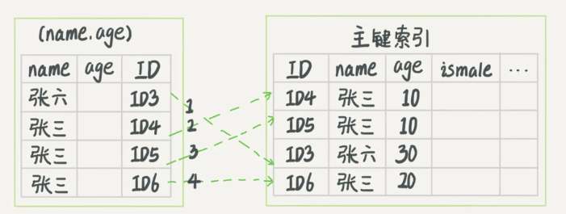

可以在索引遍历过程中，对索引中包含的字段先做判断，直接过滤掉不满足条件的记录，减少回表次数

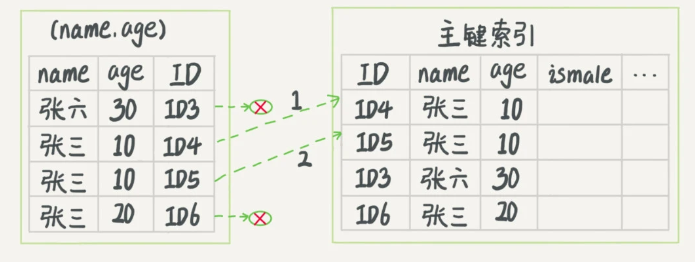


#### 索引相关问题

### 事务

SQL标准的事务隔离级别包括：

- 读未提交（read uncommitted）: 一个事务还没提交时，它做的变更就能被别的事务看到
- 读提交（read committed）: 一个事务提交之后，它做的变更才会被其他事务看到
- 可重复读（repeatable read）: 一个事务执行过程中看到的数据，总是跟这个事务在启动时看到的数据是一致的。当然在可重复读隔离级别下，未提交变更对其他事务也是不可见的
- 串行化（serializable ）: 对于同一行记录，“写”会加“写锁”，“读”会加“读锁”。当出现读写锁冲突的时候，后访问的事务必须等前一个事务执行完成，才能继续执行

**Example:**

<p>
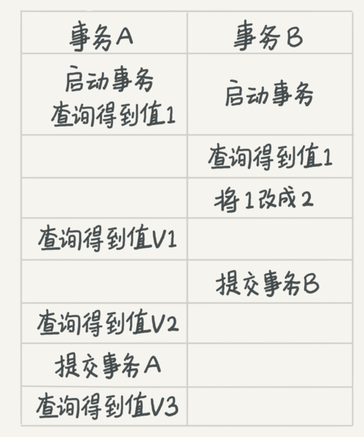
</p>

不同事务隔离级别的值也是不同的：
- read uncommitted：v1 = 2, v2 = 2, v3 = 2
- read committed：v1 = 2, v2 = 2, v3 = 2
- repeatable read：v1 = 2, v2 = 2, v3 = 2
- serializable：v1 = 2, v2 = 2, v3 = 2

### 锁
- 全局锁
- 表级锁
- 行锁

#### 全局锁
全局锁就是对整个数据库实例加锁: Flush tables with read lock (FTWRL)

影响操作：增删改数据（DML)，加字段等修改表结构的操作（DDL）

**全局锁的典型使用场景是，做全库逻辑备份**
- 如果你在主库上备份，那么在备份期间都不能执行更新，业务基本上就得停摆；
- 如果你在从库上备份，那么备份期间从库不能执行主库同步过来的binlog，会导致主从延迟。

类似的功能：
1. –single-transaction

官方自带mysqldump。使用参数–single-transaction.导数据之前就会启动一个事务，来确保拿到**一致性视图**。而由于MVCC的支持，这个过程中数据是可以正常更新的

只适用于所有的表使用事务引擎的库, **MyISAM**这种不支持事务的引擎,只能全局加锁

1. set global readonly=true
    - 在有些系统中，readonly 的值会被用来做其他逻辑，比如用来判断一个库是主库还是备库
    - 在异常处理机制上有差异。如果执行FTWRL命令之后由于客户端发生异常断开，那么MySQL会自动释放这个全局锁，整个库回到可以正常更新的状态。而将整个库设置为readonly之后，如果客户端发生异常，则数据库就会一直保持readonly状态，这样会导致整个库长时间处于不可写状态，风险较高。

#### 表级锁
表级别的锁有两种：一种是表锁，一种是元数据锁（meta data lock，MDL)

- MDL

当对一个表做DML的时候，加MDL读锁；当要对表做结构变更DDL操作的时候，加MDL写锁。

读锁之间不互斥，因此你可以有多个线程同时对一张表增删改查。

读写锁之间、写锁之间是互斥的，用来保证变更表结构操作的安全性。因此，如果有两个线程要同时给一个表加字段，其中一个要等另一个执行完才能开始执行。

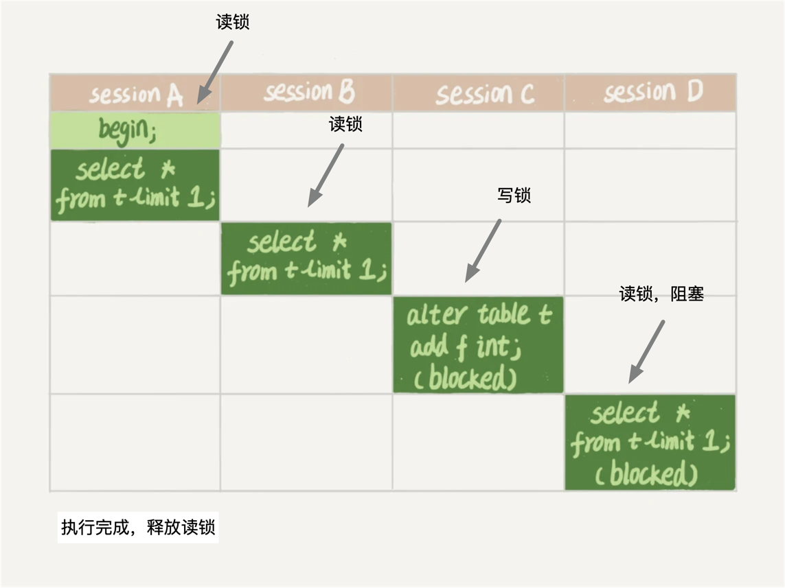

写锁没有释放之前，这个表现在完全不可读写了

**如何安全地给小表加字段？**

有长事务在执行，要考虑先暂停DDL，或者kill掉这个长事务

比较理想的机制是，在alter table语句里面设定等待时间

**Q：**
备份一般都会在备库上执行，你在用–single-transaction方法做逻辑备份的过程中，如果主库上的一个小表做了一个DDL，比如给一个表上加了一列。这时候，从备库上会看到什么现象呢？

#### 行锁

InnoDB是支持行锁的，这也是MyISAM被InnoDB替代的重要原因之一

**两阶段锁**

在InnoDB事务中，行锁是在需要的时候才加上的，但并不是不需要了就立刻释放，而是要等到事务结束时才释放

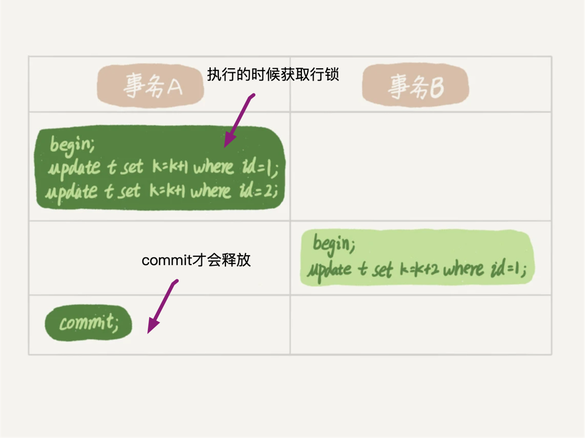

**死锁**

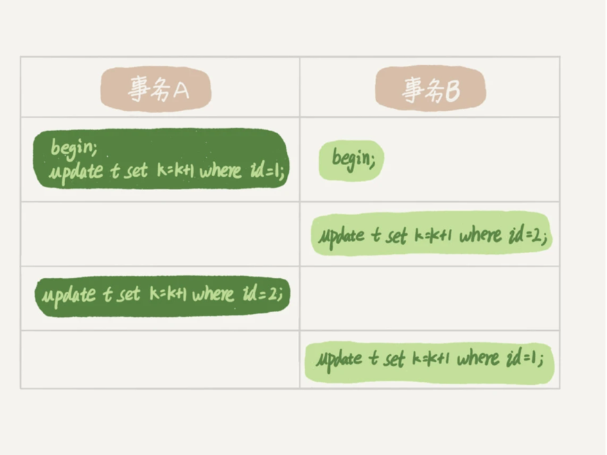

死锁检测：
1. 直接进入等待，直到超时。这个超时时间可以通过参数innodb_lock_wait_timeout来设置，但是时间不好设置
2. **正常策略采用**发起死锁检测，发现死锁后，主动回滚死锁链条中的某一个事务，让其他事务得以继续执行。将参数*innodb_deadlock_detect*设置为on，表示开启这个逻辑。

**死锁检测要耗费大量的CPU资源**：
一个事务F尝试获取锁β时被阻塞，此时就要看看持有锁β的事务C有没有被阻塞，如果没有被阻塞则没事，
如果事务C被锁γ阻塞，则继续查看持有锁γ的事务D有没有被阻塞...这样一直检查下去，假如最后检查到的事务E被锁α阻塞，而事务F持有α，则说明发生了循环等待，即检查到了死锁

你可以考虑通过**将一行改成逻辑上的多行**来减少锁冲突。可以考虑放在多条记录上，比如10个记录，总额等于这10个记录的值的总和。每次账户加金额的时候，随机选其中一条记录来加。
这样每次冲突概率变成原来的1/10，可以减少锁等待个数，也就**减少**了死锁检测的CPU消耗

**Q：**

如果你要删除一个表里面的前 10000 行数据，有以下三种方法可以做到，会选择哪一种方法呢？为什么呢？：
1. 直接执行 delete from T limit 10000;
2. 在一个连接中循环执行 20 次 delete from T limit 500
3. 第三种，在 20 个连接中同时执行 delete from T limit 500。

### 日志

### 优化

#### **更新语句**

1. redo log（重做日志）

    redo log就是mysql的WAL，当有一条记录需要更新的时候，InnoDB就会先把记录写到 redo log里面，并更新内存，这个时候更新就算完成了。
    同时，InnoDB引擎会在适当的时候，将这个操作记录更新到磁盘里面
    
    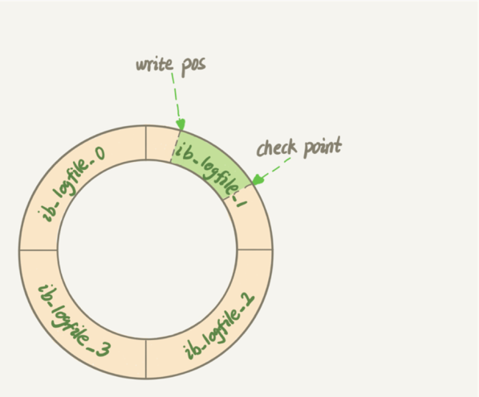
    
    > 有了redo log，InnoDB就可以保证即使数据库发生异常重启，之前提交的记录都不会丢失，这个能力称为crash-safe。

2. binlog（归档日志）

为什么会有两份日志呢？

MySQL自带的引擎是MyISAM，但是MyISAM没有crash-safe的能力，binlog日志只能用于归档。

#### **order语句流程与优化**

以下面为例：
```SQL
CREATE TABLE `t` (
    `id` int(11) NOT NULL,
    `city` varchar(16) NOT NULL,
    `name` varchar(16) NOT NULL,
    `age` int(11) NOT NULL,
    `addr` varchar(128) DEFAULT NULL,
     PRIMARY KEY (`id`),
     KEY `city` (`city`)
) ENGINE=InnoDB;

# 查询语句
select city,name,age from t where city='杭州' order by name limit 1000  ;
```

*Using filesort*表示的是需要排序

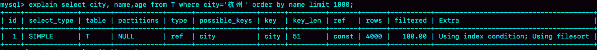

1. 全字段排序

   到主键id索引取出整行，取name、city、age三个字段的值，存入sort_buffer中

   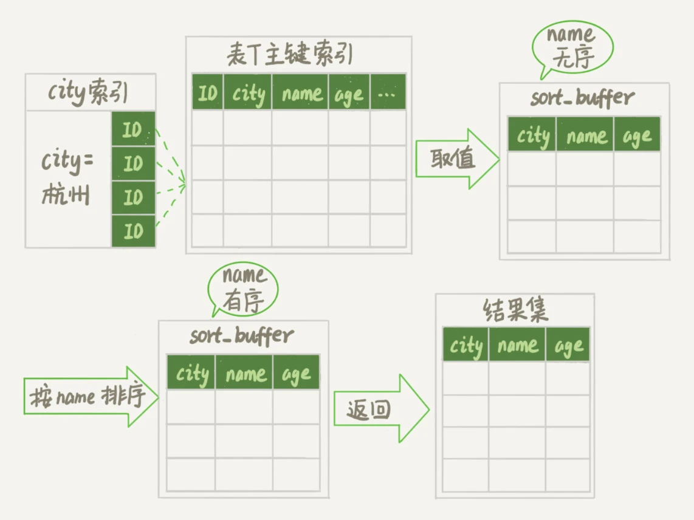

   *sort_buffer_size*是MySQL为排序开辟的内存sort_buffer的大小。如果要排序的数据量小于sort_buffer_size，就在内存中完成。如果排序数据量太大，则利用磁盘临时文件辅助排序

2. rowid排序

   *max_length_for_sort_data*是专门控制用于排序的行数据的长度的一个参数。如果单行的长度超过这个值，就认为单行太大，要换一个算法

   

   如果MySQL认为内存足够大，会优先选择全字段排序，把需要的字段都放到sort_buffer中，这样排序后就会直接从内存里面返回查询结果了，不用再回到原表去取数据。
   
   rowid排序会要求回表多造成磁盘读，因此不会被优先选择。
   
   **设计思想：如果内存够，就要多利用内存，尽量减少磁盘访问。**

3. 省去排序环节

   从city索引上取出来的行，天然就是按照name递增排序的话，就可以不用再排序了
   
   ```SQL
   alter table t add index city_user(city, name);
   ```
   
   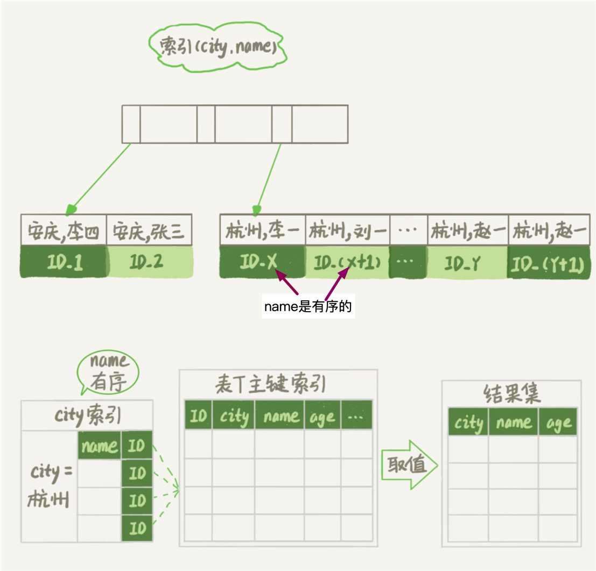
   
   这个查询过程不需要临时表，也不需要排序
   
   **以上的例子还能继续优化：可以用覆盖索引**
   
   ```SQL
   alter table t add index city_user_age(city, name, age);
   ```
   
   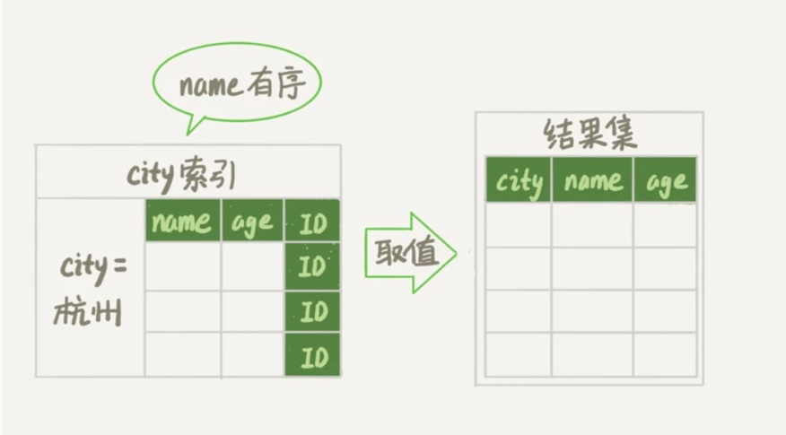
   
   explain结果：
   
   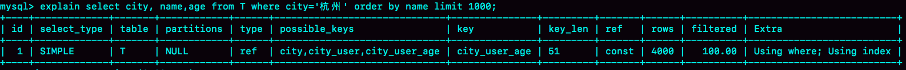
   
   Extra字段里面多了“Using index”，表示的就是使用了覆盖索引，性能上会快很多


#### **join语句流程与优化**

1. 使用join有什么问题呢？
2. 果有两个大小不同的表做join，应该用哪个表做驱动表呢？

创建如下语句：t1有100行数据，t2有1000
```SQL
CREATE TABLE `t2` (
  `id` int(11) NOT NULL,
  `a` int(11) DEFAULT NULL,
  `b` int(11) DEFAULT NULL,
  PRIMARY KEY (`id`),
  KEY `a` (`a`)
) ENGINE=InnoDB;

create table t1 like t2;
insert into t1 (select * from t2 where id<=100)
```

**Index Nested-Loop Join(NLJ)**

straight_join让MySQL使用固定的连接方式执行查询，这样优化器只会按照指定的方式去join。
t1是驱动表，t2是被驱动表
```SQL
select * from t1 straight_join t2 on (t1.a=t2.a);
```

使用索引字段join的explain结果:

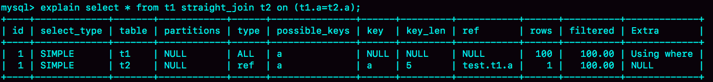

被驱动表t2的字段a上有索引，join过程用上了这个索引。这个过程是先遍历表t1，然后根据从表t1中取出的每行数据中的a值，去表t2中查找满足条件的记录

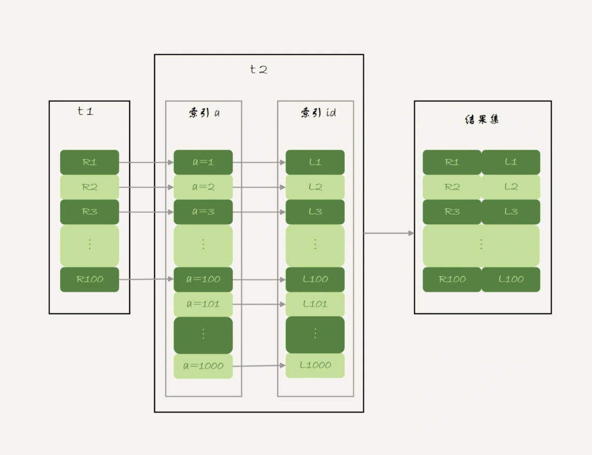

**驱动表是走全表扫描，而被驱动表是走树搜索**


## 2. Mybatis

### 一、全局脉络（先建立索引）
1. 入口：SqlSessionFactory → SqlSession → Mapper接口
2. 配置两份文件：
    - mybatis-config.xml（全局）
    - *Mapper.xml（SQL）
3. 四大核心对象：Executor | StatementHandler | ParameterHandler | ResultSetHandler
4. 三大解析器：XMLConfigBuilder | XMLMapperBuilder | XMLStatementBuilder
5. 两级缓存 + 延迟加载 + 插件拦截链
6. 动态SQL四件套：if/choose/trim/foreach
7. 日志 + 事务 + 连接池全部委托给DataSource
8. Spring集成后：Mapper扫描 → FactoryBean → 代理 → SqlSessionTemplate（线程安全）

### 二、配置精要（必须手写三遍）
1. environments → dataSource 类型：UNPOOLED/POOLED/JNDI
2. settings 高频项：
    - cacheEnabled
    - lazyLoadingEnabled
    - multipleResultSetsEnabled
    - useGeneratedKeys
    - defaultExecutorType：SIMPLE（默认）/REUSE/BATCH
    - mapUnderscoreToCamelCase：true即可省掉90%的resultMap
3. typeAliases + typeHandlers：
    - 枚举通用 EnumTypeHandler
    - JSON 字段用 JsonTypeHandler（自定义）
4. mappers四种注册方式：resource / url / class / package；Spring启动用 @MapperScan 批量扫描
5. 数据库方言：分页靠PageHelper（物理分页 = 拦截器 + ThreadLocal保存Page对象）

### 三、映射三兄弟（resultType / resultMap / sql片段）
1. resultType场景：列名 = 属性名或已开启驼峰
2. resultMap必填场景：
    - 列名 ≠ 属性名
    - 一对一级联
    - 一对多级联
    - 构造器注入
    - 枚举/JSON 字段
3. 级联策略：
    - association（1:1）嵌套select会N+1，推荐嵌套resultMap一次join取出
    - collection（1:N）用ofType指定泛型；分页场景一定加“嵌套resultMap + 分页子查询”，防止内存爆炸
4. 鉴别器：discriminator实现单表多态（例如：Payment→Alipay/WxPay子类）
5. 可重用sql片段：&lt;sql id="cols"&gt;…&lt;/sql&gt; + &lt;include refid="cols"/&gt;

### 四、动态SQL {id="sql_1"}
1. if test里OGNL可以直接调用静态方法：@com.xxx.TypeEnum@isValid(val)
2. choose/when/otherwise = switch…case
3. trim前缀后缀：prefix / suffix / prefixOverrides / suffixOverrides
    - 万能where：&lt;trim prefix="where" prefixOverrides="and |or "&gt;
4. foreach三大属性：collection / index / item / separator
    - 批量插入：foreach 套 values，记得 allowMultiQueries=true
5. script 注解：@Select("&lt;script&gt;…&lt;/script&gt;")，写在 Mapper 接口里，省XML

### 五、# 与 $ 安全底线
1. #{} → PreparedStatement占位符 → 防SQL注入
2. ${} → 字符串拼接 → 只能用于列名、排序字段、表名；前端传参必须白名单校验

### 六、缓存
1. 一级缓存：SqlSession级，默认开启，commit/close/flush 即失效；  
   同线程连续查询可命中，但分布式场景下会读到脏数据 → 建议更新操作后 sqlSession.clearCache()
2. 二级缓存：namespace级，要求：&lt;cache/&gt; 标签 + 实体类可序列化；  
   缓存失效策略：flushCache=true（语句级强制清空）、useCache=false（禁用二级）
3. 分布式必关二级缓存，或者换Redis+自定义Cache，版本号/广播失效

### 七、延迟加载（打破 N+1）
1. settings开lazyLoadingEnabled + aggressiveLazyLoading=false
2. 触发方式：调用getter时才发SQL
   原理Javassist代理实体，拦截getter → 通过MetaObject再查库
3. 陷阱：
    - 事务已关闭会报 LazyInitializationException
    - 在 Spring 中必须在 Service 层事务内访问

### 八、插件 / 拦截器（万能改写）
1. 签名：@Intercepts({@Signature(type=Executor.class, method="query", args=…)})
2. 典型场景：分页、多租户字段自动拼接、读写分离、慢SQL统计
3. 责任链顺序：插件 → ParameterHandler → StatementHandler → ResultSetHandler → Executor
4. 实现步骤：实现 Interceptor → 在 mybatis-config 或 Spring 注入插件 Bean
5. PageHelper 就是基于 Executor.query 拦截器做的

### 九、批量与事务
1. ExecutorType.BATCH：
   SqlSession session = sqlSessionFactory.openSession(ExecutorType.BATCH, false);  
   每1000条 flushStatements() 一次，最后commit
2. Spring 集成：@Transactional + SqlSessionTemplate 无法切换 BATCH，  
   需要手工注入 SqlSessionFactory，在 Service 内部 openSession(BATCH)
3. 返回主键：useGeneratedKeys=true keyProperty="id" 批量插入后，参数对象里 id 会被回填（MySQL 支持）

### 十、常见异常与排查
1. BindingException：接口与XML不对应 → 检查namespace / 方法名 / 参数
2. TooManyResultsException：期望一条返回多条 → 换 selectOne 或 limit 1
3. N+1：日志里瞬间多出成百上千 SQL → association嵌套select 导致，改为join
4. 缓存脏读：线上更新后查询仍旧值 → 二级缓存未失效，关或加版本
5. 分页总数不对：PageHelper必须紧挨Mapper查询语句，中间不能有任何查询

### BaseExecutor

BaseExecutor是模板方法，子类只要实现四个基本方法doUpdate，doFlushStatements，doQuery，doQueryCursor

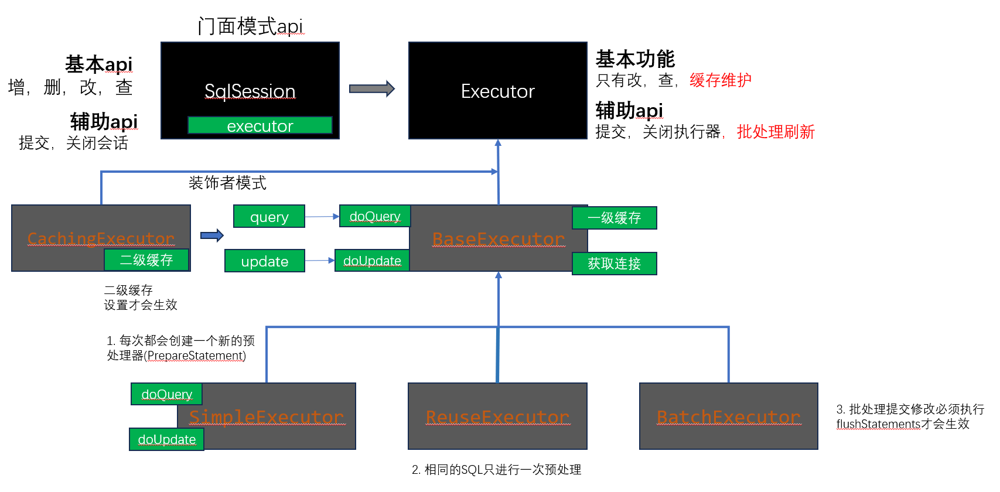

```
# 1. SimpleExecutor
  @Test
  void testSimpleExecutor() throws Exception {
    SimpleExecutor executor = new SimpleExecutor(config, new JdbcTransaction(ds, null, false));
    MappedStatement selectStatement = ExecutorTestHelper.prepareSelectOneAuthorMappedStatement(config);
    Author author = new Author(-1, "someone", "******", "someone@apache.org", null, Section.NEWS);
    executor.doQuery(selectStatement, author.getId(), RowBounds.DEFAULT, Executor.NO_RESULT_HANDLER, selectStatement.getBoundSql(author.getId()));
    executor.doQuery(selectStatement, author.getId(), RowBounds.DEFAULT, Executor.NO_RESULT_HANDLER, selectStatement.getBoundSql(author.getId()));
  }

  output:
    DEBUG [main] - Opening JDBC Connection
    DEBUG [main] - Setting autocommit to false on JDBC Connection [org.apache.derby.impl.jdbc.EmbedConnection@1590481849 (XID = 1140), (SESSIONID = 5), (DATABASE = ibderby), (DRDAID = null) ]
    DEBUG [main] - ==>  Preparing: SELECT * FROM author WHERE id = ?
    DEBUG [main] - ==> Parameters: -1(Integer)
    DEBUG [main] - <==      Total: 0
    DEBUG [main] - ==>  Preparing: SELECT * FROM author WHERE id = ?
    DEBUG [main] - ==> Parameters: -1(Integer)
    DEBUG [main] - <==      Total: 0

# 2. ReuseExecutor 预处理只执行了一次
ReuseExecutor executor = new ReuseExecutor(config, new JdbcTransaction(ds, null, false));
 output:
 DEBUG [main] - Opening JDBC Connection
DEBUG [main] - Setting autocommit to false on JDBC Connection [org.apache.derby.impl.jdbc.EmbedConnection@1777043124 (XID = 1317), (SESSIONID = 5), (DATABASE = ibderby), (DRDAID = null) ]
DEBUG [main] - ==>  Preparing: SELECT * FROM author WHERE id = ?
DEBUG [main] - ==> Parameters: -1(Integer)
DEBUG [main] - <==      Total: 0
DEBUG [main] - ==> Parameters: -1(Integer)
DEBUG [main] - <==      Total: 0

# 3. BatchExecutor 大量的修改操作, 查询操作和simple没有区别
    BatchExecutor executor = new BatchExecutor(config, new JdbcTransaction(ds, null, false));
```

#### 一级缓存

一级缓存和获取连接在公共部分，所有放在BaseExecutor
```
 try (SqlSession sqlSession1 = sqlSessionFactory.openSession()) {
      PersonMapper pm = sqlSession1.getMapper(PersonMapper.class);
      List<Person> people = pm.selectById(1); // selectById是statementID
//      sqlSession1.clearCache();
      List<Person> people1 = pm.selectById(1);
      System.out.println(people1 == people);
```

命中一级缓存情况
1. sql和参数必须相同
2. 必须相同的statementID
3. sqlSession必须一样 --- `会话级缓存`
4. RowBounds必须相同

一级缓存失效：
1. 手动清空 -- sqlSession1.clearCache
2. @Options(flushCache = FlushCachePolicy.TRUE)
3. 执行update
4. 缓存作用域缩小到STATEMENT --修改配置文件/mybatis-config.xml
```
public enum LocalCacheScope {
  SESSION,STATEMENT
}

```
```
<configuration>
    <settings>
        <setting name="defaultExecutorType" value="SIMPLE"/>
        <setting name="useGeneratedKeys" value="true"/>
        <setting name="localCacheScope" value="STATEMENT"/>
    </settings>

```

### StatementHandler

StatementHandler是MyBatis四大核心对象之一，负责一条SQL语句的“真正执行过程”。

拿到 BoundSql → 创建JDBC Statement → 绑定实参 → 执行SQL → 把结果集交给ResultSetHandler

因此它处于 “参数处理之后、结果处理之前” 这一关键位置

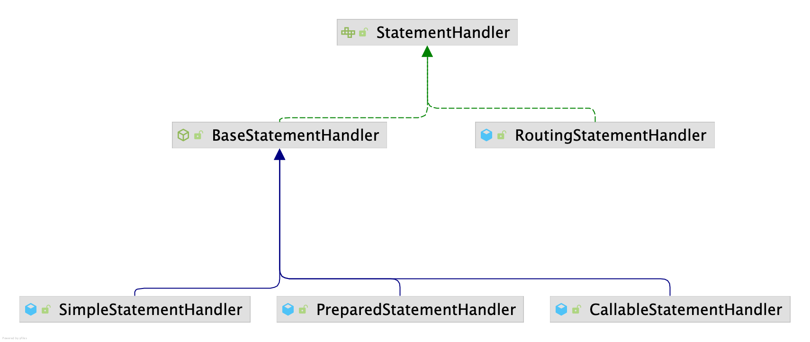

基本上都会用PreparedStatementHandler，防止SQL注入。

```Mermaid
sequenceDiagram
    participant App as 业务代码
    participant BJH as Base JDBC处理器
    participant SH  as StatementHandler
    participant PH  as ParameterHandler
    participant RH  as ResultSetHandler

    %% 1. 初始化阶段
    App->>BJH: 创建 Base JDBC处理器
    BJH->>SH:  创建 StatementHandler
    BJH->>PH:  创建 ParameterHandler
    BJH->>RH:  创建 ResultSetHandler

    %% 2. 声明 & 创建 Statement
    App->>SH: 声明 Statement
    SH->>SH:  创建 Statement

    %% 3. 预处理（Prepared）
    alt 预编译 SQL
        SH->>SH: 预处理 SQL
        SH->>PH: 设置参数入口
        PH->>PH: 解析并填充参数
        PH-->>SH: 完成参数设置
    end

    %% 4. 执行
    App->>SH: 调用 execute
    SH->>SH: 执行 SQL

    %% 5. 结果集处理
    SH->>RH: 结果集处理
    RH-->>SH: 返回处理后的结果

    %% 6. 关闭
    SH->>SH: 关闭 Statement
    SH-->>App: 结束
```

在executor里面调用
```Java
  @Override
  public <E> List<E> doQuery(MappedStatement ms, Object parameter, RowBounds rowBounds, ResultHandler resultHandler,
      BoundSql boundSql) throws SQLException {
    Statement stmt = null;
    try {
      Configuration configuration = ms.getConfiguration();
      StatementHandler handler = configuration.newStatementHandler(wrapper, ms, parameter, rowBounds, resultHandler,
          boundSql);
      stmt = prepareStatement(handler, ms.getStatementLog());
      return handler.query(stmt, resultHandler);
    } finally {
      closeStatement(stmt);
    }
  }
```

为什么要用configuration去创建StatementHandler？
1. 统一
2. 插件拦截

#### Step 1: 预处理

```Java
  private Statement prepareStatement(StatementHandler handler, Log statementLog) throws SQLException {
    Statement stmt;
    Connection connection = getConnection(statementLog);
    // 创建statement
    stmt = handler.prepare(connection, transaction.getTimeout());
    // 参数化处理
    handler.parameterize(stmt);
    return stmt;
  }
```

BaseStatementHandler是用来处理一些共性的事件
```Java
  @Override
  public Statement prepare(Connection connection, Integer transactionTimeout) throws SQLException {
    ErrorContext.instance().sql(boundSql.getSql());
    Statement statement = null;
    try {
      statement = instantiateStatement(connection);
      setStatementTimeout(statement, transactionTimeout);
      setFetchSize(statement);
      return statement;
    } catch (Exception e) {
        
    }
  }
```
调用抽象方法instantiateStatement

#### Step 2: 参数设置


### ResultSetHandler


ResultHandler的例子：
```Java
  void resultHandlerTest() {
    try (SqlSession sqlSession = sqlSessionFactory.openSession()) {
        List<Object> list = new ArrayList<>();
        ResultHandler handler = resultContext -> {
            if (resultContext.getResultCount() == 1) {
                resultContext.stop();
            }
            list.add(resultContext.getResultObject());
        };
        // handler就保留了一条结果
        sqlSession.select("org.apache.ibatis.submitted.blobtest.selectAll", handler);
    }
}
```

代码流程图：


### 映射体系

```Mermaid
graph TD
A[反射模块]
A -->|14| B[Reflector和ReflectorFactory]
B --> B1[提供对象的元数据访问,缓存]
A -->|37| C[TypeParameterResolver]
C --> C1[对上面Reflector的增强]
A -->|1| D[ObjectFactory]
D --> D1[创建对象]
A -->|11| E[Property]
E --> E1[复杂属性的支持，特别是特殊的表达式，而Reflector处理的会比较简单]
A -->|1| F[MetaClass]
F --> F1[Reflector和ReflectorFactory的组合使用，实现复杂属性表达式的解析]
A -->|1| G[ObjectWrapper]
G --> G1[对一个对象进行了封装，方便通过这个类来对对象进行属性的设置以及读取属性
然后根据被封装对象的类型，分别使用不同的子类来进行封装]
A -->|1| H[MetaObject]
H --> H1[完成属性表达式的解析操作]
```

#### 可能会被问到的问题

- MyBatis中反射模块的作用是什么？

  在进行**参数处理**、**结果集映射**等操作时会使用到大量的反射操作，Java中的反射功能虽然强大，但是代码编写起来比较复杂且容易出错，为了简化反射操作的相关代码，MyBatis提供了专门的反射模块，该模块位于org.apache.ibatis.reflection包下，它对常见的反射操作做了进一步的封装，提供了更加简洁方便的反射API。

  **ParameterHandler**：在处理预编译语句（PreparedStatement）时，ParameterHandler负责将Java对象的属性值设置到SQL语句的参数中。它使用MetaObject来动态获取对象的属性值。

  **ResultSetHandler**：当从数据库查询结果集（ResultSet）中读取数据并映射到Java对象时，ResultSetHandler使用MetaObject来动态设置对象的属性值。

- Reflector和ReflectorFactory类的功能是什么？

  Reflector类封装了Java反射API，提供了获取和设置对象属性的方法。ReflectorFactory类用于创建和管理Reflector实例，通过缓存机制提高性能

- 如何使用TypeParameterResolver来解析泛型参数？

  解析字段，方法返回值和方法参数的类型

- ObjectFactory在MyBatis中扮演什么角色？

  这个需要看了结果映射和参数映射才行

- MetaClass类如何提供对JavaBean类的元数据访问？

  MetaClass通常与MetaObject一起使用，MetaObject是对单个对象的封装，而MetaClass是对类的封装。
  MetaObject使用MetaClass来获取类的元数据，从而可以动态地访问和修改对象的属性

  如下面的笔记，MetaClass其实用到了Reflector，去获取了Class的类和方法，由于ReflectorFactory可以设置缓存，所以只需要初始化一次就行

- ObjectWrapper接口如何帮助处理不同类型的对象包装？
- MetaObject类如何提供对对象属性的动态访问？
- 如何自定义ObjectFactory或ObjectWrapper以扩展MyBatis的反射功能？

#### Reflector

Reflector是反射模块的基础，每个Reflector对象都对应一个类，在Reflector中缓存了反射需要使用的类的元信息

在Reflector的构造器中会完成相关的属性的初始化操作

```java
  // 解析指定的Class类型 并填充上述的集合信息
  public Reflector(Class<?> clazz) {
    type = clazz; // 初始化 type字段
    addDefaultConstructor(clazz);// 设置默认的构造方法
    addGetMethods(clazz);// 获取getter方法
    addSetMethods(clazz); // 获取setter方法
    addFields(clazz); // 处理没有getter/setter方法的字段
    // 初始化 可读属性名称集合
    readablePropertyNames = getMethods.keySet().toArray(new String[0]);
    // 初始化 可写属性名称集合
    writablePropertyNames = setMethods.keySet().toArray(new String[0]);
    // caseInsensitivePropertyMap记录了所有的可读和可写属性的名称 也就是记录了所有的属性名称
    for (String propName : readablePropertyNames) {
      // 属性名称转大写
      caseInsensitivePropertyMap.put(propName.toUpperCase(Locale.ENGLISH), propName);
    }
    for (String propName : writablePropertyNames) {
      // 属性名称转大写
      caseInsensitivePropertyMap.put(propName.toUpperCase(Locale.ENGLISH), propName);
    }
  }
```

ReflectorFactory接口主要实现了对Reflector对象的创建和**缓存**。

接口的定义如下,该接口提供了DefaultReflectorFactory这一个实现类

```java
public interface ReflectorFactory {
    
  // 检测该ReflectorFactory是否缓存了Reflector对象
  boolean isClassCacheEnabled();
  
  // 设置是否缓存Reflector对象
  void setClassCacheEnabled(boolean classCacheEnabled);
  
  // 创建指定了Class的Reflector对象
  Reflector findForClass(Class<?> type);
}
```

```java
public class DefaultReflectorFactory implements ReflectorFactory {
  private boolean classCacheEnabled = true;
  // 实现对 Reflector 对象的缓存
  private final ConcurrentMap<Class<?>, Reflector> reflectorMap = new ConcurrentHashMap<>();

  public DefaultReflectorFactory() {
  }

  @Override
  public boolean isClassCacheEnabled() {
    return classCacheEnabled;
  }

  @Override
  public void setClassCacheEnabled(boolean classCacheEnabled) {
    this.classCacheEnabled = classCacheEnabled;
  }

  @Override
  public Reflector findForClass(Class<?> type) {
    if (classCacheEnabled) {// 开启缓存
      // synchronized (type) removed see issue #461
      return reflectorMap.computeIfAbsent(type, Reflector::new);
    } else {
      // 没有开启缓存就直接创建
      return new Reflector(type);
    }
  }
}
```

针对于Class中Field和Method的调用，在MyBatis中封装了Invoker对象来统一处理

```java
public interface Invoker {
  // 执行Field或者Method
  Object invoke(Object target, Object[] args) throws IllegalAccessException, InvocationTargetException;

  // 返回属性相应的类型
  Class<?> getType();
}
```

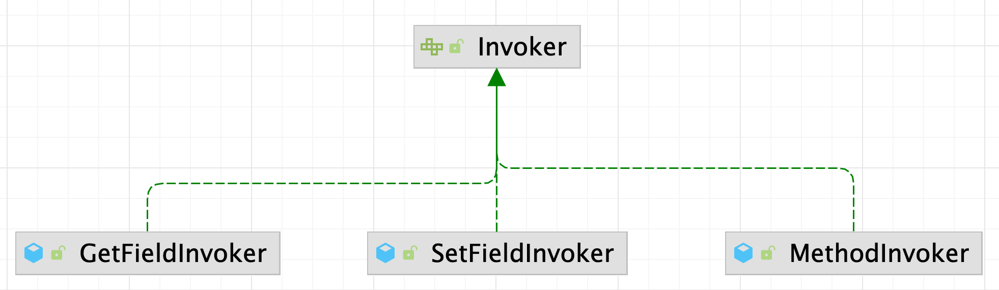

样例
```Java
  @Test
  void test() throws InvocationTargetException, InstantiationException, IllegalAccessException {
    Reflector reflector= new Reflector(RichType.class);
    
    // class org.apache.ibatis.domain.misc.RichType
    System.out.println(reflector.getType());
    String[] gettable = reflector.getGetablePropertyNames();
    // [richType, richProperty, richMap, richList, richField]
    System.out.println(Arrays.toString(gettable));

    Reflector reflector2 = new DefaultReflectorFactory().findForClass(RichType.class);
    Object o = reflector2.getDefaultConstructor().newInstance();
    Invoker richPropertySetter = reflector2.getSetInvoker("richProperty");
    richPropertySetter.invoke(o, new String[]{"666"});
    Invoker richPropertyGetter = reflector2.getGetInvoker("richProperty");
    Object res = richPropertyGetter.invoke(o, null);
    System.out.println(res);
  }
```

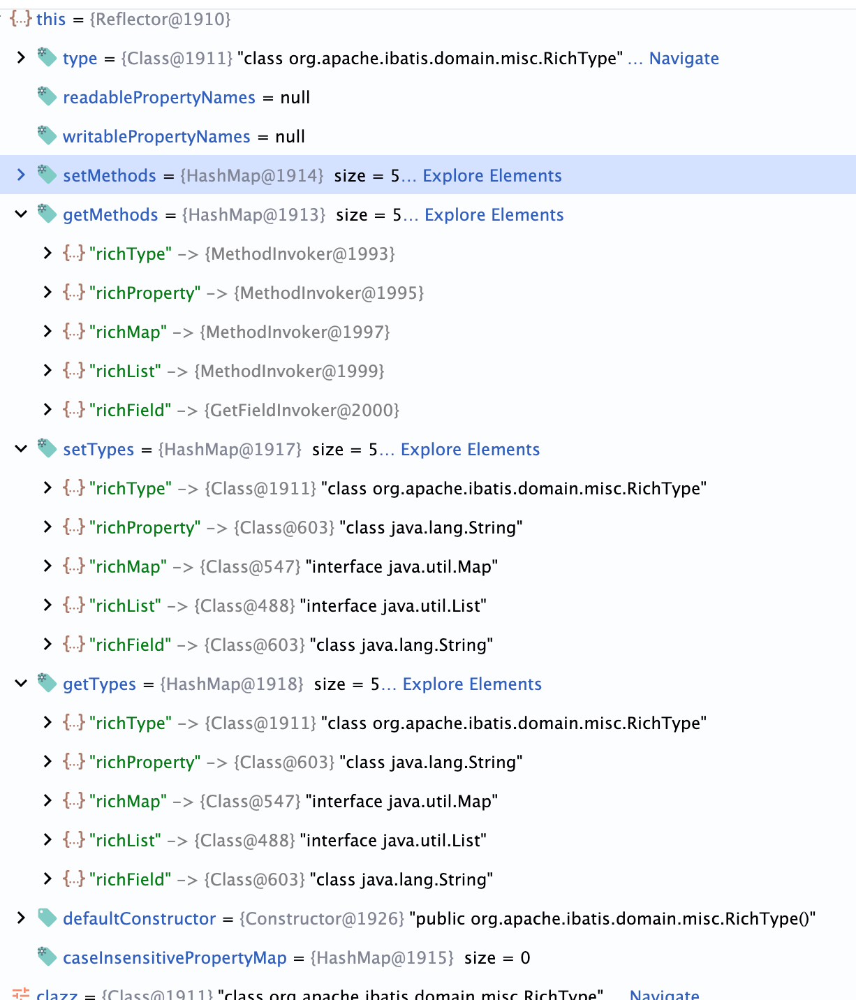

#### MetaClass

在Reflector中可以针对普通的属性操作，但是如果出现了比较复杂的属性，比如 private Person person; 
要查找的表达式person.userName.针对这种表达式的处理，这时就可以通过MetaClass来处理了

```java
/**
 * 通过 Reflector 和 ReflectorFactory 的组合使用 实现对复杂的属性表达式的解析
 * @author Clinton Begin
 */
public class MetaClass {
  // 缓存 Reflector
  private final ReflectorFactory reflectorFactory;
  // 创建 MetaClass时 会指定一个Class reflector会记录该类的相关信息
  private final Reflector reflector;

  private MetaClass(Class<?> type, ReflectorFactory reflectorFactory) {
    this.reflectorFactory = reflectorFactory;
    this.reflector = reflectorFactory.findForClass(type);
  }
  // ....
}
```

#### MetaObject

```Java
public class MetaObject {

    private final Object originalObject;
    private final ObjectWrapper objectWrapper;
    private final ObjectFactory objectFactory;
    private final ObjectWrapperFactory objectWrapperFactory;
    private final ReflectorFactory reflectorFactory;

    private MetaObject(Object object, ObjectFactory objectFactory, ObjectWrapperFactory objectWrapperFactory,
                       ReflectorFactory reflectorFactory) {
        this.originalObject = object;
        this.objectFactory = objectFactory;
        this.objectWrapperFactory = objectWrapperFactory;
        this.reflectorFactory = reflectorFactory;

        if (object instanceof ObjectWrapper) {
            this.objectWrapper = (ObjectWrapper) object;
        } else if (objectWrapperFactory.hasWrapperFor(object)) {
            this.objectWrapper = objectWrapperFactory.getWrapperFor(this, object);
        } else if (object instanceof Map) {
            this.objectWrapper = new MapWrapper(this, (Map) object);
        } else if (object instanceof Collection) {
            this.objectWrapper = new CollectionWrapper(this, (Collection) object);
        } else {
            this.objectWrapper = new BeanWrapper(this, object);
        }
    }
}
```

| 序号 | 问题                               | 得分关键词                                                                                                             |
|----|----------------------------------|-------------------------------------------------------------------------------------------------------------------|
| 1  | MetaObject到底是什么？跟反射有什么区别？        | “封装反射”“缓存元数据”“读写属性统一入口”“性能比原生反射高”                                                                                 |
| 2  | 创建MetaObject的入口代码长什么样？           | `SystemMetaObject.forObject(obj)`、`MetaObject.forObject(...,objectFactory,objectWrapperFactory,reflectorFactory)` |
| 3  | MetaObject 的四大核心属性？              | `originalObject`、`objectWrapper`、`objectFactory`、`objectWrapperFactory`                                           |
| 4  | 取值/赋值的核心方法？                      | `getValue(String property)`、`setValue(String property,Object value)`、“支持OGNL语法”                                   |
| 5  | 支持哪些“复杂”路径？举3个例子。                | `order.user.name`、`list[0].price`、`map['key'].id`                                                                 |
| 6  | 如果属性是Collection，MetaObject怎么帮我创建元素？ | “自动new对象” “ObjectFactory创建空参实例” “先set再添加到集合”                                                                      |
| 7  | 性能为什么比反射快？                       | “Reflector缓存Class元数据” “MethodHandle或FastClass” “只解析一次OGNL”                                                        |
| 8  | 在MyBatis源码里，哪些地方真正用到MetaObject？  | `ParameterHandler#setParameters`、`ResultSetHandler#applyAutomaticMappings`、`Executor#createCacheKey`              |

```java
  @Test
  void shouldGetAndSetNestedListItem() {
    RichType rich = new RichType();
    MetaObject meta = SystemMetaObject.forObject(rich);
    meta.setValue("richType.richList[0]", "foo");
    assertEquals("foo", meta.getValue("richType.richList[0]"));
  }
```

#### 手动映射

resultMap对应的是xml的标签，是一个完整对象，里面装着
- id、type、继承关系
- 一组ResultMapping对象，下面例子中用来描述“哪一列 → 哪一属性”的单个标签，最终都会被解析成一个ResultMapping对象
- 一组 一对一/一对多的嵌套ResultMap引用

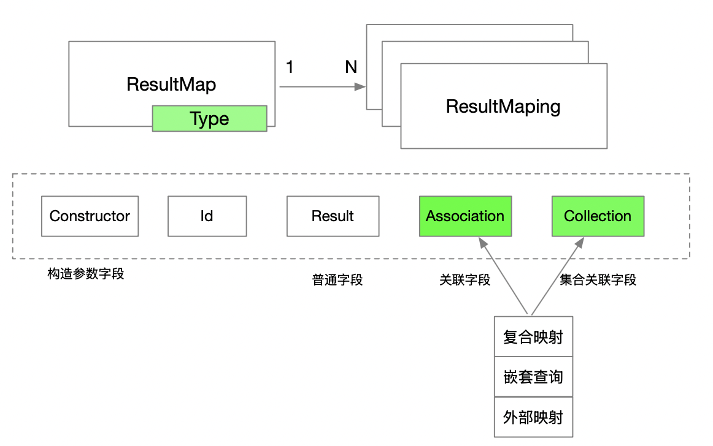


**association**

在结果映射（resultMap）中用来处理“一对一”关联关系的标签。
它把两张表中通过外键关联的记录，封装成Java对象里一个“复杂类型”的属性，从而一次性完成连表查询 → 对象组装的整个过程，避免手动再查一次数据库

数据库
```Text
user(id, username, password, card_id)  
idcard(id, code, address)
```

实体
```Java
@Data
public class User {
    private Integer id;
    private String username;
    private IdCard card;   // 一对一关联
}

@Data
public class IdCard {
    private Integer id;
    private String code;
    private String address;
}
```

Mapper XML
```XML
<!-- 1. 连表查询 -->
<select id="selectUserWithCard" resultMap="userCardMap">
    SELECT u.id   AS uid,
           u.username,
           c.id   AS cid,
           c.code,
           c.address
    FROM user u
    LEFT JOIN idcard c ON u.card_id = c.id
    WHERE u.id = #{id}
</select>

<!-- 2. 结果映射 -->
<resultMap id="userCardMap" type="User">
    <id property="id" column="uid"/>
    <result property="username" column="username"/>
    <!-- 一对一映射 -->
    <association property="card" javaType="IdCard">
        <id property="id" column="cid"/>
        <result property="code" column="code"/>
        <result property="address" column="address"/>
    </association>
</resultMap>
```

**Collection**

在结果映射（resultMap）中处理“一对多”关联关系的标签。它把主表一条记录对应从表多条记录的场景，
自动封装成Java对象里一个集合属性（List、Set等），一次性完成连表查询 → 对象组装，避免N+1次查询

实体
```Java
@Data
public class Dept {
    private Integer id;
    private String deptName;
    private List<Emp> emps;   // 一对多
}

@Data
public class Emp {
    private Integer id;
    private String empName;
}
```

Mapper XML
```XML
<!-- 1. 连表查询 -->
<select id="selectDeptWithEmps" resultMap="deptEmpMap">
    SELECT d.id   AS did,
           d.dept_name,
           e.id   AS eid,
           e.emp_name
    FROM dept d
    LEFT JOIN emp e ON e.dept_id = d.id
    WHERE d.id = #{id}
</select>

<!-- 2. 结果映射 -->
<resultMap id="deptEmpMap" type="Dept">
    <id property="id" column="did"/>
    <result property="deptName" column="dept_name"/>
    <!-- 一对多映射 -->
    <collection property="emps" ofType="Emp">
        <id property="id" column="eid"/>
        <result property="empName" column="emp_name"/>
    </collection>
</resultMap>
```

#### 自动映射

自动映射条件：
1. 列名和属性名同时存在（忽略大小写）
2. 当前列未手动设置映射
3. 属性类别存在 TypeHandler
4. 开启autoMapping（默认开启）


### 动态SQL

#### SqlNode&SqlSource

映射配置文件中定义的SQL节点会被解析成MappedStatement对象，其中的SQL语句会被解析成SqlSource对象，SQL语句中定义的动态SQL节点、文本节点等，则由SqlNode接口的相应实现表示

调用BoundSql的例子：
```Java
public <E> List<E> query(MappedStatement ms, Object parameter, RowBounds rowBounds, ResultHandler resultHandler)
   throws SQLException {
 BoundSql boundSql = ms.getBoundSql(parameter);
 CacheKey key = createCacheKey(ms, parameter, rowBounds, boundSql);
 return query(ms, parameter, rowBounds, resultHandler, key, boundSql);
}
```

BoundSql.java
```Java
// 从 {@link SqlSource} 获取的实际SQL字符串，经过动态内容处理后生成。该 SQL 可能包含 SQL 占位符 "?"，
// 以及一个有序的参数映射列表，其中每个参数都包含额外的信息（至少包括输入对象中用于读取值的属性名称）
public class BoundSql {
    private final String sql; // 可执行的sql语句
    private final List<ParameterMapping> parameterMappings; // sql语句的问号，通过这个解析
    private final Object parameterObject; // 最原始参数
    private final Map<String, Object> additionalParameters; // 原始参数脚本运算之后的新的参数，比如数组打散和一个？进行对应
    private final MetaObject metaParameters; // 操作parameterObject这个属性的
}
```

**动态SQL主流程解析**

动态SQL定义：每次执行SQL时，基于预先编写的脚本和参数动态的构建可执行Sql语句

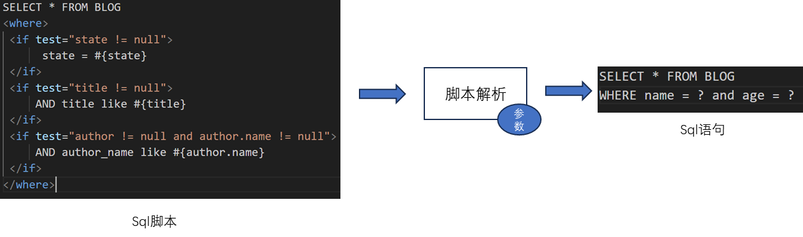

StaticSqlSource只是用来存储和映射，已经解析好的

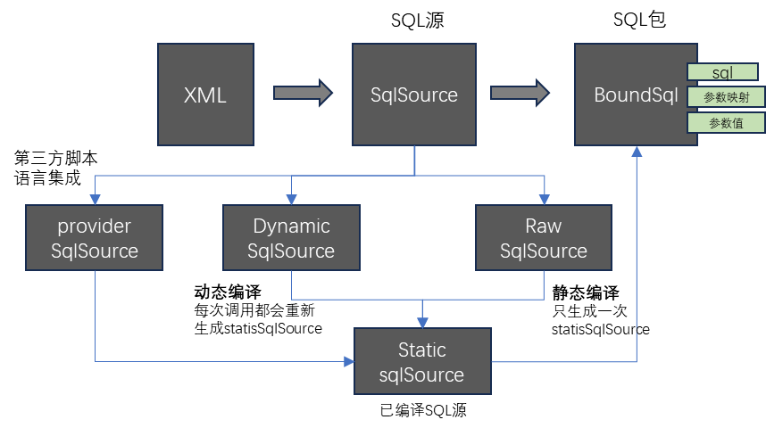

RawSqlSource就是把#里面的值转换成？

DynamicSqlSource解析流程：

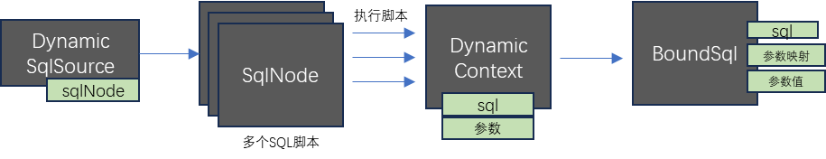


SqlNode语法树结构

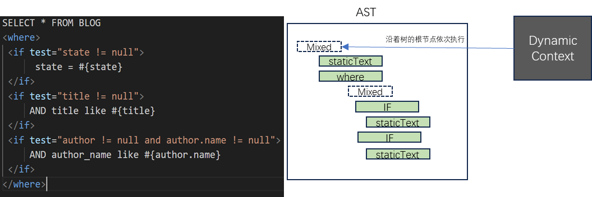

**If与Where执行过程分析**


### Configuration

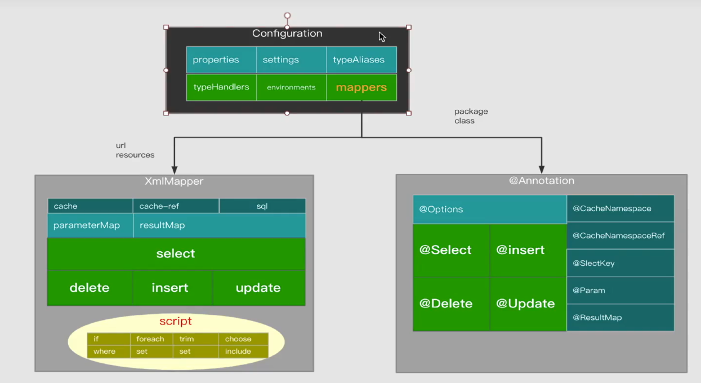


<seealso>
    <category ref="wrs">
        <a href="https://plugins.jetbrains.com/plugin/20158-writerside/docs/configure-search.html">Configure Search</a>
    </category>
</seealso>

专题1： 字符串匹配，高亮
专题2： FST，向量
专题3： mapreduce
专题4： mq的幂等性等等
专题5： java类的加载，spi, lucene用到的spi


第3章 k近邻法
指示函数I是定义在某集合X上的函数，表示其中有哪些元素属于某一子集A
argmax argmax(f(x))是使得 f(x)取得最大值所对应的变量点x(或x的集合)
近似误差（approximation error）: 对现有训练集的训练误差
估计误差（estimation error）: 数据处理过程中对误差的估计
交叉验证: 常并不会把所有的数据集都拿来训练，而是分出一部分来（这一部分不参加训练）对训练集生成的参数进行测试，相对客观的判断这些参数对训练集之外的数据的符合程度。这种思想就称为交叉验证（Cross Validation）

三大要素：
距离度量（如欧氏距离）、k值及分类决策规则（如多数表决）

k近邻法的实现：kd树

演进过程
前缀树 -》 FSM -> FSA -> FST


IO的几个实验
1. client没有连接，数据在内核里保存
2. tcp的几个参数buffer, nodelay, keepalive

同步异步 和 阻塞和非阻塞区别  lsof

a^b  ---无进位相加信息
(a&b)<<1 ---进位相加信息
a-b = a + (-b) = a + (~b + 1)

乘法：
a: 0110
b: 1110

a * b
1) a<<0, b >> 0
2) a<<1, b >> 1

List类支持对列表头部的快速访问，而对尾部访问则没那么高效