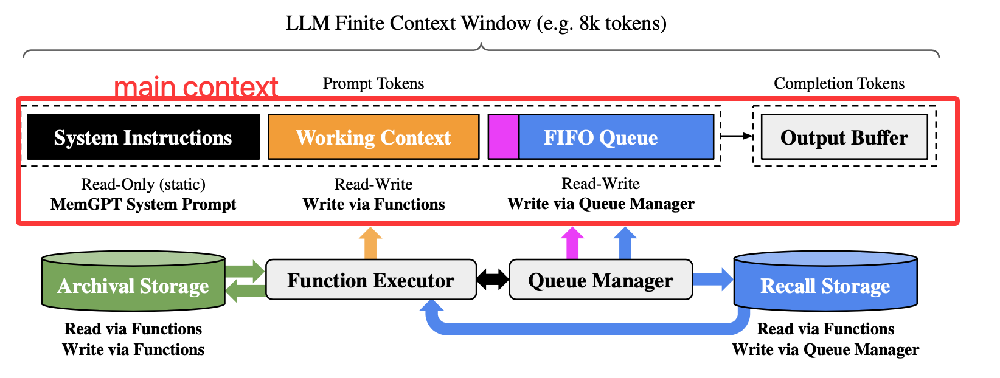
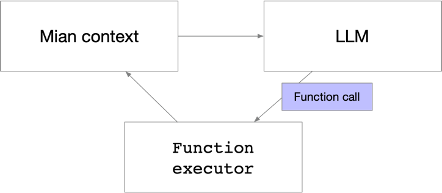
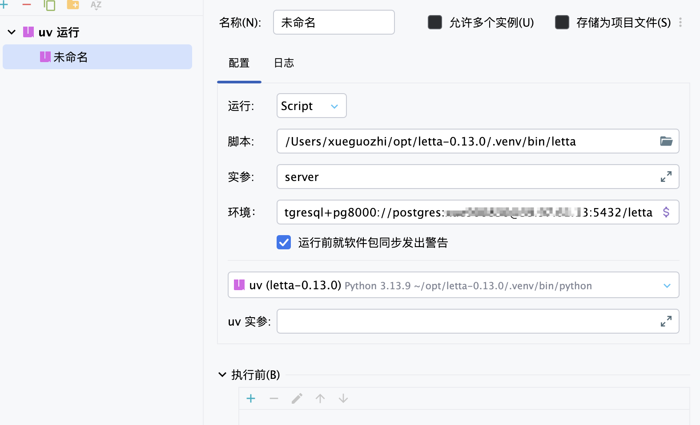

# letta

## paper

### MemGPT: Towards LLMs as Operating Systems

大模型的窗口是有限长的，为了突破这个限制，设计了这么个系统； 为什么不直接extending the context length，两个原因不行
1. a quadratic increase in computational time and memory cost due to the transformer architecture’s self-attention mechanism
2. “加长上下文”并不等于“用足上下文”，U型注意力——信息位于开头或末尾时召回率高，位于中段时显著下降

提到的两个应用场景：
1. document analysis
2. multi-session chat

memgpt把空间分成两个部分：main context (analogous to main memory/physical memory/RAM)and external context (analogous to disk memory/disk storage).



MemGPT provides function calls that the LLM processor to manage its own memory without any user intervention.

- Main context (prompt tokens)

    **system instructions**: contain information on the MemGPT control flow, the intended usage of the different memory levels, and instructions on how to use the MemGPT functions
    
    **working context**: store key facts, preferences, and other important information about the user and the persona
    
    **FIFO queue**: stores a rolling history of messages, including messages between the agent and user, as well as system
    messages (e.g. memory warnings) and function call inputs and outputs. The first index in the FIFO queue stores a system message containing a recursive summary of messages
    that have been evicted from the queue

- Queue Manager

  1. manages messages in recall storage and the FIFO queue
  
      当来了一条新的msg，他会把他放在FIFO queue的队尾，并且把msg和大模型的输出一起放到recall storage，当function call从recall storage检索的到相关数据的时候，他又会把数据放到context window

  2. 通过“队列驱逐策略”控制上下文溢出

      当token数达到上下文窗口的“警告阈值”（例如 70%）时，队列管理器向队列插入一条系统消息，提醒 LLM“内存压力”即将到来，让LLM可使用function call把FIFO 队列中的重要信息转存到工作上下文或归档存储。
    
      当oken数达到“刷新阈值”（例如 100%）时，队列管理器执行刷新：按预设比例（例如 50%）驱逐最旧消息，并与现有的递归摘要一起生成新的递归摘要，以释放上下文空间。

- Function executor

通过LLM生成的函数调用来main context and external context之间的数据移动。所有记忆的编辑与检索完全由系统自主完成

其实就是个推理循环



memgpt是由事件触发LLM推理，可以是：
1. 用户消息
2. 系统消息（如主上下文容量警告）
3. 用户交互事件

函数链（function chaining）允许在一次用户回合内连续执行多个函数，而无需把控制权交还给用户。

在调用函数时，MemGPT 可设置一个特殊标志位（request heartbeat）。

若置位：函数返回后，立即把输出追加到主上下文并立刻再次调用 LLM 处理器，继续下一步推理，若未置位：函数返回后，暂停处理器

## letta源码分析

### 环境搭建

#### 数据库建表

1. postgresql + pgvector

    推荐使用postgresql + pgvector，并且建立letta数据库，不要用默认的sqllite

    ```shell
    apt install -y postgresql-18-pgvector
    sudo -u postgres psql -c "CREATE EXTENSION IF NOT EXISTS vector;"
    SELECT extname, extversion FROM pg_extension WHERE extname='vector';
    netstat -anp | grep 5432
    ```

2. 通过alembic创建表

    uv run alembic upgrade head

3. 配置环境变量

    配置环境变量$LETTA_PG_URI=postgresql+pg8000://{user}:{password}@{ip}:5432/letta

4. llm配置

    用deepseek的api，配置环境变量LETTA_BASE_URL=https://api.deepseek.com，DEEPSEEK_API_KEY=xxx

    deepseek的client代码是有问题的，需要加上

    ```python
    from openai.types.chat import ChatCompletionMessage as _Message
    ```

5. pycharm debug

    

LETTA_EMBEDDING_MODEL没配置目前能跑简单的demo，后续更新

6. postman demo例子

创建agent

```Text
POST http://localhost:8283/v1/agents

{
    "llm_config": {
        "model": "deepseek-chat",
        "model_endpoint_type": "deepseek",
        "context_window": 16384,
        "model_endpoint": "https://api.deepseek.com/v1",
        "put_inner_thoughts_in_kwargs": true
    },
    "embedding_config": {
        "embedding_model": "glm-4.6",
        "embedding_endpoint_type": "ollama",
        "embedding_dim": 1024
    },
    "memory_blocks": [
        {
            "label": "human",
            "value": "我叫小明，是产品经理"
        },
        {
            "label": "persona",
            "value": "你是 Letta，我的智能助理"
        }
    ]
}
```

修改记忆
```Text
POST http://localhost:8283/v1/agents/{agent-id}/messages
{
    "messages": [
        {
            "role": "user",
            "content": "我不叫小明，我叫阿里巴巴"
        }
    ],
    "stream": false
}
```